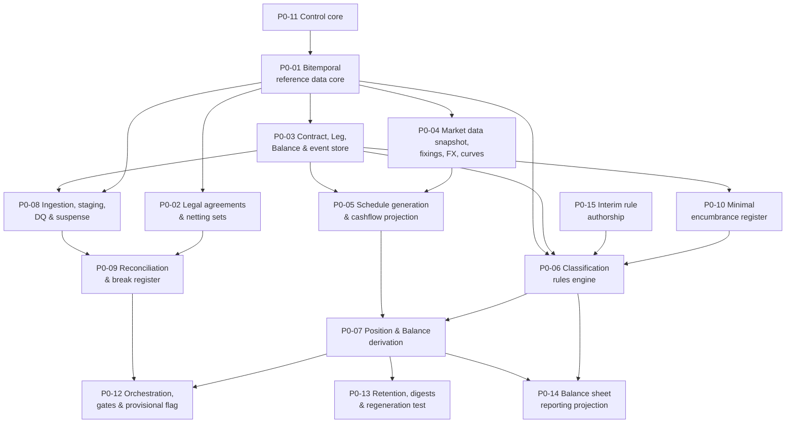

# Phase 0 — Ticket Breakdown

Fifteen tickets covering the Phase 0 scope in `treasury-alm-risk-platform` §6. Parent:  
`treasury-alm-risk-platform`.

**What Phase 0 delivers:** a complete, classified balance sheet with contractual cashflows for every  
position, reconciled, orchestrated and reproducible. Every line of the source document's Part 2  
generates as a query. No valuation, no ALM, no regulatory ratios.

**What it does not deliver:** anything requiring D8 valuation (Phase 2), behavioural models (Phase 3),  
or deal capture (Phase 4). Phases 0–3 run on a feed from the incumbent TMS for the treasury book  
(P0-08) — without that feed the treasury book is empty.

## Dependency graph

## Waves

Each wave leaves the platform in a working state.

| Wave  | Tickets                    | State at the end                                                                      |
| ----- | -------------------------- | ------------------------------------------------------------------------------------- |
| **1** | P0-11, P0-15, P0-01        | Reference data is versioned and governed; rule authorship is staffed and started      |
| **2** | P0-02, P0-03, P0-04, P0-08 | Objects can be stored and ingested; market snapshots exist; agreements are structured |
| **3** | P0-05, P0-06, P0-09, P0-10 | Cashflows project; objects classify; feeds reconcile; encumbrance is known            |
| **4** | P0-07, P0-12               | Positions derive at both freshness levels; the pipeline runs gated                    |
| **5** | P0-13, P0-14               | Reproducibility is proven; the balance sheet generates and Phase 0 is acceptable      |

**P0-11 and P0-15 come first deliberately.** The control core is a dependency of reference data, not a  
governance layer added afterwards — four-eyes on static data is required from the first record. And rule  
authorship is subject-matter work with a long lead time that the classification engine depends on; it  
ships empty otherwise.

## Two things that are not tickets

**The pre-Phase-0 clocks run in parallel and are already scoped elsewhere:**

- `counterparty-documentation-workstream` — legal agreement extraction feeds P0-02; collateral history  
reconstruction feeds Phase 1
- **Market data history purchase decision** — folded into P0-04 as a decision gate rather than a ticket,  
since the build proceeds either way

**Deployment and monitoring tickets are deliberately absent.** Add them if wanted; they were not  
requested and are not implied by the blueprint.

## Sizing note

Estimates are deliberately omitted. Three tickets carry materially more uncertainty than the rest and  
should be estimated first, because they will dominate the phase:

| Ticket                                | Why uncertain                                                                                                                           |
| ------------------------------------- | --------------------------------------------------------------------------------------------------------------------------------------- |
| **P0-06** Classification rules engine | Rules-as-data with bitemporality, precedence, explainability and impact simulation. The programme's phase plan depends on it being real |
| **P0-08** Ingestion                   | Adapter count and upstream data quality are unknown; core banking extract capability is an open question                                |
| **P0-05** Projection                  | Convention coverage across the full instrument universe, plus five rate treatments and partial-observation RFRs                         |

**P0-06 grew after publication** and is now clearly the largest ticket in the phase — see the amendments  
below. If any ticket is split, it is this one.

## Amendments since publication

Raised by `part2-query-specification`, an independent blind re-run of the Part 2 map. Applied rather  
than deferred, because the tickets were published carrying the superseded criteria.

| #   | Change                                                                                                                                                                                                                                                                                                                                                                                                                               | Tickets                    |
| --- | ------------------------------------------------------------------------------------------------------------------------------------------------------------------------------------------------------------------------------------------------------------------------------------------------------------------------------------------------------------------------------------------------------------------------------------ | -------------------------- |
| A1  | **A line is a *(measure, predicate)* pair, not a predicate.** Six lines need a sub-contract split — drawn vs undrawn, balance vs limit, partially-designated hedges, operational and insured deposit portions. No dimension set closes it                                                                                                                                                                                            | P0-14                      |
| A2  | **Fifteen dimensions.** `counterparty_type` splits into transaction counterparty and issuer/obligor. One dimension mis-classifies the whole securities book, in either direction depending on which field survives                                                                                                                                                                                                                   | P0-06, P0-01               |
| A3  | **Classification needs a second customer-aggregation pass.** Insurance thresholds, operational caps and connected grouping are irreducibly customer-level, so B.3 cannot be classified per-contract. Th**ree things must be deterministic and versioned — threshold, allocation rule, and the sequencing** where a deposit is subject to both an insurance threshold and an operational cap                                          | P0-06                      |
| A4  | **The GL is a source, not only a control.** 18 of 40 lines are GL-sourced and C.3 retained earnings has no other source. Five source systems had no inbound interface. **Now governed by the same test as A5**                                                                                                                                                                                                                       | P0-08                      |
| A5  | **Equity holdings and shorts are Contracts with quantity legs, not Balances.** After a second exchange the test became **"a Balance is a position whose amount is *asserted* by an external system rather than *derived* from terms the platform holds"** — which also sorts nostro, ROU assets and A.9 correctly, is stable under changing integration scope, **subsumes A4**, and applies at measure level as well as object level | P0-03, P0-07, P0-08, P0-14 |
| A8  | **CRM substitution is the A2 failure one level down.** HQLA keys off the issuer with no substitution; risk weight keys off the post-substitution obligor. If both read one field they fight. The issuer/obligor dimension is **always the contractual obligor**, with a derived `crm_effective_obligor` consumed only by the risk-weight rule                                                                                        | P0-06                      |
| A6  | **No Part 2 line exists for banking-book mandatorily-FVTPL** (a held CLN failing SPPI). A.3's predicate needs `book_intent=trading AND c7=FVTPL`, which exposes the gap. **FVOCI splits into FVOCI-debt and FVOCI-equity** as enum values                                                                                                                                                                                            | P0-14, P0-15               |
| A7  | **Part 2 section D has no encumbrance or collateral memorandum block**, which LCR and NSFR both need. A.2/A.5 overlap with no boundary — same class as the NCD routing rule                                                                                                                                                                                                                                                          | P0-10, P0-14, P0-15        |

A6 and A7 include taxonomy extensions that are **the bank's accounting policy call**, not build tasks,  
and should be resolved before P0-14 closes.

## Tickets

| #     | Ticket                                                    | Governing artifacts              |
| ----- | --------------------------------------------------------- | -------------------------------- |
| P0-01 | Bitemporal reference data core                            | D1 §2, §3.1–3.7                  |
| P0-02 | Legal agreements &amp; netting sets                       | D1 §3.8                          |
| P0-03 | Contract, Leg, Balance &amp; event store                  | D2 §2, §3                        |
| P0-04 | Market data snapshot, fixings, FX &amp; projection curves | D3                               |
| P0-05 | Schedule generation &amp; cashflow projection             | D2 §2.2, §4                      |
| P0-06 | Classification rules engine                               | `classification-rules-engine`    |
| P0-07 | Position &amp; Balance derivation                         | D2 §5                            |
| P0-08 | Ingestion, staging, data quality &amp; suspense           | D16 §3, §4                       |
| P0-09 | Reconciliation engine &amp; break register                | D16 §5                           |
| P0-10 | Minimal encumbrance register                              | D6 subset; D10 §3.5              |
| P0-11 | Control core                                              | `d15-control-core`               |
| P0-12 | Orchestration, gates &amp; provisional flag               | D17                              |
| P0-13 | Retention, digests &amp; regeneration test                | D2 §7                            |
| P0-14 | Balance sheet reporting projection                        | `part2-taxonomy-mapping`; D2 §8  |
| P0-15 | Interim rule authorship *(non-engineering)*               | `classification-rules-engine` §9 |

