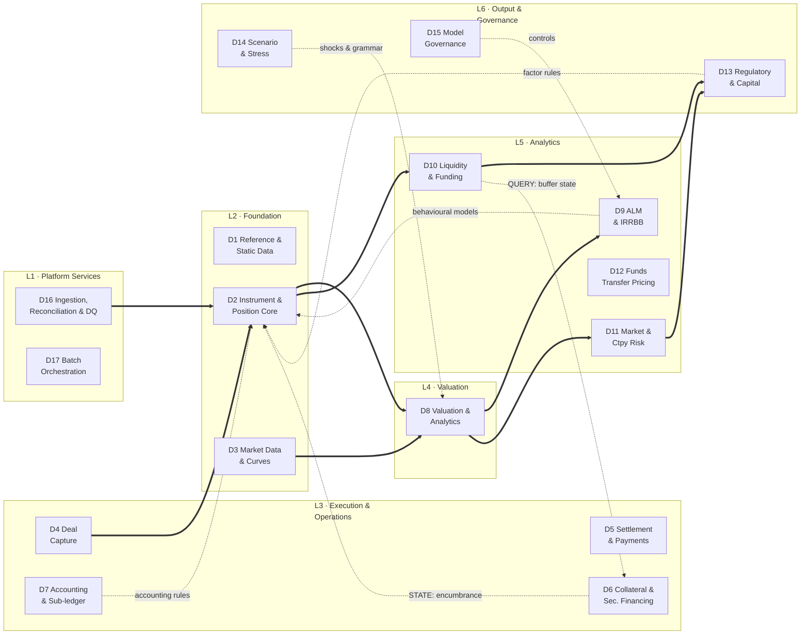
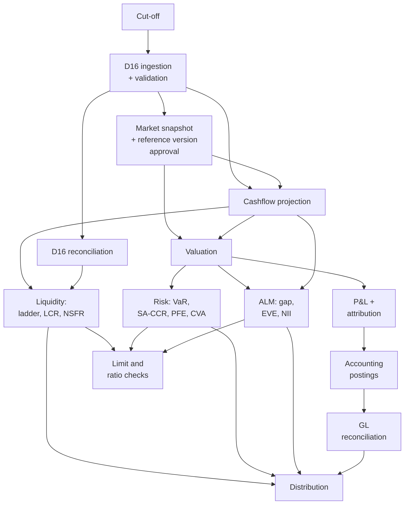
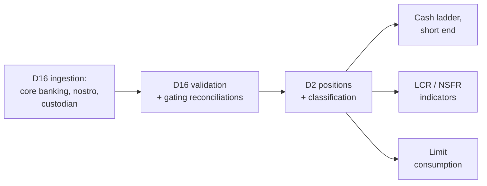
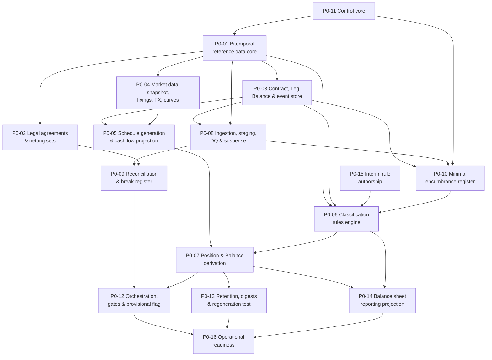

# Treasury, ALM & Risk Platform
## Implementation Whitepaper

**Status:** Ready for implementation · Phase 0 executable
**Scope basis:** *Tier 1 Bank Treasury — Instrument Universe & Granular Balance Sheet Taxonomy*
**Design corpus:** 30 artifacts, 17 bounded contexts, one adversarial review, two independent taxonomy validations

---

## How to use this document

This whitepaper is the **single consolidated specification** for a treasury system of record with
integrated asset-liability management, liquidity, risk and regulatory reporting. It is self-contained
on architecture, data model, module contracts, delivery sequence, controls and acceptance criteria.

| Reader | Start at |
|---|---|
| Board / ALCO | Part I, then Part VII |
| Programme manager | Part VI, then Part VII |
| Solution architect | Parts II–IV |
| Implementation team | Part VI §3 (Phase 0 tickets), then Parts III–V |
| Vendor / procurement | Part I, Part VI §2, Part VIII |
| Audit / risk | Part V, Part VIII |

**Design intent, stated once.** Every figure the platform produces must be traceable to the individual
transactions that produced it and reproducible exactly as it stood on any past date. Everything else in
this document follows from that.

---

# PART I — SCOPE

## 1. What is being built

A platform that becomes the bank's **system of record for treasury** and the source of its ALM,
liquidity, risk and regulatory numbers. Treasury deals are booked, confirmed, settled and accounted for
here. Core banking remains the system of record for retail and corporate loans and deposits, which feed
the platform daily.

## 2. Scope decisions

Settled before design; everything downstream is constrained by them.

| Decision | Choice | Consequence |
|---|---|---|
| Deliverable | Technology-agnostic architecture | Capabilities, boundaries and contracts specified; stack choices remain open |
| Regulatory regime | Basel III/IV + IFRS 9, single jurisdiction | No multi-GAAP; regulatory layer is a configurable rules engine |
| Legal entity | Single entity — **provisional** | Entity carried as an attribute; no consolidation built. **Four unresolved signals — see Part VII §1.1** |
| System boundary | Full TMS + ALM + Risk | Core banking keeps loans and deposits |
| Scale | ~500k customer accounts | Contract-level storage and projection throughout; no cohorting |
| Hedge accounting | **IFRS 9 only, no macro hedge accounting** | One rule set. Structural hedges run economically. **Capital consequence in Part V §6** |
| Net investment hedging | **Excluded — blocked, not decided out** | Requires a foreign operation; moves with the group-structure question |

**Out of scope:** loan origination and servicing, customer channels, the core banking GL itself, IFRS 9
ECL model computation (consumed via a specified interface), client-facing treasury sales.

## 3. Instrument universe

The full source Part 1: money market and central bank facilities; repo, reverse repo, tri-party,
securities lending and collateral swaps; fixed income including ABS/MBS, covered bonds, CoCos and
structured notes; FX spot, forwards, swaps, NDFs, cross-currency swaps and options **including barriers
and digitals**; interest rate derivatives including swaptions, caps, floors and futures; credit
derivatives including single-name and index CDS; equity and commodity instruments where mandated;
wholesale funding and issuance; liquidity and collateral tools; internal ALM instruments; and trade and
structured finance.

**Exotic FX options are in scope.** The source universe names barriers and digitals. This makes a
vanilla-only pricing library disqualifying rather than a trade-off.

---

# PART II — ARCHITECTURE

## 1. Seventeen bounded contexts in six layers

| Layer | Domains |
|---|---|
| **L1 Platform Services** | D16 Ingestion, Reconciliation & Data Quality · D17 Batch Orchestration & Operational Control |
| **L2 Foundation** | D1 Reference & Static Data · D2 Instrument & Position Core · D3 Market Data & Curves |
| **L3 Execution & Operations** | D4 Deal Capture · D5 Confirmation, Settlement & Payments · D6 Collateral & Securities Financing · D7 Accounting & Sub-ledger |
| **L4 Valuation** | D8 Valuation & Analytics Engine |
| **L5 Analytics** | D9 ALM & IRRBB · D10 Liquidity & Funding · D11 Market & Counterparty Credit Risk · D12 Funds Transfer Pricing |
| **L6 Output & Governance** | D13 Regulatory Reporting & Capital · D14 Scenario & Stress Framework · D15 Model Governance, Audit & Control |

**The limit framework is not part of D11.** It is a separate concern consumed by D4's pre-deal checks
and by D9, D10 and D11's outputs, and it lands with Phase 4.



## 2. Three edge classes

The architecture is **not acyclic**, and pretending otherwise hides its most dangerous dependencies.

| Class | Direction | Carries | Made safe by |
|---|---|---|---|
| **Data** | Upward | Positions, cashflows, valuations, measures | Ordinary layering |
| **Rule** | Downward | Versioned, effective-dated **definitions** — never computed values | Versioning and effective dating |
| **State** | Downward | Observed state, sometimes externally asserted | **Replayability** — see below |

**Rule edges:** D7 → D2 (accounting classification); D13 → D2, D10, D6 (regulatory classification and
factor sets); D9 → D2 (behavioural models); D14 → D2, D8, D9, D10, D11 (scenarios, shocks and the
perturbation grammar); D15 → L5 (controls and validation).

**The design rule that makes rule edges safe:** a downward edge may carry only versioned,
effective-dated definitions. If it ever needs to carry a computed result, the boundary is wrong.

**State edges: currently one — D6 → D2 encumbrance.** A pledged bond leaves the HQLA buffer at the
moment of pledging. This is neither a versioned definition nor a computed result, so the rule above did
not constrain the edge most likely to be got wrong. A state edge is safe when the state is:

1. **Event-published** with effective *and* system timestamps — never a periodic file, because the
   consumer recomputes on the event
2. **Bitemporally queryable** — "what was the state as of D, as known on K"
3. **Provenance- and authority-tagged** — how much of a reported number rests on externally-asserted or
   operationally-maintained state must be a query

**One read-only query edge — D10 → D6.** The collateral optimiser needs current buffer composition and
whether the Level 2/2B caps are binding, which cannot be reduced to a rule. It does not break the design
rule because **the rule governs what a lower layer stores and executes, not what it asks.** The
discipline it needs is different: the optimiser stores no score, and every allocation records the policy
version, market snapshot and ratio state it was taken against.

## 3. Two boundary inversions

1. **D6 originates Contracts.** Central bank facility drawings are created from collateral pool state,
   not booked by a dealer. The normal D4 → D2 flow inverts.
2. **D6 encumbrance drives D2 classification**, intraday. A collateral system publishing end-of-day
   state does not degrade this — it stops the trigger firing, and HQLA becomes a batch number labelled
   intraday.

## 4. Domain responsibilities

### L1 — Platform Services

**D16 — Ingestion, Reconciliation & Data Quality.** Feed adapters and canonical staging; acquisition
monitoring; data quality validation; the reconciliation engine and break register; quarantine and
suspense presentation; the **data-good state** D17 gates on. *Owns the fallback hierarchy for position,
balance and static feeds only — market observables belong to D3.*

**D17 — Batch Orchestration & Operational Control.** The pipeline DAG, scheduling and cut-off
management, gate evaluation, the provisional flag and its propagation, re-run semantics, calendar
awareness including regulatory reporting dates, run telemetry.

### L2 — Foundation

**D1 — Reference & Static Data.** Ten data domains: legal entity and organisation; counterparty and
customer master; product catalogue; calendars and conventions; index and benchmark definitions;
currency; GL chart and mapping; **legal agreements and netting sets**; classification rule sets;
**bucket and vertex definitions**. Everything is bitemporal.

**D2 — Instrument & Position Core.** The Contract and Balance store, the cashflow projection engine,
classification, position derivation, the bitemporal query surface.

**D3 — Market Data & Curves.** Fixings, FX, prices, credit spreads, volatility surfaces, curve
construction, multi-curve discounting, snapshot versioning, provenance tagging, the market-observable
fallback hierarchy. *In Phase 0 because projection needs forward curves — not because of valuation.*

### L3 — Execution & Operations

**D4 — Deal Capture & Trade Lifecycle.** Booking, amendments, novations, terminations, exercises,
fixings, rollovers; pre-deal limit checks; four-eyes authorisation.

**D5 — Confirmation, Settlement & Payments.** Confirmation generation and matching, settlement
instructions, nostro management, payment generation and release, failed-trade handling.

**D6 — Collateral & Securities Financing.** Repo and securities financing lifecycles, tri-party,
haircuts, margining, optimisation and substitution, central bank pool management. **Owns the encumbrance
register.** The only module straddling Phase 0 and Phase 4.

**D7 — Accounting & Sub-ledger.** IFRS 9 classification and measurement, effective interest,
modification accounting, hedge accounting, derecognition, IAS 32 presentation, the double-entry
sub-ledger.

### L4 — Valuation

**D8 — Valuation & Analytics Engine.** Narrow contract: given a position, a market snapshot and a date,
return **value, cashflows, sensitivities and `exposure_by_bucket`**.

### L5 — Analytics

**D9 — ALM & IRRBB.** Repricing gap, EVE, NII sensitivity, supervisory outlier tests, **definition and
calibration of behavioural models**, basis risk, CSRBB, IRRBB limits.

**D10 — Liquidity & Funding.** Cashflow ladder, counterbalancing capacity, LCR, NSFR, survival horizon,
funding concentration, encumbrance ratio, early warning indicators, funding plan, liquidity stress.

**D11 — Market & Counterparty Credit Risk.** VaR and expected shortfall, **sensitivity aggregation** and
P&L attribution, SA-CCR per netting set, PFE, CVA/DVA, settlement and issuer risk, large exposures
aggregation.

**D12 — Funds Transfer Pricing.** Internal pricing curves and transfer contracts.

### L6 — Output & Governance

**D13 — Regulatory Reporting & Capital.** Capital composition and the accounting-equity-to-CET1 bridge,
RWA, leverage, large exposures, the configurable returns engine, Pillar 3, capital planning. **Authors
the regulatory classification rules and factor sets** that D2, D10 and D6 execute.

**D14 — Scenario & Stress Framework.** All shocks, scenarios and stress paths, versioned and approved —
plus the **transformation grammar** that makes "consumed identically" mechanical: one representation,
node set, magnitude unit and floor rule, shared between D14's shocks and D8's sensitivity perturbations.

**D15 — Model Governance, Audit & Control.** Model inventory, validation, change control, four-eyes,
audit trail, reproducibility. **Accretes from Phase 0; only the aggregate portfolio view is Phase 7.**

---

# PART III — CANONICAL DATA MODEL

## 1. Six core objects

| Object | Definition |
|---|---|
| **Contract** | Legal and economic terms of a deal or holding. Common attributes as the query surface plus a typed terms payload per product family |
| **Leg** | One currency, one payment convention, one rate treatment. A Contract has one or more |
| **Cashflow** | Dated projection from a Leg. Tagged contractual/behavioural, principal/interest, certain/contingent |
| **Balance** | Carrying amount plus dimensions. No legs, no cashflows, no projection |
| **Position** | Aggregated view over Contracts *and* Balances. Always derived, never entered |
| **Valuation** | D8 output against a market snapshot. Immutable and versioned |

### 1.1 The Contract / Balance test

> **A Balance is a position whose amount is *asserted* by an external system rather than *derived* from
> terms the platform holds.**

Directly testable: *can you compute this from what D2 holds, or must someone tell you the number?*

| | Objects |
|---|---|
| **Contract** — derived | Anything computable from held terms, **including equity holdings (A.3, A.4) and short positions (B.4) as quantity legs** |
| **Balance** — asserted | Vault cash, central bank reserves, nostro and vostro, ROU assets, associates and subsidiaries, PP&E, goodwill, tax, provisions, all equity lines |

**Three properties this test buys:**

1. It is **stable under changing integration scope** — object type does not flip as feeds are added
2. It **subsumes the GL source/control rule**: the GL is a *source* where the amount is asserted, a
   *control* where it is derived. One test governs both the object model and the feed inventory
3. It **applies at measure level as well as object level** — a Contract may carry asserted measures (the
   ECL allowance, an external pricer's fair value, externally-projected cashflows) alongside derived ones

It also gives the core-banking fallback a principled representation: if core banking cannot supply
contract-level terms, those positions are honestly **Balances** rather than Contracts with missing terms.

### 1.2 Derived values are never stored and never ingested

Accrued interest (A.15, B.13) and three of four reserve lines (FVOCI revaluation, cash flow hedge, FX
translation) are computed. Core banking also supplies accrued interest — **D2 computes it; core
banking's figure is a reconciliation control, not an input.** Ingesting both double-counts the balance
sheet and produces a GL break whose cause is architectural.

## 2. Leg rate treatments — five, not two

| Treatment | Instruments |
|---|---|
| Fixed | Money market, fixed bonds, IRS fixed leg |
| Floating (index) | FRNs, IRS, basis swaps, OIS. **Three fixing states — see §5** |
| **Return** | Total return swaps, equity swaps — price appreciation plus distributions |
| **Quantity** | Commodity swaps and futures, short securities. Quantity × price; relaxes one-currency-per-Leg |
| **Externally projected** | ABS/MBS, index CDS, synthetic securitisation. **Stored, not regenerated** |

**Worked decompositions.** Interbank placement: 1 fixed bullet leg. Vanilla IRS: 2 legs. FX swap:
**two linked Contracts**, not one — a single Contract cannot carry two maturity dates. NDF: 2 notional
legs, settlement a single net cashflow. Repo: cash leg + collateral leg. **Collateral swap: collateral
legs both sides, no cash leg.** Bond: 1 leg. **ABS/MBS: 1 externally-projected leg.** Callable/CoCo/
barrier FX option: 1 leg + Optionality. TRS: return leg + funding leg. **Futures: no contractual
cashflows at all** — exposure only.

## 3. Fifteen classification dimensions, in two groups

**Risk and behaviour (8):** contractual maturity bucket · behavioural maturity · repricing basis and
index · currency · product/GL mapping · **transaction counterparty** · accounting classification ·
regulatory classification.

**Presentation and accounting (7):** book intent (trading vs banking — also the IRRBB scope boundary) ·
hedge designation · primary risk type · ECL stage · held-for-sale · capital instrument classification ·
**issuer / obligor**.

### 3.1 The counterparty split

`counterparty_type` splits into **transaction counterparty** and **issuer / obligor**. A bond bought from
Bank X but issued by a sovereign keys HQLA, risk weight, large exposures and concentration off the
**issuer**; settlement, confirmation and settlement risk off the **trade counterparty**.

**One dimension mis-classifies the entire securities book, and the direction depends on which field
survives — so the check must be built both ways:**

- Trade-capture-derived data keeps the counterparty → **understates HQLA**, overstates bank concentration
- Custody-derived data keeps the issuer → **understates settlement risk**

**CRM substitution is the same failure one level down.** HQLA keys off the issuer with *no* substitution;
risk weight keys off the *post-substitution* obligor. **The dimension is always the contractual
obligor**, with a derived `crm_effective_obligor` consumed only by the risk-weight rule. Guarantor stays
a Contract attribute — dimensions are derived and mandatory-complete; guarantor is captured.

### 3.2 Hard rules

1. **No Contract or Balance is stored without a complete classification** — but `not_applicable` is a
   permitted value where a dimension is meaningless, and only ever as an explicit rule outcome
2. **Classification is rules-derived, versioned and effective-dated.** Override is four-eyes,
   reason-coded, expiring and reported as a population
3. **Every Contract and Balance carries an `internal` designation**, and internal objects are excluded
   from external-facing aggregation *by construction*. FTP generates two contracts per transfer netting
   to zero at bank level; exclusion by report-level filter fails in the direction that inflates both
   sides of the balance sheet by the full internal book

### 3.3 Bucket and vertex definitions are shared reference data

The maturity bucket dimension, D8's `exposure_by_bucket` and D9's repricing gap ladder must use **one set
of bucket boundaries, held in D1, versioned and effective-dated**. The gap is assembled from cashflows
*plus* `exposure_by_bucket`; bucketed independently the two halves do not add up, and the failure is
silent because each half looks reasonable alone.

**A bucket is an interval; a vertex is a point.** D1 holds one boundary set per family; derived vertex
sets store their derivation rule. **The prescribed capital vertices are not derived** — they must appear
exactly, and nearest-neighbour mapping is not permitted.

**The platform rate vertex set is the union of the 19 IRRBB band midpoints and the 10 prescribed capital
vertices — 29 nodes.** Both regulatory views are then exact subsets. The price is a sensitivity fan-out
~53% larger than originally assumed, which belongs in the performance envelope rather than being
discovered against it.

## 4. Cashflow is not the universal intermediate

Cashflow is the universal intermediate for **liquidity, accrual and settlement**. It is **not** for
repricing gap:

| Position | Contribution |
|---|---|
| Options | **Delta-equivalent exposure** via `exposure_by_bucket` — a swaption's cashflow rate treatment produces a meaningless bucket |
| Futures | Notional exposure, no cashflow |
| Equity, commodity, Balance-held | Contribute to EVE and NSFR with neither — **excluded from the gap, with the exclusion stated** |

## 5. Reproducible projection

```
project(Contract, as_of_date, basis, assumption_set, horizon,
        market_snapshot_version, reference_data_version) → Cashflow[]
```

Same inputs, same outputs, always. No ambient configuration, no hidden state.

**Three fixing states, not two.** A past reset is a stored fact; a future reset is a market query; and a
**compounded-in-arrears current period is partly observed** — some daily fixings existing and some not.
Now standard across the interest rate complex.

**Determinism is asserted, not assumed.** Bit-exact floating-point equality across a decade of platform
migrations is unsafe, and summation order changes when partitioning changes. Four measures:

1. **Per-contract digest stored every EOD** — converts a silently undetectable failure into one detected
   next day at contract granularity. An aggregate comparison passes on compensating errors
2. **Full detail frozen for regulatory reporting dates** — 4–20 dates a year, ~100m rows
3. **Engine builds retained as versioned artefacts.** *For bought code this is a procurement requirement:
   long-term version retention and escrow must be in the contract*
4. **The regeneration test runs from Phase 1**, not Phase 7

**Monte Carlo needs its seed in the version set**, or two runs differ by simulation noise.

**The regeneration test is an implementation control, not a model validation.** It asks whether the
platform reproduces the same number from the same inputs, and says nothing about whether the number is
right — a consistently wrong model passes it daily. Reproducibility is the *precondition* for validation,
not evidence of correctness.

## 6. Interfaces that were missing and are now specified

### 6.1 The ECL interface

| Direction | Content |
|---|---|
| Inbound | Allowance by contract, **with measurement category** |
| Inbound | Stage 1/2/3. **Stage 3 interest is calculated on the net carrying amount**, so D2's accrual is a function of the allowance — the ECL interface runs *before* accrual in the EOD sequence |
| Outbound | EAD for off-balance-sheet items, from D2's drawdown model |
| Outbound | Contractual and behavioural cashflows |

**The allowance does not always reduce the carrying amount:**

| Category | Effect |
|---|---|
| Amortised cost | **Reduces it** |
| **FVOCI debt** | **Does not** — carrying amount stays fair value; loss to P&L, entry to the FVOCI reserve |
| FVOCI equity | Not applicable — no impairment model |
| FVTPL | Not applicable |
| Off-balance-sheet | **A provision liability in B.9**, not a contra-asset |

Applying the allowance to an FVOCI debt carrying amount double-counts credit risk. The error is
invisible in aggregate — it looks like conservatism — and surfaces only when the FVOCI reserve fails to
reconcile against D7 and D9's CSRBB measure.

**The external ECL model enters D15's inventory as a third-party model.** Model risk does not stop at the
module boundary; if no validation evidence is available, the reliance is disclosed rather than assumed.

### 6.2 Legal agreements and netting sets

ISDA, CSA, GMRA and GMSLA are D1 static data defining **netting sets**, first-class because:

- **SA-CCR computes EAD per netting set.** So does CVA
- Gross-versus-net presentation for A.3 and B.4 depends on IAS 32 offsetting enforceability
- LCR downgrade-trigger outflows are CSA rating triggers
- D6 needs threshold, MTA, eligible collateral and rehypothecation rights
- **D11 needs the same CSA terms as SA-CCR formula inputs** — margin period of risk, threshold, MTA and
  independent amount enter the margined calculation directly
- **The discount curve for a collateralised derivative is selected from the CSA, not the trade's
  currency.** CSA paying interest on EUR cash → EUR collateral rate curve; uncollateralised → funding
  curve; cleared → CCP rate

**Terms must be structured data, not attached PDFs.** Without structured eligible-collateral and
collateral-interest terms the platform cannot select a discount curve and cannot value a collateralised
derivative correctly — **which makes the extraction a Phase 2 blocker, not a Phase 4 one.**

### 6.3 The accounting-characteristics view

D7 must perform SPPI, closely-related and effective-interest assessments, all of which are legal-terms
analyses — but the terms payload is closed to it. **D2 publishes a derived accounting-characteristics
view**: payoff linearity, leverage, contingency features, embedded feature inventory, and
fee/discount/premium components. This preserves the instrument-agnostic property of the published
contract without widening the rule.

## 7. Accounting treatment

### 7.1 Classification and measurement

**Business model** is assessed at portfolio level; **SPPI** at instrument level. The rules engine needs
both scopes.

| Category | Measurement | Note |
|---|---|---|
| Amortised cost | Cost less allowance | |
| **FVOCI debt** | Fair value | ECL in P&L via OCI; **recycles on disposal** |
| **FVOCI equity** | Fair value | **No impairment, never recycles** |
| FVTPL | Fair value | Includes held CLNs failing SPPI |

**FVOCI debt and FVOCI equity behave oppositely on impairment and recycling and are routinely
implemented as one category. They are two enum values.**

**Three cases routinely missed:** Stage 3 interest on net carrying amount; **POCI assets** with a
credit-adjusted EIR; and **modification accounting** — a non-substantial modification requires
recalculating gross carrying amount at the *original* EIR with an **immediate P&L catch-up**.

### 7.2 Structured products — tiered

| Tier | Criterion | Structure | Build |
|---|---|---|---|
| 1 | Exercise right or trigger on the host's own terms | Single Contract + Optionality | **Yes** |
| 2 | Accounting separation required **or** embedded derivative carries a distinct risk type | Linked Contracts | **Yes** |
| 3 | Path-dependent or multi-underlying | Replicating portfolio | Specify only |

**Barriers and digitals are Tier 1**, in scope, priced by the bought library.

**The two Tier 2 triggers are independent.** IFRS 9 abolished bifurcation for **financial assets**
(4.3.2) but retained it for **liabilities** (4.3.3):

- **Held CLN** — fails SPPI, whole instrument at FVTPL, *no* bifurcation. Tier 2 for **risk visibility**
- **Issued structured deposit** — bifurcation applies **only if the embedded derivative is not closely
  related**. An unleveraged at- or out-of-the-money rate cap **is closely related and is not separated**

**The fair value option is not a free escape** — own-credit fair value change goes to OCI, creating a
reserve line and a CET1 filter, and it never recycles.

### 7.3 Hedge accounting

**IFRS 9 only, no macro hedge accounting. One rule set, no bright line anywhere.**

| Retained | Forgone |
|---|---|
| Cost of hedging (FX basis, forward element) deferrable in OCI | Portfolio fair value hedging of the structural book |
| Aggregated exposures | |
| Rebalancing rather than hedge failure | |

**Hedged items are frequently not Contracts** — a portfolio layer, a forecast transaction, a risk
component, a net position. Hedge designation needs its own object; D2 carries only the queryable
designation dimension.

**Documentation must exist at inception and cannot be retrofitted** — captured at booking in D4 and
rejected if incomplete.

**Two behaviours the system must enforce, not merely permit:** rebalancing is mandatory when the hedge
ratio ceases to be appropriate; voluntary discontinuation is prohibited.

### 7.4 Derecognition

Repo'd-out securities are **not derecognised**; reverse-repo securities are **not recognised** but
**do count toward HQLA if eligible and rehypothecable**. Securitisation derecognition drives both the
balance sheet and D13's significant-risk-transfer conclusion — the two can legitimately diverge and both
must be recorded with reasoning.

---

# PART IV — RUN CYCLE AND OPERATIONS

## 1. The pipeline is a DAG, not a sequence

Liquidity depends on projection and reconciliation, **not on valuation** — so LCR can complete and
publish while a pricing problem holds up risk. Accounting depends on P&L, so a posting failure blocks GL
reconciliation and nothing else.

**The rule: a stage blocks only its descendants, never the whole run.** A linear pipeline blocks
everything downstream of any failure, which leads operations to override gates routinely — and a gate
that is routinely overridden has stopped being a control.



## 2. Two cycles, and their remedies

**The callable book.** D2's projection needs an exercise assumption; D8 cannot produce one without D2's
cashflows. Every callable, puttable, CoCo and Bermudan swaption sits in that cycle. Resolution: a
**three-step protocol with a stored artefact in the middle** — contractual projection → valuation →
re-projection under a **versioned exercise assumption set**. Break the cycle with **the prior day's
assumption set**, refreshed around exercise dates.

**The collateral optimiser (Phase 4).** Optimisation → encumbrance → classification → liquidity metrics
→ optimisation. Same remedy: **score against the prior day's ratio state.** What must not happen is
optimisation being wired into the ratio stage's own dependency chain, where the result depends on which
side of the recompute it ran.

## 3. Gates

| Type | Checks |
|---|---|
| Arrival | Feeds present, counts and control totals match |
| Validation | Quarantine volume within tolerance |
| Reconciliation | Unresolved break materiality within tolerance |
| Approval | Market snapshot and reference data version approved |
| Completion | Upstream finished, expected record counts produced |
| **Plausibility** | Day-on-day movement within tolerance — **catches a completed-but-wrong stage, which completion checks structurally cannot** |
| **Model validity** | No input depends on an unvalidated or overdue model |

**Three outcomes: Pass · Warn (proceed, flagged provisional) · Fail (descendants blocked).**

**The model validity gate is a `Warn`, deliberately.** `Fail` turns a governance lapse into an
operational outage and makes override irresistible; silent pass gives the control no teeth. `Warn`
computes the number, marks it provisional, and surfaces the overdue model in the daily provisional report
rather than in an incident.

**Overrides** require four-eyes, a reason code, justification, and automatic provisional propagation.
**No override clears a reconciliation gate silently.**

## 4. The provisional flag

**Propagation is transitive** through the DAG.

**It must travel on the artifact, not the dashboard** — rendered on the report, the export, the API
response and **in the file name**. A status page saying "today's run is provisional" does nothing once
someone has emailed a PDF.

**It clears only by resolving the gate and re-running**, never by hand, and the re-run produces a **new
version** rather than overwriting — because someone may have acted on the provisional figure.

## 5. The EOD window and compute budget

| Boundary | Time |
|---|---|
| Last essential input (core banking extract) | ~00:00 |
| First hard deadline (market open) | 07:00 |
| **Window (W)** | **7 hours, entirely unattended** |

```
R + F + R ≤ W        R ≤ (W − F) / 2 = 3 hours
```

| Path | Budget |
|---|---|
| **Tier A critical path** | **≤ 90 minutes** |
| Full pipeline | **≤ 3 hours** |

**R is the critical path, not total work.** Keeping valuation and stress off the earliest-deadline path
is worth real design effort.

**Tier A avoids the entire valuation subtree** — cash and nostro position, funding requirement, limit
availability, ratio status. **The LCR falls out cheaply because it is balance × prescribed factor**, not
a valuation-dependent computation.



**The unattended window is the design driver, not the duration.** Automated retry first for transient
failures; **paging escalation** for the rest — the F = 1 hour assumption holds only with paging.
Instrument F from day one; it is the assumption most likely to be wrong.

## 6. Degradation order

| Tier | Outputs | Normal day |
|---|---|---|
| **A** | Cash and nostro position, funding requirement, limits, ratio status | By 07:00 |
| **B** | Full LCR/NSFR, P&L, ALM metrics, risk measures *(not as one class)* | Same business day |
| **C** | Accounting postings, GL reconciliation, management reporting, FTP | May run late |
| **D** | Scenario and stress runs, non-regulatory analytics | Skippable, back-filled |
| **Off-window** | **Counterparty exposure simulation — PFE, EPE, simulated XVA** | Not a tier; larger than everything above combined |

**Two date-dependent inversions, applied automatically from the submission calendar:**

- **Regulatory reporting dates** — regulatory output rises to tier A, and **no override may permit a
  submission from provisional data**
- **Month-end** — tier C rises to tier B. **Month-end runs are longer *and* have tighter priorities**, so
  window pressure is worst when workload is heaviest. Load-test it explicitly

**Two rules that keep degradation honest:** a skipped output is an **announced** output; and **degraded
is not the same as provisional** — partial results and unvalidated results are different decisions with
different approvals.

---

# PART V — CONTROL ENVIRONMENT

## 1. Reconciliation

**The platform is the sub-ledger; the GL is the control account. Differences are exceptions to be
explained, never adjustments to be plugged.**

| # | Reconciliation | Available from |
|---|---|---|
| 1 | Position to custodian/CSD — **three-way** | **Phase 0** |
| 2 | Position to nostro — **gates the tier A path** | **Phase 0** |
| 3 | Dual-mastered attributes (D1 golden source) | **Phase 0** |
| 4 | **Interim account-level GL comparison** — daily trial balance extract | **Phase 0** |
| 5 | Position to counterparty/CCP — valuation | Phase 2 |
| 6 | Sub-ledger to GL — posting-level | Phase 4 |
| 7 | Trade population to confirmation status | Phase 4 |

**The custodian reconciliation is three-way, not two-way.** A repo'd-out security remains a Position
while absent from the custodian statement; a reverse-repo security sits at the custodian without being a
holding. Comparing positions to holdings alone raises a false break on every repo, reverse repo and stock
loan in the book. The third leg is the encumbrance and financing register — **which gives the Phase 0
encumbrance register a second, independent justification beyond HQLA.**

**A break is an object with a lifecycle, not a daily difference.** The same break on five consecutive
days is **one five-day-old break**, not five. Resolution requires a stated cause — a difference that
vanishes because the data changed is still a break to explain.

## 2. Three failure classes, three responses

| Class | Response |
|---|---|
| **Acquisition failure** — feed absent or incomplete | Retry, then escalate. Downstream blocked |
| **Validation failure** — malformed, implausible, referential integrity | Quarantine to suspense; the rest proceeds |
| **Reconciliation break** — well-formed but disagrees with an external record | Break register; blocks by materiality |

**The most dangerous is a partial acquisition that looks successful.** A core banking feed arriving with
60% of records is worse than one that fails, because the balance sheet simply shrinks and nothing alerts.
**Record counts and control totals are mandatory on every feed.**

## 3. Quarantine presents, never excludes

A record failing validation or classification routes to a **reported suspense position**, and every
balance sheet and ratio report renders an unclassified line even when zero. Excluding the record does not
make ratios quietly wrong — it makes the balance sheet not balance by an amount nobody can name.

**The same principle applies to risk, where the absent record is a risk factor.** A position whose risk
factors are not in the historical dataset raises no error in a historical simulation: an absent factor is
a flat series, which reads as **a position with no risk**. **A position with incomplete factor coverage
is reported uncovered, never as zero-risk**, and the uncovered proportion of the book is published.

## 4. Provenance — three kinds

| Provenance | Answers |
|---|---|
| **Market data** | Observed, interpolated, stale, proxied, model-implied or manually marked — and it survives aggregation |
| **Encumbrance** | Externally asserted and authoritative (tri-party) · externally asserted and reconcilable · platform asserted · **operationally maintained** (standing state with no feed) |
| **Models** | Which models contributed to an output and their validation status |

Each answers a question that is otherwise an investigation rather than a query: *how much of this ratio
rests on non-observed prices* · *how much of the unencumbered buffer rests on operationally-maintained
state* · *what share of our EVE rests on a model overdue for revalidation*.

## 5. Governance

**Four-eyes is a platform service, not a per-module feature.** Nine controlled actions are live in Phase
0 alone. Implemented per module it becomes several approval mechanisms with different override semantics
and no consolidated answer to *"what was overridden yesterday, by whom, and what is still outstanding"* —
the first thing an auditor asks for.

**The Phase 0–3 segregation model is not front/middle/back office**, which presumes D4 and D5. Until
Phase 4 the meaningful separation is between **those who author reference data and rules** and **those who
consume the outputs**: the maintainer of a counterparty rating must not be the person whose ratio
improves when it changes.

**The impact statement is a capability, not a document.** Retroactive-effect changes must state *what
reproduces differently, and over what period* — required for calendars, snapshot restatements and rule
activations. It means applying a proposed change **without committing it**, re-running against a frozen
population and diffing in **taxonomy lines, balance moved and ratio buckets**. It is a real Phase 0 build
item and the highest-leverage control in the platform: it turns *"we think this rule change is fine"*
into a number, before production rather than after.

**Every audit record carries a correlation ID.** One business action spans several modules — a back-dated
trade correction touches D2's bitemporal store, triggers a classification recompute, changes a
reconciliation outcome, flags a re-run and later produces an accounting adjustment. Six records in five
modules describing one decision. **The ID cannot be retrofitted.**

**Model governance.** The inventory is far larger than it appears — about eight things are named as
models across the design corpus; there are at least twenty-six. The unnamed ones cluster in proxy and
fallback hierarchies, the proxy spread model, the core/volatile deposit split, the collateral outflow
proxy, PFE and XVA, and the external ECL model. **A proxy is a model.** Backtesting applies to roughly a
third of the inventory — EVE has no realised outcome and neither does a curve — so **validation technique
is an inventory field**. **Approved usage is a list of named consumers and purposes, not free text.**

**BCBS 239 is the governing standard** for reconciliation and data quality.

## 6. The capital consequence of the hedge accounting decision

**Stated here because it runs against intuition and belongs in front of the Board.**

| Approach | Where volatility lands | CET1 impact |
|---|---|---|
| Cash flow hedge accounting | CFH reserve (OCI) | **None — filtered out of CET1** |
| **No hedge accounting** | P&L → retained earnings | **Direct — retained earnings *is* CET1** |
| Micro fair value hedge | P&L both sides | Minimal |

Basel's cash flow hedge reserve filter exists precisely to keep economically meaningless hedge volatility
out of capital. **Declining hedge accounting declines that protection.**

**The risk is unchanged; only its presentation and capital treatment differ.** Two mitigations remain
available and should be prioritised on **capital** grounds: micro fair value hedges of specific
issuances, and cash flow hedges of forecast interest cashflows. **The revisit threshold is CET1
volatility, not earnings volatility, and the former binds first.**

**Hedge designation cannot be applied retrospectively** — adopting macro hedge accounting later works
prospectively only, and the volatility already taken is not recoverable.

---

# PART VI — DELIVERY PLAN

## 1. Phase sequence

**The organising move: separate rule *authoring* from module *completion*.** A later-phase module can
author a versioned rule set that an early-phase module executes.

| Phase | Delivers | Usable output | Posture |
|---|---|---|---|
| **0 Foundation** | D1 (agreements, netting sets, bucket definitions), D2, D3 (snapshot, fixings, FX, projection curves), D16, D17, classification rules engine *with interim authorship staffed*, D15 control core *incl. impact-statement dry-run*, D6 minimal encumbrance register *at full-D6 grain* | A complete, classified balance sheet with contractual cashflows, reconciled and orchestrated | **Build D1/D2/D3. Buy the D16 matching engine and D17 orchestrator; build the adapters** |
| **1 Liquidity** | D10 ladder, LCR, NSFR, HQLA, concentration; D13 factor rule sets; D15 regeneration test | Daily regulatory liquidity ratios | Build |
| **2 Valuation** | D8 pricing, curves, sensitivities, `exposure_by_bucket` | Independent valuation, daily P&L | **Buy the pricing library** |
| **3 ALM & IRRBB** | D9 gap/EVE/NII, behavioural models, D14 scenarios, internal liquidity metrics | ALCO pack, IRRBB, internal stress view | Build the framework; own the models |
| **4 Front-to-back** | D4, D5, full D6, D7 — **bought**. Built regardless: the **limit framework**, **D11's counterparty carve-out**, the **D6 register handover** (§3.2) | Treasury as system of record; STP | **Mostly buy** — a buy-evaluation contract and a procurement workplan, not a build spec |
| **5 Risk** | D11 VaR/ES, stressed VaR, attribution, backtesting, PFE, full XVA | Full market and counterparty risk | Buy the analytics |
| **6 FTP & Regulatory** | D12, D13 full returns engine | Business-unit performance, regulatory submission | Build |
| **7 Governance** | **D15 aggregate model risk** — inventory-wide reporting, risk appetite, model provenance | Audit and regulator ready | Build |

**Phase 7 is not "D15 (full)".** Inventory, validation and change control **accrete from Phase 0**.
Models arrive from Phase 0 onward, and validation-before-first-use means the capability must exist when
each model does. A validation function arriving in Phase 7 validates nothing for six years and then
inherits a portfolio of production models nobody approved. **The revalidation cycle starts with the
second model, not with the governance phase.**

**Principal risk: Phase 4 is where these programmes die.** More work than everything else combined, and
it delivers operational efficiency rather than new insight.

## 2. Build / buy

| Component | Posture | Reasoning |
|---|---|---|
| D1, D2, D3 | **Build** | The bank's specific structure; poorest off-the-shelf fit |
| D16 matching engine, D17 orchestrator | **Buy**; build the adapters | Mature vendor market; nothing here is a differentiator |
| **Pricing library (D8)** | **Buy** | Validating pricers across the full instrument range is a multi-year specialist commitment with no competitive return. **Must price barriers and digitals** |
| Phase 0 curves | **Consume vendor-published**; build in-house from Phase 2 | Calibration needs the Phase 2 library |
| **Phase 4 front-to-back** | **Evaluate seriously for purchase** | Commodity, high volume, unforgiving |
| Risk analytics (D11) | **Buy the analytics**; build the limit framework | As valuation |
| D13 returns engine | **Build** | Must be configurable to the local regulator |

**Two procurement requirements that will otherwise be missed:** long-term **version retention and escrow**
for the pricing library, because reproducibility requires running a decade-old vendor build; and
**raw quotes rather than derived factors** when buying market data history.

## 3. The delivery plan across all seven stages

**112 discrete pieces of work.** Each stage is cut into waves, and **each wave leaves the platform in a
working state** — not a partially built one.

| Stage | Pieces | Note |
|---|---|---|
| **0. Foundation** | 16 | Detailed in §3.1 |
| **1. Liquidity** | 16 | **Does not finish liquidity** — see below |
| **2. Valuation** | 16 | Spine is the library procurement, not a build |
| **3. ALM & IRRBB** | 16 | Gated by the CSRBB scope decision |
| **4. Front-to-back** | **8** | **Carve-outs only** — the rest is a procurement, §3.2 |
| **5. Risk** | 16 | Excludes the counterparty measures carved out to Phase 4 |
| **6. FTP & Regulatory** | 16 | Cannot be sized without the returns inventory |
| **7. Governance** | **8** | **Deliberately the smallest — see below** |

**Every stage ends with an operational readiness item** — parallel running, cutover, rollback, training
and operational acceptance. These were added after an internal critique found 97 build tickets with no
cutover or acceptance anywhere in the programme. The omission is worth recording, because it is the
normal way a technically successful programme disappoints its users.

**Stage 7 being smallest is a design achievement, not an omission.** The review found model governance
scheduled at the end — meaning that for six years models would produce numbers the bank relied on with
nobody having approved them, and the governance function would inherit a portfolio it had never seen.
Approval and validation now happen in every stage, as each model is built. What remains at Stage 7 is
the portfolio view — *how much of what we report rests on models we have not validated* — which
genuinely cannot be built until there is a portfolio to look at. **Two of its eight items are checks
that the correction held.**

**Stage 1 does not finish liquidity.** It delivers the *regulator's* ratios, which are computable from
prescribed rules. The bank's *own* view of what would happen under stress needs behavioural models and
arrives at Stage 3. Stated plainly because the alternative reading — "liquidity is done" — would be
wrong for two years.

### 3.1 Stage 0 execution — sixteen tickets in six waves

| Wave | Tickets | State at the end |
|---|---|---|
| **1** | P0-11 control core · P0-15 rule authorship *(non-engineering)* · P0-01 reference data | Static data versioned and governed; rule authoring staffed |
| **2** | P0-02 agreements & netting sets · P0-03 object store · P0-04 market data · P0-08 ingestion | Objects store and ingest; snapshots exist |
| **3** | P0-05 projection · P0-06 classification engine · P0-09 reconciliation · P0-10 encumbrance register | Cashflows project; objects classify; feeds reconcile |
| **4** | P0-07 position derivation · P0-12 orchestration | Positions at both freshness levels; pipeline runs gated |
| **5** | P0-13 retention & regeneration test · P0-14 balance sheet projection | Reproducibility proven; Phase 0 technically acceptable |
| **6** | P0-16 operational readiness | **The phase is operationally live** — parallel run explained, on-call exercised, forums standing |

**Wave 6 exists because the breakdown originally declared deployment and monitoring tickets out of
scope.** That was defensible for one foundation phase and was then inherited unexamined across six
further phases, producing 97 build tickets with no cutover, parallel run, rollback, training or
operational acceptance anywhere in the programme.

**Phase 0's operational change is narrower than later phases — and it sets every habit the rest of the
programme inherits:** a nightly pipeline whose gates can *block*; a break register that ages and
escalates; a suspense presentation that leaves unclassified balances on the balance sheet; four-eyes on
static data from the first record; and a balance sheet **generated** rather than assembled.

**Two acceptance criteria worth stating at programme level:** the generated balance sheet runs in
parallel with the current process for a stated number of cycles with **every material difference
explained, not merely reconciled**; and the on-call rota is **exercised, not designed** — a failed gate
at 2am has actually been handled before go-live.



**P0-11 and P0-15 come first deliberately.** Four-eyes on static data is required from the first record,
not retrofitted — and the control core carries the **impact-simulation harness** that D1 and the
classification engine both assume exists. Rule authorship is subject-matter work with a long lead time;
the engine ships empty without it.

**P0-06 is the largest and highest-uncertainty ticket.** It carries rules-as-data with bitemporality,
precedence, explainability, impact simulation, the fifteenth dimension, the CRM substitution split and
**a second customer-aggregation pass** (§3.1.1 below).

#### 3.1.1 Classification runs in two passes

**Part of regulatory classification is irreducibly customer-level.** Deposit insurance coverage is a
per-**depositor** threshold; operational deposit status is **capped at the amount required for the
service**; connected-counterparty grouping spans accounts. **So B.3 — customer deposits, the largest
liability line — cannot be classified contract-by-contract.**

```
Pass 1   per-Contract rule evaluation
Pass 2   customer aggregation → threshold and cap computation → allocation back to Contracts
```

**Three things must be deterministic, stated and versioned:**

1. **The threshold** — insurance limit and operational-service cap
2. **The allocation rule** — which contracts receive the insured portion. If implicit, the
   insured/uninsured split moves between runs and the LCR moves with it, with no attributable cause
3. **The sequencing** — insurance-first gives a different split from operational-cap-first

**This does not undercut contract-level storage**, which remains necessary but is not sufficient.

#### 3.1.2 Recompute triggers

Classification changes without anything happening to the contract. Seven triggers, of which two are
routinely missed:

- **Passage of time** — a 13-month deposit enters the ≤12-month bucket tomorrow with no event at all
- **Encumbrance change** — intraday, event-driven

Plus counterparty static change, ECL stage migration, management decision, **rule version activation**
(rare, high impact, requires an impact statement before activation), and behavioural recalibration.

**There is no default outcome.** An unmatched object is **unclassified** and routes to suspense. A
default of "banking book" or "amortised cost" makes the batch run clean and produces a balance sheet that
is confidently wrong. An unclassified line is ugly, and being ugly is its function.

### 3.2 Stage 4 is a procurement, and only its carve-outs are planned

**Breaking Stage 4 into build tasks would pre-empt the buy decision.** Writing several thousand build
requirements for software the bank would prefer to purchase is wasted effort and a strong institutional
bias toward building it anyway. What exists instead is a **buy-evaluation contract** — what a candidate
must satisfy, which requirements are pass/fail, and how a supplier's claim is converted into evidence
rather than accepted as a claim — plus a **procurement workplan** covering lots, calendar, decision
rights and stop conditions.

**Three pieces are built regardless of the outcome**, and they are the eight tickets in the Stage 4 count:

| Carve-out | Why it is not in a lot |
|---|---|
| **The limit framework** | Marked Build because no vendor sells the shape — limits spanning treasury positions, banking book measures and counterparty exposure, evaluated **pre-deal** |
| **The counterparty carve-out** | Current exposure, SA-CCR, a simplified netting-set CVA and settlement exposure. Rests on Stage 0–2 foundations, not on the package or on Stage 5's simulation |
| **The collateral register handover** | Full collateral management arrives around a register that has been in production for two or three years. The handover is inheritance, not installation |

**All three can be built during the procurement.** None depends on the vendor, the lots or the contract,
and the procurement runs roughly nine to twelve months from gate to signature. Two consequences:

- **It de-risks the stage the programme names as its principal risk** by shortening what remains after
  signature
- **It strengthens the fallback.** One stop condition is *"cost exceeds the build estimate"* — a limit
  framework and a counterparty exposure engine already built are cost removed from that alternative,
  priced rather than estimated

**Two things the carve-out set deliberately excludes:** package implementation, which cannot be written
without presupposing the award; and the deal capture and settlement module specifications, which become
necessary only if the buy fails.

**Two failure modes the carve-out tickets exist to prevent.** A pre-deal check that is not on the booking
path is decoration — if the package books first and checks after, the framework detects breaches instead
of preventing them, which a post-deal report already does. And **the register must remain the system of
record with the package publishing into it**: inverting that loses the bitemporal history, degrades the
intraday classification trigger to a batch file, and **restarts the 24-month liquidity look-back** — a
loss invisible in the ratio itself, which simply reports a smaller maximum and a better number.

## 4. Four clocks running now, independent of funding

**Each loses value permanently for every month deferred. None depends on the platform.**

| Clock | What is lost | Fix |
|---|---|---|
| **Collateral movement history** | One month of the 24-month LCR look-back, permanently. Statement retrieval ages from self-service into archive request | **Log forward** (7 fields, named daily owner) · **reconstruct backward** from nostro, counterparty and custodian statements · **proxy the residual** conservatively |
| **Legal agreement extraction** | Lead time against a **Phase 2** need | Structured extraction across tiers 1, 2 and 4 of the counterparty population |
| **Market data history** | Nothing — **but this is the only one money can fix** | Buy a vendor history set; **raw quotes, not derived factors** |
| **FTP methodology** | **The only recoverable one** — the inputs survive, the decision does not | Settle at Stage 4. Deferring means Stage 6 applies a newly chosen methodology backwards to two years of booked business, restating business unit performance for periods already reported |

**The collateral and legal exercises share a population and should be run as one workstream** with
separate tracks: statement requests issue on **day one for everyone**, agreement extraction proceeds in
tier order. The saving is coordination and relationship overhead, not extraction effort.

### 4.1 Seven pieces of work no engineer can do

**The binding constraint is subject-matter capacity, not engineering capacity**, and the detailed plan
quantifies it: seven of the pieces of work sit on the critical path and cannot be done by the build team.

| Work | Who | Blocks |
|---|---|---|
| Accounting and regulatory classification rules | Finance and regulatory reporting | **Stage 0.** The platform classifies every position by these; without them it computes nothing |
| Prescribed liquidity factors | Regulatory reporting | **Stage 1.** The ratio engine ships empty |
| Ownership of the market risk conventions | Risk, as a named interim role | **Stage 1 — but its deadline belongs to Stage 2.** The conventions must be settled *before the valuation library is bought*, because the supplier's conventions are part of what is purchased. **The tightest deadline in the programme and the least obvious owner** |
| Supplier contract terms — retention, escrow, extractability | Procurement and Legal | **Stage 2.** Long-term rights that cannot be added later, from a position of dependency |
| Transfer pricing methodology | Finance with ALCO | Stage 4, used at Stage 6 |
| Regulatory return inventory | Regulatory reporting | **Stage 6.** The build cannot be sized without the list |
| Model validation resourcing | Executive — budget and hiring | **Every stage from 2 onward** |

**None can be accelerated by adding engineers, and each has a lead time measured in months.** They
should be resourced and started on their own schedule, ahead of the engineering that depends on them.

**Legal agreement extraction is an eighth item of the same kind**, sitting outside the numbered work
because it is a legal review rather than a platform task.

---

# PART VII — DECISIONS REGISTER

**38 decisions gate the stages, and they are the programme's real critical path.** None is engineering
work. Most are routine and belong to management; those below are the ones the Board or its committees
must take, or where deferral has a consequence the Board should see.

## 1. The four that go first

Each is factual or near-factual, has the longest lead time, and fans out across multiple phases.

### 1.1 Group structure — **Board** — *now*

Does the bank have subsidiaries, securitisation vehicles or foreign operations that consolidate? **Four
independent signals in the bank's own taxonomy say yes**; the scope decision says single entity.

| Signal | Line |
|---|---|
| Investments in associates and subsidiaries | A.9 |
| Non-controlling interests | C.6 |
| Own securitisation notes on balance sheet | B.6 |
| Foreign currency translation reserve | C.4 |

**Fans out to** D2's entity model · D7's net investment hedging and the FCTR · **D13's entire
consolidation and reporting scope** · D6's collateral scope.

**Carrying the entity field costs one column now. Adding it later is a restatement, not a migration.**

### 1.2 Trading book size — **Treasury** — *now*

Factual and answerable today. Sizes the whole of Phase 5 and the risk analytics procurement. If the
trading book is small and simple the Phase 5 build shrinks materially — worth knowing before the
procurement, not after.

### 1.3 CSRBB scope — **Risk, with ALCO** — *before Phase 3*

**One answer, three artifacts** — the measure (D9), whether spread curve infrastructure is needed (D3),
whether spread scenarios exist (D14). Plus D13, because **CSRBB is a capital measure**: spread moves on
the FVOCI portfolio flow through OCI into CET1 without ever appearing in P&L.

### 1.4 Validator sourcing — **Executive, with Risk** — *now*

Does an independent model validation function exist, and if not, how is validation sourced — internal
function, external firm, or rotating peer review?

**Filed under Phase 7; needed now.** Model governance accretes from Phase 0. It is a **budget and hiring
decision, not a build decision**, which is exactly why it needs runway. The scarcity problem is real at
this bank's size: independence is hard when the modeller and validator are the same two people in
rotation.

## 2. By owner

| Owner | Decisions |
|---|---|
| **Board** | Group structure **(now)** · SA or IRB · endorse staged funding |
| **ALCO** | EOD window and degradation sign-off · stress scenario approval workflow · CSRBB · FTP at all, and matched-maturity or pooled · hedge accounting ratification |
| **Finance** | **GL authoritative source and posting interface** · fair value option usage · IFRS 9 transitionals · snapshot timing and restatement · CVA-free fair value policy · confirm the trade-date election · author the interim accounting rule set |
| **Treasury** | **Trading book size (now)** · **collateral log ownership (now)** · uncleared margin IM scope · rehypothecation, CCP membership, covered bonds, CB facilities · significant currency threshold · NMD history and deposit beta · exotic FX sequencing |
| **Risk** | **CSRBB** · **validator sourcing (now)** · interim non-rate grammar owner · overlay semantics · VaR method · exposure simulation cadence · Tier 3 path · **history purchase (now)** |
| **Regulatory Reporting** | Deposit insurance threshold and aggregation · returns list, templates and calendar · SA/IRB · confirm standardised market risk means sensitivities-based · author the interim regulatory rule set |
| **IT / Vendor** | **Incumbent TMS extract capability (now)** · core banking extract capability **(now)** · curve build-or-buy · library retention and escrow |
| **Operations** | On-call rota and paging · auto-retry policy · own the daily collateral log |
| **Legal** | Agreement extraction ownership · commission netting opinions where gaps are found |

## 3. Three decisions whose real deadline is earlier than their filed phase

| Decision | Filed | Actually needed | Why |
|---|---|---|---|
| GL authoritative source and posting interface | Phase 4 | **Phase 0 wave 2** | The GL is a **source** for 18 of 40 balance sheet lines. C.3 retained earnings is the balancing figure and has no other source |
| Validator sourcing | Phase 7 | **Now** | Governance accretes from Phase 0 |
| Fair value option usage | Phase 6 | **Phase 0 rule authoring** | Changes the accounting classification rules being written now; brings own-credit OCI and its CET1 filter into scope |

**The pattern: a decision was filed under the phase that consumes it most visibly, rather than the phase
that first depends on it.** Worth re-checking the remaining twenty-nine as each phase is broken down.

## 4. Settled

| Decision | Outcome |
|---|---|
| Ingestion granularity | Contract-level storage **and** projection; no cohorting |
| Retention | Store inputs and as-reported outputs permanently; regenerate projections. Lifetime + 7 years; shared inputs permanent |
| Structured products | Tiered rule; Tiers 1 and 2 built |
| Intraday freshness | Near-real-time with EOD authoritative cut and **per-source freshness stamping** |
| Hedge accounting | **IFRS 9 only, no macro** — capital consequence in Part V §6 |
| Multi-entity | Entity field carried, machinery not built — **provisional** |
| NCD routing | **Negotiability.** All negotiable CDs to B.6; B.3's NCD sub-line deleted |
| Recognition | **Trade date**, FX spot in the derivative lines *(confirm against existing policy)* |
| Taxonomy additions | **Seven additions, one deletion** — see Appendix B |

**Unowned decisions do not age into being decided.** If one sits open for two months without its named
owner disputing the assignment, the assignment is probably wrong.

---

# PART VIII — ACCEPTANCE CRITERIA

## 1. The three coverage tests

Applied at Phase 0 exit. **The third was originally missing**, which is how bankers' acceptances, equity
holdings, collateral swaps and physical commodities went unnoticed.

1. **Every Part 1 instrument class books, projects and prices** — validated against the worked
   decompositions, including NDF net settlement, FX swap as two linked Contracts, repo recognition
   rules, collateral swaps with no cash leg, tri-party baskets, callable CoCos, inflation-linked
   notionals, TRS return legs, commodity quantity legs, futures with no cashflows, and
   externally-projected ABS/MBS
2. **Every Part 2 line generates as a *(measure, predicate)* pair** over Positions and Balances, against
   a declared measure set, with no bespoke rule
3. **Every Part 1 class maps to a named Part 2 line, or is explicitly recorded as an intentional
   non-appearance with a reason**

### 1.1 Why test 2 needs a measure, not just a predicate

**Six lines need a sub-contract split** — one contract contributing different *amounts* to two lines:

| Split | Lines |
|---|---|
| Revolver drawn vs undrawn | A.6 / D.1 |
| Overdraft balance vs limit | A.6 / D.1 |
| Card balance vs limit | A.6 / D.1 |
| Partially-designated hedges | A.3 / A.8 |
| Deposit operational vs non-operational portion | B.3 |
| Deposit insured vs uninsured portion | B.3 |

**No dimension set closes this**, including the fifteen-dimension set. The problem is not which slice you
filter on. Declared measures: drawn amount, undrawn amount, limit, gross carrying amount, fair value,
notional, designated portion.

## 2. Further Phase 0 criteria

4. Contractual and behavioural projections coexist; their difference is explainable per contract
5. Any historic position, balance or cashflow set reproduces exactly on **both temporal axes**, under the
   models, rules, reference data and classifications in force at the time — verified by the Phase 1
   regeneration test against per-contract digests
6. Schedule generation passes an exhaustive convention test suite, **including partial-observation
   compounded RFR periods**
7. No object exists without complete classification; `not_applicable` only where genuinely meaningless;
   overrides four-eyes and reported
8. Projection completes within the EOD window with re-run headroom, sized on the assumption that **the
   floating-rate book invalidates its cache daily** and that **internal contracts multiply the contract
   count**
9. **Balance derivation branches on measurement category for ECL** — verified by reconciling the FVOCI
   reserve against D7 and D9's CSRBB measure
10. A rule change is a **data** change with no code release; the release boundary is crossed only when a
    rule needs a predicate outside the declared input vector
11. Conflicting rules at equal precedence **block activation**
12. Explanation is a **stored lookup, not a reconstruction**, at both object and population level
13. Impact simulation runs before any rule activation
14. Encumbrance changes propagate to HQLA eligibility **without a batch delay**
15. **The provisional flag renders on the artifact**, surviving export outside the platform

## 3. The three tests a non-technical reader can apply

1. **Point at any figure in any report and ask why.** The answer should be a rule, a version, the inputs
   that satisfied it, and who approved it — in one query, not a research exercise
2. **Ask for a report as it stood three years ago.** It should reproduce exactly, under the rules,
   assumptions and data that applied then
3. **Ask why a ratio moved.** The answer should decompose into balance sheet change, market change and
   assumption change, separately

**A platform that cannot do these three is a reporting tool. One that can is a control environment.**

---

# APPENDIX A — Instrument to module traceability

All classes flow through D2, D7, D9/D10 and D13; the table names modules with *material specific*
handling.

| Part 1 class | Modules | Notes |
|---|---|---|
| 1. Money market | D4, D5, D10 | Central bank facilities also D6, which **originates** them |
| 2. Repo & securities financing | D6, D4, D5, D10 | **Recognition rules mandatory.** Tri-party collateral is a **basket reallocated daily by the agent**, not known ISINs. **Collateral swaps have no cash leg** |
| 3. Fixed income | D3, D8, D6, D11 | **ABS/MBS externally projected.** CoCos and callables use optionality |
| 4. FX | D8, D11, D5 | **FX swaps are two linked Contracts.** **Barriers and digitals in scope**, priced by the bought library |
| 5. Interest rate derivatives | D8, D9, D11, D6 | **Futures generate no contractual cashflows.** TRS uses the return treatment |
| 6. Credit derivatives | D8, D11, D13 | **Index CDS externally projected.** SA-CCR and CVA **per netting set** |
| 7. Equity & commodity | D8, D11, D6 | **Commodity legs are quantity × price.** Equity swaps use the return treatment |
| 8. Wholesale funding issuance | D4, D7, D10, D13 | **AT1 routes to B.7 or C.5 by capital instrument classification** |
| 9. Liquidity & collateral tools | D6, D10 | **Facilities received have no balance sheet anchor** — separate register, memorandum in D.8 |
| 10. Internal ALM instruments | D12, D9, D2 | **Carry the `internal` designation**; excluded from external aggregation by construction |
| 11. Trade & structured finance | D2, D10, D13 | **Forfaiting and factoring are funded purchases of receivables at a discount**, not contingent exposures |

---

# APPENDIX B — Balance sheet taxonomy resolution

Part 2 is the **reporting projection** of the canonical model. Line-by-line validation was run twice,
independently; both runs agree the Balance primitive is required.

**Composition:** 12 lines pure Contract · 16 pure Balance · 8 mixed · 4 derived-dominant. *Counts move
with the equity call, now settled as Contract.*

## Four "orphans" that were not orphans

Resolved by splitting by role rather than by adding lines.

| Instrument | Resolution |
|---|---|
| **Bankers' acceptances** | Three presentations of one name: **held** → A.4 (A.3 if trading) · **accepted unfunded** → off-balance-sheet with ECL provision in B.9 · **accepted and discounted** → A.6 |
| **Securities lending** | Securities lent remain in A.3/A.4 **encumbered**; received securities **not recognised**; cash collateral → extended B.5 |
| **Collateral swaps** | **Net balance sheet impact nil** — the entire substance is encumbrance, disclosed in D.5/D.6 |
| **Committed facilities received** | **Not recognised** — a facility granted *to* the bank is not an asset. Memorandum in D.8 |

## Seven additions, one deletion

| Change | Content |
|---|---|
| **A.3b** *(new)* | **Non-trading financial assets mandatorily at FVTPL.** A.3 is the *trading* book — filtering it on FVTPL swept banking-book CLNs into the trading book, wrong for IRRBB scope, market risk capital and disclosure. Separately required by IFRS 7 |
| **D.5, D.6** *(new)* | Assets pledged as collateral; collateral received that may be repledged. **Required by LCR, NSFR and IFRS 7** |
| **D.7, D.8** *(new)* | Acceptances and endorsements; facilities received (memorandum) |
| **B.5** *(extended)* | *"Repurchase agreements and cash collateral received on securities lending"* |
| **A.15** *(sub-components)* | Precious metals **(not HQLA under Basel III)**; exchange and clearing house margin — **settled-to-market VM extinguishes daily and creates no balance**, so treating it as a receivable overstates both the balance sheet and the leverage exposure measure |
| **B.3** *(deleted)* | NCD sub-line removed |

## Routing rules and boundaries

- **NCDs** — negotiability. All negotiable CDs to B.6. *Accepted cost: NCDs placed with retail or SME
  customers receive debt-security ASF rather than deposit treatment*
- **Promissory notes** — negotiable and held-to-collect-and-sell → A.4; bilateral and non-traded → A.6
- **Syndicated participations, borrowing side** — syndicated *loan* → B.2; syndicated *note* → B.6
- **A.2 / A.5** — A.2 is settlement and cash management (nostro, current, overnight, call); A.5 is term
  lending to banks. Aligns with the LCR's operational/non-operational distinction, so one rule serves
  presentation and the ratio

## Three intentional non-appearances

Internal ALM contracts (eliminate on consolidation) · collateral swaps (encumbrance only) · facilities
received (not an asset).

---

# APPENDIX C — Supporting document set

This whitepaper consolidates the following. Each remains authoritative for its own depth.

| Artifact | Covers |
|---|---|
| `treasury-alm-risk-platform` | Architecture blueprint (rev 3) |
| `d1-reference-and-static-data` … `d17-batch-orchestration` | Sixteen module deep-dives |
| `classification-rules-engine` | The Phase 0 capability spanning D1, D2 and later-phase rule authors |
| `rate-transformation-grammar` | Shock and sensitivity representation |
| `part2-taxonomy-mapping` · `part2-query-specification` | Two independent line-by-line validations |
| `taxonomy-policy-decisions` | The accounting policy resolutions in Appendix B |
| `eod-window-and-degradation` | The operational contract in Part IV §5–6 |
| `counterparty-documentation-workstream` · `statement-request-pack` | The pre-build clocks in Part VI §4 |
| `phase4-front-to-back-buy-evaluation` | What a candidate front-to-back system must satisfy |
| `phase4-procurement-workplan` | Lots, calendar, decision rights, waiver rule and stop conditions |
| `gl-interface-decision` | GL authority and posting interface granularity |
| `tickets` · `tickets-phase1` … `tickets-phase7` | **Eight executable ticket sets — 112 pieces of work.** `tickets-phase4` covers the build carve-outs only |
| `decisions-register` · `phase-breakdown-readiness` | Part VII in full |
| `architecture-critique` · `phase-breakdown-critique` | The adversarial reviews that reshaped the design and the plan |
| `blueprint-amendment-protocol` | How seven agents amended one blueprint without collisions |
| `executive-summary` · `programme-delivery-summary` | Board and ALCO summaries — *what and why*, then *how it will be delivered* |

---

## Closing note on how this design was produced

The architecture was independently and adversarially reviewed, and **the review changed it materially** —
the Balance primitive, two missing domains, the phase re-cut, the fifteenth dimension and the
customer-aggregation pass all came from challenge rather than from the original design. The parts that
survived unchanged were the parts held with least confidence; the parts that broke were those asserted
most flatly.

An independent blind re-run of the balance sheet mapping, performed after the first was complete, found
four further defects that neither the original nor the critique had caught. It cost half a day.

**The pattern is worth carrying into the build:** a reader who has not seen your reasoning finds things a
reviewer who has cannot.
