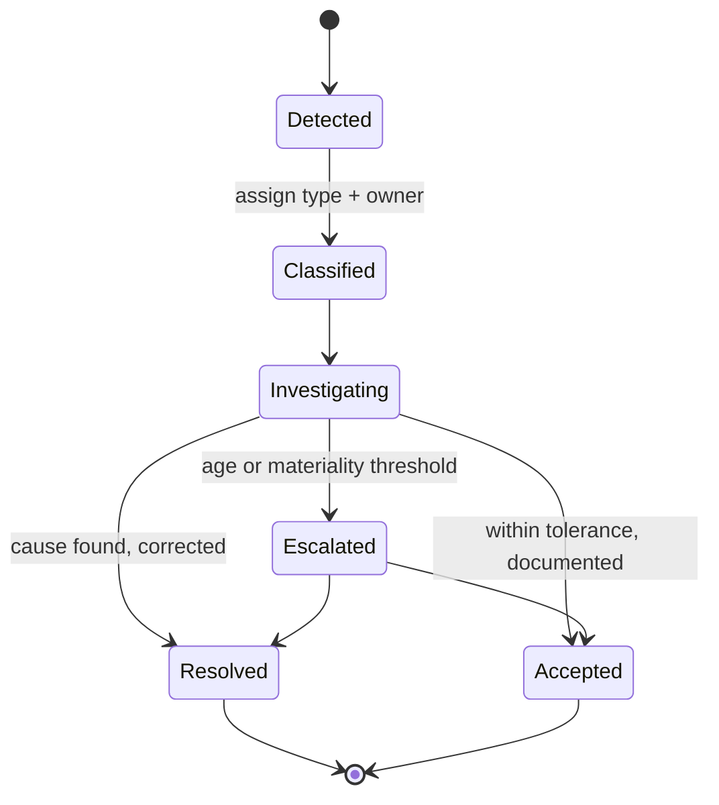

# D16 — Ingestion, Reconciliation & Data Quality

Every external feed enters the platform through here, and every reconciliation is run here. Parent:
`treasury-alm-risk-platform`. Phase 0. **Added in revision 2 (critique C10).**

**Revision B.** Deepened against `d3-market-data-and-curves`, the critique's §3.1 recognition rules and
§3.4 quarantine finding, and the Phase 0 dependency analysis in §7. Changes are listed in the appendix.

**Why it exists as a domain.** The blueprint made reconciliation a hard gate on the EOD pipeline and
gave it no owner. Without a domain, feed adaptation and reconciliation get built once per consumer —
D2 builds core banking ingestion, D6 builds custodian ingestion, D10 builds nostro ingestion, D7 builds
GL reconciliation — with four different break-handling conventions and no consolidated view of whether
today's data is trustworthy.

**The organising idea:** the platform should have exactly one answer to *"is today's data good?"*, and
it should be a state, not an opinion.

**The one-line test for whether D16 is built correctly:** when a number is wrong, can you tell within
minutes whether the cause was a feed that did not arrive, a record that did not validate, or a
difference against an external record that nobody has explained? If those three collapse into "a data
issue", D16 is a loader with a report attached.

## 1. Responsibilities

**D16 owns:** feed adapters and the canonical staging model; acquisition monitoring; data quality
validation; the reconciliation engine; the break register and its lifecycle; quarantine and the
suspense presentation (§4.3); and the **data-good state** that D17 gates on.

**D16 does not own:** what the data *means* once landed (D2 for contracts and balances, D3 for market
data, D1 for static); the **market-data fallback hierarchy** (D3 — §1.1); the accounting rules that
generate the GL side of a reconciliation (D7); the pipeline schedule and gates themselves (D17 — D16
supplies the signal, D17 decides what it blocks); break *resolution*, which belongs to the business
owner of the break.

### 1.1 The D16 / D3 boundary — and a correction

Parent §5 assigns "the fallback hierarchy for missing data" to D16 generically. `d3-market-data-and-curves`
§1.5 and §5 claim the market-data half of it. Both cannot be right, and **D3 is right**: a market data
fallback is instrument-specific, it produces a value carrying a provenance tag that must survive into
valuation and capital treatment, and it is inseparable from curve construction. A generic
"previous good value → interpolate → proxy → fail" ladder in D16 cannot make that judgement.

**The corrected split:**

| D16 | D3 |
| --- | --- |
| Did the feed arrive, on time, parseable, with the expected record count? | Is this a plausible value for *this* instrument, given yesterday's? |
| Cross-source reconciliation and the break register | Which of several available sources is the **official** mark |
| The fallback hierarchy for **position, balance and static** feeds | The fallback hierarchy for **market observables**, and the provenance tag |

The rule: **D16 decides whether the data arrived; D3 decides what the platform believes.** D16 still
counts and reports D3's fallback applications as an acquisition-health signal (§6) — a proxy used
occasionally is a control and a proxy used daily is a broken feed nobody noticed — but it does not
choose the fallback.

Revision A's §4 claimed the market data ladder and the per-instrument staleness tolerance. Both move
to D3.

## 2. Three failure classes, three responses

Revision 1 treated data problems as one thing. They are three, and conflating them produces either
alert fatigue or silent corruption.

| Class | Meaning | Detection | Response |
|---|---|---|---|
| **Acquisition failure** | The feed did not arrive, or arrived incomplete | Expected-arrival monitoring, record counts, control totals | Retry, then escalate. Downstream blocked |
| **Validation failure** | The feed arrived and is malformed, implausible, or fails referential integrity | Validation rules at the staging boundary | Quarantine to suspense (§4.3); the rest may proceed |
| **Reconciliation break** | The data is well-formed and landed, but disagrees with an external record | Reconciliation engine | Break register; may or may not block, by materiality |

**The most dangerous is a partial acquisition that looks successful.** A core banking feed arriving with
60% of records is worse than one that fails to arrive, because the balance sheet simply shrinks and
nothing alerts. **Record counts and control totals are mandatory on every feed** — not a nice-to-have,
and the single most valuable check in the module.

## 3. Ingestion

### 3.1 Adapter pattern

One adapter per source, each responsible for protocol, format and mapping into a **canonical staging
model**. Beyond the staging boundary, no downstream module contains source-specific logic. Adding a
custodian is a new adapter, not a change to D2.

### 3.2 Feed inventory

| Source | Content | Cadence | Consumers |
|---|---|---|---|
| Core banking | Retail and corporate loans, deposits, overdrafts, cards, commitments; customer master | Daily batch | D2, D1 |
| **Incumbent TMS** | **Treasury contract population and lifecycle events, until D4 replaces it in Phase 4** | Daily batch or file | D2 |
| Custodian / CSD | Securities holdings, settlement status, movements | Daily | D2, D6 |
| **Tri-party collateral agent** | **Basket composition as allocated by the agent, which reallocates daily** | Daily | D6, D2 |
| Correspondent banks | Nostro statements (MT940/950) | Daily, ideally intraday | D2, D10, and later intraday monitoring |
| Counterparties / CCPs | Trade population, valuations, margin balances | Daily / monthly | D6, D11 |
| Market data vendors | Prices, rates, curve inputs, spreads, vol | Intraday and EOD snapshot | D3 |
| Reference data vendors | Calendars, ratings, sector, LEI | Periodic | D1 |
| **Corporate action announcements** | **Announcement, ex/record/pay dates, terms, entitlement** | Event-driven | D2, D3, D6 |
| External ECL engine | Allowance and stage assignment | Periodic | D2 |
| External pool/waterfall models | ABS/MBS and index CDS cashflows | Periodic | D2 |

Four rows deserve comment.

**The incumbent TMS feed is the one whose absence would have been discovered late.** Critique
contradiction D8 established that until D4 arrives in Phase 4, the platform has no treasury contract
source at all — D2's near-real-time capability is built in Phase 0 and exploited in Phase 4, which is
deliberate, but it leaves Phases 0–3 with an empty treasury book unless something feeds it. This
adapter is what makes Phases 0–3 produce a real balance sheet, and it is throwaway code by design.
Scope it as such and resist the pull to make it good.

**Tri-party collateral is a basket, not a set of ISINs** (critique §3.1). The agent reallocates daily,
so encumbrance is determined by an arriving report rather than by anything the platform decided. It is
simultaneously an ingestion source and a reconciliation source, and it is the only feed where the
external party's record is definitionally correct and the platform's is the copy.

**Nostro statements should be captured at event granularity with timestamps, not end-of-day balances
only.** The same feed serves intraday liquidity monitoring in a later phase; capturing balances alone
means re-plumbing (parent §4).

**Corporate actions were flagged ownerless by the critique**, and the ownership is genuinely split.
D3 §3.3 takes the price series adjustment factors. D16 takes the announcement feed and its
reconciliation against the custodian's entitlement. **The ops process — deciding an election on a
voluntary action — belongs to D4/D6 and is not in Phase 0.** Naming the split matters because the
mandatory half (splits, redemptions, mandatory conversions) silently corrupts positions if unhandled,
while the voluntary half merely requires someone to make a decision.

### 3.3 Idempotency and replay

**Feeds get resent — routinely.** A correspondent reissues a statement, core banking re-runs an extract,
a counterparty sends a corrected file. Ingestion must be idempotent: the same file loaded twice
produces the same state, not doubled records. Every inbound file carries a source, a logical date and a
sequence, and re-delivery supersedes rather than appends.

This is the ingestion half of D17 §5's idempotency requirement, and the two must be designed together —
a re-run is worthless if re-ingestion is not deterministic.

### 3.4 Late-arriving and back-dated data

Where D16 meets D2's bitemporality. A record arriving today with an effective date of last week is
**normal, not an error**. D16 lands it with today's knowledge date and last week's effective date; D2's
bitemporal model absorbs it; and D17 is notified because previously published figures may now
reproduce differently (D2 §3).

**The control that matters:** back-dated arrivals must be *reported*, not merely absorbed. A material
back-dated volume is a symptom of an upstream process problem, and it is invisible unless someone
counts it.

### 3.5 Control-only fields — received, reconciled, never forwarded

**A field can be ingested for the sole purpose of disagreeing with it.** This is not an edge case; it
is a named architectural requirement in three places, and it needs a mechanism.

Parent §2.1, `part2-taxonomy-mapping` §7.2 and D2 §6.1 all state the same rule: core banking carries
accrued interest and will supply it in the daily feed, **D2 computes accrual, and core banking's figure
is a reconciliation control, not an input**. Ingesting both double-counts taxonomy lines A.15 and B.13
and produces a GL break whose cause is architectural rather than operational.

**So the staging model must distinguish two field classes:**

| Class | Behaviour |
| --- | --- |
| `authoritative` | Lands, forwards downstream, becomes platform state |
| `control_only` | Lands in staging, is **retained and reconciled against the platform's own computed value**, and is never forwarded to D2 |

Without an explicit class, the default behaviour of every adapter ever written is to map the field
through, because it is present in the file and it has an obvious destination. The double-count then
appears as a GL break that operations will try to explain as a timing difference for months.

Other likely `control_only` fields: core banking's own maturity bucketing, its interest rate
classifications, and any balance it computes that the platform also derives. The general rule —
**anything the platform derives, it does not ingest** (parent §2.1's "derived values are never stored
and never ingested") — needs this mechanism to be enforceable rather than aspirational.

## 4. Data quality

### 4.1 The four check classes

Run at the staging boundary before anything lands:

| Check | Examples |
|---|---|
| **Completeness** | Record counts against control totals; mandatory fields; expected account coverage |
| **Staleness** | Feed age against expected cadence; individual record timestamps |
| **Plausibility** | Value ranges, day-on-day movement thresholds, sign conventions, duplicate detection |
| **Referential integrity** | Counterparties, products, currencies and accounts resolve against D1 — **at the D1 version in force for the business date**, not the current one |

The referential integrity rule is easy to state and easy to implement wrongly. Resolving against
*current* D1 means a reprocessing run in March validates January's records against March's counterparty
hierarchy, and records that were valid in January fail. It is the same class of error as D1 §2's
retroactive calendar correction, arriving through a different door.

### 4.2 Fallback

For position, balance and static feeds, D16 owns the ordered fallback rule per data type, and every
application is logged, visible in the run report, and counted.

For market observables, D3 owns the hierarchy and the provenance tag (§1.1). D16 counts the
applications and publishes the count to D17 as an acquisition-health signal.

**Silent substitution is the failure mode to design against in both cases.** A fallback used
occasionally is a control; a fallback used daily is a broken feed nobody noticed.

### 4.3 Quarantine is a suspense account, not an exclusion

**Corrected in revision B, against critique §3.4 — this was the most consequential gap in revision A.**

Revision A said quarantined records are "visible, counted, aged and either corrected or explicitly
written off". That is necessary and it is not sufficient, because it leaves the record *out of the
balance sheet*. The critique's finding is exact:

> A quarantined retail deposit is *missing* from the balance sheet — which does not make ratios
> "quietly wrong", it makes the balance sheet not balance, and the daily batch will produce
> quarantines from day one.

**The rule: quarantine routes to a reported suspense bucket, never to exclusion.**

- A quarantined record lands in an **unclassified suspense position** carrying whatever attributes did
  validate — at minimum an amount and a currency.
- **Every balance sheet and every ratio report renders an explicit unclassified line**, even when it is
  zero. A line that appears only when non-zero is a line nobody notices when it appears.
- Suspense above a materiality threshold is a **hard sign-off gate**, surfaced to D17 as a validation
  outcome (§6).
- Ageing applies: a record in suspense for five days is escalated, and the ageing is on the record, not
  on the day's batch.

**The reasoning is worth retaining because it is counter-intuitive.** Exclusion feels safer than
admitting a wrong number into the balance sheet. It is not: a wrong classification is visible and
challengeable, while an absent record is invisible and produces a balance sheet that does not balance
by an amount nobody can name. **The point of quarantine is visibility, and exclusion is less visible
than a wrong classification.**

This also resolves what D2 §2.4 means operationally. D2 requires classification failures to quarantine
rather than default silently; the suspense bucket is the mechanism, and it lives here.

## 5. Reconciliation

**The principle from parent §4:** the platform is the sub-ledger and the GL is the control account.
Differences are exceptions to be explained, never adjustments to be plugged.

### 5.1 The four reconciliations

| # | Reconciliation | Question | Frequency | Needs |
|---|---|---|---|---|
| 1 | Sub-ledger to GL | Does my accounting agree with the bank's books? | Daily, per account and currency | **D7 — Phase 4** |
| 2a | Position to external record — **population** | Do I own what I think I own? | Daily — custodian, nostro, tri-party, counterparty | Phase 0 |
| 2b | Position to external record — **valuation** | Do we agree on what it is worth? | Daily — counterparty, CCP | **D8 — Phase 2** |
| 3 | Trade population to confirmation status | Is everything I booked legally real? | Daily | **D4/D5 — Phase 4** |
| 4 | Dual-mastered attributes | Do D1 and the upstream master agree? | Periodic — per D1 §4 golden source | Phase 0 |

Reconciliation 4 was implicit in D1's golden-source rule and needs an executor; it lives here.

**Splitting 2 into population and valuation is new in revision B** and it matters twice: the two have
different phase dependencies (§7), and they demand different responses (§5.3).

### 5.2 A break is an object with a lifecycle, not a daily difference

This is the distinction that separates a reconciliation *control* from a reconciliation *report*.

A break carries: detection date, reconciliation, classification (timing / error / missing / valuation
difference), materiality, owner, age, investigation notes, and resolution. **It persists across days
until cleared** — the same break detected on five consecutive days is one five-day-old break, not five
breaks. Getting this wrong makes ageing meaningless and is the most common implementation error.

Ageing thresholds trigger escalation automatically. Resolution requires a stated cause, not merely the
difference disappearing — a break that vanishes because the underlying data changed is still a break
that needs explaining.

### 5.3 Materiality and the data-good state

Each reconciliation has a materiality threshold and a tolerance. D16 publishes a **data-good state per
domain and per business date** — clean, provisional, or blocked — which D17 gates on (§6).

**Valuation differences and population differences are different incidents.** A small MTM difference
against a counterparty statement is a model disagreement to log and monitor for trend; a missing trade
is an incident with a legal dimension. The same reconciliation produces two entirely different
responses, which is why §5.1 splits them.

### 5.4 The custodian reconciliation is not a like-for-like comparison

**New in revision B, and it is the finding most likely to derail the Phase 0 reconciliation build.**

The obvious implementation compares the platform's securities positions against the custodian's
holdings statement and raises a break on every difference. **Under the recognition rules the critique
established (§3.1, now parent Appendix A row 2), that implementation breaks on every repo, every
reverse repo and every securities loan in the book** — which is to say, continuously.

| Situation | Platform | Custodian | Correct reconciliation behaviour |
|---|---|---|---|
| Security repo'd out | **Still a Position**, encumbered — not derecognised | Delivered away, absent | Expected difference. Reconcile platform position *plus* encumbrance state against custodian holdings *plus* the repo record |
| Security received under reverse repo | **Not a holding** — memo only, but HQLA-eligible if rehypothecable | Present in the account | Expected difference in the opposite direction |
| Security lent | Still a Position, encumbered | Absent | As repo'd out |
| Tri-party basket | Composition known only from the agent's report | Agent's allocation | The agent's record is authoritative; the platform's is the copy |

**So the reconciliation is three-way, not two-way:** platform positions, custodian holdings, and the
encumbrance and financing register that explains the difference between them. A two-way build produces
a break register dominated by expected differences, which is indistinguishable from — and rapidly worse
than — no reconciliation at all, because it trains everyone to ignore it.

This makes D6's **minimal encumbrance register**, already pulled forward into Phase 0 by parent §6 for
HQLA reasons, a **second, independent Phase 0 dependency** — this time for reconciliation. Worth noting
because if the HQLA argument were ever relaxed, the reconciliation argument would still hold.

## 6. The contract with D17

D16 detects; **D17 decides what a detection blocks**. The interface is deliberately narrow:

| D16 publishes | D17 consumes |
|---|---|
| Feed arrival status per source and business date | Gate on ingestion completeness |
| Validation outcome, quarantine counts, **suspense materiality** | Gate on data quality |
| Reconciliation status and unresolved break materiality per domain | Gate on reconciliation |
| Fallback application counts, including D3's | Warning signal, not usually blocking |

Separating detection from decision means the same signal can block one consumer and merely flag
another — a custodian break blocks securities-dependent reporting without blocking the interest rate
gap. This is the D17 §2 rule that a stage blocks only its descendants, expressed at the data layer.

## 7. Phase split — and what gates the EOD before Phase 4

The parent lists D16 in Phase 0 undifferentiated. It cannot all be Phase 0, and the reason is
structural rather than a matter of effort: **three of the four reconciliations depend on modules that
arrive in Phase 2 or Phase 4.**

| Capability | Phase | Note |
|---|---|---|
| Adapter framework, canonical staging, idempotency, control-only field class | **0** | The spine; everything else attaches to it |
| Acquisition monitoring, control totals, the four DQ checks | **0** | §2's most valuable check is here |
| Quarantine and the suspense presentation | **0** | Balance sheet does not balance without it from day one |
| Core banking, incumbent TMS, custodian, nostro, reference and market data adapters | **0** | |
| Reconciliation 2a — position to external record, population | **0** | Needs D6's minimal encumbrance register (§5.4) |
| Reconciliation 4 — dual-mastered attributes | **0** | |
| Break register, lifecycle, ageing, escalation | **0** | Built once, used by all four reconciliations |
| Tri-party agent adapter and basket reconciliation | **1** | With D10's HQLA and encumbrance needs |
| Reconciliation 2b — valuation differences | **2** | Cannot compare a valuation the platform cannot produce |
| Reconciliation 1 — sub-ledger to GL | **4** | Needs D7's postings |
| Reconciliation 3 — trade to confirmation | **4** | Needs D4/D5 |

**The consequence nobody has stated.** Parent §4 makes reconciliation a hard EOD gate and parent §3
puts "GL reconciliation" in the EOD sequence — but **the sub-ledger-to-GL reconciliation cannot run
until Phase 4.** For Phases 0 through 3, the strongest available control on the platform's own
correctness is reconciliation 2a: position against custodian, nostro and counterparty records.

Two things follow, and both are decisions rather than observations:

1. **State explicitly what the Phase 0–3 reconciliation gate consists of**, so that the "hard gate"
   language in parent §4 does not imply a control that does not yet exist. A gate that is documented
   and empty is worse than an acknowledged gap.
2. **Consider an interim GL comparison** — platform positions against the existing GL balances at
   account level, without the posting-level decomposition D7 will later provide. It is coarse, it
   cannot decompose a break to a contract, and it would still have caught most of the population
   errors that a Phase 0 platform will actually make. Whether it is worth building for a three-phase
   life is a real trade-off, and it should be decided rather than defaulted.

## 8. Sizing, performance and the critical path

**D16 opens the EOD window.** Every stage in D17's DAG descends from ingestion and reconciliation, so
D16's elapsed time is pure critical path — it delays everything and parallelises with nothing.

Two consequences for design:

- **Reconciliation is the expensive half, not ingestion.** Matching ~500k core banking contracts plus
  internal mirrors (D2 §4.4 puts the effective count at a multiple of 500k) against external records,
  with fuzzy matching on unstructured counterparty statements, is where the time goes. Matching keys
  and their fallback order should be designed for throughput at this scale rather than discovered at it.
- **Feeds arrive at different times, and waiting for the slowest wastes the window.** Ingestion should
  start per feed on arrival rather than at a single batch start, with the gate evaluated once the
  expected set is complete. This is a D16/D17 joint design point.

**Volume is unremarkable** — the break register and staging history are small relative to D2. Retention
is the real question: reconciliation results are audit evidence (§9), so they are retained on the same
horizon as the audit trail, not on an operational one.

## 9. Governance, evidence and build/buy

**Reconciliation output is the first thing an auditor and a regulator ask to see**, which makes D16 an
evidence-producing module rather than an operational convenience. The break register, its ageing, and
the record of what was accepted within tolerance and by whom flow to D15 as auditable evidence.

**BCBS 239 is the governing standard and is unnamed anywhere in the blueprint.** Its principles on risk
data aggregation — accuracy and integrity, completeness, timeliness, adaptability — are close to a
specification for this module, and for a bank of the size the source taxonomy implies, compliance is
expected rather than optional. Naming it gives D16's requirements an external anchor and gives the
programme a defensible answer to "why does this module exist".

**Build/buy posture: buy the reconciliation and matching engine; build the adapters.** The parent's
phase table marks all of Phase 0 "Build — competitive core", and that is right for D1, D2 and D3 and
wrong here. Matching engines, break workflow and exception management are a mature vendor market, and
nothing about this bank's reconciliation is a competitive differentiator. The adapters are bank-specific
and stay in-house. This mirrors the critique's "buy" posture for D17's orchestration engine, and the
two should be evaluated together — several vendors sell both, and the D16/D17 interface in §6 is narrow
enough that they need not come from the same supplier.

## 10. Interfaces

**Inbound.** All external feeds (§3.2). D7 for the GL side of reconciliation 1 (Phase 4). D2 for
positions in reconciliation 2. **D6 for encumbrance and financing state, without which reconciliation
2a produces false breaks** (§5.4). D8 for valuations in reconciliation 2b (Phase 2). D4/D5 for trade and
confirmation status in reconciliation 3 (Phase 4). D1 for golden-source designations and referential
integrity, version-addressed to the business date.

**Outbound.** Landed canonical data to D2, D3 and D1. Data-good state and gate signals to D17. Suspense
positions to D2 for balance sheet presentation (§4.3). Break register and reconciliation results to
operations, and as auditable evidence to D15.

## 11. Acceptance criteria

1. Every feed has expected-arrival monitoring, record counts and control totals; a partial arrival is
   detected, not absorbed
2. Ingestion is idempotent — re-delivery supersedes and never doubles
3. Back-dated arrivals land correctly on both temporal axes and are separately reported and counted
4. Referential integrity resolves against the D1 version in force for the business date, including on
   reprocessing runs
5. Fields the platform derives are ingestible as `control_only` — retained and reconciled, never
   forwarded — and accrued interest demonstrably does not reach D2
6. The fallback hierarchy is documented per data type, enforced in order, and every application is
   logged and counted, including D3's
7. **Quarantined records land in a reported suspense position; every balance sheet and ratio report
   renders an unclassified line even when zero; the balance sheet balances**
8. Breaks persist as objects across days with stable identity, correct ageing, and automatic escalation
9. Break resolution requires a stated cause; a disappearing difference does not auto-close
10. The custodian reconciliation is three-way and produces **no** break for a normally-financed repo,
    reverse repo, securities loan or tri-party allocation
11. Population and valuation differences are separately classified and separately escalated
12. A data-good state is published per domain per business date, and D17 gates on it
13. Adding a new source is a new adapter with no change to any downstream module
14. The Phase 0–3 reconciliation gate is explicitly documented, including what it does not yet cover

## 12. Open questions

1. **Core banking extract capability** — can it produce a complete daily contract-level extract with
   control totals, and can it flag deltas, or is a full snapshot the only option? This shapes the
   largest adapter.
2. **Incumbent TMS extract** — can it produce a contract-level treasury population, and at what
   granularity? Phases 0–3 have no treasury book without it (§3.2), and this question has no owner
   in any artifact today.
3. **Nostro granularity** — do correspondents supply event-level statements with timestamps, or
   end-of-day balances only? Determines whether intraday monitoring is later an addition or a rebuild.
4. **Counterparty statement cadence and format** — daily or monthly, machine-readable or PDF. PDF-only
   counterparties cannot be reconciled daily without manual effort, and they are also the ones whose
   legal agreements D1 §7 needs extracted, so the two exercises hit the same population.
5. **Interim GL comparison — build it or accept the gap?** §7. A three-phase-life control, and the
   answer should be explicit.
6. **Break ownership model** — who owns a break by classification, and what is the escalation path
   beyond ageing thresholds?
7. **Materiality thresholds** — set by whom, reviewed how often, and are they absolute or proportional?
8. **Suspense tolerance** — what volume of unclassified balance is acceptable before the EOD is
   blocked rather than flagged? This is a business decision with a regulatory dimension, not an
   operational parameter.

## Appendix — revision B changes

| Ref | Change |
| --- | --- |
| B1 | Market-data fallback hierarchy and per-instrument staleness moved to D3; D16/D3 boundary stated (§1.1) — resolves a direct contradiction with `d3-market-data-and-curves` §1.5 |
| B2 | **Quarantine corrected to a reported suspense bucket** against critique §3.4; exclusion breaks the balance sheet (§4.3) |
| B3 | `control_only` field class added, enforcing the accrued interest rule from parent §2.1 and `part2-taxonomy-mapping` §7.2 (§3.5) |
| B4 | Custodian reconciliation restated as three-way under the repo/sec-lending recognition rules; second Phase 0 dependency on D6's encumbrance register (§5.4) |
| B5 | Reconciliation 2 split into population and valuation — different phases, different responses (§5.1, §5.3) |
| B6 | Phase split added; three of four reconciliations depend on Phase 2/4 modules, leaving the Phase 0–3 gate weaker than parent §4 implies (§7) |
| B7 | Incumbent TMS, tri-party agent and corporate action feeds added to the inventory (§3.2) |
| B8 | Sizing and critical path added; reconciliation, not ingestion, is the expensive half (§8) |
| B9 | BCBS 239 named; build/buy posture stated as buy-the-engine, build-the-adapters, against the parent's blanket "build" for Phase 0 (§9) |
