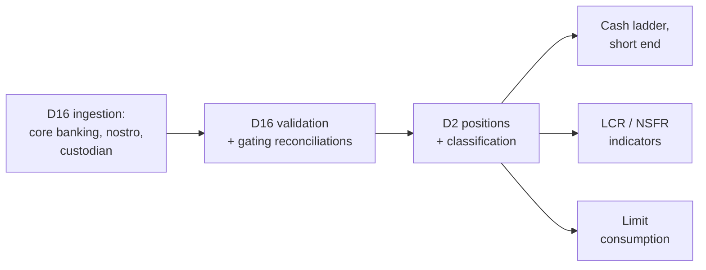

# EOD Window, Compute Budget & Degradation Order

The operational contract the batch pipeline is built against. Parent: `treasury-alm-risk-platform`.
Resolves open questions 1 and 2 in `d17-batch-orchestration` §9 and unblocks sizing in D2, D16 and D17.

**Amended for `D11-7`.** Risk measures were one tier row and are five workloads (§5.3); the sensitivity
ladder separates from VaR on reporting dates because only one of them is a capital number (§5.1); and
**the counterparty exposure simulation — the largest compute in the platform — had no row at all**,
because it belongs outside the tiers rather than inside them (§5.4). Sizing consequences for D8 and D11
join §6.

## 1. The window

| Boundary | Time | Constraint |
|---|---|---|
| **Last essential input** | ~00:00 | Core banking EOD extract — the binding constraint, later than market close for foreign-currency holdings |
| **First hard deadline** | 07:00 | Market open. The desk needs cash position, funding requirement, limit availability and ratio status to trade |
| **Window (W)** | **7 hours** | 00:00 → 07:00 |

**The window is entirely outside business hours.** This is the single most consequential fact about it,
and §4 sets out what follows.

## 2. Compute budget

The requirement "EOD completes with re-run headroom" (parent §5), made precise:

```
R + F + R  ≤  W

W = window                      = 7h
F = detect + decide + fix       = 1h assumed (§4 — unattended, so this is optimistic without automation)
R = full pipeline run time
```

**R ≤ (W − F) / 2 = 3 hours.**

Two refinements:

- **R is the critical path, not total work.** The pipeline is a DAG (`d17-batch-orchestration` §2), so
  parallel branches do not add. Keeping expensive stages — valuation, stress runs — off the critical
  path to the earliest deadline is worth real design effort.
- **A partial re-run is much cheaper than a full one.** The practical constraint is *critical-path
  re-run*, which is why §3's tier A path is budgeted separately and far more tightly.

**Feed reliability is unknown, so the design assumes routine re-runs.** Budgets below are set on that
assumption and should be revisited once six months of run telemetry exists (§6).

### Derived budgets

| Path | Budget | Reasoning |
|---|---|---|
| **Tier A critical path** | **≤ 90 minutes** | Allows two full attempts plus a fix inside the window even if the first failure is discovered late |
| **Full pipeline (R)** | **≤ 3 hours** | From the formula above |
| **Tier B completion** | Same business day | Not window-constrained |

## 3. Tier A — the critical path

What must exist by 07:00, and the minimum pipeline to produce it.

**Outputs:** cash and nostro position; today's funding requirement; limit availability for dealers;
regulatory ratio status (are we still compliant?).

**Stages required:**



**What tier A does not need — and this is the point.** No valuation, no P&L, no VaR or SA-CCR, no EVE or
NII, no accounting postings. The critical path avoids the entire valuation subtree.

**The LCR falls out cheaply, and that is not an accident.** Because LCR is **balance × prescribed
factor** rather than a valuation-dependent computation (`d10-liquidity-and-funding` §3.1), a daily
ratio indicator needs classified balances and nothing else. The correction that fixed the module's
mechanism also made a by-open regulatory ratio affordable.

**Reconciliations split across tiers.** Only reconciliations that gate tier A run on the critical path —
principally nostro, since a wrong cash position is a wrong funding decision. Custodian, counterparty and
GL reconciliations gate tier B and run after.

## 4. The unattended-window consequence

**The entire seven hours falls outside business hours.** If a gate fails at 02:00, nobody is watching.
This changes the design more than the duration does.

**Three requirements follow:**

1. **Automated recovery first.** Transient failures — a feed arriving late, a timeout, a retryable
   error — must auto-retry on a defined policy before any human is involved. Most overnight failures are
   transient, and a design that pages a human for each one is a design nobody will operate.
2. **Paging escalation for the rest.** Non-transient gate failures must reach a person, with a defined
   on-call rota and escalation path. The F = 1 hour assumption in §2 **is only achievable with paging** —
   without it, a 02:00 failure is discovered at 07:00 and the window has already gone.
3. **Tier A path kept short precisely because of this.** A 90-minute critical path means a failure
   discovered as late as 04:30 still leaves time for a fix and a full re-run before open. This is the
   real justification for the tight budget, more than raw compute economics.

**Recommendation:** instrument F from day one — time from failure to human acknowledgement, and to
resolution. It is the assumption most likely to be wrong, and the one that invalidates the whole budget
if it is.

## 5. Degradation order

Applied when the window is at risk. **Approved as proposed, including the reporting-date inversion.**

| Tier | Outputs | Normal day |
|---|---|---|
| **A** | Cash and nostro position, funding requirement, limit availability, ratio status | **Must have by 07:00.** Without these the desk cannot operate |
| **B** | Full LCR/NSFR, P&L and attribution, ALM metrics, and **risk measures — but not as one class** (§5.3) | Same business day |
| **C** | Accounting postings, GL reconciliation, management reporting, FTP | May run late |
| **D** | Scenario and stress runs, non-regulatory analytics. **Per-scenario `run_tier` overrides the class** (`d14-scenario-and-stress-framework` §8) | Skippable, back-filled |
| **Off-window** | **Counterparty exposure simulation — PFE, EPE, simulated-exposure XVA** | **Not a tier.** Larger than everything above combined, and neither same-day nor skippable (§5.4) |

### 5.1 Date-dependent inversions

**Regulatory reporting dates: regulatory output rises to tier A.** On a submission date the priority
order changes — regulatory outputs outrank almost everything, including some trading-support outputs.
D17 holds the regulatory reporting date calendar (`d17-batch-orchestration` §6) and must apply the
alternate priority automatically rather than relying on someone remembering.

**Month-end: tier C rises to tier B.** Accounting postings and GL reconciliation become same-day
requirements. Note the compounding problem: **month-end runs are longer *and* have tighter priorities**,
so window pressure is worst exactly when the workload is heaviest. Month-end should be explicitly
load-tested, not assumed to scale from a normal day.

**The inversion's least obvious member is the sensitivity ladder — and it separates from VaR.** The two
sit together in tier B and read as one workload, but only one of them is a regulatory output. Market risk
capital is standardised and, under the parent's Basel III/IV scope, the standardised approach is itself
sensitivities-based, so **the sensitivity ladder is an input to market risk RWA while VaR is a management
and limit measure** (`d11-market-and-counterparty-risk` §2.2.1).

| On a reporting date | Tier | Consequence |
|---|---|---|
| **Sensitivity ladder** (D8-produced, D11-aggregated) | **A** | Rises with the other regulatory output. It also drags D8's per-subject sensitivity production onto the critical path on those dates, which is the part that has to be sized |
| VaR / ES, stressed VaR | **B**, unchanged | Nothing regulatory depends on it that day |

**Two things follow.** The alternate priority order D17 applies automatically (above) must distinguish
*within* risk measures rather than promoting the class, or it lifts a 250-revaluation fan-out onto the
90-minute critical path to no purpose. And **D13 §6.1's stricter reporting-date gate policy — no override
may permit a submission from provisional data — attaches to the sensitivity ladder**, not to VaR.

**This rests on one unconfirmed reading**, tracked as `D11-11` in the parent's D11 appendix: whether
"standardised" in `d13-regulatory-reporting-and-capital` §3 means the sensitivities-based method. If it
does not, the ladder stays tier B with VaR and this sub-section reduces to a note. **Nothing else in this
document moves either way**, so it is not worth blocking on — but it is worth asking before the D17
priority table is configured, because the wrong answer is invisible until a submission date.

### 5.2 Two rules that keep degradation honest

**A skipped output is an announced output.** Never a silent absence. The recipient is told what is
missing and when it will arrive. Silent omission is how a missing report becomes an assumed-fine report.

**Degraded is not the same as provisional.** Publishing *partial* results and publishing *unvalidated*
results are different decisions with different approvals. A tier D skip is a scope decision; a gate
override is a data-quality decision carrying the provisional flag (`d17-batch-orchestration` §4). The
two must not be conflated in either the approval path or the output labelling.

### 5.3 "Risk measures" is one tier row covering five workloads

Tier B's original wording treats risk measures as a class. **They differ by an order of magnitude in
cost and by more than that in urgency**, and the per-measure tier is the same correction
`d14-scenario-and-stress-framework` §8 makes for scenarios — *the tier belongs on the member, not on the
category*.

| Measure | Tier | Why not simply "B" |
|---|---|---|
| Current exposure, SA-CCR EAD | **B** | Formula over data that already exists. Cheap, and it feeds the limit framework's counterparty line |
| **Sensitivity ladder** | **B, rising to A on reporting dates** | It is a capital input (§5.1) |
| VaR / ES, stressed VaR | **B** | Management measure. Back-fillable — with one caveat below |
| P&L attribution | **B** | Its output is tomorrow's backtest input, so a skip breaks a control rather than a report. The residual is also the platform's best single consistency check (`d11-market-and-counterparty-risk` §2.3), which is an argument against treating it as the first thing to drop |
| Exposure simulation — PFE, EPE, XVA | **Off-window** | §5.4 |

**One caveat on back-filling VaR.** A skipped VaR is a missing observation in a series whose *count* has
meaning: the backtest exception count is assessed over a rolling window, and a gap is not back-fillable
in the sense tier D implies — a VaR computed three days late against a reconstructed position is not the
measure that was in force. The bank is on standardised market risk capital, so today this is a governance
question rather than a capital one. **If that ever changes, the VaR run needs a stated no-skip policy**,
and it is cheaper to know that now than to discover it during a model application.

### 5.4 One workload does not belong in the tiers at all

**The counterparty exposure simulation is the largest compute in the platform and this document has never
carried a row for it.** That is not an oversight in the tiering; it is a workload the tiering does not
describe. Its multiplier is `netting sets × paths × time steps` — hundreds of millions of valuations,
against ~500 full passes for VaR and stressed VaR combined
(`d8-valuation-and-analytics` §6.1, `d11-market-and-counterparty-risk` §5.1).

It fits none of A–D:

| Tier | Why not |
|---|---|
| A or B | It does not fit the seven-hour window, let alone the 90-minute critical path. Forcing it in means the window is missed on the nights it runs |
| C | "May run late" implies it runs nightly and merely finishes late. It should not run nightly |
| D | "Skippable, back-filled" is wrong in the other direction — **XVA feeds D7's accounting values and D13's capital**, so it cannot simply not happen |

**Recommendation: a scheduled off-window workload with its own compute allocation and a stated
frequency** — **weekly full simulation, with a daily approximate roll-forward** for the exposure numbers
limits and XVA consume between full runs. The roll-forward is what keeps the daily outputs honest without
paying for the full simulation nightly, and the full run is what keeps the roll-forward anchored.

**This is the same shape as reverse stress testing** (`d14-scenario-and-stress-framework` §5, §8) and gets
the same treatment for the same reason: *a workload that does not fit the nightly window should be planned
as one that does not, rather than found not to.* Both should be sized against one offline compute
allocation rather than two, since they compete for the same grid and neither is same-day.

**Three things this needs before Phase 5, none of which is a Phase 5 decision:**

1. **A frequency approved by whoever owns the XVA number** — finance for the accounting input, risk for
   the limit input. A weekly full run is a stated staleness, and stated staleness is D8 §5.1's pattern
2. **A compute allocation separate from the EOD grid budget** in §2, or the two silently contend
3. **The `T` measurement** from `d8-valuation-and-analytics` §6.1 — without it, none of the above can be
   sized, and it is available as soon as the Phase 2 wrapper runs

## 6. Sizing consequences

What this unblocks in each module.

### D2 — Instrument & Position Core

- Full-balance-sheet projection on both bases must fit within the 3-hour full-run budget, **sized on the
  assumption that the floating-rate book invalidates its cache daily** (D2 §4.4) and that internal FTP
  and hedge contracts multiply the effective contract count beyond 500k
- The **tier A subset** — positions, classification and the short-end cash ladder — must complete inside
  the 90-minute critical path. This is a much tighter constraint than the full run and should drive
  whether position derivation is incremental or full-rebuild
- Determinism work (D2 §7.4) is load-bearing operationally, not only for reproducibility: routine
  re-runs are assumed, and a re-run that silently differs from the original is unusable

### D16 — Ingestion, Reconciliation & Data Quality

- Ingestion and validation sit at the head of the tier A path, so their runtime comes directly out of
  the 90-minute budget — they need to be fast, not merely correct
- **Reconciliations must be tiered.** Nostro gates tier A; custodian, counterparty and GL gate tier B.
  Running every reconciliation before anything publishes would put the entire reconciliation suite on
  the critical path
- Auto-retry policy per feed is a D16 responsibility feeding D17's gate evaluation (§4)

### D17 — Batch Orchestration

- The DAG must be arranged so the tier A path is genuinely minimal — this is a design objective, not an
  emergent property
- Automated retry, paging escalation and the on-call rota are Phase 0 scope, not Phase 7 polish
- The alternate reporting-date and month-end priority orders are configuration, applied automatically
- Run telemetry from day one: stage durations, critical path duration, gate outcomes, retry counts, and
  time-to-acknowledge
- **The alternate reporting-date order distinguishes within risk measures**, promoting the sensitivity
  ladder without promoting VaR (§5.1). A class-level promotion lifts a 250-revaluation fan-out onto the
  critical path for nothing

### D8 / D11 — Valuation and Risk

**Added with §5.3 and §5.4.** These arrive in Phases 2 and 5, three and six phases after this contract is
written, and two of the three items below are decided in Phase 2 regardless.

- **`T` — one full revaluation pass of the fair-valued book — is the number none of this can be sized
  without**, and it is measurable as soon as the Phase 2 wrapper runs. Everything in §5.3 and §5.4 is a
  multiple of it (`d8-valuation-and-analytics` §6.1, acceptance criterion 16)
- **The nightly risk fan-out is ~500 `T` for VaR and stressed VaR**, off the tier A path and inside the
  business day. That is a grid two orders of magnitude larger than Phase 2's single pass, and the
  licensing consequence is a Phase 2 procurement item, not a Phase 5 one
  (`d8-valuation-and-analytics` §9.2)
- **The exposure simulation is budgeted separately from `R`** (§2, §5.4). If it is allowed to draw on the
  EOD grid allocation, the 3-hour full-run budget is being shared with a workload that is larger than the
  pipeline it is sharing with, and the contention is invisible until both run on the same night
- **The sensitivity ladder is 29 nodes, not ~19 — `D14-6`.** The platform vertex set is the union of the
  IRRBB band midpoints and the prescribed capital vertices, so both regulatory views are exact subsets
  (`d1-reference-and-static-data` §3.10). That is **~53% more perturbations per pass than §5.3 was drawn
  against**, and it compounds with the reporting-date promotion above: the ladder is both larger than
  assumed and, on submission dates, on the critical path. **This lands in Phase 2, not Phase 5**

### D15 — the impact statement is a recurring workload from Phase 3

**Added under `D15-9`.** `d15-control-core` §4's dry-run has been costed as a Phase 0 build item with no
running cost, which is right for the rule sets it was specified against and wrong from Phase 3 onward.

- A rule-set impact statement is a classification pass. **A recalibrated behavioural model's impact
  statement is a full EVE and NII re-run under both parameter sets** — a complete D9 cycle, twice
- **Recalibration is scheduled, not exceptional**, so this is a periodic workload with a place in the
  budget rather than an occasional intrusion into headroom. It is the only workload in this document
  that is triggered by a governance calendar rather than by the trading day
- It does not need to be inside the window. **It needs an allocation and a stated place** — most
  naturally alongside §5.4's off-window workloads, which is where the reverse stress and exposure
  simulation contention already has to be resolved

## 7. Review triggers

The budgets rest on two unknowns and should be revisited when either resolves:

1. **Feed reliability** — currently unknown, assumed poor. After six months of telemetry, re-derive the
   re-run frequency and adjust headroom
2. **F (detect + fix)** — assumed 1 hour, achievable only with paging. Measure it; if actual F exceeds
   90 minutes, R must come down or the tier A path must shorten further
3. **Balance sheet growth** — the 3-hour budget was set against a ~500k-account book plus internal
   contracts. Material growth re-opens the cohorting option deferred in D2 §4.4
4. **`T`, once measured** (§6, D8/D11) — every figure in §5.3 and §5.4 is a multiple of a number that does
   not exist yet. Revisit the off-window allocation and the tier B contents when the Phase 2 wrapper
   produces it

## 8. Approvals required

| Item | Approver | Status |
|---|---|---|
| Degradation tiers A–D | ALCO and finance | Proposed, approved in principle — **needs formal sign-off** |
| Reporting-date inversion | Finance and compliance | Proposed |
| **Sensitivity ladder rising to tier A on reporting dates** (§5.1) | Finance and regulatory reporting | Proposed — **conditional on the `D11-11` reading of D13 §3** |
| **Exposure simulation frequency — weekly full, daily roll-forward** (§5.4) | **Finance for the XVA accounting input; risk for the limit input** | Proposed. Needed before Phase 5 sizing, and the staleness is the thing being approved |
| **Off-window compute allocation, shared with reverse stress testing** (§5.4) | Operations with the Phase 2 grid owner | Not yet scoped |
| Month-end tier C → B | Finance | Proposed |
| On-call rota and paging | Operations | **Not yet scoped — required for the F = 1h assumption to hold** |
| Auto-retry policy per feed | Operations with D16 owner | Not yet defined |
| **Off-window allocation for model impact statements** (§6, `D15-9`) | Operations with the model owner | Not yet scoped — arrives with Phase 3 recalibration |

## Appendix — amendments applied from sibling modules

| Ref | Applied | Section |
|---|---|---|
| `D14-6` | The sensitivity ladder is 29 nodes rather than ~19 — ~53% more perturbations per pass than §5.3 assumed, from Phase 2, compounding with the reporting-date promotion | §6 |
| `D15-9` | The impact statement becomes a **recurring** workload from Phase 3, because a recalibrated model's dry-run is a full EVE/NII re-run under both parameter sets and recalibration is scheduled | §6, §8 |

Raised by `d14-scenario-and-stress-framework` and `d15-model-governance`, recorded as
deferred-with-trigger in the parent's D14 and D15 appendices, applied here under *"this artifact is next
amended"*. Refs keep their originating namespace (`blueprint-amendment-protocol` R1) and allocate no
`EOD-n`.

**Both make the nightly machine larger than §6 costed, and neither is a design change.** `D14-6` was
already decided in D1 §3.10 and had simply never reached a sizing document; `D15-9` is a running cost
attached to a capability everyone had priced as a one-off build. `D11-7` — already applied here — is the
third of the same kind, and the pattern is worth noting: **this document is downstream of decisions
taken in modules that arrive years later, so it goes stale silently.** §7's review triggers should be
read as including "a sizing-relevant amendment lands in any module".
