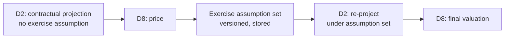

# P2-12 — Two-pass Exercise Protocol

**Wave 4. Depends on P2-07, P2-08, P0-05, P0-12.**

**Resolves a circularity the blueprint's run sequence could not have executed.**

Governing artifacts: `d8-valuation-and-analytics` §5, §5.1.

## The circularity

D2 permits an exercise assumption to come from *"D8's model-implied exercise"* — **but D8 needs D2's
cashflows to price.**

**For every callable bond, puttable, CoCo and Bermudan swaption, the call graph is circular with no
stated resolution order.** This was the architecture critique's §3.4 finding, and it stayed open through
several revisions because each module's spec was locally coherent.

## The resolution — three steps with a stored artefact between them

**The middle artefact is the point.** The exercise assumption is a **versioned, reproducible object**,
not a hidden call between two modules. It is an input to the next projection exactly as a behavioural
model output is, it is governed by D15, and **"why did this callable's cashflows change" resolves to a
dated assumption version.**

## The EOD sequence conflict, and the recommended way out

**Parent §3 runs `cashflow regeneration → valuation` in a straight line. The two-pass protocol needs
projection → valuation → re-projection — a cycle inside a DAG that D17 models as acyclic.**

| Option | Consequence |
|---|---|
| Run the loop within the EOD | Correct, and **adds a second projection pass over the callable population to the critical path** |
| **Use the prior day's assumption set** | **Breaks the cycle.** The assumption is a day stale; for a Bermudan callable that is immaterial **except around an exercise date** |

**Recommended: the prior day's assumption set, with a documented same-day refresh around exercise
dates.** It keeps the DAG acyclic, keeps the critical path short, and **converts an accidental staleness
into a stated one.**

**What must not happen is the cycle being resolved implicitly by whichever stage runs first**, which is
what an unspecified design produces.

## In scope

- The three-step protocol and the stored assumption set
- The cycle-breaking convention, **documented as a decision**
- The exercise-date refresh window
- Model-implied cashflow tagging: **returned by D8, tagged as such, and never written back to D2 as
  contractual fact.** They are a third basis, not an amendment to the contractual or behavioural ones

## Out of scope

- Option pricing — P2-08
- D17's DAG — this ticket supplies the constraint; D17 implements it
- Behavioural models — Phase 3

## Acceptance criteria

1. The exercise assumption set is a **stored, versioned artefact**, resolvable for any historic date
2. **Model-implied cashflows are tagged and are never written back to D2 as contractual fact**
3. The chosen cycle-breaking convention is **documented**, and the EOD DAG remains acyclic
4. The same-day refresh fires around exercise dates, and the window is configuration
5. A callable's cashflow change resolves to a dated assumption version, not to an investigation
6. Historic callable valuations reproduce under the assumption set in force at the time

## Notes

**Parent §3's sequence needs amending regardless of which option is chosen** — it currently describes a
pipeline that cannot price the callable book. That is a blueprint correction (`F1`, already carried into
parent Appendix H) rather than a ticket deliverable, but the plan should not assume the published
sequence is executable as drawn.

**Criterion 2 protects a distinction that is easy to lose.** Parent §2.2's principle is that contractual
and behavioural bases are **parallel, never override**. A model-implied cashflow set is a *third* basis;
writing it back to D2 as contractual fact would corrupt the one store the whole platform treats as the
system of record.
