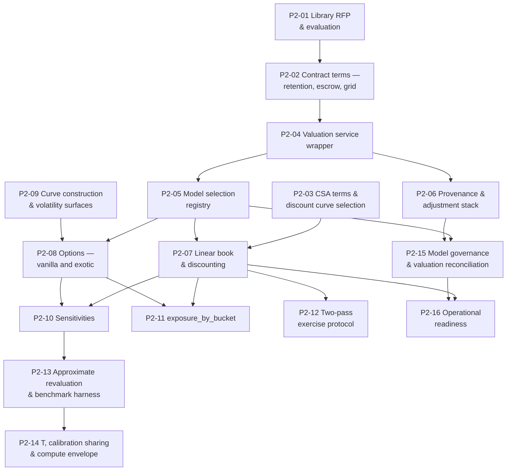

# Phase 2 — Ticket Breakdown

**Sixteen tickets** covering the Phase 2 scope in `treasury-alm-risk-platform` §6. Parent:
`treasury-alm-risk-platform`. Companion to `tickets` (Phase 0), `tickets-phase1` and `tickets-phase3`.

**What Phase 2 delivers:** independent valuation of the treasury book and daily P&L — a governed pricing
service returning value, model-implied cashflows, sensitivities and `exposure_by_bucket` against a
versioned market snapshot. Plus in-house curve construction and the volatility surface.

**What it does not deliver:** aggregation of any kind. Valuation is per subject; every metric built from
values belongs to D9, D10, D11 or D13.

## Phase 2 is a hinge, and the dependencies run in opposite directions

Worth stating precisely, because it changes how the phase is planned. **Phase 1 does not depend on
Phase 2** — it precedes it, and its ratios are deliberately behavioural- and valuation-free. The
relationship is the other way round:

| Direction | What flows |
|---|---|
| **Phase 1 → Phase 2** | An **obligation with a deadline.** `p1-10`'s transformation grammar must exist *before the library is chosen*, because "are perturbation conventions configurable to match D14's shocks" is a disqualifying evaluation criterion and a criterion cannot be evaluated against a convention that does not exist. `p1-05`'s prices and provenance also land first |
| **Phase 2 → Phase 3** | A **hard dependency.** EVE needs discounting, the repricing gap needs `exposure_by_bucket`, and NII needs valuation under shocked curves. `tickets-phase3` cannot start its measurement tickets until this phase delivers |
| **Phase 2 → Phase 5** | **Architecture that cannot be retrofitted.** The approximate revaluation path, the benchmark harness and the grid licence quantity are all decided here and consumed three phases later |

**So Phase 2 is where the programme's largest vendor decision is taken**, and the decision is
irreversible in one direction: the remedy for a library with fixed, incompatible conventions is a
different library.

## The one-line test that governs the whole phase

> **Can the pricing library be replaced with a different vendor's without changing any other module?**
> If the answer requires thought, the boundary has already leaked.

**D8 is the most-referenced unbuilt thing in the corpus** — D2, D3, D7, D9, D10, D13 and D16 all consume
it — and the risk here is not that it is too small but **that it grows.** "Valuation & Analytics Engine"
is a name that attracts work: P&L attribution, risk aggregation, independent price verification, the
whole quant estate. Every absorption is locally reasonable and collectively fatal, because **the moment
D8 is more than a pricing service, the buy decision dies** and the bank builds the one thing it was
supposed to buy.

**What is bought and what is built:**

| Layer | Posture | Content |
|---|---|---|
| **Pricing library** | **Buy** | Payoff representations, model implementations, calibration routines, numerical methods |
| **Valuation service wrapper** | **Build — and keep it thin** | Request routing, model selection, snapshot binding, subject translation, result versioning, provenance propagation, caching, grid distribution |

**A vendor library is not a module.** It has no opinion about the bank's contract model, no access to the
snapshot store, no notion of a versioned result. The wrapper is the module, it is genuinely thin, and it
is the thing that must not accumulate business logic.

## Dependency graph

**Inherited, not drawn:** `p1-10` (the grammar, into P2-01 and P2-10), `p1-05` (prices and provenance),
`p0-04` (snapshots), `p0-11` (control core), `p0-13` (reproducibility).

## Waves

| Wave | Tickets | State at the end |
|---|---|---|
| **1** | P2-01, P2-02, P2-03 | **The library is chosen and contracted**, with retention, escrow and grid quantity in the agreement; CSA terms are structured |
| **2** | P2-04, P2-05, P2-06 | The wrapper exists, thin; model selection is governed data; every value decomposes and carries provenance |
| **3** | P2-07, P2-08, P2-09 | The book prices — linear, vanilla and exotic — on in-house curves and a fitted surface |
| **4** | P2-10, P2-11, P2-12 | Sensitivities reconcile to full revaluation; the gap's missing half exists; the callable cycle is resolved |
| **5** | P2-13, P2-14, P2-15 | Phase 5's architecture is in place, `T` is measured, and the pricing models are validated |
| **6** | **P2-16** | **Valuation is operationally live** — parallel run by instrument class complete, IPV running, disputes have an arbiter |

**Wave 1 is procurement, and it is the long pole.** Nothing in waves 2–5 can start against an unchosen
library. The evaluation criteria are unusual enough that P2-01 is worth staffing properly rather than
delegating to a generic RFP process.

## Four things that are not tickets

**1. The Phase 0 curve decision is already taken.** Phase 0 consumes vendor-published curves precisely so
this library decision could be deferred to the phase with information about what the book needs
(`E3`, D3 §10). P2-09 replaces those curves; it does not discover the need for them.

**2. Exotic FX scope is closed.** Barriers and digitals are **in the instrument universe** (source Part 1
§4), so the library must price them — **a vanilla-only candidate is disqualifying rather than a
trade-off** (`D3-1`). Whether they are *held today* affects only where within Phase 2 the capability
lands, never whether the library must support it. This question consumed five artifacts and a critique
finding before anyone checked the source document; it is not to be re-opened.

**3. CVA is not in this phase.** The adjustment stack is built here with its **XVA slots empty** — CVA,
DVA and FVA are netting-set calculations owned by D11. The resulting fair value gap between Phase 4 and
Phase 5 is real, is documented, and **needs a finance decision before Phase 4 is planned** (parent §2.9).

**4. `p1-10`'s grammar is a Phase 1 deliverable, not a Phase 2 one.** If it has slipped, **P2-01 cannot
run its most important evaluation criterion** and the correct response is to stop, not to evaluate
around it.

## Sizing note

| Ticket | Why uncertain |
|---|---|
| **P2-01** RFP and evaluation | Vendor market engagement, a demonstration script that must actually be executed rather than described, and a decision the programme cannot reverse |
| **P2-08** Options including exotics | The smile-consistent surface and term-structure models are where coverage claims meet reality, and where a library either fits this universe or does not |
| **P2-13** Approximate revaluation | Building a path whose consumer arrives in Phase 5, against a benchmark tolerance nobody has yet had to hold |

**P2-01 should start before the phase does.** Vendor evaluation has a calendar of its own, and every
other ticket queues behind it.

## Decisions that gate acceptance

| # | Decision | Gates | Owner |
|---|---|---|---|
| 1 | **Curve build-or-buy confirmed** — the recommended answer is on the table and needs signing (`D3-4` neighbours it) | P2-09 | Treasury with D3 owner |
| 2 | **Home-market curve depth and the extrapolation rule** — if the last liquid point sits well inside the banking book's horizon this becomes one of the most consequential assumptions in the platform, and it needs ALCO visibility rather than a default buried in curve configuration | P2-09 | ALCO |
| 3 | **Exotic FX sequencing within Phase 2** — scope is closed, timing is not | P2-08 | Front office |
| 4 | **Tier 3 structured products — built or documented only?** D2 says "specify only", which holds until the first Tier 3 product is approved and there is no valuation path | P2-05 | Product approval |
| 5 | **Volatility representation binding** — `p1-15`'s interim owner must bind it **before the RFP closes** | P2-01 | Interim owner (`D11-10`) |
| 6 | **Snapshot timing convention and restatement policy** — small decisions that become very expensive once a year of history exists under the wrong one | P2-04, P2-09 | D3 owner with finance |

**Decision 5 has the tightest deadline and the least obvious owner.** The library's vega conventions are
a purchase decision, and `p1-15` exists to make sure someone owns them.

## Amendments carried in from the cross-artifact pass

| Ref | Change | Tickets |
|---|---|---|
| `D15-7` | **A vendor upgrade is a model change on the vendor's calendar, not the bank's**, and a validated version eventually goes end-of-life. Belongs in the contract, not in an operational discovery | P2-02, P2-15 |
| `D14-6` | The sensitivity ladder is **29 nodes, not ~19** — roughly 53% more perturbations per pass, from this phase onward, and it rises to tier A on reporting dates | P2-10, P2-14 |
| `D11-9` | ~250 derived snapshots daily by Phase 5. **Materialise under bounded retention**; D8 consumes materialised snapshots and holds no perturbation path of its own | P2-13, P2-14 |
| `D15-3` | Curve construction, the fallback hierarchy and the proxy spread methodology are three model inventory entries, not one | P2-09, P2-15 |
| `D11-1` | The sensitivities **are** the market risk capital number under the standardised approach, so the perturbation criterion is disqualifying rather than a trade-off | P2-01, P2-10 |

## Tickets

| # | Ticket | Governing artifacts |
|---|---|---|
| P2-01 | Pricing library RFP & evaluation | D8 §9; `rate-transformation-grammar` §7 |
| P2-02 | Contract terms — retention, escrow & grid licensing | D8 §9.1, §9.2 |
| P2-03 | CSA terms & discount curve selection | D3 §4.2; parent §2.7, `E1` |
| P2-04 | Valuation service wrapper | D8 §1.3, §2 |
| P2-05 | Model selection registry | D8 §4 |
| P2-06 | Provenance propagation & adjustment stack | D8 §2.2, §3.1, §7 |
| P2-07 | Linear book pricing & discounting | D8 §4 tier 1 |
| P2-08 | Options — vanilla and exotic | D8 §4; D3 §3.5 |
| P2-09 | Curve construction & volatility surfaces | D3 §4, §3.5, §10 |
| P2-10 | Sensitivities | D8 §3.3 |
| P2-11 | `exposure_by_bucket` | D8 §3.4 |
| P2-12 | Two-pass exercise protocol | D8 §5, §5.1 |
| P2-13 | Approximate revaluation & benchmark harness | D8 §6.1 |
| P2-14 | `T`, calibration sharing & compute envelope | D8 §6, §6.1 |
| P2-15 | Pricing model governance & valuation reconciliation | D8 §10; D16 §5 |
| P2-16 | Operational readiness | D8 §7; D3 §3.3 |
