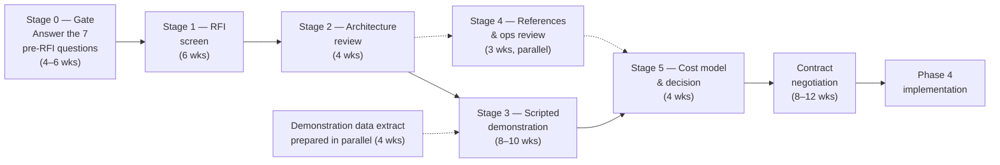

# Phase 4 Procurement Workplan

Execution plan for the Phase 4 front-to-back purchase. Parent: `treasury-alm-risk-platform`.
Requirements source: `phase4-front-to-back-buy-evaluation`.

**The division of labour between the two artifacts.** The buy-evaluation contract says *what a candidate
must satisfy* — lots, non-negotiables, the demonstration list, the scoring rule. This says *how the
procurement is run*: what the lots contain now that four scope questions are answered, when each stage
happens and what it depends on, who decides what, and the conditions under which the procurement stops
rather than continues.

**Scope narrowed materially before this was written**, which is the point of §1. Four questions from
`d6-collateral-and-securities-financing` §13 were settled, and all four narrowed D6.

## 1. Scope settled — and what it removes

| Question | Answer | Removed from Lot 1 |
|---|---|---|
| **UMR initial margin** | **Out of scope — variation margin only** | The IM calculation model (ISDA SIMM or the regulatory schedule), segregated IM custody accounts, IM-specific eligibility and haircut schedules, the separate IM dispute process, and the IM demonstration row |
| **CCP membership** | **Client clearing only, via a broker** | Default fund contributions as an encumbrance source; direct CCP margin flows; a distinct CCP netting-set population. Exposure runs to the clearing broker and is margined bilaterally in shape |
| **Rehypothecation** | **Received collateral is held, not re-used** | Re-pledging chains become a latent capability rather than a day-one requirement. The register still registers received collateral without recognising it |
| **Covered bond cover pool** | **No programme** | A large standing encumbrance with no transaction feed, and the pool monitoring obligation |

**This is the single largest scope reduction available in Phase 4, and it lands entirely on D6.** UMR
initial margin alone is the difference between a collateral module that computes and segregates margin
under a regulatory model and one that calls, receives and posts variation margin. Vendors price and
demo those very differently.

### 1.1 Two consequences that run the other way

**The rehypothecation answer may reduce the HQLA buffer, and the distinction matters.** *"We do not
re-use received collateral"* and *"we have no right to re-use it"* have **opposite** LCR consequences.
Securities received under reverse repo count toward HQLA only where the bank **has the right** to re-use
them and has not done so; where no such right exists in the agreement, they do not count at all.

The answer above states **practice**. The **right** is a term in the GMRAs and CSAs, and
`counterparty-documentation-workstream` is already extracting it as structured data. Until that is
confirmed, the platform must not assume reverse-repo collateral counts. **The exposure is over-counting
HQLA**, which is the wrong direction to be wrong in, so the Phase 1 default is to exclude and revisit
when the extraction lands. Recorded as the one open sub-question in §7.

**Client clearing does not remove collateral management, it re-points it.** Margin flows to a clearing
broker instead of a CCP, and the broker relationship carries its own agreement terms, eligibility
schedule and dispute process. Lot 1 still needs the margining workflow — it needs one flavour of it
rather than three.

## 2. Lot cuts, as they now stand

Unchanged in structure from the buy-evaluation contract §1. Restated with the scope reductions applied,
because the RFP is written from this table.

| Lot | Contents | Posture | Effect of §1 |
|---|---|---|---|
| **1** | D4 deal capture & lifecycle, D5 confirmation/settlement/payments, D6 collateral & securities financing | **Buy, single vendor** | **D6 shrinks appreciably.** D4 and D5 are unchanged and still dominate the lot — deal capture and settlement across the instrument universe remains the bulk of the work |
| **2** | D7 posting engine, EIR and amortisation, hedge mechanics | **Buy the engine; classification rules stay ours** | Unchanged. IFRS 9-only framework, no macro hedge accounting, no IAS 39 machinery |
| **3** | Limit framework — limit store, evaluation service, breach workflow | **Build** | Unchanged. Still the shape no vendor sells, and still gated by N7 on the Lot 1 side |

**The lot boundaries do not move on the strength of §1.** D6 getting smaller is an argument about price
and demonstration effort, not about whether collateral belongs with trade lifecycle and settlement — the
shared event model argument in the buy-evaluation contract stands regardless of how much of D6 is in
scope.

## 3. The calendar

**Anchored to platform phases, not to dates**, because the phase start dates are not fixed. Durations
are working estimates for a procurement of this size; the dependencies between stages are not estimates
and should not be compressed.

| Stage | Duration | Starts | Hard dependency |
|---|---|---|---|
| **0. Pre-RFI gate** | 4–6 weeks | **Phase 1** | None — these are facts about the bank, not platform outputs (§4) |
| **1. RFI screen** | 6 weeks | **Phase 2** | Stage 0 complete. Issuing without it produces answers to the wrong questions |
| **2. Architecture review** | 4 weeks | Phase 2 | Stage 1 shortlist |
| **3. Scripted demonstration** | 8–10 weeks | **Phase 3** | A real classified contract extract — a Phase 0 output, so available from Phase 1 onward. Also `counterparty-documentation-workstream`, for rows 3, 4 and 16 |
| **4. References & ops review** | 3 weeks | Phase 3, parallel with stage 3 | Stage 2 shortlist |
| **5. Cost model & decision** | 4 weeks | Phase 3 | Stages 3 and 4 |
| **Contract negotiation** | 8–12 weeks | Phase 3 → 4 boundary | Stage 5 recommendation |

**Total: roughly nine to twelve months from gate to signature.** Phase 4 cannot start until this
concludes, which is why stages 1 and 2 run during Phase 2 rather than at the start of Phase 4.

### 3.1 The three sequencing constraints that actually bind

1. **Stage 0 gates stage 1, and stage 0 is not a platform task.** The seven questions are answerable by
   finance, treasury and IT now. Four of them were answered to write this document; three remain (§7)
2. **Stage 3 needs real data.** A demonstration on vendor sample data scores a 3, not a 4, under the
   evidence rule — and the rows where the difference matters most are exactly the ones needing the bank's
   own repo, tri-party and agreement data
3. **`counterparty-documentation-workstream` is already on a Phase 2 deadline** for an unrelated reason
   (CSA-driven discount curve selection). Demonstration rows 3, 4 and 16 depend on the same extraction,
   so if it slips, stage 3 degrades to vendor-data evidence rather than stopping — a silent quality loss
   worth watching for

## 4. Stage 0 — the pre-RFI gate

**The gate is: all seven questions answered, in writing, with an owner's name against each.** Four are
now closed. The three below are open and each has a named function that can close it.

| # | Question | Owner | Blocks |
|---|---|---|---|
| 1 | ~~Which GL is authoritative, and is the posting interface contract-level or batch summary?~~ **Closed — `gl-interface-decision`.** Separate finance/ERP GL; contract-level postings; continuous for event-derived and EOD for computation-derived; daily trial balance inbound | Finance + IT | **Lot 2 is unblocked.** The §5 requirement set below now states the interface, and contract-level journal emission to an external ERP is an RFI-stage discriminator rather than a demonstration-stage discovery |
| 2 | **Can the incumbent TMS produce a contract-level extract?** | IT | Lot 1's migration path — and, separately, whether Phases 0–3 have a treasury book at all |
| 3 | **Manufactured payment tax treatment**, including withholding on manufactured dividends | Tax | D6 configuration. A tax question, not a systems one |

Three further questions are **elections rather than facts** and belong to finance on the same gate:
whether cost of hedging is elected, whether the fair value option is applied anywhere, and whether any
POCI assets exist. Each converts a conditional demonstration row into a mandatory one or removes it.

## 5. Decision rights

**Stated because the failure mode is predictable.** A non-negotiable that cannot be traced to a named
owner will be traded away late in a commercial negotiation, by someone acting reasonably under time
pressure, without anyone intending to change the architecture.

| Decision | Decides | Consulted | Cannot decide alone |
|---|---|---|---|
| Lot boundaries | **Architecture authority** | Treasury, Finance, IT | — |
| Requirement set and scoring weights | **Architecture authority** | Treasury, Finance, Risk, Ops | Weights fixed before the RFI issues and **not revised after scores are seen** — Procurement enforces |
| Shortlist after stages 1 and 2 | **Procurement**, on the scored result | Architecture authority | Cannot admit a candidate that failed a non-negotiable |
| Demonstration scoring — D4/D5/D6 rows | **Treasury operations** | Architecture authority | — |
| Demonstration scoring — D7 rows | **Finance** | Architecture authority | — |
| Limit framework requirements (Lot 3) | **Risk** | Treasury, Architecture authority | — |
| Contract terms — escrow, extractability, regulatory cadence, support window | **Legal + Procurement** | Architecture authority | The architecture-derived terms in the buy contract §8 are requirements, not negotiating positions |
| Final award | **ExCo**, on the joint recommendation | All of the above | — |
| Spend above delegated threshold | **Board** | — | — |
| **Waiver of a non-negotiable** | **See below** | — | — |

### 5.1 The waiver rule

**N1 (D2 remains system of record) and N4 (classification is consumed, not authored) are not waivable.**
They are not stringent requirements; they are the architecture. A package that fails either is not a
worse fit — it is a different programme, in which the platform's classification, reproducibility and
regulatory-ratio guarantees pass to a vendor. If waiving one is genuinely under consideration, the
decision that needs taking is whether to run this architecture at all, and that belongs to the Board.

**N2, N3, N5–N10 may be waived only:**

1. **Jointly** by the architecture authority, ALCO and Finance — no single function
2. **With the cost stated in writing**, in the terms of the failure the non-negotiable prevents
3. **After the runner-up has been re-priced.** A waiver considered without the alternative costed is not
   a decision, it is capitulation with paperwork. This clause does more work than the other two

## 6. Stop conditions

**A procurement needs stated conditions for not proceeding**, decided before anyone is invested in an
outcome.

| Condition | Response |
|---|---|
| **No candidate passes the non-negotiables at stage 2** | Stop and re-lot. Most likely re-cut: split D6 out of Lot 1 and buy D4/D5 connectivity alone, accepting the event-model integration cost the single-vendor argument was avoiding |
| **Only one candidate reaches stage 3** | Competitive tension is gone. Either extend the market scan by one round, or proceed with a documented BATNA — the build cost for Lot 1 — priced before negotiation opens, not after |
| **All candidates fail the same mandatory demonstration row** | The requirement is wrong, or the market does not serve it. Return it to the architecture authority rather than waiving it per candidate. **The instrument-model rows are the likely site** — FX swap as two linked Contracts, collateral swap with no cash leg, quantity legs |
| **Stage 5 cost exceeds the build estimate** | Legitimate outcome, not a failure. The buy-evaluation contract is usable as a build spec unchanged; that was a design goal |
| **Stage 0 questions 1 or 2 remain unanswered at Phase 2 close** | Do not issue the RFI. Answers to the wrong questions cost more than the delay |

## 7. Open items

| # | Item | Owner | Needed by |
|---|---|---|---|
| 1 | **Does the bank hold the *right* to re-use received collateral, even though it does not exercise it?** Determines whether reverse-repo collateral counts toward HQLA (§1.1) | Legal, via `counterparty-documentation-workstream` | **Phase 1** — it changes the LCR, not just Phase 4 |
| 2 | ~~GL authority and posting interface granularity~~ — **closed** (`gl-interface-decision`). Replaced by its follow-on: **a posting-volume estimate against the ERP's ingestion limits and licensing basis.** Contract-level × intraday is the most demanding combination available and is not yet sized; the fallback if it exceeds capacity is summary-to-GL with detail retained, which should be priced now | IT + Finance | **Before the Lot 2 RFP issues** |
| 3 | Incumbent TMS contract-level extract | IT | Stage 0 |
| 4 | Manufactured payment tax treatment | Tax | Stage 0 |
| 5 | Cost of hedging election; fair value option; POCI assets | Finance | Stage 0 |
| 6 | **Own securitisation derecognition** — the same question as parent Appendix D signal 3. If derecognition fails, the assets are on balance sheet and encumbered to noteholders | Finance + Legal | Phase 0 register scope; Phase 6 capital |
| 7 | Which central bank facilities are used, and whether collateral is pre-positioned as standing practice | Treasury | Phase 0 register scope |

**Items 6 and 7 are the last two encumbrance sources with no transaction feed.** With the cover pool and
CCP default fund answers settled, they are what remains of the standing-state category — and both affect
P0-10's scope now rather than Phase 4's.
