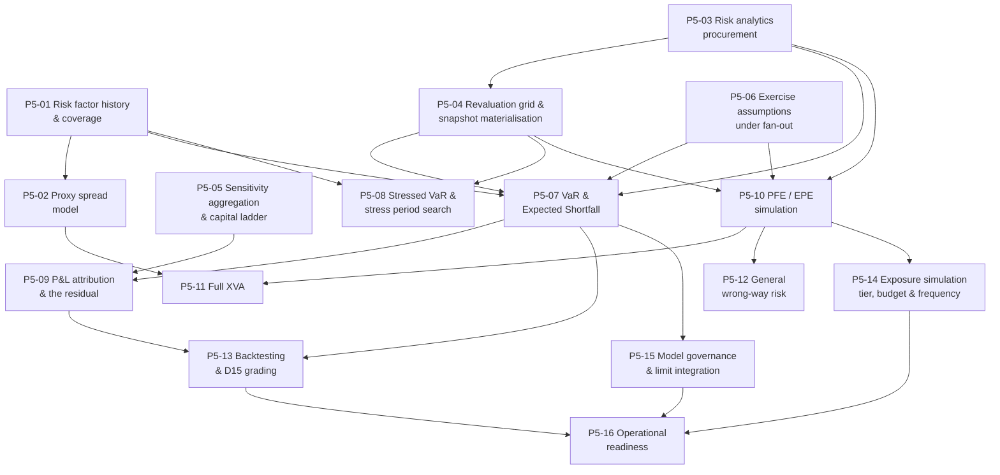

# Phase 5 — Ticket Breakdown

**Sixteen tickets** covering the Phase 5 scope in `treasury-alm-risk-platform` §6. Parent:
`treasury-alm-risk-platform`. Companion to `tickets` (Phase 0), `tickets-phase1`, `tickets-phase2` and
`tickets-phase3`.

**What Phase 5 delivers:** full market and counterparty credit risk measurement — VaR and expected
shortfall, stressed VaR, sensitivity aggregation, P&L attribution and backtesting, PFE profiles and full
simulated-exposure XVA.

**What it does not deliver:** the counterparty measures already carved out to **Phase 4** — current
exposure, SA-CCR, the simplified netting-set CVA, settlement exposure, issuer exposure aggregation and
specific wrong-way risk detection. Phase 5 *replaces a measured number* rather than filling an absence
(D11 §6).

## This phase is where Phase 2's decisions are graded

**Phase 5 consumes two Phase 2 deliverables that cannot be built here**, and if either was cut or
under-delivered, this is where it is discovered — three phases too late.

| Consumed | From | What happens if it is missing |
|---|---|---|
| **The approximate revaluation path** — payoff evaluation at a state | `tickets-phase2/p2-13` | **PFE and EPE cannot be computed at all.** Exposure profiles are netting sets × paths × time steps — 10⁴–10⁵ `T`, which no grid revalues in full. This is not a performance problem, it is an impossibility |
| **`T`, and the grid licence sized on it** | `tickets-phase2/p2-14`, `p2-02` | The licence was negotiated against a one-pass workload and is renegotiated here **from a position of total lock-in**, against a vendor who by now knows the model set and the wrapper |
| **The full-revaluation benchmark harness** | `p2-13` | No approximation can be permitted, because the rule is that an approximation is allowed **only where a scheduled benchmark demonstrates it inside a stated tolerance** |
| **Sensitivities under the grammar** | `p2-10` | D11 would compute its own, which is the second perturbation implementation acceptance criterion 1 exists to forbid |

**The governing rule this phase executes, inherited from D11 §5.1:** *an approximation is permitted only
where a scheduled full-revaluation benchmark demonstrates it inside a stated tolerance.*

## The binding constraint is history, and money is the only thing that fixes it

**D11 is the module that cannot be built without risk factor history**, and the numbers are unforgiving:

| Need | Depth | If absent |
|---|---|---|
| Historical simulation VaR | 1–2 years clean daily | **No VaR at all** |
| Stressed VaR and stress period identification | **10+ years containing a genuine stress period** | A "stressed" measure calibrated on a calm decade — **worse than none** |
| Proxy spreads for illiquid names | Sector / rating / region history | Uncollateralised CVA on unrated counterparties has no spread input |
| Backtesting | Continuous from go-live | D15 cannot grade the model |

**This is parent §6.1's third clock — the only one money can fix**, and the purchase decision was due in
Phase 0. A platform that started capturing at go-live and reaches Phase 5 in year three has **two years
of history with no stress period in it.** If the purchase was not made, P5-01 is where the programme
finds out, and no amount of engineering recovers it.

## Two modules under one name

**Market risk is trading-book-scoped. Counterparty credit risk is not** — and scoping all of D11 to the
trading book is the most common error here, because it is the natural reading of a module named for
market risk first. **It silently omits the derivative book this platform exists to manage.**

**For this bank the trading book may be small.** If treasury runs a modest trading book with most
derivative activity being banking book hedging, **counterparty risk is materially the larger half of this
module and should be resourced that way.** That is gating decision 1, it is answerable now, and it
changes both the build and the buy evaluation.

## Dependency graph

## Waves

| Wave | Tickets | State at the end |
|---|---|---|
| **1** | P5-01, P5-02, P5-03 | **History coverage is known and published**; proxy spreads exist; the analytics engine is chosen |
| **2** | P5-04, P5-05, P5-06 | The grid runs at fan-out; sensitivities aggregate; the exercise convention is decided rather than discovered |
| **3** | P5-07, P5-08, P5-09 | Market risk measures produce, and **attribution puts the whole platform on trial** |
| **4** | P5-10, P5-11, P5-12 | Exposure simulates; XVA feeds D8's adjustment stack; general wrong-way risk is visible |
| **5** | P5-13, P5-14, P5-15 | Backtests are graded by D15; the largest workload has a tier; measures reach the limit framework |
| **6** | **P5-16** | **Risk measures are operationally live** — limits recalibrated for PFE, the XVA transition communicated |

**P5-01 comes first because it can fail the phase.** Coverage is a fact to be established before anything
is built on it, not a risk to be managed during.

## Four things that are not tickets

**1. SA-CCR, current exposure, settlement exposure and issuer aggregation are Phase 4.** They rest on
data that exists by then, and **SA-CCR in particular is a prescribed formula, not a model**, which makes
it far cheaper than its original Phase 5 placement implied. If the Phase 4 carve-out was not taken, that
is an escalation before this phase starts — it means the fair value gap ran for a full phase and Phase
4's pre-deal check silently omitted counterparty limits.

**2. D11 does not own limit values.** It supplies **measure definitions and utilisation** to the Phase 4
limit framework. Three artifacts disagreed about this and two were stale; the correction is
`D11-H2`-adjacent and is settled (D11 §1.4).

**3. D11 does not grade its own backtest.** It produces the hypothetical and actual P&L series; **D15
owns exception counting and grading.** This is parent §5's segregation principle, and it matters more
here than elsewhere — see below.

**4. Regulatory market risk capital is standardised.** VaR here is an **internal management measure, not
a capital model.** That lowers the validation burden and does not remove it, and it has a consequence
worth stating: **a backtest exception is a management signal rather than a capital multiplier, which
makes it *more* likely to be quietly tolerated, not less.**

## Sizing note

| Ticket | Why uncertain |
|---|---|
| **P5-10** PFE / EPE simulation | **The largest compute in the platform**, with no tier, no budget and no frequency today. Its sizing depends on `T`, which Phase 2 should have measured |
| **P5-01** Risk factor history | Entirely dependent on a Phase 0 purchase decision and on what the captured series actually contains. Coverage is discovered, not planned |
| **P5-09** P&L attribution | Build, not buy — it depends on this platform's module boundaries. **The residual is where every other module is on trial**, and a large residual is a debugging exercise across the whole corpus |

## Decisions that gate acceptance

| # | Decision | Gates | Owner |
|---|---|---|---|
| 1 | **How large is the trading book?** Determines whether this module is market-risk-led or counterparty-led | Everything — resourcing, build and buy | Front office / finance. **Answerable now** |
| 2 | **Which VaR method?** Historical simulation is the honest default and the expensive one | P5-03, P5-07 | Risk, with the fan-out arithmetic on the table |
| 3 | **Exposure simulation frequency** — weekly full with daily roll-forward, or something else | P5-10, P5-14. **The staleness is the thing being approved** | Finance for the XVA input; risk for the limit input |
| 4 | **Is P&L attribution built to FRTB desk-level structure?** Cheap now, precondition for any future internal-model application | P5-09 | Risk. A deliberate decision rather than a default |
| 5 | **Does "standardised" market risk mean the sensitivities-based method?** (`D11-11`) | P5-05's node set constraint | Regulatory reporting. **Answerable in an hour** |
| 6 | **Who owns counterparty credit risk organisationally** — treasury risk or credit? | Does not change the architecture; changes who specifies P5-10 to P5-12 | Executive |

## Amendments carried in from the cross-artifact pass

| Ref | Change | Tickets |
|---|---|---|
| `D11-3` | **A position whose risk factors have no history contributes zero VaR, silently** — an absent factor is a flat series, which reads as a position with no risk. Report uncovered, never zero, and publish the uncovered proportion | P5-01, P5-07 |
| `D11-9` | ~250 derived snapshots daily is not the scale D3 sized for. **Materialise under bounded retention**; D8 holds no perturbation path of its own | P5-04 |
| `D11-7` | Risk measures are **five workloads, not one tier row**. The sensitivity ladder rises to tier A on reporting dates while VaR does not, and the exposure simulation sits outside tiers A–D entirely | P5-05, P5-14 |
| `D11-4` | The grammar version travels with every history series **including a purchased one**, and the purchase buys raw quotes rather than pre-derived factors | P5-01 |
| `D11-8` | **The SA-CCR hedging set is not the primary risk type dimension** — applied in Phase 4, noted here because the same conflation recurs in exposure aggregation | P5-12 |
| `D15-11` | Sensitivity analysis is the **primary validation evidence where backtesting is impossible** — which covers PFE, XVA and the proxy spread model | P5-15 |

## Tickets

| # | Ticket | Governing artifacts |
|---|---|---|
| P5-01 | Risk factor history dataset & coverage | D11 §4; D3 §6 |
| P5-02 | Proxy spread model | D11 §4; D3 §3.4 |
| P5-03 | Risk analytics procurement | D11 §7 |
| P5-04 | Revaluation grid & snapshot materialisation | D11 §5.3; D3 §8 |
| P5-05 | Sensitivity aggregation & the capital ladder | D11 §1.2, §2.2.1 |
| P5-06 | Exercise assumptions under fan-out | D11 §5.4; D8 §5.1 |
| P5-07 | VaR & Expected Shortfall | D11 §2.2 |
| P5-08 | Stressed VaR & stress period identification | D11 §1.3.2, §2.2 |
| P5-09 | P&L attribution & the residual | D11 §2.3 |
| P5-10 | PFE / EPE simulation | D11 §3.2 |
| P5-11 | Full XVA | D11 §3.3; D8 §3.1 |
| P5-12 | General wrong-way risk | D11 §3.5 |
| P5-13 | Backtesting series & D15 grading | D11 §2.4 |
| P5-14 | Exposure simulation tier, budget & frequency | D11 §5.5; `eod-window-and-degradation` §5.4 |
| P5-15 | Risk model governance & limit integration | D11 §1.4, §9 |
| P5-16 | Operational readiness | D11 §3.3, §5.5 |
