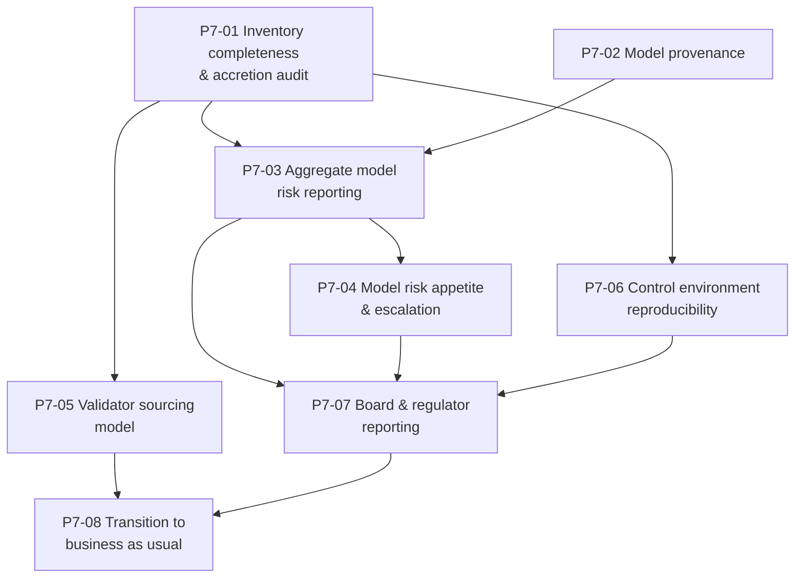

# Phase 7 — Ticket Breakdown

**Eight tickets in four waves.** Parent: `treasury-alm-risk-platform`. Companion to `tickets` (Phase 0),
`tickets-phase1`, `tickets-phase2`, `tickets-phase3`, `tickets-phase5` and `tickets-phase6`.

**What Phase 7 delivers:** aggregate model risk management — model provenance, inventory-wide reporting,
model risk appetite, and audit readiness.

**What it does not deliver, and this is the whole point:** the model inventory, validation standards,
the validation record, change control, backtesting and the periodic revalidation cycle. **All of those
accreted from Phase 0 onward** (`D15-1`, `D15-2`).

## Eight tickets, deliberately

The other six phases have sixteen tickets each. **This one has eight, and padding it to match would
misrepresent the design.** Seven are the aggregate model risk work; the eighth is the programme's own
transition to business as usual, which has to land somewhere and lands here.

Parent §6's original Phase 7 entry read *"D15 (full)"* — **the last surviving instance of the defect the
architecture critique found.** The critique caught D15 holding the four-eyes machinery Phase 0 mandates,
and `d15-control-core` fixed the human-control half by carving Phase 0 out. **The model half had the
identical defect and had not been fixed** until `D15-1` and `D15-2`.

The argument is arithmetic. **Models arrive from Phase 0 onward**, and validation before first use means
the validation capability must exist when each model does — not when the module named after it is
scheduled. *"A validation function arriving in Phase 7 validates nothing for six years and then inherits
a portfolio of models in production that nobody ever approved."*

**So a small Phase 7 is the evidence that the correction was applied. A large one means it was not.**

**Phase 7 has no cutover, no parallel run and no rollback — nothing goes live.** Its operational item is
P7-08: the programme ends, and everything it built needs an owner.

## What accreted where

| Capability | Phase | Delivered by |
|---|---|---|
| Control core — audit, four-eyes, override, impact statement, authority matrix | **0** | `tickets/p0-11` |
| Model definition and the inventory itself | **0** | Nearly free, and the thing that prevents unnamed models |
| Regeneration test | **0–1** | `tickets/p0-13` |
| Validation standards, validation record, model change control | **2** | `tickets-phase2/p2-15` |
| Backtesting execution and grading | **3**, **5** | `tickets-phase3/p3-02`, `tickets-phase5/p5-13` |
| Approved-usage control | **3**, again at **6** | `p3-13` (D14 overlay), `p6-07` (D12 consumption) |
| **Periodic revalidation cycle** | **3, not 7** | `p3-02` — a Phase 2 curve model falls due again in Phase 3 |
| **Aggregate reporting, provenance, risk appetite** | **7** | **This phase** |

## The two tickets that are really audits

**P7-01 and P7-02 are diagnostics before they are builds**, and their size depends entirely on whether
the earlier phases did what they were asked.

| Ticket | If the earlier phases delivered | If they did not |
|---|---|---|
| **P7-01** Inventory completeness | A reconciliation — confirm 26+ entries carry owner, tier, status and next-due date | **A remediation phase**: models in production that were never validated, exactly the outcome `D15-1` predicted |
| **P7-02** Model provenance | Wiring an aggregation over tags that already exist on computed outputs | **A retrofit across every computed output** — `D15-8` warned it is *"cheap to design in, expensive to retrofit"* |

**Check both before committing to a Phase 7 plan.** They are the phase's only real sizing risk.

## Dependency graph

## Waves

| Wave | Tickets | State at the end |
|---|---|---|
| **1** | P7-01, P7-02 | The inventory is complete and its accretion verified; **every computed output carries model provenance** |
| **2** | P7-03, P7-04, P7-05 | The aggregate question is answerable; appetite has thresholds; validation capacity has a sourcing model |
| **3** | P7-06, P7-07 | The control environment reproduces historically; the bank is audit and regulator ready |
| **4** | **P7-08** | **The programme ends and everything it built has an owner** |

## The question this phase exists to answer

> **How much of the bank's reported position rests on models that are unvalidated, overdue for
> revalidation, used outside approved usage, or proxied?**

**The platform already answers the equivalent question for market data and cannot answer it for models.**
D3 established provenance as a platform NFR — observed, interpolated, stale, proxied, model-implied,
marked — and parent §5 requires that *"provenance survives aggregation."* **Models have no equivalent.**

**Why this is worth building rather than a nice-to-have.** Models whose failure carries no automatic
consequence get quietly tolerated. **Aggregate reporting is the mechanism that makes tolerance visible**
— and unlike a validation finding, which is one model at a time, **it shows the accumulation.**

> **A single overdue tier-3 model is nothing. Forty percent of EVE resting on models past their
> revalidation date is a board matter, and no other artefact would surface it.**

## Three things that are not tickets

**1. Validation itself.** It has been running since Phase 2. This phase reports on it; it does not
perform it.

**2. The revalidation cycle.** It started with the second model in Phase 3 and has been running since.

**3. Model risk policy authorship**, if the bank already has one. `D15` open question 6: **if a model
risk policy predates this programme, its tier definitions and validation standards take precedence**, and
this phase's job is to **map the platform's twenty-six models onto them rather than invent a parallel
framework.** Confirm before wave 1.

## Sizing note

**This phase should be the smallest in the programme.** Its two uncertainties are both inherited:

| Uncertainty | Source |
|---|---|
| **Whether provenance was designed into computed outputs earlier** | `D15-8` — the retrofit is the expensive case |
| **Whether validation actually accreted across six phases** | `D15-1` — if not, P7-01 becomes remediation and this phase stops being small |

## Decisions that gate acceptance

| # | Decision | Gates | Owner |
|---|---|---|---|
| 1 | **Does an independent validation function exist, and how deep? — `D15-13`** The single most consequential question in D15. **A budget and hiring decision, not an architectural one** — which makes it the part most likely to be quietly dropped, because it produces no deliverable and its absence is invisible until examination | P7-05, and everything since Phase 2 | Executive |
| 2 | **Who owns the model inventory operationally** — a second-line risk function, or is it created by this programme with no permanent home? **An inventory nobody maintains is worse than none, because it reports coverage that has decayed** | P7-01, P7-03 | Executive |
| 3 | **Does a model risk policy predate this programme?** If so it takes precedence | All | Risk |
| 4 | **Does a model validity failure gate the EOD?** Decided as `Warn` in `p1`-era D17 (`D15-12`) — confirm it survived contact with operations | P7-04 | Risk with operations |

## Amendments carried in from the cross-artifact pass

| Ref | Change | Tickets |
|---|---|---|
| `D15-1`, `D15-2` | **Phase 7 is aggregate model risk, not "D15 (full)"**; the revalidation cycle starts with the second model. **This breakdown is the consequence** | The whole phase |
| `D15-3` | The inventory is **at least twenty-six items, fourteen unnamed anywhere**, six of them tier 1, clustering around proxies and fallbacks — **a proxy is a model** | P7-01 |
| `D15-4` | **Backtesting covers about a third of the inventory.** Validation technique is a recorded field so "no backtest" is a category or a finding, never ambiguous | P7-01, P7-03 |
| `D15-8` | **Model provenance, on D3's pattern.** Without it, *"what share of our EVE rests on an overdue model"* is an investigation | P7-02 |
| `D15-11` | Sensitivity analysis is the **primary validation evidence wherever backtesting is impossible** — which is most of the inventory | P7-01 |
| `D15-13` | Validation needs independence **and equivalent technical depth**, and in a bank this size those conflict | P7-05 |

## Tickets

| # | Ticket | Governing artifacts |
|---|---|---|
| P7-01 | Inventory completeness & accretion audit | D15 §3.1, §3.2, §4.1 |
| P7-02 | Model provenance | D15 §6; D3 §5 |
| P7-03 | Aggregate model risk reporting | D15 §6 |
| P7-04 | Model risk appetite & escalation | D15 §6; D10 §7 pattern |
| P7-05 | Validator sourcing model *(non-engineering)* | D15 §4.2, §4.3 |
| P7-06 | Control environment reproducibility | D15 §9 criterion 13; `d15-control-core` §6.2 |
| P7-07 | Board & regulator reporting | D15 §6; executive summary §8 |
| P7-08 | Transition to business as usual | D15 §10 q2; `d15-control-core` §6.2 |
