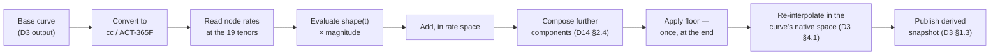

# Rate Transformation Grammar v1 — Phase 1 deliverable

The initial transformation grammar for the **rate factor class**, per `d14-scenario-and-stress-framework`
§2.5. Parent: `d14-scenario-and-stress-framework`. **Phase 1**, ahead of the Phase 2 pricing library
choice.

**What this is.** The single answer to *"what does it mean to move a rate curve"*, used identically by
D3 when it applies a shock and publishes a derived snapshot, by D8 when it perturbs to produce a
sensitivity, and by D11 when it captures a risk factor move into history. It fixes five things —
representation, node set, application order, magnitude basis and floor treatment — and deliberately
fixes nothing else.

**Why it is a Phase 1 deliverable rather than a Phase 3 one.** `d8-valuation-and-analytics` §9 lists
*"whether perturbation conventions are configurable to match D14's shocks"* as an evaluation criterion
for the Phase 2 pricing library, and §9.1 costs the lock-in when the answer is no. **A criterion cannot
be evaluated against a convention that does not exist**, and the remedy for choosing a library with
fixed, incompatible conventions is a different library. §7 turns this document into the demonstration
script that makes the criterion testable.

**The one-line test this document exists to pass.** `DV01 × 200` and the +200bp parallel ΔEVE are
produced by the same transformation at different magnitudes, so the difference between them is
attributable to the floor and to higher-order terms — **and to nothing else** (D14 §2.5, D8 acceptance
criterion 9).

## 1. Scope

**In scope:** interest rate curves — risk-free/OIS, index forecast curves, and CSA-selected collateral
discount curves (parent §2.7, `d3-market-data-and-curves` §4.2), in every currency in the approved curve
inventory (D3 §4.3).

**Out of scope, and deliberately so — each needs its own factor-class grammar and none is needed in
Phase 1:**

| Factor class | Needed by | Grammar due |
| --- | --- | --- |
| Volatility surfaces | D8 vega, D11 | Phase 2 with the library |
| Credit and proxy spreads | D9 CSRBB, D11 | Phase 3, and gated on D9 §11 Q4's CSRBB scope question |
| FX spot and forward points | D9, D10, D11 | Phase 3 |
| Basis — cross-currency and tenor | D3 §4.4, D7 cost of hedging | Phase 3, with the basis scenario family |

**The grammar record is structured per factor class from the start** (D14 §12 Q8). This document
populates one class; the others slot in beside it without a schema change. A rate-shaped single record
would have to be reopened three times.

**What the grammar does not own**, because these are magnitudes and shapes rather than conventions:

- **Shock magnitudes** — prescribed magnitudes are D13-referenced (D14 §1.2); internal magnitudes are
  ALCO-approved scenario payload
- **Shape functions** — the exponential decay that makes a short-rate shock short-dated is part of the
  prescribed or approved definition. The grammar requires only that a shape be expressible as a
  function of node tenor, and that it be evaluated at nodes rather than at an engine's convenience
- **Which sensitivities are produced, and by what numerical method** — D8 §3.3

## 2. The five settled elements

### 2.1 Representation — continuously compounded zero rates

**Decision: the transformed quantity is the continuously compounded zero rate, ACT/365 fixed, on the
curve's published output, in every currency.**

The alternatives and why not:

| Representation | Rejected because |
| --- | --- |
| **Par rate** | A par-rate move is a statement about a swap, not about a curve, and its meaning depends on the swap conventions of each currency — so "the same shock" is a different transformation in each currency by construction. It also cannot express a move at a tenor with no liquid par instrument |
| **Instantaneous forward** | Well-behaved mathematically and unreadable to every consumer of the output. A +200bp forward shock does not produce a +200bp zero curve, and no ALCO paper survives that footnote |
| **Discount factor** | Multiplicative, so a "1bp bump" has no tenor-independent meaning |
| **Zero rate, annually compounded** | Defensible, and the only real cost of continuous is a conversion at the boundary. Continuous is chosen because additive composition is exact in it (§2.3) and because the prescribed shock formulas are naturally expressed against a tenor-parametrised continuous rate |

**One consequence worth stating flatly:** the curve's *quoting* convention is unchanged by this. Curves
are quoted, stored and published however D3 §4.1's construction defines; the grammar converts to
continuously compounded ACT/365F at the point of transformation and converts back. **The conversion is
part of the grammar and part of the reconciliation test**, because a conversion applied on one side and
not the other reproduces the exact failure this document prevents.

### 2.2 Node set — derived from the repricing band boundaries, not maintained beside them

**Superseded — read `d1-reference-and-static-data` §3.10.3 for the current set.** This section was
drafted before `d11-market-and-counterparty-risk` §2.2.1 established that the sensitivities *are* the
market risk capital number under the standardised approach, which introduces a **prescribed** vertex
list the grammar's node set must contain.

**Decision as it now stands: the node set is the platform rate vertex set held in D1 §3.10.3 — the
union of the 19 IRRBB band midpoints and the 10 prescribed capital vertices, 29 values.** The grammar
references it; it does not hold it.

| | Then | Now |
| --- | --- | --- |
| Node set | 19 band midpoints | **29** — union with the prescribed capital vertices |
| Longest node | 25y, a terminal-band convention | **30y, prescribed** — §2.2.3's extension question no longer gates it |
| Sensitivity fan-out | 19 × currencies | **29 × currencies, ~53% more** — a real cost, sized in D1 §3.10.3 |

The three original reasons survive unchanged and one is added:

1. **It makes the prescribed IRRBB shock exact rather than mapped.** The standardised framework
   evaluates its shape functions at the band midpoints, which remain a subset.
2. **It ties the grammar to the repricing band structure** rather than to a list of its own (§2.2.1,
   §2.2.2). Key rate sensitivities aggregate to the parallel DV01 and to D9's gap ladder with no
   reconciliation layer between them.
3. **It bounds the compute.** The node count is the sensitivity fan-out D8 §6 sizes and
   `eod-window-and-degradation` §5 schedules (D14 §8) — which is why the union is the ceiling and not a
   starting point for further additions.
4. **It makes the capital number exact rather than interpolated.** A node set missing a prescribed
   vertex forces an interpolation between the risk report and the RWA calculation, unattributable in
   exactly the way §6's residual discipline exists to prevent (`d11-market-and-counterparty-risk` §2.2.1).

**The node set is not the curve's construction pillar set, and must not be conflated with it.** D3
calibrates from liquid instruments at whatever tenors the market quotes; the grammar moves the
*output* curve at the vertex set's tenors. Different lists, different owners, different reasons.

#### 2.2.1 A node is not a bucket — one boundary set, two derived views

D14 §12 Q9 asked whether the node set and the key rate bucket set are "one list". **They cannot be, and
the question is better answered by rejecting its premise: a bucket is an interval and a node is a
point.** Nineteen bands are delimited by twenty boundaries and represented by nineteen midpoints. Three
lists of different lengths, describing one structure.

**Decision: D1 holds the *boundary set*; the node set is a stored derivation from it, not an
independently maintained list.**

```
band_boundaries (D1)    0, O/N, 1M, 3M, 6M, 9M, 1Y, 1.5Y, 2Y, 3Y, 4Y,
                        5Y, 6Y, 7Y, 8Y, 9Y, 10Y, 15Y, 20Y, ∞        (20 values)
        ↓ derivation rule: midpoint of each band; terminal convention for the open band (§2.2.3)
node_set (D14 grammar)  19 tenors as above
        ↓ consumed as intervals
D2 maturity dimension · D8 exposure_by_bucket · D9 gap ladder
```

**Why derivation rather than equality matters.** Two lists that happen to agree are one edit away from
disagreeing, and the disagreement is silent: key rate sensitivities would still sum, the gap ladder
would still balance, and only the *aggregation of one into the other* would be wrong. A stored
derivation makes a boundary change propagate to the node set as a consequence rather than as a second
task someone remembers.

**The change this requires: D1 gains a bucket and time-band domain it does not currently have.**
Parent Appendix H3 states that repricing bucket definitions "become shared D1 reference data", and
`d1-reference-and-static-data` §3 still lists nine domains, none of which is this one. **H3 was applied
to the blueprint and never to D1.** The domain is small — boundary sets, their derivation rules, their
consumers — and it is Phase 0, because D2's maturity dimension needs it before anything else does.

#### 2.2.2 What is *not* one list, and must not be forced into one

The platform has **three bucket families**, and they differ by what the boundaries mean rather than by
where they happen to fall:

| Family | Buckets by | Members | Boundary set |
| --- | --- | --- | --- |
| **Repricing / rate** | When the rate resets | D14 node set, D8 `exposure_by_bucket`, D9 gap ladder | The 19 bands above |
| **Liquidity** | When cash moves | D10's ladder (§2.1): O/N, 2–7d, 8–14d, 15–30d, 1–2m, 2–3m, 3–6m, 6–12m, 1–2y, 2–5y, 5y+ | Dense at the short end, terminal at 5y |
| **Presentation** | Contractual maturity as a balance sheet dimension | D2 dimension 1 (parent §2.3) | Follows the taxonomy's disclosure bands |

`d9-alm-and-irrbb` §3 puts the distinction exactly: *"a 5-year floating rate loan resetting quarterly
sits in the 5-year liquidity bucket and the 3-month repricing bucket."* **One list across families
would put that loan in one place and be wrong in at least one report.**

**So the reconciliation confirms a narrower claim than the open item assumed, and the narrower claim is
the correct one:** within the *repricing* family the boundary set is one governed object, and Appendix
H3's wording — *"repricing bucket definitions"* — was already correctly scoped. Nothing in the grammar
reaches the liquidity ladder, and D10 §2.1's *"one ladder, many bucket definitions"* stands unchanged.

**The single cross-family rule that does apply: refinement, never re-partition.** Where a family needs
a finer view than the governed set — an internal ladder, a locally prescribed return — **every boundary
of the coarser set must also be a boundary of the finer one.** The coarse view is then an exact
summation of the fine one, with no mapping and no re-bucketing judgement. This is what makes §2.2.3's
extension safe.

#### 2.2.3 The terminal band, and the extension test for long duration

**The 25y node is not a midpoint. It is a convention for the open band `(20Y, ∞)`** — and it is the one
element of the node set with no derivation behind it.

Two facts decide how much that matters, and they point in opposite directions:

- **The shock shape is flat out there.** The long-end shape function `1 − e^(−t/4)` reaches 0.993 at
  20 years and 0.99995 at 40. Beyond 20 years all six prescribed shocks are, to any relevant precision,
  a parallel move at the long magnitude. **Extending the node set does not change what the shock is.**
- **The sensitivity weight is not flat, and its error changes sign with the rate level.** A
  zero-coupon flow's DV01 scales with `t · DF(t)`, which peaks at `t = 1/r`. Representing a 45-year flow
  at the 25-year node therefore:

| Flat discount rate | Peak of `t · DF` | Effect of collapsing 45y onto the 25y node |
| --- | --- | --- |
| 4% | 25 years | DV01 **overstated by ~19%** |
| 2% | 50 years | DV01 **understated by ~21%** |

**The convention works well at 4% because 25 years is where the sensitivity weight peaks at 4%.** That
is a coincidence of calibration, not a property of the band, and it inverts in a low-rate world. The
error cannot be removed with a static adjustment factor, because its sign is a function of the level of
the curve it is trying to describe.

**Decision: the internal band set may be extended beyond 20 years; the prescribed 19-band view is
retained as an exact coarsening of it (§2.2.2).** The extension, if the test below fires:

```
internal boundaries   … 15Y, 20Y, 25Y, 30Y, 40Y, ∞          (22 bands)
internal nodes        … 17.5, 22.5, 27.5, 35, 45
prescribed view       sum the last four internal bands → the (20Y, ∞) band, node 25.0
```

Exactness holds because 20Y remains a boundary in both. The regulatory outlier test is computed on the
prescribed view and is unaffected; the internal EVE, the gap ladder and D8's key rate sensitivities gain
the resolution.

**The materiality test — run it in Phase 1, against the incumbent extract:**

| Step | Threshold |
| --- | --- |
| PV01 of banking book positions with repricing beyond 20 years, as a share of total banking book PV01 | **Extend if > 5%** |
| Re-run at a flat 2% and a flat 4% discount | Extend if the two answers differ by more than 20% of the smaller — the sign-flip above is live in this book |

**Where the exposure will be if it exists**, so the test can be aimed rather than run blind:

| Candidate | Verdict |
| --- | --- |
| Long-dated fixed-rate sovereigns in the HQLA buffer (Part 1 §3) | **The most likely source.** 30y and 50y government bonds are exactly this exposure and are held for a reason unrelated to duration |
| Structural hedges and long receiver swaps (Part 1 §5) | Likely, and deliberately long |
| Own issuance — AT1 and Tier 2 perpetuals (Part 1 §8) | **Smaller than it looks.** A perpetual with a call and reset reprices at the reset date, not at infinity. It is long in the *presentation* family and short in the *repricing* family — the §2.2.2 distinction doing real work |
| Non-maturity deposits under a behavioural profile | Bounded by the prescribed NMD maturity cap (D13-authored, D14 §1.2), which is well inside 20 years |

**One dependency the test has, and it is not in this module's control.** Parent Appendix F's still-open
list includes whether the incumbent TMS can produce a contract-level extract at all. **Without it the
test cannot be run and the extension question stays open into Phase 3** — at which point extending the
band set means re-cutting D1 reference data that D2, D8 and D9 have all been consuming. Cheap now,
awkward later, and the awkwardness is the usual one: reproducing a historic gap ladder across a
boundary change.

**Decision, stated because the alternative is more intuitive and wrong: shock the output curve, do not
re-bootstrap from shocked instruments.** Re-calibrating a curve from shocked par instruments is
arguably more economically faithful. It is rejected because it makes the shocked curve a function of
the calibration methodology, so a library change or a calibration-instrument change silently moves
every historic stress result; because it cannot be reproduced across the Phase 0 vendor-curve decision
(parent §6, D3 §1.2 — there are no calibration instruments behind a vendor-published curve to shock);
and because it puts construction judgement inside a scenario, which is the boundary D14 §1.3 exists to
hold. **If a scenario needs the calibration set to move, that is a basis or a market-structure scenario
and it is a different factor class.**

### 2.3 Application order — evaluate, add, compose, floor, re-interpolate



Four rules the diagram encodes:

1. **Shocks are additive in continuously compounded rate space.** Composition (D14 §2.4) sums component
   shape functions at each node before anything else happens. This is why continuous compounding is
   worth the boundary conversion: 100bp applied twice is exactly 200bp, so a composed scenario's
   payload is inspectable rather than emergent.
2. **The floor is applied once, at the end, to the composed total** — not per component. Flooring each
   component and then summing produces a curve that is not the floor of any scenario.
3. **Re-interpolation uses the curve's own native scheme** (D3 §4.1), not the grammar's. The grammar
   moves node rates; D3 owns what happens between nodes, under the same scheme as the base curve.
4. **The shocked curve is therefore not the analytic shape function applied pointwise at every tenor.**
   Between nodes it is the native interpolation of shocked node rates. That is an approximation, and
   **it is the right one because it is the same approximation on both sides of the reconciliation** —
   D8's perturbation moves the same nodes through the same re-interpolation. An exact-everywhere shock
   and a node-based DV01 would not reconcile no matter how carefully either was specified.

**Perturbation on a shocked state.** A stressed sensitivity perturbs the *derived* snapshot's node
rates, after that snapshot's floor has been applied, and is itself unfloored (§2.5). Order is
shock-then-perturb, never the reverse, and it is fixed here rather than per request.

### 2.4 Magnitude basis

| Element | Value |
| --- | --- |
| Unit | Basis points, absolute, on the continuously compounded zero rate |
| Day count for tenor arithmetic | ACT/365 fixed |
| Sign convention | Positive is a rate increase, in every currency, including where the base rate is negative |
| Perturbation size — first order | **1bp**, two-sided (central difference), unless the library's analytic derivative is used and demonstrated equivalent (§7) |
| Perturbation size — second order | 25bp, two-sided, for gamma and convexity |

**Two-sided by default is a decision, not a detail.** A one-sided bump on a book with material
optionality mixes gamma into delta, and the error has a sign that persists across every report the
number reaches. It costs one extra revaluation per node and it is worth it; where the library offers
adjoint or analytic derivatives, those are preferred on both accuracy and cost, subject to the §7
demonstration.

### 2.5 Floor treatment

**Decision: the post-shock floor is applied to the composed shocked rate, at the grammar's nodes, in
the grammar's representation, before re-interpolation — and perturbations are unfloored.**

The floor is a tenor-graduated profile:

```
floor(t) = min( f0 + slope · t , 0 )        t in years, f0 < 0, slope > 0
```

| Calibration | f0 | slope | Reaches 0 at |
| --- | --- | --- | --- |
| BCBS standardised framework | −100bp | +5bp / year | 20 years |
| EBA IRRBB technical standards | −150bp | +3bp / year | 50 years |

**The applicable calibration is D13's to confirm, not this document's** (D14 §1.2 — prescribed constants
are D13-authored and a shock definition *references* them). Both are carried here so the grammar's
`floor_profile` field is demonstrably expressive enough for either, which is the Phase 1 requirement;
binding one is a Phase 3 act with D13's confirmation. **The parametric form is the deliverable; the
numbers are a reference.**

Three consequences:

- **The floor applies to the total post-shock rate, never to the shock increment.** A −200bp shock on a
  +50bp base at 2y floors at −86bp under the BCBS profile, an effective shock of −136bp. Flooring the
  increment instead gives −100bp of shock and a −50bp curve, and both look plausible on a chart.
- **Perturbations are unfloored.** A 1bp bump is a measurement of a local derivative, not a scenario,
  and flooring it would make DV01 a function of proximity to a regulatory constant. The consequence is
  §6's residual, declared rather than engineered away.
- **A floored shock is not linearly decomposable** (D14 §2.5). Every shock definition carries
  `linearly_decomposable: true | false`, set false whenever the floor binds at any node under the
  scenario, so attribution can name the reason instead of inferring it.

## 3. The record

```
grammar_version        = (id, effective_from, effective_to, approval_ref)

rate_factor_class {
  representation        : "zero_cc"                    # §2.1 — enumerated, not free text
  day_count             : "ACT/365F"
  band_boundary_set     : "D1:repricing_bands@version"  # §2.2.1 — referenced, never copied
  node_derivation       : "band_midpoint"               # §2.2.1
  terminal_convention   : { open_band_node_years: 25 }  # §2.2.3 — the one node with no derivation
  node_set              : [19 tenors in years]          # derived and cached, not authored
  interpolation_after   : "curve_native"               # §2.3 — the only permitted value in v1
  composition           : "additive_rate_space"        # §2.3
  floor_profile         : { f0_bp, slope_bp_per_year } | null
  floor_scope           : "composed_total"             # §2.5
  floor_applies_to      : ["shock"]                    # perturbations excluded — §2.5
  perturbation_first    : { size_bp: 1,  sided: "two" }
  perturbation_second   : { size_bp: 25, sided: "two" }
  analytic_derivative   : "permitted_if_demonstrated"  # §7 test 6
}
```

**`representation` and `interpolation_after` are enumerations with one permitted value each in v1.**
This is deliberate: the field exists so that a future change is a versioned, approved, reproducible
event rather than a code change, and so that the reproducibility line D14 §7 adds is meaningful. It is
not an invitation to configure per curve.

**Governance.** The grammar is model configuration under `d15-control-core`, not an ALCO scenario
(D14 §2.5). Four-eyes, effective-dated, and a change is an impact-statement event (parent Appendix H5) —
because re-binding a convention moves every rate number in the platform while leaving every other
version line a reviewer would check identical (D14 §7).

## 4. The per-curve binding table

The grammar is one record. **The binding says which curves it governs and how a rate shock reaches
each of them** — and the second half is where a per-curve decision genuinely exists.

`transmission` is the field that matters. A rate shock is defined on the risk-free curve; whether the
index forecast curve and the collateral discount curve move with it is a modelling choice, and the
default is the conservative one:

| Value | Meaning |
| --- | --- |
| `rfr_anchor` | The shock is defined on this curve |
| `follows_rfr` | Moves by the same node-level increment; **the basis to the anchor is preserved** |
| `independent` | Does not move under a rate scenario; requires its own factor class to move |

**Default: `follows_rfr`, basis preserved.** The alternative — shocking discount and forecast curves
independently — is a basis scenario wearing a rate scenario's name, and it produces an EVE number whose
driver nobody can decompose. Basis moves are a separate factor class (§1) and a separate approved
scenario.

Worked binding for an illustrative six-currency inventory (D3 §4.3 owns the actual list):

| Curve id — `(ccy, index, collateral basis, class)` | Grammar | Transmission | Note |
| --- | --- | --- | --- |
| `(EUR, ESTR, EUR cash, discount)` | rate v1 | **`rfr_anchor`** | The EUR shock is defined here |
| `(EUR, EURIBOR 3M, —, forecast)` | rate v1 | `follows_rfr` | EURIBOR–ESTR basis preserved |
| `(EUR, EURIBOR 6M, —, forecast)` | rate v1 | `follows_rfr` | Tenor basis to 3M preserved |
| `(USD, SOFR, USD cash, discount)` | rate v1 | **`rfr_anchor`** | Per-currency anchor — a EUR shock does not move USD |
| `(USD, SOFR, EUR cash, discount)` | rate v1 | `follows_rfr` (USD anchor) | CSA-selected curve (D3 §4.2); cross-currency basis preserved |
| `(GBP, SONIA, GBP cash, discount)` | rate v1 | **`rfr_anchor`** | |
| `(JPY, TONA, JPY cash, discount)` | rate v1 | **`rfr_anchor`** | Floor binds across most of the curve — expect `linearly_decomposable: false` |
| `(CHF, SARON, CHF cash, discount)` | rate v1 | **`rfr_anchor`** | As above |
| `(ccy, —, —, funding)` | rate v1 | `follows_rfr` | The bank's own funding curve; the funding *spread* is a spread-class factor and does not move here |
| `(ccy, —, —, CCP)` | rate v1 | `follows_rfr` | |

**Two rules the table encodes:**

1. **One anchor per currency, and a rate shock is per-currency.** The six prescribed shocks are
   per-currency calibrated (`d9-alm-and-irrbb` §4.2); nothing in a EUR shock moves a USD curve. FX is
   untouched — a rate scenario that moves FX is a market scenario (D14 §2.1) and says so.
2. **Every curve in the approved inventory has a row.** A curve with no binding is not shockable, which
   is a legitimate state and must be an explicit `independent` row rather than an absence. D3 §4.3's
   *"anything not on the list does not exist"* applies here unchanged.

## 5. Phase 1 delivery scope

| Delivered in Phase 1 | Deferred |
| --- | --- |
| This grammar record, versioned and approved through `d15-control-core` | Volatility, spread, FX and basis factor classes (§1) |
| The binding table over D3's Phase 1 curve inventory | Bindings for curves that arrive with their consumers |
| D3 executing it for the market scenario family — sufficient for D10 §3.6 Track 3's collateral proxy (D14 §9) | D8 executing it — Phase 2, which is the point |
| The §7 evaluation script, as an input to the Phase 2 library selection | The §6 reconciliation report, which needs D8 |

**Dependencies:** D3 for the curve inventory and the native interpolation schemes; D15 control core for
approval and four-eyes; D13 for the floor calibration confirmation — **a confirmation rather than a
build, and the one most likely to be late**, though the parametric form in §2.5 means a late answer
delays binding rather than delivery.

**And one dependency that does not yet exist: D1 has no bucket and time-band domain** (§2.2.1).
`d1-reference-and-static-data` §3 lists nine domains and parent Appendix H3's shared bucket definitions
are not among them. The grammar references a boundary set it cannot currently point at. **This is a
Phase 0 addition, not a Phase 1 one** — D2's maturity dimension consumes it first, and the grammar is
the second consumer rather than the reason it exists.

## 6. The reconciliation contract

The report that proves the grammar works, and the reason D14 acceptance criterion 13 exists. For a
named shock S on portfolio P:

```
full_reval_ΔPV(S)  −  Σ_nodes [ KRD_node × shock_increment_node ]  =  residual
```

The residual decomposes into three named components and no fourth:

| Component | Expected | If it is not |
| --- | --- | --- |
| **Convention mismatch** | **Exactly zero** | The grammar is not being read by one of the two sides. This is a defect, not a tolerance |
| **Floor binding** | Non-zero exactly when `linearly_decomposable: false`, and reproducible by re-running the shock unfloored | A floor is being applied somewhere not in §2.5 |
| **Higher-order / cross-gamma** | Small, and growing with shock size and with optionality in P | Second-order terms are being omitted where they matter — a §2.4 perturbation-size question |

**The test that isolates the first component**: run the shock at 1bp. At that magnitude the floor
cannot bind and higher-order terms are negligible, so `full_reval_ΔPV(1bp)` and the summed key-rate
DV01 must agree to numerical precision. **Any disagreement at 1bp is convention mismatch, with nothing
else it could be** — which makes the failure diagnosable on the day it appears rather than at the first
+200bp ALCO pack.

## 7. The Phase 2 pricing library evaluation script

Eight demonstrations, run against candidate libraries, answering D8 §9's criterion. Following the
`phase4-front-to-back-buy-evaluation` pattern: a demonstration list, not a questionnaire.

| # | Demonstration | Fails if |
| --- | --- | --- |
| 1 | Produce a DV01 by perturbing continuously compounded zero rates, ACT/365F, on a curve quoted annually | The library perturbs only in its own quoting convention, or only in par space |
| 2 | Produce key rate sensitivities at **a caller-supplied node set** — the 19 tenors in §2.2 | The node set is fixed, or derived from the calibration pillars |
| 3 | Show that the key rate sensitivities sum to the parallel DV01 within a stated tolerance, and state the tolerance | The library cannot express a parallel move as the sum of its node moves — a sign it perturbs the calibration inputs, not the output curve |
| 4 | Value the same portfolio against an externally supplied shocked curve (a D3 derived snapshot) and reproduce demonstration 1's DV01 × 200 to within the §6 decomposition | The library insists on generating its own shocked curve, which forecloses D3 §1.3 |
| 5 | Apply a tenor-graduated post-shock floor at node level and re-interpolate natively | The floor is a scalar, or is applied after interpolation, or cannot be disabled for perturbations |
| 6 | If analytic or adjoint derivatives are offered, reproduce the two-sided finite-difference DV01 within tolerance on a portfolio containing swaptions and callables | The fast path and the slow path disagree, which makes the speed unusable for a reported number |
| 7 | Perturb an **already shocked** curve — stressed sensitivities, §2.3's ordering | The library can only perturb a base snapshot |
| 8 | Report the perturbation convention actually used, per request, in the output | The convention is implicit, in which case D14 §7's reproducibility line cannot be populated and criterion 14 fails |

**Demonstrations 2, 4 and 8 are the non-negotiables.** A library failing 2 or 4 cannot participate in
the platform's shock architecture at all; one failing 8 can be made to work and will not be provable.
The rest are negotiable at a stated cost — and D8 §9.1's point stands: **the cost of getting this wrong
is not a workaround, it is a re-procurement.**

## 8. Acceptance criteria

1. Every curve in D3's approved inventory has a binding row with an explicit `transmission`; absence is
   not a permitted state (§4)
2. A 1bp shock and the summed key-rate DV01 agree to numerical precision on a linear portfolio —
   the convention-mismatch isolation test (§6)
3. The six prescribed IRRBB shocks evaluate their shape functions at the 19 node tenors, with no
   intermediate mapping step (§2.2)
3a. **The node set is derived from D1's band boundary set and is not separately authored**; changing a
   boundary changes the node set as a consequence, demonstrated by test rather than by process (§2.2.1)
3b. **Where an internal band set is finer than the prescribed one, every prescribed boundary is also an
   internal boundary**, and the prescribed view reproduces exactly as a summation of internal bands —
   refinement, never re-partition (§2.2.2)
4. The post-shock floor is applied once, to the composed total, at node level, and is demonstrably
   absent from perturbations (§2.5)
5. Every shock definition carries `linearly_decomposable`, set from whether the floor binds at any node
   (§2.5)
6. A rate shock in one currency leaves every other currency's curves and FX unchanged (§4)
7. Basis is preserved under `follows_rfr` — a rate shock does not widen a tenor or cross-currency basis
   (§4)
8. The grammar version is recorded on every derived snapshot and every sensitivity result (D14 §7)
9. A grammar change routes through four-eyes and produces an impact statement before it takes effect
   (§3, parent Appendix H5)

## 9. Open items

1. **Floor calibration binding** (§2.5). BCBS or EBA profile — D13's confirmation, needed before Phase 3
   and not before Phase 1. The parametric form covers either.
2. **JPY and CHF under the floor.** Both plausibly floor across most of the curve, making
   `linearly_decomposable: false` the normal state rather than the exception in those currencies. Worth
   confirming against live curves in Phase 1, because if it is normal, the ALCO pack's attribution
   layout should assume it rather than treat it as a footnote.
3. ~~**The 25y last node against a book with 30y+ exposure.**~~ **Resolved in §2.2.3** — the extension
   mechanism is specified (refinement of the internal band set, prescribed view retained as an exact
   coarsening) and the materiality test is defined. **What remains open is the data, not the design:**
   the test needs a contract-level extract from the incumbent TMS, which parent Appendix F still lists
   as unconfirmed. Run in Phase 1 if the extract exists; otherwise this stays open into Phase 3, where
   extending the band set means re-cutting reference data three modules already consume.
   **Narrowed again by D1 §3.10.3:** a 30-year vertex is now in the node set by prescription, so the
   *vertex* half is settled regardless of the book. Only the *band* half — whether the internal
   repricing bands subdivide past 20 years — still waits on the extract, and its consequence is
   resolution in the gap ladder rather than a missing capital input.
4. **Analytic derivatives and the reproducibility line.** If the library's fast path is used, is the
   perturbation convention still meaningfully "1bp two-sided"? Demonstration 6 makes them agree
   numerically; §3's record should probably distinguish the method used, which is a small schema
   question best answered once a library is chosen.
5. **Whether `rfr_anchor` survives a policy-rate scenario.** A macro path (D14 §1.5) transmits a policy
   rate to the short end via a registered transmission model. That model's output is a node-level move
   and fits this grammar unchanged — but it may want to move the anchor and the forecast curve by
   *different* amounts, which is a basis move under §4's default. Flagged now, decided with the Phase 6
   transmission registry.
