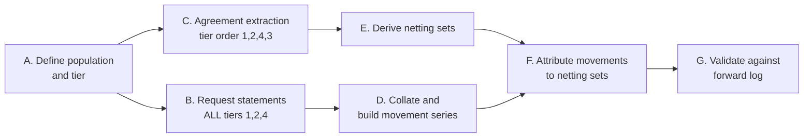

# Counterparty Documentation Workstream

A combined pre-build workstream producing two datasets the platform cannot generate for itself:
**structured legal agreement terms** (`d1-reference-and-static-data` §3.8) and **24 months of collateral
movement history** (`d10-liquidity-and-funding` §3.6, Track 2).

Parent: `treasury-alm-risk-platform`. **Starts before Phase 0.** Neither output depends on the platform
existing, and both degrade with delay.

## 1. Why combine them — and where they genuinely overlap

The instruction was "one pass per counterparty." That is right as a **coordination** principle and
slightly wrong as a **work** principle, and the distinction matters for planning.

**They are different activities on different sources:**

| | Agreement extraction | Collateral history |
|---|---|---|
| Source | Your own executed documents, held by legal/documentation | External statements from correspondents, counterparties, custodians |
| Activity | Legal document review and field extraction | Data request, collation and reconciliation |
| Skill | Legal / documentation | Treasury operations / data |
| Clock | Steady — documents don't decay | **Degrading** — statement retrieval moves from self-service to archive request as records age |

**What they genuinely share, and where the saving is:**

1. **The same counterparty population** — specifically the collateralised one (§2)
2. **The same external contact** — one approach per counterparty rather than two, which matters for
   relationship management more than for effort
3. **The same prioritisation** — materiality ranking derived once
4. **The netting set as a shared key** — collateral movements must ultimately attribute to a netting
   set, which only exists once the agreements are extracted. **This is a real dependency, not a
   convenience**
5. **One project owner, one tracker, one status report**

**The honest saving is coordination and relationship overhead, not extraction effort.** Do not plan on
halving the work. Plan on running two tracks with a shared population, a shared contact protocol and a
single owner.

## 2. Population and tiering — where the overlap actually sits

Not every counterparty needs both outputs. Tiering first prevents the most common failure, which is
treating a 400-counterparty list as uniform and stalling on the tail.

| Tier | Population | Agreements | Collateral history | Priority |
|---|---|---|---|---|
| **1** | Collateralised derivative counterparties (ISDA + CSA in place) | **Yes** — full CSA extraction | **Yes** — full 24 months | **Highest.** Both outputs, and drives LCR outflow and SA-CCR |
| **2** | Repo / securities financing counterparties (GMRA, GMSLA) | **Yes** — margin and eligibility terms | **Yes** — margin movements | High. Drives HQLA encumbrance and NSFR |
| **3** | Uncollateralised derivative counterparties (ISDA, no CSA) | **Yes** — netting terms only | **No** — no collateral moves | Medium. Needed for SA-CCR netting sets |
| **4** | CCPs and clearing brokers | **Yes** — clearing terms | **Yes** — margin history, usually well recorded | High, and usually cheap — the data is already systematised |
| **5** | Deposit, loan and non-derivative counterparties | Standard terms only | **No** | Low. Out of scope for this workstream |

**Tiers 1, 2 and 4 are the overlap** — the population where "one pass per counterparty" is literally
true. Tier 3 is agreements-only. Tier 5 is neither.

**First task is producing this list**, which itself requires a decision: the population is defined from
current live relationships *plus* any counterparty with collateral activity in the past 24 months, even
if the relationship is now dormant. The look-back needs the dormant ones; the agreement extraction does
not.

## 3. Extraction template — agreements

One record per master agreement, with child records per annex and per netting set.

### 3.1 Master agreement

| Field | Notes |
|---|---|
| Agreement type | ISDA, GMRA, GMSLA, clearing agreement, other |
| Counterparty legal entity | Must resolve to a D1 legal entity, not a group name |
| Our legal entity | Single value today; captured explicitly against the group-structure signals in parent Appendix D |
| Governing law and jurisdiction | Drives which netting opinion applies |
| Execution date, version, amendments | Including any master amendment agreements |
| Termination events and additional termination events | ATEs are frequently bespoke and frequently missed |
| Cross-default provisions and thresholds | |
| **Netting enforceability opinion** | Opinion holder, date, jurisdiction, **review/expiry date**. A dated attribute with a review cycle, not a boolean |

### 3.2 Credit support annex

| Field | Notes |
|---|---|
| Threshold (each way) | May be rating-dependent |
| Minimum transfer amount | |
| Independent amount / initial margin | |
| Eligible collateral schedule | Instrument types, currencies, **haircuts** |
| **Rating downgrade triggers** | Trigger levels and the additional collateral or termination consequence. **Directly drives an LCR outflow** (`d10-liquidity-and-funding` §3.3) |
| Rehypothecation rights | Whether collateral received may be reused — determines HQLA treatment (D2 §2.9) |
| Valuation agent, call frequency, notification times | |
| Dispute resolution mechanics | |
| Interest / remuneration on cash collateral | |

### 3.3 Netting set

The set of Contracts covered by one enforceable netting arrangement. Derived from the agreement
hierarchy rather than entered directly, but must be explicit and queryable — **SA-CCR and CVA compute
per netting set** (D1 §3.8).

## 4. Extraction template — collateral history

Seven fields, matching the forward log in `d10-liquidity-and-funding` §3.6 so the reconstructed and
logged series are directly comparable.

| Field | Notes |
|---|---|
| Movement date | **Value date**, not instruction date |
| Counterparty | Resolves to D1 legal entity |
| Netting set reference | May be blank during reconstruction; **backfilled once §3.3 completes** |
| Direction | Posted or received |
| Amount and currency | |
| Collateral type | Cash, or securities with ISIN |
| Transaction type | Derivative VM, derivative IM, repo/SFT margin |

**Source hierarchy**, strongest first: nostro and bank statements (complete record of cash collateral,
and correspondents routinely re-supply 24 months); counterparty and CCP margin statements; custodian
statements for securities collateral; internal margin call correspondence and operations spreadsheets
as validation.

**The metric is forgiving.** The LCR look-back needs the **largest absolute net 30-day collateral flow**
over the period — an extremum, not a continuous series. Sparse coverage in quiet periods is acceptable;
coverage around stress episodes is not optional. Prioritise completeness at the peaks.

## 5. Sequencing

**Step B runs first and for everyone at once.** Statement requests have lead time and a degrading
retrieval window — issue them across the whole of tiers 1, 2 and 4 on day one, before any extraction
work begins. Waiting to request statements counterparty-by-counterparty as extraction reaches them
wastes the one thing that is genuinely time-sensitive.

**Ready-to-send templates for step B are in the child artifact `statement-request-pack`** — four
recipient types (correspondents, derivative counterparties, CCPs, custodians), a chaser, a tracking log
and the practical notes that decide whether responses arrive in a loadable format or as two years of
PDFs.

**Step C proceeds in tier order** and can run for months without harming the outcome.

**Step F is the real dependency** — collateral movements cannot be attributed to netting sets until the
netting sets exist. Movements can be captured before then with the netting set field blank and
backfilled later; this is expected, not a defect.

## 6. Ownership

| Track | Owner | Skills |
|---|---|---|
| Overall | Single named workstream owner | Project management, authority to escalate |
| Agreement extraction | Legal / documentation function | Contract review; ability to interpret ATEs and netting opinions |
| Statement requests and collation | Treasury operations | Relationship contacts, statement interpretation, reconciliation |
| Netting set derivation and validation | Credit risk or middle office | Understands what netting is *for* downstream |
| Data capture and quality | Whoever will own D1 static data | Ensures output lands in the D1 template, not a bespoke spreadsheet |

**Capture into the D1 templates from the start**, not into working spreadsheets to be migrated later.
The fields are already specified; a migration step is avoidable rework and loses provenance.

## 7. Explicitly out of scope

**Standing settlement instruction verification.** Tempting to add — you are already contacting every
counterparty — but SSIs sit under a higher control tier requiring four-eyes plus callback verification
against an independently sourced contact (D1 §4). Folding them into a bulk documentation exercise
weakens that control. Run SSI verification as its own controlled exercise.

**In scope as a cheap addition, by contrast: counterparty hierarchy confirmation.** While in contact,
confirm the legal entity, its parent and its ultimate parent — feeding D1 §3.2's three groupings, which
otherwise need their own data-gathering round. Low cost, same conversation, and the hierarchy is needed
for concentration reporting in Phase 1.

## 8. Deliverables

1. Tiered counterparty population list with materiality ranking
2. Structured master agreement records for tiers 1–4
3. Structured CSA / margin annex records for tiers 1, 2, 4
4. Netting set definitions with enforceability opinion status and review dates
5. Collateral movement series covering 24 months for tiers 1, 2, 4, with documented coverage gaps
6. A **coverage statement** — which periods and counterparties are complete, partial or absent, feeding
   the Track 3 proxy in `d10-liquidity-and-funding` §3.6
7. Counterparty hierarchy confirmations (§7)

## 9. Acceptance criteria

1. Every tier 1, 2 and 4 counterparty has a master agreement record or a documented explanation of its
   absence
2. Every CSA field in §3.2 is captured or explicitly marked not-applicable — **downgrade triggers and
   rehypothecation rights carry no blanks**, since both drive regulatory numbers
3. Netting sets are derivable for every collateralised counterparty and reconcile to the agreement
   hierarchy
4. Netting enforceability opinions are recorded with review dates; **gaps are reported, not silently
   treated as enforceable**
5. Collateral movement coverage is quantified per counterparty and per month, with peak periods
   explicitly assessed for completeness
6. The reconstructed series reconciles to the forward log (Track 1) for the overlap period, confirming
   the reconstruction method is sound
7. All output sits in D1 template structures, not bespoke spreadsheets

## 10. Risks

| Risk | Impact | Mitigation |
|---|---|---|
| **Agreements missing, unsigned or superseded** | Netting unenforceable → exposures cannot be netted for capital. **A real capital cost, not a data gap** | Report gaps early; this may trigger a remediation programme with legal, which has its own timeline |
| **Netting opinion gaps by jurisdiction** | Same as above | Identify jurisdictions early; opinions can be commissioned but take time |
| **Statement retrieval window closes** | Permanent loss of look-back history | **Issue all requests on day one** (§5) |
| **Counterparty statements disagree with internal records** | Reconstruction ambiguity | Bank statements are the tiebreaker for cash; document the rule before disputes arise |
| **Netting set attribution proves impossible for older movements** | Aggregate-only history | Acceptable — the LCR look-back is computed in aggregate, so counterparty-level attribution is desirable rather than essential |
| **Scope creep into full CLM** | Workstream never finishes | The templates in §3 and §4 are the scope. Anything beyond them is a separate decision |

## 11. Open questions

1. **Population size** — how many counterparties fall into tiers 1, 2 and 4? This determines whether
   the workstream is weeks or months, and it is the first thing to establish.
2. **Where are executed agreements held today**, and is the inventory complete and current?
3. **Do netting enforceability opinions exist**, and for which jurisdictions?
4. **Who owns the counterparty relationship contact** for statement requests — treasury, credit, or
   relationship management?
5. **Is there an existing collateral system or service provider** holding movement history? If so, much
   of Track 2 collapses into a single data request.
