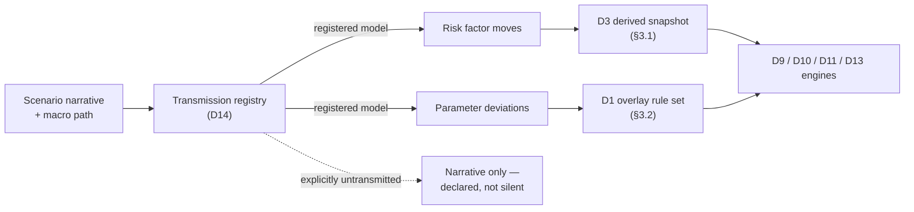

# D14 — Scenario & Stress Framework

All shocks, scenarios and stress paths, versioned and approved, consumed identically by D9, D10, D11
and D13. Parent: `treasury-alm-risk-platform`. Phase 3 of the build sequence — **with a Phase 1
carve-out this deep-dive establishes (§9).**

**What makes this module different from the rest of the platform.** D14 computes almost nothing. It is
a *definition* module: it authors versioned artefacts that other modules execute, exactly as D13 authors
classification rules that D2 executes. Its failure mode is therefore not a wrong number — it is
**four modules each producing a defensible number under nominally the same scenario, which do not add
up.** Nobody sees a stack trace. The ALCO pack simply stops reconciling, under stress, which is when it
is read hardest.

The parent blueprint gives D14 one sentence: *"All shocks, scenarios and stress paths, versioned and
approved, consumed identically by D9, D10 and D11."* Every word of that is right. **"Consumed
identically" is doing more work than it appears, and only part of it has a mechanism** — `d3-market-data-and-curves`
§1.3 solved the curve half and left the behavioural half unowned (§3).

**Revision 2 — the consumer list is one module short and the mechanism is one layer short.**
`d8-valuation-and-analytics` §3.3 makes the *perturbation convention set* "versioned configuration,
shared between D8's sensitivities and D14's shocks", and names no owner. That is the same gap as §3.2's
overlay, arriving from the other direction: D8 is a consumer of D14 definitions that the parent
sentence does not list, and a sensitivity is a shock in everything but magnitude and governance (§1.6,
§2.5).

## 1. Responsibilities

**D14 owns:**

- The scenario inventory — every named shock, scenario and stress path the bank runs, in one governed place
- Scenario *definitions*: what moves, by how much, in what representation, over what time axis
- The **scenario-conditional parameter overlay** — behavioural and factor deviations that a scenario implies (§3.2)
- Scenario composition and the ordering rules that make composition deterministic (§2.4)
- The **transformation grammar** — the representation, node set, magnitude unit and floor application
  point that a shock *or a sensitivity perturbation* is expressed in, shared with D3, D8 and D11 (§2.5)
- Scenario coherence review and calibration vintage (§4)
- Reverse stress test specification — the target, the search space and the stopping rule (§5)
- The **transmission registry**: which model maps which macro variable onto which risk factor (§1.5)
- Scenario approval routing, effective dating and expiry (§6)

**D14 does not own:**

- Shock *application* to market objects — D3 applies and publishes a derived snapshot (§1.3, inherited from D3 §1.3)
- Behavioural model *definition or calibration* — D9 owns the models; D14 overlays scenario-conditional deviations onto their parameters (§1.5)
- Behavioural model *execution* — D2 executes, under overlay exactly as under base parameters (§3.2)
- Prescribed LCR/NSFR run-off, drawdown, ASF and RSF factors — **D13 authors these and they are not scenarios** (§1.2)
- Statistical scenario *generation* for VaR — D11 owns historical-simulation and Monte Carlo draws (§1.4)
- Which sensitivities are produced and by what numerical method — D8 owns that; D14 owns only the
  convention the perturbation is expressed in (§1.6)
- Base curve construction — interpolation space, extrapolation, bootstrapping, the base curve's own
  floor policy — D3 §4.1. The grammar governs how a curve is *moved*, not how it is *built* (§2.5)
- Execution of any stress run — D9, D10, D11 and D13 each run their own engines against D14 definitions
- Model approval and validation — D15 governs; D14 supplies definitions into that framework
- Macro forecasting — the bank's economics function or an external provider supplies macro paths; D14 governs and structures them

**The boundary that matters most:** D14 owns *what the scenario is*; the consuming modules own *what it
does to them*. The instant D14 starts holding a computed stressed number rather than a definition, the
parent blueprint's downward-edge rule (parent §1 — *"a downward edge may carry only versioned,
effective-dated definitions, never live computed values"*) is broken and D14 becomes a fifth analytics
engine competing with the four it is supposed to align.

### 1.1 Three things are called "scenario" and they differ on the time axis

This is the first place the design goes wrong, and it goes wrong quietly because all three are legitimately
called scenarios in normal usage.

| Concept | Time axis | Question it answers | Primary consumer |
| --- | --- | --- | --- |
| **Shock** | Instantaneous — t=0 revaluation, no elapsed time | What is my balance sheet worth if the curve moves *now*? | D9 (ΔEVE), D11 |
| **Stress scenario** | A state plus prescribed behaviour over a short horizon — typically 30–90 days, daily-stepped | How much cash leaves, and how long do I survive? | D10 (survival horizon), D9 (ΔNII) |
| **Stress path** | Multi-period — quarterly over 3–5 years | Does my capital stay above requirement through a downturn? | D13 (ICAAP, capital projection), D10 (funding plan) |

**These cannot share one record shape**, and the common design error is to build the shock object first —
because the six IRRBB shocks are the most concrete requirement — then discover in Phase 6 that a capital
projection needs a fourteen-quarter path and retrofit a time dimension onto a structure that assumed
instantaneity. The path is the general case; the shock is the degenerate one-period case. **Build the
time axis in from the start even though Phase 3 only exercises the first row.**

A second consequence: **ΔEVE and ΔNII under "the same +200bp scenario" are not the same scenario.** EVE
applies an instantaneous shock to a run-off balance sheet; NII applies a rate path over one to three
years to a static, constant or dynamic balance sheet (`d9-alm-and-irrbb` §5). A single named scenario
must therefore carry *both* a shock representation and a path representation, or D9 must be permitted to
name two scenarios where ALCO believes there is one. The first is better; the second is honest. Silently
letting the shock double as a flat path is neither.

### 1.2 The D14 / D13 boundary — prescribed factors are not scenarios

**`d10-liquidity-and-funding` §6 states this correctly and it deserves to be a hard architectural line.**

LCR is a stress scenario in economic substance — prescribed run-off, drawdown and haircut factors are a
regulator's stress assumptions. It is tempting, and wrong, to put them in D14 on that reasoning.

| | Prescribed regulatory factors | D14 scenarios |
| --- | --- | --- |
| Author | **D13** (parent §1.6, D13 §1.1) | D14 |
| Store | D1 §3.9, alongside classification rule sets | D1, as a distinct rule class (§3.2) |
| Changeable by the bank | **No.** A change is a regulatory change | Yes, under approval |
| Approval | Adoption, with an effective date matching the regulation | ALCO or board risk committee (§6) |
| Challengeable | No | Yes — that is the point of them |

**The failure this prevents:** if prescribed factors live in the scenario inventory, the approval workflow
that exists to let ALCO tune an internal stress assumption becomes a workflow that can amend a
regulator-prescribed constant. It will be used that way, eventually, by someone with a deadline. The
control is not a warning label; it is that the two live in different rule classes with different
authorship.

**The awkward middle case, decided.** The six prescribed IRRBB shocks (`d9-alm-and-irrbb` §4.2) are
regulator-calibrated *magnitudes* delivered through the *shock* mechanism. They belong in D14's inventory
— D9 consumes them the same way it consumes an internal shock, and splitting them out would fork the
consumption interface — but they carry `origin: prescribed`, are **not editable under the ALCO approval
route**, and their calibration vintage tracks the regulation rather than the bank's review cycle (§6).
The same treatment applies to the post-shock interest rate floor and the prescribed NMD maturity caps,
which are D13-authored constants that a shock definition *references* rather than contains.

### 1.3 The D14 / D3 boundary — inherited, and generalised

`d3-market-data-and-curves` §1.3 already settled the curve half: **a shocked curve is a derived D3
snapshot.** D14 supplies the shock definition, D3 applies it and publishes the result with its own
version, derived from a named base snapshot and a named shock version. D9, D10, D11 and D14's own runs
consume the same object and get bit-identical curves (D3 acceptance criterion 8).

**D14 generalises that decision to everything in a market snapshot, not only curves.** The same argument
— three consumers applying the same shock three ways diverge silently — applies without modification to:

| Market object | Shocked by | Consumed by |
| --- | --- | --- |
| Curves (zero / par / instantaneous forward — the representation is part of the definition) | D3 | D9, D11, D13 |
| FX spot and forward | D3 | D9, D10, D11 |
| Credit spreads and proxy spreads | D3 | D9 (CSRBB), D11 |
| Volatility surfaces | D3 | D8 → D9, D11 |
| Security prices | D3 | D10 (counterbalancing capacity), D11 |
| **Haircuts** | **D3** | **D10** |

Haircuts are the one worth naming explicitly. D3 §9 already supplies "market values and haircut inputs"
to D10, and D10 §6 lists "haircut widening" as a scenario parameter. Without this line, haircut widening
is the one market shock D10 would apply itself — and it would be the only market shock in the platform
not reconciling to a derived snapshot. **Rule: if a consumer would have to apply a shock itself, the
object belongs in the market snapshot and the shock belongs to D3.**

### 1.4 The D14 / D11 boundary — statistical scenario sets are not governed scenarios

D11's historical-simulation VaR consumes 250-plus daily risk factor moves; Monte Carlo consumes tens of
thousands of draws. These are called scenarios and they are not D14's.

The distinction is **governance granularity**: a D14 scenario is individually named, individually
approved, individually challengeable and individually reported. A VaR draw is none of those — the
*method* is approved (by D15, as a model), the draws are not. Putting them in the same inventory makes
the inventory unreadable and makes "how many approved scenarios does the bank run" unanswerable.

**What D14 does own at that boundary:** the **stress period identification** for stressed VaR — which
historical window is designated the stress period is a governed, named, approved choice with material
capital consequences, and it is exactly the kind of judgement this module exists to hold. The window
definition is D14's; the 250 draws inside it are D11's.

### 1.5 The D14 / D9 boundary — the transmission problem

A macro stress path says *unemployment rises 4 points, GDP contracts 3%, policy rate rises 400bp*. **No
engine in this platform consumes any of those.** D2 consumes cashflows and parameters, D8 consumes
curves, D10 consumes factors. Something must map macro variables onto risk factors, and that something
is a model — a deposit outflow model conditioned on unemployment, a prepayment model conditioned on the
rate path, an ECL model conditioned on GDP.

**Those transmission models are not D14's.** They belong to their risk owners — D9 for behavioural, D11
for market, the external ECL function for staging — and are governed by D15 like any other model. But
**a macro path with no registered transmission is a press release, and this is where scenario frameworks
most commonly fail in practice**: the scenario is beautifully documented, the narrative is board-approved,
and the number that comes out was produced by an analyst choosing a deposit outflow rate that felt
consistent with it.

**D14 owns the transmission registry**: for each scenario, a table of *(macro variable → transmission
model version → target **D3 market object** or parameter)*. Its acceptance test is coverage — **every
variable in an approved scenario narrative resolves to either a registered transmission or an explicit
"narrative only, not transmitted" designation.** The second is permitted and sometimes correct; being
silent is not.

**The target is a D3 market object, not a "risk factor" — `D11-H3`.** This read *"target risk factor
or parameter"*, and the distinction is not terminological. **A risk factor is a construct of a risk
methodology**: which factors exist, and at what granularity, is chosen by D11's VaR model and changes
when that model changes. **A D3 market object — a curve, a surface, a fixing series, a spread — is a
platform object with an identity that outlives any methodology.** Anchoring the registry to risk
factors means a VaR methodology change silently invalidates the transmission mapping of every
board-approved macro scenario: the scenarios still exist, still carry their approvals, and now point at
factor names that have been redefined underneath them. Nothing fails; the mapping is simply wrong, and
it is wrong in the direction of a stress result that still computes. Anchoring to D3 objects makes the
registry stable under exactly the change most likely to happen
(`d11-market-and-counterparty-risk` §1.3.3). Where a risk factor and a market object genuinely differ
in granularity, the registry targets the object and the risk methodology maps downward from it — which
is the same direction of travel as §3.1's derived snapshot.



### 1.6 The D14 / D8 boundary — a sensitivity is a shock

**`d8-valuation-and-analytics` §3.3 is the fourth boundary and it was not in this module's first
revision.** It states the dependency exactly and stops one step short of placing it:

> *"The perturbation convention set is versioned configuration, shared between D8's sensitivities and
> D14's shocks. If D8 bumps zero rates and D14 shocks par rates, the sensitivity-predicted P&L will not
> reconcile to the full-revaluation P&L, and the difference will be attributed to 'higher-order effects'
> for as long as anyone is willing to keep saying that."*

**The mechanism underneath it: a DV01 and a ΔEVE are the same operation at different magnitudes.** A
DV01 is the revaluation difference under a 1bp curve transformation; a prescribed ΔEVE is the
revaluation difference under a 200bp one. They differ in magnitude, in governance and in what they are
used for. **They do not differ in the transformation** — and if the transformation is defined by
different code in different modules, `DV01 × 200` does not approximate ΔEVE and nothing in the platform
can say why.

There are three consumers of that one transformation, not two:

| Consumer | Uses it for | Breaks how, if it diverges |
| --- | --- | --- |
| **D3** | Applying shocks and publishing derived snapshots (§1.3, §3.1) | Already solved for shocks — but D3 §1.3 places the mechanics in per-curve configuration, which no other module reads (§2.5) |
| **D8** | Sensitivity perturbation — DV01, key rate durations, CS01, vega (D8 §3.3) | Sensitivity-predicted P&L stops reconciling to full revaluation; the residual is unattributable |
| **D11** | The representation its historical risk factor moves are captured in (parent §6.1's history clock) | A sensitivity-based VaR applies moves expressed one way to greeks computed another — internally inconsistent before any market data arrives |

**D14 owns the grammar; it does not own any of the three executions.** The split is the same one this
module makes everywhere else: D14 says *what a move is*, the consuming module does it.

## 2. The scenario object

### 2.1 Four families, one envelope

| Family | Contains | Time axis | Approver |
| --- | --- | --- | --- |
| **Rate shock** | Curve transformation per currency and index; representation shocked; floor treatment | Instantaneous | Prescribed (adopted) or ALCO |
| **Market scenario** | Multi-factor moves — rates, FX, spreads, vol, prices, haircuts | Instantaneous or short path | ALCO |
| **Liquidity stress** | Market moves **plus** behavioural and factor overlay — run-off, drawdown, rollover, haircut widening, market closure | Daily-stepped over 30–90 days | ALCO |
| **Macro stress path** | Macro variable paths plus transmission registry | Quarterly over 3–5 years | Board risk committee |

They share one envelope — identity, version, effective date, approval state, narrative, calibration
vintage, expiry — and differ only in payload. **The envelope is what makes "consumed identically" true;
the payload is what makes the four families honest about being different.**

### 2.2 Every scenario carries a narrative, and the narrative is not decoration

A stress scenario without a story is a set of numbers nobody can challenge. The narrative is what lets a
risk committee ask *"would deposits really behave that way if that happened?"*, and it is the only part
of the artefact a non-quantitative approver can meaningfully approve. **It is a required field, it is
versioned with the parameters, and a parameter change without a narrative change is a review trigger** —
because it usually means the narrative was fitted to a desired answer after the fact.

### 2.3 Severity is a property of the scenario, not of the family

Scenarios need a declared severity tier — *mild / moderate / severe / extreme* — used for two things:
reporting comparability across families, and the risk appetite framework, which sets thresholds like
"survive a severe idiosyncratic stress for 30 days". Without a governed severity label, that appetite
statement is unenforceable, because whether a given scenario is "severe" becomes an argument each time.

### 2.4 Composition, and why ordering must be explicit

The minimum liquidity scenario set (`d10-liquidity-and-funding` §6) is idiosyncratic, market-wide, **and a
combined scenario**. Combination is not addition.

- A ratings downgrade (idiosyncratic) triggers CSA collateral calls; a market-wide spread widening changes
  the size of those calls. **Apply them in either order and the collateral outflow differs.**
- Two scenarios may both cap a parameter — one flooring deposit beta at zero, another flooring it at the
  bank's policy floor. The result depends on which applies last.
- A shocked curve derived from an already-shocked curve is not the same object as a curve shocked once by
  the sum.

**Decision: composition is explicit, ordered and stored as its own scenario, not computed on the fly.** A
combined scenario is a first-class definition naming its components and their application order, approved
as a unit, with its own version. It is *not* a runtime instruction to apply scenarios A and B together —
that would put the ordering decision in the consuming engine, which is precisely the divergence this
module exists to prevent. **Composition rules are D14's; the composed result is a scenario like any other.**

### 2.5 The transformation grammar — one vocabulary, two instance classes

**Decision: D14 publishes a versioned *transformation grammar*. A shock is a governed instance of it;
a sensitivity perturbation is a technical instance of it. Both name a grammar version, and neither
carries mechanics of its own.**

This is the §1.6 dependency placed. It is deliberately *not* a decision to put perturbations in the
scenario inventory — see the two instance classes below.

**The rate factor class is drafted** — see `rate-transformation-grammar`, the Phase 1 deliverable that
binds representation, node set, application order, magnitude basis and floor treatment, and carries the
evaluation script the Phase 2 library is chosen against. The other factor classes follow their
consumers (its §1).

**What the grammar fixes**, per risk factor class:

| Element | The choice it removes | What happens if it is left per-engine |
| --- | --- | --- |
| **Representation** | Zero rate / par rate / instantaneous forward / discount factor | Three DV01s and three EVEs on the same trade (D3 §1.3, D8 §3.3) |
| **Node set and application order** | Which tenors move, and whether the move is applied at nodes *then* interpolated or to the already-interpolated curve | A shock applied at pillars and re-interpolated is not the curve the definition describes; key rate sensitivities that do not sum to the parallel DV01 |
| **Magnitude unit and basis** | Absolute bp vs relative %; the compounding and day count the bp is expressed in | 1bp on an annually compounded zero is not 1bp continuous. On volatility the gap is larger: one vol point against 1% relative differs by a factor of twenty on a 5-vol surface |
| **Floor application point** | Before or after interpolation; on the shocked zero, the shocked par or the shocked forward | The prescribed post-shock IRRBB floor (`d9-alm-and-irrbb` §4.2) is defined on a post-shock *rate*. Which rate is a bank choice, and it moves the supervisory outlier test result |
| **Composition with other transformations** | Perturbation on a shocked state vs shock on a perturbed state | Stressed sensitivities become order-dependent — §2.4's problem, one layer down |

**Two instance classes, separated on governance and joined on mechanism:**

| | **Shock** — governed instance | **Perturbation** — technical instance |
| --- | --- | --- |
| Purpose | Answer a risk question | Measure a local derivative |
| Magnitude | Material — 25bp to 400bp, calibrated | Infinitesimal by intent — 1bp, one vol point |
| Narrative, severity, expiry (§2.2–2.4) | Required | **Not applicable.** A 1bp bump has no story and no severity tier |
| Approval | ALCO, board, or adopted (§6) | **Not ALCO.** Model configuration under D15, four-eyes like any model parameter |
| Held in | The scenario inventory | The convention registry — deliberately a separate list |
| Grammar | Names a grammar version | Names **the same** grammar version |

**Why separate the instances but share the grammar.** The reasoning is §1.2's and §1.4's, applied a
third time: governance granularity and mechanism are different axes. ALCO cannot meaningfully approve
a 1bp bump, and putting hundreds of perturbations in the inventory makes *"how many approved scenarios
does the bank run"* unanswerable — the same argument that keeps VaR draws out (§1.4). But unlike VaR
draws, perturbations must be **mechanically identical** to shocks or the reconciliation D8 acceptance
criterion 9 requires is unachievable. Separation of governance, unity of mechanism. **A third module
inventing its own bump is the failure; a second inventory is not.**

**Binding is a governed table, not an emergent property.** The grammar binds per *(risk factor class,
curve or surface id)* in one versioned table. Per-currency variation is permitted — a currency quoted
and hedged in par swaps may reasonably be shocked in par — but it is a declared row someone approved,
not the residue of thirty-six independently maintained curve configurations (D3 §4.3).

**This narrows `d3-market-data-and-curves` §1.3**, which places *"the representation shocked, the
interpolation applied afterwards, and the floor treatment"* in curve configuration (D3 §4). D3 is right
that these are versioned, approved, and executed by D3. It is wrong that they are *per-curve*
configuration: a convention shared with D8's sensitivities and D11's risk factor history cannot live in
a config object that neither module reads. D3 §4.1's curve *construction* configuration is untouched —
it governs how the base curve is built, the grammar governs how it is moved, and the two are separately
approvable for good reason.

**Prescribed shocks are prescribed in magnitude, not in representation.** The six BCBS shocks (§1.2)
fix per-currency magnitudes and a tenor formula. They do not fix which curve representation is shocked
or where the post-shock floor bites. **So even the prescribed class needs a grammar binding, and that
binding is a bank judgement that changes a regulatory number.** It belongs in the documented
methodology, not in whichever engine reaches the curve first.

**One consequence that will otherwise be discovered as a bug: a floored shock is not a scaled
perturbation.** Where the post-shock floor binds — precisely the low-rate environment in which the down
shocks are interesting — `DV01 × 200` cannot reproduce the floored ΔEVE, and no amount of grammar
alignment will make it. The grammar makes the residual *explainable*; it does not make it zero.
**Each shock therefore declares whether it is linearly decomposable**, so attribution can separate
three things that otherwise arrive as one number:

| Residual component | Should be |
| --- | --- |
| Convention mismatch | **Zero, by construction.** This is what the grammar buys |
| Floor binding | A real economic effect, reported as such |
| Higher-order / cross-gamma | What is genuinely left, and now small enough to be believable |

## 3. Where a scenario is applied — two paths, one currently missing

This is the central design decision of the module.

### 3.1 Path one — market objects, via D3 (settled)

Inherited from D3 §1.3 and generalised in §1.3 above. D14 publishes the shock definition; D3 applies it;
consumers read a derived snapshot. Settled, and the mechanism already exists.

### 3.2 Path two — behavioural parameters and factors, via D1 (this deep-dive's decision)

**Nothing in the blueprint or the sibling deep-dives says where a scenario's *non-market* assumptions are
applied.** D10 §6 says its stress engine "takes factors as input rather than embedding them", which is
right and stops short of saying where the inputs live. D9 defines behavioural parameters and D2 executes
them, with no statement of what happens to those parameters under a scenario.

**Left unresolved, the outcome is deterministic:** D10 holds a scenario deposit run-off rate in its own
stress configuration, D9 holds a scenario deposit beta in its own, and both are edited by different
people on different cycles. Under a named "severe idiosyncratic stress" the bank then assumes deposits
run off 25% (D10) while simultaneously assuming the retained deposits reprice with a beta calibrated on
normal conditions (D9). Both numbers are defensible in isolation. Together they describe two different
worlds, and **the ALCO pack presents them on facing pages.** This is exactly the silent divergence the
D3 decision was made to prevent, on the half of the problem D3 does not cover.

**Decision: a scenario's behavioural and factor deviations are published as a versioned,
effective-dated *overlay rule set*, held in D1 §3.9 as a distinct rule class, and executed by whichever
module executes the corresponding base parameter.**

| Deviation | Base owner | Base executor | Under scenario |
| --- | --- | --- | --- |
| Deposit repricing beta, NMD maturity profile, prepayment CPR, early redemption, rollover | D9 defines | **D2** executes | D2 executes base parameters **with D14 overlay applied**, same code path |
| Core/volatile balance split, drawdown and utilisation rates | D10 defines | **D10** applies | D10 applies its own parameters **with D14 overlay applied** |
| Prescribed LCR/NSFR factors | D13 authors | D10 applies | **Not overlaid.** Prescribed factors do not move under a bank scenario (§1.2) |
| Haircuts, market closure | — | — | Market objects — path one (§3.1) |

Three properties this buys, and each is the reason for the choice rather than a side effect:

1. **One store, one versioning model, one approval mechanism.** The D1 §3.9 pattern already exists and
   already carries exactly this semantic — a later-phase module authoring a versioned rule set that an
   earlier-phase module executes. D14 is a third author alongside D7 and D13, not a new mechanism.
2. **The system of record still contains no opinions.** D2 executes an overlay it does not own, exactly
   as it executes a classification rule it does not own. Parent §1's downward-edge rule holds unmodified.
3. **Scenario runs reproduce.** An overlay version is resolvable, so a historic stress run reproduces
   under the assumptions in force at the time — the same guarantee D2 §7 gives projections.

**The interaction rule that must be stated, because it is where this design can still go wrong.** An
overlay is a *deviation*, not a replacement: it references a base parameter set version and expresses a
delta or an override per parameter. Two consequences. A scenario run must record **both** the base
parameter version and the overlay version, or a metric movement cannot be decomposed into recalibration
versus scenario change — and `d9-alm-and-irrbb` §6.4's assumption-attribution requirement is
unsatisfiable without it. And **an overlay whose base has been recalibrated must be re-reviewed**, because
"beta falls to 0.1 under stress" and "beta is multiplied by 0.3 under stress" diverge the moment the base
beta moves. Overlays should express the intended one explicitly; the framework should not guess.

**An overlay is an extension of a model's approved usage, and it is not free — `D15-5`.** The point of a
stress overlay is to push a parameter **outside the range it was calibrated on**; that is the exercise,
not a defect of it. But a behavioural model is validated for a stated purpose over a stated range, and
running it beyond that range is a **usage extension requiring the model owner's agreement**, on the same
footing as any other new consumer. D15's inventory therefore records approved usage as a list of named
consumers and purposes rather than free text, and D14's overlay appears in it explicitly
(`d15-model-governance` §3.3). Two practical consequences: the extension is reviewed once, when the
overlay is approved, rather than argued about after a stress result looks implausible; and where a model
genuinely cannot be extended — a beta calibrated on a single benign rate cycle, asked to behave under a
400bp shock — that is a **finding about the scenario's reliability**, which §4's coherence owner needs
and which is invisible if the extension is never recorded as one.

### 3.3 What this means for the deposit book's three splits

`d10-liquidity-and-funding` §5.1 establishes that the non-maturity deposit book is split three ways for
three purposes and that the three must not share a parameter. **That constraint survives scenario
overlay and is in fact where overlay earns its keep:** a stress scenario overlays split 2 (D10's
core/volatile liquidity behaviour) and split 3 (D9's beta and maturity profile) **separately, from one
approved scenario**, and leaves split 1 (LCR's prescribed stable/less-stable classification) untouched
because it is not a model.

The reconciliation D10 acceptance criterion 9 requires — both parameter sets shown against a common
segmentation — extends to overlays: **under a named scenario, the two overlaid parameter sets must be
presentable side by side against that same segmentation.** That is the report that would have caught the
facing-pages failure in §3.2, and it is cheap once overlays are first-class objects.

## 4. Coherence and calibration

**Nobody currently owns whether a scenario is internally sensible.** Each consuming module validates that
its own inputs are well-formed; none validates that rates +300bp, deposits running off 25% and HQLA
haircuts widening 500bp describe a world that could exist.

D14 owns coherence review, and it is a **review process with a checklist, not a validation rule** —
attempting to make it algorithmic produces a constraint engine that rejects the genuinely novel scenarios
that matter most. The checklist:

| Check | Failure it catches |
| --- | --- |
| Direction consistency | Rates up with deposit outflow *and* an assumption of cheaper wholesale funding |
| Transmission coverage (§1.5) | A macro variable in the narrative that reaches no risk factor |
| Cross-family consistency | The liquidity stress and the macro path disagree on the same policy rate |
| Severity proportionality | A "moderate" scenario more severe on one axis than the "severe" one |
| Historical plausibility anchor | Magnitudes with no reference to an observed episode, and no stated reason for exceeding all of them |
| **Correlation realism** | Independently calibrated single-factor moves stacked as if jointly observed — the most common way a "severe" scenario is quietly implausible |

**Calibration vintage is a required field, and staleness is the failure mode nobody plans for.** Every
scenario records when its magnitudes were last calibrated and against what. A deposit run calibrated
before 2023 on pre-digital-banking outflow speeds is not severe by current standards, and it will keep
reporting "survived" until the day it does not. **Scenarios expire.** An expired scenario still runs — it
is not silently dropped — but its output is flagged, in the same spirit as parent §5's provenance
requirement and D17's *provisional* propagation. Suppressing a stale scenario hides the problem; flagging
it makes it a question at the next review.

## 5. Reverse stress testing is a different computational shape

Both `d9-alm-and-irrbb` §4.2 and `d10-liquidity-and-funding` §6 require reverse stress testing, and it is
consistently under-designed because it looks like one more scenario. It is not.

A normal stress run **evaluates**: given a scenario, produce a metric. A reverse stress test **inverts**:
given a target outcome — survival horizon below 30 days, ΔEVE consuming 20% of Tier 1, CET1 below
requirement — find the scenarios that reach it, then assess their plausibility.

Three design consequences, none of which fall out of the normal path:

1. **The engines must be callable in a search loop**, tens to hundreds of times per test. Parent §3's
   statelessness makes this possible; nothing yet makes it *affordable*. This is a real constraint on the
   run economics in §8 and it is the one that will surprise the sizing.
2. **The search space must be bounded and declared** — which factors may move, over what ranges, jointly
   or singly. An unbounded search returns a mathematically valid answer of no interest (*"a 40% deposit
   run in one day breaks us"*). **The bounding is itself a governed judgement and belongs to D14**,
   because it determines the answer as much as the engine does.
3. **The output is a set of scenarios, plus a plausibility assessment.** The assessment is qualitative and
   is the actual deliverable. A reverse stress test that reports a breaking point without judging its
   likelihood has answered the easy half of the question.

**Reverse stress test results feed back into the inventory.** A breaking scenario judged plausible should
be promoted to a named, approved forward scenario and run routinely thereafter. That loop is the point of
the exercise, and it needs an explicit route from output to inventory or it will not happen.

## 6. Governance, approval and ownership

`d10-liquidity-and-funding` §11 Q5 leaves this open — *"D14 owns definitions, but who approves them?"*
Proposed resolution, to be confirmed against the bank's committee structure:

| Scenario class | Approver | Cadence | Notes |
| --- | --- | --- | --- |
| Prescribed rate shocks, prescribed floors and caps | **Adopted, not approved** | On regulatory change | D13 confirms the effective date; no bank discretion (§1.2) |
| Internal rate and market scenarios | **ALCO** | Annual review, ad hoc on trigger | Recalibration is an approval event |
| Liquidity stress scenarios | **ALCO** | Annual, plus review after any material market event | Drives the risk appetite thresholds in D10 §7 |
| Macro stress paths (ICAAP) | **Board risk committee** | Annual with the ICAAP cycle | Narrative approval is the substance |
| Reverse stress test specification and bounds | **Board risk committee** | Annual | The bounds determine the answer (§5) |
| Ad hoc / what-if | **Named requester, no approval** | — | **Must be structurally incapable of entering a regulatory or ALCO output** (§6.1) |

**Four-eyes and audit trail come from `d15-control-core`** — scenario definitions are exactly the class of
object that control core exists to govern, and D14 requires no separate mechanism.

### 6.1 The ad hoc scenario is the hole in every scenario framework

Pre-deal what-if is `d10-liquidity-and-funding` §7's highest-value interactive feature, and it necessarily
runs scenarios nobody approved. That is correct and must stay. **The control is not approval — it is
that an unapproved scenario's output is structurally unable to reach an approved report.**

Concretely: ad hoc scenarios carry an `approval_state` that propagates onto every result computed from
them, and D13's returns engine and the ALCO pack reject inputs carrying it. This is the same mechanism as
D17's *provisional* flag and D3's `curve_class` — the latter exists so a regulatory return can assert no
internal curve entered it (D3 §1.3), and the identical assertion is needed for scenarios. **Reuse the
mechanism; do not invent a third one.**

## 7. Reproducibility

Parent §5 requires versioned scenario rules. A scenario version alone is insufficient: a stress result
is reproducible only if **every input that varied is version-addressable**. A scenario run record must
resolve to:

```
scenario_version
  → definition version (payload + narrative + severity)
  → transformation grammar version       (D14, per §2.5)
  → base market snapshot version         (D3)
  → derived snapshot version(s)          (D3, per §3.1)
  → base behavioural parameter version   (D9 / D10)
  → overlay rule set version             (D14, per §3.2)
  → reference data version               (D1)
  → transmission model versions          (per §1.5)
  → engine build                         (parent §2.5)
```

**Three of these are new obligations this deep-dive creates**, and all three are cheap now and expensive
later: the overlay version, the transmission model versions, and the grammar version. Without the first
two a stress result is reproducible in its market inputs and not in its assumptions — the half that
rarely moves, not the half that does. Without the third it is not reproducible at all once the
convention is re-bound, and re-binding leaves no trace: **the shock definition is unchanged, the base
snapshot is unchanged, and the number moves.** That is the hardest class of irreproducibility to
diagnose, because every version line a reviewer thinks to check still matches.

**Scenario results are immutable and retained**, like D8 valuations. Re-running last year's ICAAP is a
regulatory request, not a hypothetical, and it fails on any of the ten lines above being unresolvable.

## 8. Run economics

`eod-window-and-degradation` §5 places "scenario and stress runs" in **tier D — skippable, back-filled**.
**That is right for the class and wrong for several of its members**, and the tier belongs on the
scenario, not on the category:

- The **supervisory outlier test** is a regulatory measure. On a reporting date it rises with everything
  else regulatory to tier A (`eod-window-and-degradation` §5.1's date-dependent inversion), and D13 §6.1's
  stricter gate policy applies — no override may permit submission from provisional data.
- **Survival horizon** is a daily risk appetite metric with defined escalation (D10 §7). A skipped run is
  an unmonitored appetite threshold, not a missing analytic.
- **ICAAP paths and reverse stress tests** are genuinely tier D — periodic, and nothing operational
  depends on them same-day.

**Recommendation: scenario definitions carry a `run_tier`, and D17 schedules from it.** A one-field
change that turns a category-level assumption into a per-scenario decision, made by the people who know
which scenarios someone acts on.

**Fan-out is the sizing risk and D3 §8 already flagged its curve half.** The multiplier is
`scenarios × currencies × balance sheet bases × representations`, and D3's decision to generate derived
snapshots once and share them across D9, D10 and D11 is the mitigation — *"the correctness argument for
centralising shock application is also the performance argument."* §3.2's overlay decision extends the
same economics to the behavioural half: overlays are resolved once per scenario, not per consumer.

**The grammar's node set is a compute decision made for correctness reasons by people not costing it**
(§2.5). D8 §6 sizes sensitivity production as one revaluation per perturbed node; a twenty-node key
rate ladder across six currencies is a materially different nightly machine from a ten-node one, and
the node count is chosen in D14's grammar. **The node set should be agreed with the D8 compute envelope
and `eod-window-and-degradation` §5 before it is approved**, not discovered to be a sizing input after
the ladder is published and the sensitivity report has consumers.

**Reverse stress testing is the uncosted item** (§5). A search across hundreds of engine invocations does
not fit a nightly window and should not try — it is a scheduled offline exercise with its own compute
allocation, and it should be planned as one rather than discovered to be one.

## 9. Phasing — Phase 3, with a Phase 1 carve-out

The parent build sequence places D14 in Phase 3 with D9, and D3 §10 agrees, placing derived snapshots in
Phase 3. **That is right for the module and there is one concrete contradiction to resolve.**

**`d10-liquidity-and-funding` §3.6 Track 3 requires D14 in Phase 1.** The collateral movement history
proxy — the residual track of a *pre-Phase-0* workstream — is specified as *"a scenario-derived estimate,
computed by stressing the current derivative portfolio through D14's market scenarios."* That proxy is
load-bearing for LCR completeness in Phase 1, and D14 does not exist until Phase 3.

Three ways out, and the third is recommended:

| Option | Consequence |
| --- | --- |
| Pull D14 forward to Phase 1 | Overkill. The governance apparatus, overlays and transmission registry are not needed to compute one proxy |
| Let D10 hold the proxy scenario itself | Creates the exact ungoverned local scenario definition this module exists to prevent — and it lands in a regulatory ratio |
| **Carve out a minimal Phase 1 scenario definition capability** | The envelope (§2.1), the market scenario family, D3-applied shocks, and the D15 approval route. No overlays, no macro paths, no transmission registry, no reverse stress |

**Recommended: the carve-out.** It is small, it reuses D3's Phase 1 snapshot infrastructure and D15's
Phase 0 control core, and it means the collateral proxy — which is disclosed to a regulator as an interim
method (D10 §3.6) — rests on an approved, versioned, reproducible scenario from the first day it is used.
The alternative is a spreadsheet whose provenance is asked about in year three.

**The carve-out has a second member, and it arrives on a harder deadline than the first.** The
transformation grammar (§2.5) must exist by Phase 1, for a reason that has nothing to do with the
collateral proxy: **`d8-valuation-and-analytics` §9 makes "whether perturbation conventions are
configurable to match D14's shocks" an evaluation criterion for the Phase 2 pricing library**, and D8
§9.1 costs the lock-in if the answer is no. A criterion cannot be evaluated against a convention that
does not exist. **The grammar has to be written before the library is chosen, not after it is
installed** — and unlike most Phase-ordering arguments in this programme, this one is irreversible in
the wrong direction, because the remedy for a library with fixed conventions is a different library.

| D14 capability | Phase | Driver |
| --- | --- | --- |
| Envelope, market scenario family, D3-applied shocks, approval route | **1** | D10 §3.6 Track 3 collateral proxy |
| **Transformation grammar and convention registry (§2.5)** | **1** | **D8 §9's Phase 2 library evaluation criterion, and D3's Phase 1 derived snapshots, which need a representation binding to be reproducible at all** |
| Prescribed rate shocks, internal shocks, behavioural overlay (§3.2), liquidity stress family, coherence review | **3** | D9 IRRBB, D10 survival horizon and internal stress |
| Composition and ordering (§2.4) | **3** | D10's combined scenario |
| Stress period identification for stressed VaR (§1.4) | **5** | D11 |
| Macro stress paths, transmission registry (§1.5), reverse stress testing (§5) | **6** | D13 capital projection and ICAAP |

**One clock runs ahead of all of this.** D3 §6 lists *"D9 / D14 behavioural model calibration and
backtesting — rate history spanning at least one full cycle"* as a Phase 3 need served by a Phase 0
decision. Scenario calibration is subject to the same constraint as behavioural calibration: **magnitudes
anchored to observed episodes (§4) need history containing episodes.** The vendor history purchase
decision in parent §6.1 is a D14 dependency as much as a D9 and D11 one, and D14 was not named in it.

## 10. Interfaces

**Inbound.**

| Source | Content |
| --- | --- |
| D3 | Base snapshots against which scenarios are defined; the curve inventory bounding what is shockable (D3 §4.3) |
| D1 | The rule store for overlay publication (§3.2); currency and index definitions |
| D13 | Prescribed shock magnitudes, post-shock floors, NMD caps — referenced, not owned (§1.2); the regulatory calendar driving ICAAP timing |
| D8 | The sensitivity set and its numerical method, which the grammar must be expressible for (§1.6, D8 §3.3); the compute envelope bounding the node set (§8, D8 §6) |
| D9 | Behavioural model inventory and base parameter sets, which overlays deviate from (§3.2) |
| D10 | Base liquidity factor sets and the segmentation overlays are expressed over |
| D15 | Model approval status for transmission models (§1.5); four-eyes and audit (§6) |
| Economics / external provider | Macro variable paths for the stress path family |

**Outbound.**

| Target | Content |
| --- | --- |
| D3 | Shock definitions, versioned and approved — D3 applies and publishes derived snapshots (§3.1); **the transformation grammar and its per-curve binding**, which D3 executes (§2.5) |
| D1 | Scenario-conditional parameter overlay rule sets (§3.2) |
| **D8** | **The transformation grammar** — the perturbation convention D8 computes sensitivities under (§1.6, §2.5, D8 §3.3) |
| D9 | The six prescribed shocks, internal shocks, and the scenario inventory |
| D10 | Liquidity stress scenarios, severity tiers for risk appetite thresholds, factor overlays |
| D11 | Market scenarios; the designated stress period window (§1.4); **the grammar its risk factor history must be captured in** (§1.6) |
| D13 | Macro stress paths and transmission registry for capital projection and ICAAP |
| D17 | Per-scenario `run_tier` for EOD scheduling (§8) |
| D15 | The scenario inventory as a governed artefact |

## 11. Acceptance criteria

1. **D9, D10, D11 and D13 running the same named scenario resolve to the same derived snapshot version
   and the same overlay version** — demonstrated by a reconciliation report, not by assurance. This is the
   module's reason for existing and it should be the first test written
2. Every scenario carries narrative, severity tier, calibration vintage, approval state and expiry; none
   is optional and none defaults silently
3. Prescribed regulatory factors are structurally unreachable by the scenario approval workflow (§1.2)
4. A composed scenario is a stored definition with explicit component ordering; running components
   together ad hoc is not a supported path (§2.4)
5. Every macro variable in an approved scenario resolves to a registered transmission model or an explicit
   untransmitted designation (§1.5)
6. A historic stress run reproduces exactly from its scenario run record — all ten version lines in §7
   resolve, including overlay, grammar and transmission model versions
7. Ad hoc and unapproved scenarios propagate an approval state that D13's returns engine and the ALCO
   pack reject (§6.1)
8. Overlays deviate from a named base parameter version, and a scenario result decomposes movement into
   base recalibration versus scenario change (§3.2, `d9-alm-and-irrbb` §6.4)
9. Under a named scenario, D9's and D10's overlaid deposit parameters present side by side against the
   common segmentation (§3.3, extending D10 acceptance criterion 9)
10. Expired scenarios run and are flagged; they are never silently suppressed (§4)
11. Reverse stress testing runs against declared, approved bounds and returns a scenario set with a
    plausibility assessment, with a defined route for promoting a plausible breaker into the inventory (§5)
12. The six prescribed IRRBB shocks reconcile to the supervisory definition including per-currency
    calibration and post-shock floors (`d9-alm-and-irrbb` acceptance criterion 1 — D14's half of it)
13. **Sensitivity-predicted P&L reconciles to full-revaluation P&L under the same named shock**, with
    the residual decomposed into floor-binding and higher-order components and **nothing attributable
    to convention mismatch** (§2.5, D8 acceptance criterion 9 — D14's half of it)
14. Every shock definition and every sensitivity request resolves to a transformation grammar version;
    no engine carries a default representation, node set or floor rule of its own (§2.5)
15. The grammar binding for the six prescribed shocks — representation and floor application point — is
    recorded as a documented methodology choice, since neither is prescribed by the regulation (§2.5)
16. Perturbation conventions are in the convention registry and not in the scenario inventory; the
    inventory answers *"how many approved scenarios does the bank run"* without qualification (§2.5)

## 12. Open questions

1. **Committee structure.** §6's approval routing assumes ALCO and a board risk committee. Confirm against
   the bank's actual structure, and confirm who owns the D14 inventory operationally — treasury risk or a
   second-line risk function. The second-line answer is better and is a resourcing question.
2. **Macro path source.** Does the bank have an economics function producing macro paths, or are they
   bought? This determines whether the transmission registry (§1.5) has a counterparty to negotiate the
   variable set with, and it is a Phase 6 dependency worth confirming early.
3. **Scenario history for calibration.** §4 anchors magnitudes to observed episodes. Which episodes are in
   the bank's data, and does the vendor history purchase decision (parent §6.1) cover the variables
   scenarios are defined over — not only the risk factors VaR needs?
4. **ICAAP scenario reuse.** Does the regulator prescribe ICAAP scenarios, or are they bank-authored? If
   prescribed, they route like §1.2's prescribed class rather than the board approval route in §6, and the
   Phase 6 content changes materially.
5. **Reverse stress compute allocation** (§5, §8). An offline exercise with its own budget — but how large,
   and does the answer change the Phase 6 infrastructure sizing? Not answerable until the engines exist;
   worth flagging as a known unknown rather than discovering it in Phase 6.
6. **CSRBB scenarios.** `d9-alm-and-irrbb` §11 Q4 leaves CSRBB scope open. If in scope, spread scenarios
   need their own definitions and D3 needs shockable spread curves beyond what valuation requires — a D14
   dependency on an unresolved D9 question.
7. **Overlay semantics — delta or override?** §3.2 requires the choice be explicit per parameter. Is there
   a house default, and does the behavioural model inventory have an opinion? Cheap to settle now and
   awkward to change once overlays are populated.
8. **Grammar for the non-rate factor classes** (§2.5). Rates are the settled half — the representation
   question has a known answer set. Volatility (absolute point vs relative), credit spread (par spread
   vs hazard rate, and whether recovery moves with it) and FX (spot only, or spot plus forward points)
   each need their own decision. **D11 has the strongest opinion and arrives in Phase 5**, which is
   after the grammar is needed; the rate class can be settled in Phase 1 and the rest deferred, provided
   the grammar is structured per factor class from the start rather than as one rate-shaped record.
9. **Is the shock node set the same list as the key rate bucket set?** Bucket boundaries are D1
   reference data (parent §2.3, D8 §3.4). If the shock node set and the key rate bucket set are
   allowed to differ, key rate sensitivities do not aggregate to the shock's ΔEVE and criterion 13 is
   unachievable — but forcing them equal ties a compute decision (§8) to a reporting one. Recommended:
   one list, and if two are ever needed, an explicit mapping rather than a coincidence.

## Appendix — amendments this raises for the parent blueprint

Following the pattern of `d3-market-data-and-curves` and `d16-ingestion-reconciliation-dq`, whose findings
became parent Appendix E and F. None is a redesign.

| Ref | Change | Section |
| --- | --- | --- |
| G1 | **Scenario-conditional parameter overlays are a D1 rule class**, authored by D14 and executed by D2 and D10 — the behavioural counterpart to D3's shocked-snapshot decision, and previously unowned. D1 §3.9 gains a third author alongside D7 and D13 | §3.2 |
| G2 | **D3 applies shocks to all market objects, not only curves** — explicitly including haircuts, which D10 would otherwise shock itself | §1.3 |
| G3 | **Prescribed regulatory factors are structurally separated from scenarios**, in different rule classes with different authorship, so the scenario approval workflow cannot amend a regulator-prescribed constant | §1.2 |
| G4 | **A minimal D14 carve-out moves to Phase 1**, resolving the contradiction where D10 §3.6's collateral proxy — load-bearing for Phase 1 LCR — consumes a Phase 3 module | §9 |
| G5 | **`run_tier` moves from category to scenario.** `eod-window-and-degradation` §5's tier D is wrong for the outlier test on reporting dates and for survival horizon as a daily appetite metric | §8 |
| G6 | **The transmission registry is a named artefact.** Macro stress paths reach no engine without it, and its absence is where scenario frameworks fail silently in practice | §1.5 |
| G7 | **Reverse stress testing is an inversion, not an evaluation** — it needs bounded search, a plausibility assessment, its own compute allocation, and a route back into the inventory. Currently required by D9 and D10 and designed by neither | §5 |
| G8 | **Scenarios expire.** Calibration vintage is a required field and a stale scenario is flagged rather than suppressed, consistent with parent §5 provenance and D17's provisional propagation | §4 |
| G9 | **D14 is a consumer of the market data history clock** (parent §6.1), which named D9, D11 and D15 but not D14. Scenario magnitudes anchored to observed episodes need history containing episodes | §9 |
| G10 | **Ad hoc scenarios propagate an approval state** that regulatory and ALCO outputs reject — reusing D17's provisional and D3's `curve_class` mechanism rather than inventing a third | §6.1 |
| G11 | **Shock, stress scenario and stress path differ on the time axis** and cannot share a record shape. The path is the general case; build the time dimension in from Phase 1 | §1.1 |
| G12 | **The transformation grammar is a D14 artefact**, shared by D3 (shock application), D8 (sensitivity perturbation) and D11 (risk factor history representation). A DV01 and a ΔEVE are the same transformation at different magnitudes; defining them in different modules is what makes sensitivity-predicted P&L stop reconciling. **D8 is a D14 consumer and the parent's one-line summary does not list it** | §1.6, §2.5 |
| G13 | **A shock is a governed instance of the grammar; a perturbation is a technical one.** Same mechanism, different governance — perturbations do not enter the scenario inventory and are not ALCO-approved, but they may not carry their own conventions either | §2.5 |
| G14 | **`d3-market-data-and-curves` §1.3 is narrowed.** Shock application mechanics are *executed* by D3 but are not per-curve configuration, because D8 and D11 must read the same convention. D3 §4.1's curve construction configuration is unaffected | §2.5 |
| G15 | **The grammar joins the Phase 1 carve-out**, on a harder deadline than the collateral proxy: D8 §9 makes convention configurability a Phase 2 pricing-library evaluation criterion, and the remedy for getting it wrong is a different library | §9 |
| G16 | **A floored shock is not a scaled perturbation.** Shocks declare linear decomposability so attribution separates convention mismatch (must be zero) from floor binding (a real effect) from higher-order terms | §2.5 |
| G17 | **The grammar version is a tenth reproducibility line.** Re-binding a convention moves the number while the scenario version, the snapshot version and every other line a reviewer would check stay identical | §7 |
| G18 | **D1 has no bucket and time-band domain.** Parent Appendix H3 makes repricing bucket definitions shared D1 reference data; `d1-reference-and-static-data` §3 still lists nine domains and this is not one of them — H3 was applied to the blueprint and never to D1. A **Phase 0** addition, since D2's maturity dimension consumes it before D8, D9 or D14 do | `rate-transformation-grammar` §2.2.1 |
| G19 | **A node is not a bucket.** D1 holds one *boundary set*; the grammar's node set is a stored derivation from it (midpoints), not a second list that happens to agree. Two lists in agreement are one edit from silent divergence, and the divergence breaks only the aggregation of one view into the other — the half nobody tests | `rate-transformation-grammar` §2.2.1 |
| G20 | **Refinement, never re-partition.** Where an internal band set is finer than a prescribed one, every prescribed boundary must also be an internal boundary, so the prescribed view is an exact summation rather than a re-bucketing judgement. This is what makes a long-duration extension safe, and it applies to any locally prescribed return bucketing (D10 §2.1) | `rate-transformation-grammar` §2.2.2 |

## Appendix — amendments applied from sibling modules

Findings raised by `d11-market-and-counterparty-risk` and `d15-model-governance` against this artifact,
applied under the trigger *"D14 is next amended"*. Refs keep their originating module's namespace
(`blueprint-amendment-protocol` R1); this is **not a fourth D14 pass** and allocates no `D14-n`.

| Ref | Applied | Section |
|---|---|---|
| `D11-H3` | The transmission registry targets **D3 market objects**, not risk factors — otherwise a VaR methodology change silently invalidates the mapping of every board-approved macro scenario | §1.5 |
| `D15-5` | A stress overlay is an extension of a model's approved usage and is recorded as one in D15's inventory, not treated as free | §3.2 |

**`D11-H3` is a stability finding, not a naming one.** A risk factor is a construct of whichever risk
methodology is current; a D3 market object outlives methodology changes. The registry has to be anchored
to the thing that does not move.

**On the ref `D11-H3`.** Raised as `H3` in the D11 deep-dive's own appendix and never allocated a
`D11-n` in the parent, so it has no canonical ref. Written as originating-module-plus-local-ref rather
than allocating into D11's sequence, which has a single writer that is not me (R1b).

## Child artifacts

- `rate-transformation-grammar` — **Rate Transformation Grammar v1, a Phase 1 deliverable.** The §2.5
  grammar populated for the rate factor class: representation, node set, application order, magnitude
  basis, floor treatment, the per-curve binding table, and the eight-demonstration script the Phase 2
  pricing library is evaluated against
