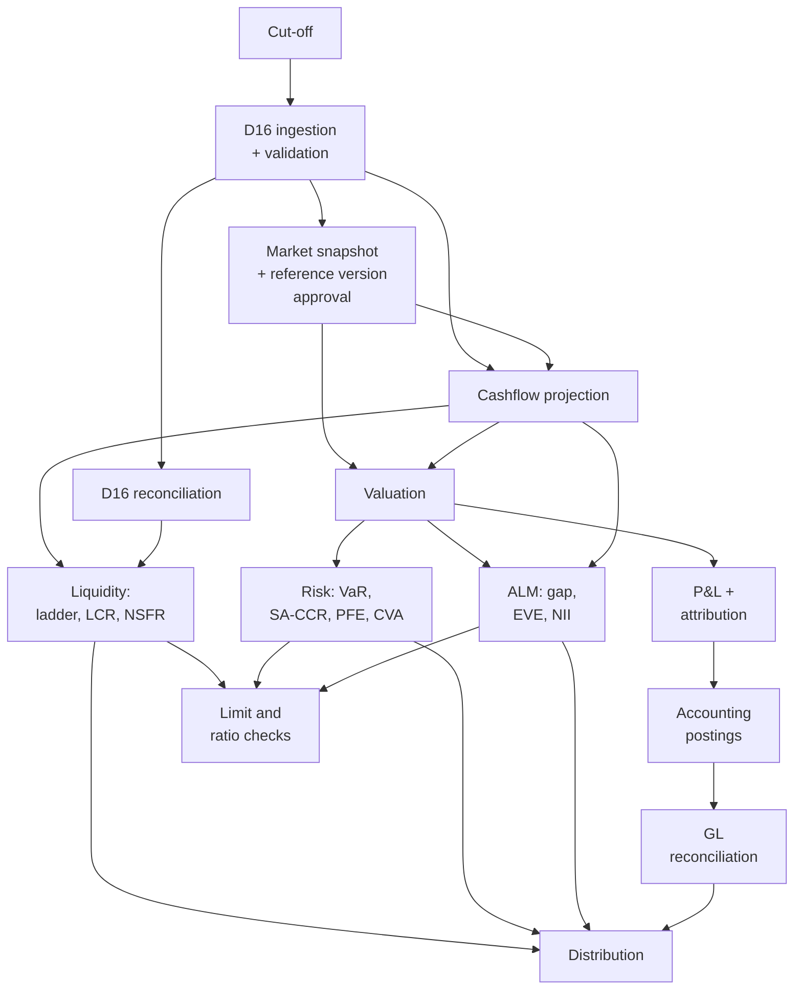

# D17 — Batch Orchestration & Operational Control

Runs the EOD pipeline, enforces the gates, and decides what a failure blocks. Parent:
`treasury-alm-risk-platform`. Phase 0. **Added in revision 2 (critique C10).**

**Why it exists as a domain.** The blueprint called *"every stage is gated"* a non-negotiable and
specified nothing to implement it. Gating is not a property that emerges from modules being careful; it
needs a scheduler, a dependency graph, a gate state machine, re-run semantics, and something that
carries the consequence of a failed gate all the way to the artifact a human reads.

**The organising idea:** a number that has not passed its gates must be *visibly* provisional wherever
it ends up — including in a PDF someone emailed at 6am.

## 1. Responsibilities

**D17 owns:** the pipeline dependency graph; scheduling and cut-off management; gate evaluation and
enforcement; the provisional flag and its propagation; re-run and partial-re-run semantics; calendar
awareness including regulatory reporting dates; run history and SLA monitoring; and the operational
audit of manual interventions.

**D17 does not own:** what any stage computes; whether data is good (D16 detects, D17 decides what the
detection blocks); business approval of results (ALCO, finance, risk); model or rule content.

## 2. The pipeline is a DAG, not a sequence

**Correction to the parent blueprint's presentation.** Parent §3 draws EOD as a linear chain:

```
cut-off → ingestion → snapshot approval → projection → valuation → P&L
→ risk → ALM & liquidity → limits → postings → GL reconciliation → distribution
```

That is a readable summary and a misleading implementation spec. **The real dependency structure is a
directed acyclic graph**, and treating it as linear causes a specific, avoidable failure: an accounting
posting problem blocks the liquidity report, which does not depend on it.



**What the DAG buys you.** Liquidity depends on projection and reconciliation, not on valuation — so
LCR can complete and publish while a pricing library problem holds up risk. Accounting depends on P&L,
so a posting failure blocks GL reconciliation and the accounting outputs, and nothing else. Independent
branches run in parallel and fail independently.

**The rule:** a stage blocks only its **descendants**, never the whole run. Revision 1's linear framing
would have blocked everything downstream of any failure, which in practice leads to operations
overriding gates routinely — and a gate that is routinely overridden is not a control.

## 3. Gates

A gate sits on an edge and evaluates before the downstream stage starts.

| Gate type | Checks | Source |
|---|---|---|
| Arrival | Expected feeds present, counts and control totals match | D16 |
| Validation | Quarantine volume within tolerance | D16 |
| Reconciliation | Unresolved break materiality within tolerance | D16 |
| Approval | Market snapshot and reference data version approved by a named role | D3, D1 |
| Completion | Upstream stage finished, expected record counts produced | D17 |
| Plausibility | Output moved within tolerance versus prior day | Stage-specific |
| **Model validity** | **No stage input depends on a model that is unvalidated or overdue for revalidation** | **D15** |

**The model validity gate is a `Warn`, and the choice is deliberate — `D15-12`.** Adding the row is the
easy half; deciding its outcome class is the finding. Both extremes are wrong in an obvious way:

| Outcome | Consequence |
|---|---|
| `Fail` | An overdue revalidation **stops the bank reporting**. A governance lapse becomes an operational outage, and the pressure to override is then irresistible — which converts the control into a rubber stamp on its first use |
| Silent pass | The control has no teeth. An unvalidated model produces a number indistinguishable from a validated one, which is the entire failure mode D15 exists to prevent |

**`Warn` is the answer neither extreme offers, and the machinery already exists**: outputs compute and
are marked provisional, so the number is available to whoever needs it and carries the fact that it
rests on an unvalidated model wherever it travels (§4). The overdue model then shows up in the daily
provisional report rather than in an incident, which is the right forum for it
(`d15-model-governance` §9). **Recorded here as a decision rather than a default**, because the default
in most implementations is to omit the gate entirely and the omission is invisible.

**Three outcomes, not two:**

- **Pass** — descendants proceed normally
- **Warn** — descendants proceed, output flagged provisional
- **Fail** — descendants blocked

**The plausibility gate deserves emphasis.** A stage can complete successfully and produce a wrong
answer. A day-on-day movement check on key outputs — LCR, EVE, total assets, P&L — catches the class of
failure that completion checks structurally cannot.

### 3.1 Overrides

**A gate that can be overridden without trace is not a gate.** An override requires: four-eyes
authorisation by a role permitted to override that gate type, a reason code, a free-text justification,
and **automatic propagation of the provisional flag to everything downstream**. Overrides are reported
daily and reviewed periodically — a gate overridden repeatedly is either mis-calibrated or masking a
chronic problem, and both need surfacing.

No override may clear a *reconciliation* gate silently: the parent blueprint makes reconciliation status
a hard gate, so an override there marks every dependent output provisional without exception.

## 4. The provisional flag

The mechanism that makes gating meaningful rather than decorative.

**Propagation is transitive.** A provisional stage marks every descendant provisional, transitively
through the DAG, regardless of whether those stages passed their own gates.

**It must travel on the artifact, not the dashboard.** This is the part most implementations get wrong.
A status page saying "today's run is provisional" does nothing once someone has emailed a PDF or
exported a spreadsheet. The flag must be rendered **on the report, on the export, in the API response,
and in the file name** — visible in whatever form the number finally reaches a human, including forms
outside the platform.

**Clearing.** The flag clears only by resolving the originating gate and re-running the affected
subgraph (§5). It is never cleared by hand, and a re-run that clears it produces a new version of the
output rather than overwriting the provisional one — the provisional figure and its replacement both
remain, because someone may have acted on the first.

## 5. Re-run semantics

Three granularities:

| Type | Scope | Use |
|---|---|---|
| **Full re-run** | Entire DAG from cut-off | Data corrected at source; rare |
| **Partial re-run** | A stage and its descendants | The normal case — a gate failure resolved |
| **Targeted reprocessing** | Specific contracts or entities through the affected subgraph | A single quarantined record corrected |

**Two hard requirements:**

1. **Idempotency.** Re-running a stage with unchanged inputs produces an identical result. This depends
   directly on D2 §7.4's determinism work and is the operational reason that work matters — without it,
   a re-run silently produces a different answer and nobody can tell whether the difference came from
   the correction or from the engine.
2. **Version, never overwrite.** Each run produces a versioned output. The original and the re-run both
   persist, with the reason for the re-run recorded. Anyone who consumed the original can see what
   replaced it and why.

**Run history is a first-class record**: every run, every stage outcome, every gate evaluation, every
override, every re-run and its cause. This is the operational half of the audit trail and D15 consumes
it.

## 6. Calendars, cut-offs and the window

**Calendar awareness.** The pipeline is not identical every day. D17 must know: business days per
relevant financial centre; month-end, quarter-end and year-end variants with additional stages;
**regulatory reporting dates, which trigger the full-detail freeze in D2 §7.2**; and periodic stages —
ECL interface, hedge assessment, behavioural recalibration, FTP publication — that run on their own
cadence within the same framework.

Owning the regulatory reporting date calendar is a specific and easily-missed responsibility: the
freeze that removes regeneration from the critical path only happens if something knows which dates
matter.

**Cut-off management.** Cut-off defines the boundary between today's business and tomorrow's, per source
and per book. It is a controlled parameter, and moving it is an audited event — a late cut-off to
capture a large trade is legitimate, and doing it silently is not.

**The window and degradation order.** EOD must complete with re-run headroom (parent §5). When it
overruns, something must give, and the priority must be decided in advance rather than at 3am. A
documented degradation order — which outputs are essential for the next business day's opening, which
can be published late, which can be skipped and back-filled — is an operational requirement, and it is
a business decision that ALCO and finance should make rather than operations improvising.

## 7. Interfaces

**Inbound.** D16 — feed arrival, validation, reconciliation and data-good state per domain. Every
compute domain — stage completion, record counts, output plausibility metrics. D1 — calendars and the
regulatory reporting date schedule. D3 and D1 — snapshot and reference version approval status.

**Outbound.** Stage triggers to every domain. Provisional flags to every output-producing domain, for
rendering on artifacts. Run history and override records to D15. Operational alerting and SLA status to
operations.

## 8. Acceptance criteria

1. The pipeline is modelled as a DAG; a failed stage blocks only its descendants
2. Independent branches run in parallel and fail independently — a valuation failure does not block
   liquidity reporting
3. Every gate has a defined type, threshold, and pass/warn/fail semantics
4. A plausibility gate exists on key outputs and catches a completed-but-wrong stage
5. Overrides require four-eyes, a reason code and justification; they propagate provisional status and
   are reported daily
6. **The provisional flag renders on the report, the export, the API response and the file name** — not
   only on a status page
7. The flag clears only by resolving the gate and re-running; never by hand
8. Re-runs are idempotent, and every run produces a versioned output rather than an overwrite
9. Run history captures every stage outcome, gate evaluation, override and re-run cause
10. The regulatory reporting date calendar is held and triggers the D2 §7.2 full-detail freeze
11. A documented degradation order exists for window overruns, approved by the business

## 9. Open questions

1. **The EOD window.** What is it, in wall-clock terms — when does data stop arriving and when must
   outputs be available? Everything about sizing and degradation depends on this and it is not yet
   stated anywhere.
2. **Degradation order.** Which outputs are essential for next-day opening? A business decision needing
   ALCO and finance input.
3. **Override authority.** Which roles may override which gate types? Reconciliation gates should
   plausibly sit higher than plausibility gates.
4. **Provisional rendering in downstream tools.** If reports are consumed through a BI tool or exported
   to spreadsheets, how does the flag survive that boundary? This may constrain reporting tool choice.
5. **Re-run frequency expectations.** Designing for a rare re-run and designing for a nightly one are
   different problems; the answer depends on upstream feed reliability, which is currently unknown.

## Appendix — amendments applied from sibling modules

| Ref | Applied | Section |
|---|---|---|
| `D15-12` | **Model validity added as a seventh gate type, with `Warn` as its outcome class** — not `Fail`, which would let a governance lapse stop the bank reporting, and not omission, which leaves the control toothless | §3 |

Raised by `d15-model-governance` and recorded as deferred-with-trigger in the parent's D15 appendix;
applied here under *"D17 is next amended"*. The ref keeps its originating module's namespace
(`blueprint-amendment-protocol` R1) and allocates no `D17-n`.

**Note what this costs D17: nothing.** The gate reuses §3's existing outcome classes and §4's existing
propagation. The finding was never that the mechanism was missing — it is that nobody had said which
outcome a model failure produces, and an undecided outcome defaults to the gate not existing.
