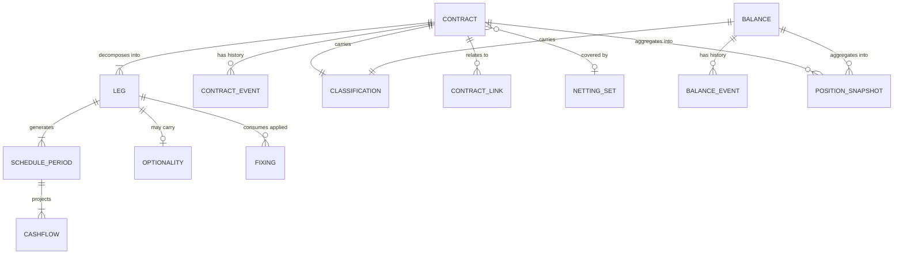

# D2 — Instrument & Position Core

The system of record for every treasury and balance sheet position, and the engine that projects them
into cashflows. Parent: `treasury-alm-risk-platform`.

**Revision 2.** Remediated against `architecture-critique` and `part2-taxonomy-mapping`. Section
anchors from revision 1 are preserved so existing cross-references remain valid. Changes summarised in
§11.

**Why this module first.** Almost every number the platform produces is an aggregation of D2's output.
A defect here is a defect in every report simultaneously. Equally, if the model is right, adding an
instrument is configuration rather than a project.

## 1. Responsibilities

**D2 owns:** the canonical Contract and Balance store; contract lifecycle state and event history;
schedule and cashflow projection on both bases; classification across the fourteen dimensions;
position derivation; and the as-of/bitemporal query surface.

**D2 does not own:** deal capture and pre-deal controls (D4); market data (D3); valuation (D8);
behavioural model definition and calibration (D9, governed by D15); accounting postings (D7);
encumbrance state (D6); ECL computation (external, interfaced in §6.3); feed adaptation and
reconciliation (D16); batch orchestration (D17).

D2 is a **deterministic projection engine**: it applies models and rules that other modules author.
That keeps opinions out of the system of record.

## 2. Entity model



### 2.1 Contract

Common attributes — identity (internal ID, external references, ISIN, UTI, core banking account),
parties (legal entity, book, portfolio, trader, counterparty, guarantor), dates, economics (direction,
notional, currency, inception rate/price), product code, status, and a typed terms payload.

**Design rule: common attributes plus classification are the query surface; the terms payload is**
**detail.** Nothing outside D2, D8 and the accounting-characteristics view (§6.2) reads the payload. The
payload is schema-validated on write against the product family definition in D1 and is never
free-form.

### 2.2 Leg

One currency, one payment convention, one rate treatment. Fields: identity and leg role; economics
(notional — possibly a schedule, currency, direction); rate treatment; conventions (day count,
business day convention, frequency, calendars, payment lag, stub handling); amortisation; principal
exchange flags.

#### Rate treatments — five, not two

| Treatment | Definition | Instruments |
| --- | --- | --- |
| **Fixed** | Stated rate | Money market, fixed bonds, IRS fixed leg |
| **Floating (index)** | Index + spread × multiplier, with reset conventions, compounding/averaging, embedded caps/floors | FRNs, IRS, basis swaps, OIS |
| **Return** | Price appreciation plus distributions on a reference asset | **Total return swaps** (Part 1 §5, §6), **equity swaps** (§7) |
| **Quantity** | Quantity × price rather than notional × rate. **Relaxes the one-currency-per-Leg rule** | **Commodity swaps and futures** (§7), **short securities positions** (Part 2 B.4) |
| **Externally projected** | Cashflows supplied by an external pool or waterfall model | **ABS/MBS**, **index CDS**, **synthetic securitisation** |

Return and quantity treatments were absent from revision 1, which claimed the Leg model was universal.
It was not: a total-return leg is neither fixed nor floating-index, and a commodity leg has no single
currency.

**Externally projected cashflows are stored, not regenerated** — the one documented exception to §7's
regeneration strategy. ABS/MBS cashflows derive from pool factor, CPR/CDR and a tranche waterfall; the
bank does not hold the underlying loans, so contract-level projection cannot apply. Index CDS behaves
the same way via a stepping factor over a reference pool. The externally supplied projection is
versioned and retained like any other stored input.

**Futures generate no contractual cashflows at all** — only variation margin. They contribute
`exposure_by_bucket` (parent §2.4) without cashflow.

#### Worked decompositions

| Instrument | Legs |
| --- | --- |
| Interbank placement | 1 fixed bullet leg |
| Vanilla IRS | 2 legs, fixed + floating, no principal exchange |
| Basis swap | 2 floating legs, different index tenors |
| OIS | 2 legs, floating compounded overnight |
| FX spot / forward outright | 2 legs, different currencies, single exchange |
| **FX swap** | **Two linked Contracts (near and far), not one.** A single Contract cannot carry two maturity dates, which breaks classification dimension 1 |
| Cross-currency swap | 2 legs, different currencies, initial and final exchange |
| NDF | 2 notional legs; **settlement is a single net cashflow in the settlement currency**, the non-deliverable leg being notional-only |
| Repo / reverse repo | Cash leg + collateral leg — see §2.9 for recognition rules |
| **Collateral swap** | **Collateral leg on both sides, no cash leg.** The "repo = cash + collateral" framing does not apply |
| Bond holding | 1 leg. FRN = floating. Inflation-linked = floating with index-linked notional schedule |
| **ABS/MBS** | 1 externally-projected leg |
| Callable bond / CoCo | 1 leg + Optionality (call schedule, trigger) |
| **Exotic FX option (barrier, digital)** | 1 leg + Optionality carrying barrier/trigger levels; premium as a separate leg. **In scope** — priced by D8's bought library |
| Cap / floor / swaption | 1–2 legs + Optionality; premium leg |
| TRS / equity swap | 1 return leg + 1 funding leg |
| Commodity swap / future | 1–2 quantity legs |
| Residential mortgage | 1 amortising leg, model-driven prepayment |
| Non-maturity deposit | 1 leg, no maturity, behavioural profile |
| Undrawn commitment | 1 contingent leg + drawdown model |
| LC / guarantee | 1 contingent leg + fee leg |
| **Bankers' acceptance** | Two-sided gross structure. **No Part 2 home exists** — the taxonomy needs extending; see §10 |

### 2.3 Optionality

Option type, style, exercise schedule, strike or trigger and its reference, exercise party, settlement
type. D2 **projects cashflows on a stated exercise assumption and records which assumption was used.**
It does not decide exercise; the assumption is an input (contractual, model-driven, or scenario-driven).

### 2.4 Classification — fourteen dimensions in two groups

**Risk and behaviour** (eight): contractual maturity bucket; behavioural maturity; repricing basis and
index; currency; product/GL mapping; counterparty type; accounting classification; regulatory
classification.

**Presentation and accounting** (six, new in revision 2): book intent (trading vs banking); hedge
designation; primary risk type; ECL stage; held-for-sale; capital instrument classification.

| Dimension | Derived from | Rule author |
| --- | --- | --- |
| Contractual maturity bucket | Maturity vs reporting date | D2 |
| Behavioural maturity | Behavioural model output | D9 model, D2 executes |
| Repricing basis + index | Leg rate treatment and next reset | D2 |
| Currency | Per-leg and per-cashflow | D2 |
| Product / GL mapping | Product code → GL map | D1 |
| Counterparty type | Counterparty static | D1 |
| Accounting classification | Business model + SPPI | D7 |
| Regulatory classification | Issuer, instrument, rating, counterparty, **encumbrance** | D13 |
| **Book intent** | Trading vs banking book assignment | D7 / governed policy — also the IRRBB scope boundary |
| **Hedge designation** | Designation event | D7. **Must be a queryable dimension, not only a CONTRACT_LINK** — taxonomy lines A.8 and B.8 require designated derivatives separable by query |
| **Primary risk type** | FX / IR / credit / equity / commodity | D11. **Not derivable from product code** — a cross-currency swap is both FX and IR, so an explicit designation rule is required |
| **ECL stage** | 1 / 2 / 3 | External ECL engine via §6.3 |
| **Held for sale** | Management decision | D7 |
| **Capital instrument classification** | Accounting and regulatory capital treatment | D13. **Routes the line item itself** — decides whether AT1 presents in B.7 or C.5 |

**Revised hard rules:**

1. **No Contract or Balance is stored without a complete classification — but "not applicable" is a**
** permitted value** where a dimension is meaningless. Equity holdings have no maturity and no
 repricing basis; PP&E and goodwill have neither plus no counterparty. Revision 1's absolute rule
 would have blocked booking half the balance sheet.
2. **Classification is rules-derived, versioned and effective-dated.** A regulatory change is one rule
 change with an effective date; historic reports reproduce under the rules that applied. Override is
 four-eyes, reason-coded, audited and reported.

**Classification is not purely a function of an object's own attributes.** Regulatory classification
depends on encumbrance, owned by D6, so it must recompute on collateral state change — not only at
booking.

**The classification rules engine lives in Phase 0**, with D7 and D13 authoring rules into it on their
own timelines (parent §6). Revision 1 made classification a Phase 0 gate while placing its rule owners
in Phases 4 and 6.

### 2.5 Contract links

`CONTRACT_LINK` binds contracts without merging them. Types: **package** (FX swap near/far, bond plus
asset swap, structured product host plus embedded derivative); **hedge relationship** (see the caveat
below); **internal pair** (FTP mirrors and internal hedges, which must eliminate on consolidation and
must never both appear in an external report); **novation/restructure chain**; **participation**.

**Caveat on hedge relationships.** A hedged item is routinely *not* a Contract — it may be a layer of a
portfolio, a forecast transaction, or a risk component. A CONTRACT_LINK cannot express those, so hedge
designation needs its own object in D7 with D2 carrying the queryable designation dimension (§2.4).

### 2.6 Structured products — tiered treatment

Tier selected by rule at product-approval time**.**

| Tier | Criterion | Booking structure | Build status |
| --- | --- | --- | --- |
| **1** | Embedded feature is an exercise right or trigger on the host's own terms | Single Contract: host leg + Optionality | **Build** |
| **2** | Accounting separation required, **or** the embedded derivative carries a risk type distinct from the host | Linked Contracts joined by a `package` link | **Build** |
| **3** | Path-dependent or multi-underlying payoff not priceable from the terms payload | Replicating portfolio; bespoke booking with product-approval sign-off | **Specify only** |

Tier 1 covers callables, puttables, CoCos and capped/floored FRNs. **Barrier and digital FX options are**
**Tier 1, not Tier 3** — a single Contract plus an Optionality descriptor carrying the barrier level,
priced by D8's bought library. Revision 1 contradicted itself by treating them as both in scope and
not held; they are in the source universe (Part 1 §4) and in scope.

#### The two Tier 2 triggers are independent

IFRS 9 abolished bifurcation for **financial assets** (a hybrid with a financial asset host is
classified in its entirety via SPPI, IFRS 9 4.3.2) but **retained it for financial liabilities** and
non-financial hosts (4.3.3).

| Instrument | Side | Accounting | Why Tier 2 |
| --- | --- | --- | --- |
| Credit-linked note held | Asset | Fails SPPI → whole instrument at FVTPL, **no bifurcation** | **Risk visibility** — D11 needs the embedded credit exposure as a first-class object with reference entity, notional and seniority |
| Synthetic securitisation | Asset / off-BS | Structure-dependent | **Risk visibility and capital** — significant-risk-transfer assessment in D13 |
| Structured deposit issued | Liability | **Bifurcation if the embedded derivative is not closely related** | **Accounting separation** — where the test is met |
| Equity/index-linked issuance | Liability | Same test | **Accounting separation**, plus hedge accounting complexity |

**Correction to revision 1: the liability trigger over-tiered.** Bifurcation applies only where the
embedded derivative is **not closely related**, meets the derivative definition standalone, and the
host is not already at FVTPL. **An unleveraged interest rate cap or floor embedded in a deposit that is**
**at- or out-of-the-money at issuance is closely related and is not separated** (IFRS 9 B4.3.8(b)). Part
1 §8 describes "structured deposits, index/**rate**-linked" — so the rate-linked portion of that
population is probably Tier 1, not Tier 2.

**Restated criterion:** Tier 2 applies if *(accounting separation is required — not closely related AND*
*standalone-derivative AND host not FVTPL)* **OR** *(the embedded derivative carries a risk type the*
*host does not)*.

**The fair value option is not a free escape.** Designating the whole instrument at FVTPL avoids
bifurcation, but **own-credit fair value change is presented in OCI** (IFRS 9 5.7.7), creating a
reserve line and a CET1 filter. That is a D7 and D13 consequence, not a simplification.

**Other consequences.** The `package` link is build-now. The embedded derivative Contract carries a
`derived-from` marker so it never generates independent settlement instructions in D5. Where accounting
does not bifurcate but the platform books linked contracts (held CLNs), **D7 must reconstitute**
**single-instrument FVTPL treatment from the linked pair** — explicit in D7's interface, not implicit.

### 2.7 Balance — the sixth primitive

**New in revision 2.** `part2-taxonomy-mapping` found that only 20 of the source taxonomy's 40 balance
sheet lines can be Contracts. A Balance carries a **carrying amount, currency and the fourteen**
**dimensions** — and nothing else. No legs, no schedules, no cashflows, no projection.

| Holds | Taxonomy lines |
| --- | --- |
| Cash, mandatory reserves, excess reserves | A.1 |
| Nostro and vostro balances | A.2, B.2 |
| Equity holdings — trading and FVOCI/strategic | A.3, A.4 |
| Associates, JVs, subsidiaries | A.9 |
| PP&E, investment property, right-of-use assets | A.10–A.12 |
| Goodwill and intangibles, deferred tax | A.13, A.14, B.11 |
| Prepayments, repossessed collateral, in-transit clearing | A.15, B.13 |
| Held-for-sale groups | A.16, B.14 |
| Provisions (non-ECL), current tax, payables, deferred income | B.9, B.10, B.13 |
| All equity lines | C.1–C.3, C.6, and general/statutory reserves in C.4 |
| Contingent liabilities (disclosure) | D.4 |

**Balances have events too.** `BALANCE_EVENT` mirrors the Contract event model — same append-only,
bitemporal, cancel-and-correct discipline (§3).

**Mandatory reserve balances are encumbered by definition and generally HQLA-ineligible**, so
encumbrance is a Balance attribute as well as a Contract one. Revision 1 gave encumbrance only to
securities.

**Two special cases:**

*Derived values are never stored and never ingested.* Accrued interest (A.15, B.13) is computed by D2's
accrual engine. Three of C.4's four reserve sub-lines — FVOCI revaluation, cash flow hedge, FX
translation — are accumulations derived from D7 and D8 outputs. They have no primitive; they are
computed at reporting time. **The FVOCI revaluation reserve is the accounting expression of CSRBB**
(`d9-alm-and-irrbb` §7), so that link must be explicit in both directions.

*Equity-classified AT1 (C.5) needs both primitives at once.* Coupons are discretionary — correctly
presented in equity — yet they are real expected cashflows belonging in the liquidity ladder. **A**
**Contract may carry a presentation override** routing its carrying amount to an equity line while its
cashflows remain in the projection, tagged discretionary. This is narrow, single-purpose, and must not
be generalised.

### 2.8 Legal agreements and netting sets

**Absent from revision 1 entirely.** Master agreements — ISDA, CSA, GMRA, GMSLA — are D1 static data.
They define **netting sets**, which Contracts reference and which are first-class because:

- **SA-CCR computes exposure at default per netting set.** So does CVA
- Gross-versus-net presentation for A.3 and B.4 depends on IAS 32 offsetting enforceability
- LCR downgrade-trigger outflows are CSA rating triggers (`d10-liquidity-and-funding` §3.3)
- D6 needs threshold, minimum transfer amount, eligible collateral schedule, rehypothecation rights

**Terms are structured data, not attached PDFs.** Small to add; blocking for Phases 4–6 if omitted.

### 2.9 Securities financing recognition rules

Foundational and stated nowhere in revision 1. Getting these wrong double-counts or loses HQLA.

| Transaction | Recognition |
| --- | --- |
| Repo (securities out) | Securities are **not derecognised** — they remain your Position, flagged **encumbered**. Cash received is a Balance; the obligation is a Contract |
| Reverse repo (securities in) | Securities are **not recognised** as holdings, **but count toward HQLA if eligible and rehypothecable** |
| Securities lending | Securities lent remain on balance sheet, encumbered. **No explicit Part 2 line exists** — §10 |
| Collateral swap | Collateral legs both sides, **no cash leg**, no balance sheet line |
| Tri-party repo | Collateral is a **basket reallocated daily by the agent**, not known ISINs. The collateral leg references the basket and its eligibility schedule, not a security list |

The collateral leg carries explicit `creates_position`, `encumbers` and `rehypothecable` flags rather
than implying them from transaction type.

## 3. Lifecycle and event model

Current state is a projection of append-only event history, never a mutable record. Event types:
`BOOKED`, `AMENDED`, `DRAWN`, `REPAID`, `PARTIAL_PREPAYMENT`, `ROLLED`, `EXERCISED`, `CALLED`,
`NOVATED`, `RESTRUCTURED`, `TERMINATED`, `MATURED`, `DEFAULTED`, `CANCELLED`, `RECLASSIFIED`,
`COLLATERAL_SUBSTITUTED`.

**Scheduled fixings and scheduled payments are not events.** They are deterministic consequences of the
schedule and are regenerated, not stored. Revision 1 listed `FIXING_APPLIED` and `REPAID` as event
types while estimating 10–30 events per contract — inconsistent, since a 30-year monthly mortgage would
generate 360 of each. Only **unscheduled** occurrences — early repayment, amendment, substitution — are
events. Observed fixings that deviate from the expected source, or are manually overridden, are stored
as `FIXING` records against the Leg (§4.1).

**Cancel-and-correct, never overwrite.** A booking error is corrected by `CANCELLED` plus a new object,
or by `AMENDED` carrying before/after values.

**Bitemporality.** Every query is answerable on effective date and knowledge date independently. A
back-dated trade booked today changes yesterday's position, and the platform must produce both
"yesterday as we reported it" and "yesterday as we now understand it", and explain the difference.

## 4. Cashflow projection engine

```
project(Contract, as_of_date, basis, assumption_set, horizon,
        market_snapshot_version, reference_data_version) → Cashflow[]
```

**Revision 1's signature omitted the market snapshot and reference data version** while sourcing future
resets from forward curves and schedules from calendars — the same call on different days returned
different answers, and a retroactively corrected holiday shifted historic payment dates. Both are now
explicit parameters. Same inputs, same outputs, always.

### 4.1 Pipeline

1. **Schedule generation** — frequency, stubs, business day adjustment, calendars, payment lag, roll
 conventions. Unglamorous, and where most defects live; it needs an exhaustive convention test suite.
2. **Notional resolution** — bullet, linear, annuity, custom, model-driven, or index-linked.
3. **Rate resolution** — **three fixing states, not two.** Revision 1 said a past reset is a stored fact
 and a future reset is a market query. **Compounded-in-arrears risk-free rates create a third case:**
** the current period is partly observed**, some daily fixings existing and some not. Now standard
 across the interest rate complex, so partial observation is handled explicitly, not as an edge case.
4. **Cashflow assembly** — principal, interest, fees, premiums, exchanges, individually tagged.
5. **Contingency and optionality** — drawdown models, exercise assumptions, contingent tagging.
6. **Behavioural overlay (behavioural basis only)** — §4.3.
7. **Tagging** — inherit classification, add cashflow-level tags.

### 4.2 The Cashflow record

Contract/Leg/period reference; payment date, accrual start and end; amount and currency; type;
certainty; basis; rate treatment with next reset date and index; assumption reference; inherited
classification.

**Correction:** revision 1 said the rate treatment field "drives repricing gap". It does not, on its
own — for a swaption it produces a nonsense bucket. Repricing gap consumes `exposure_by_bucket` from
D8 alongside cashflows (parent §2.4).

### 4.3 Behavioural overlay

D9 defines, D2 executes, D15 governs.

| Behaviour | Applies to | Effect |
| --- | --- | --- |
| Non-maturity deposit profiling | Retail and corporate current, savings, call (B.3) | Core/volatile split plus modelled maturity profile |
| Prepayment | Mortgages, personal loans, callable assets | Rate-dependent CPR |
| Drawdown | Commitments, revolvers, overdrafts | Modelled utilisation |
| Early redemption | Retail term deposits | Modelled break rate |
| Rollover / stickiness | Wholesale and corporate term deposits | Extends or shortens vs contractual |
| Pipeline | Committed undrawn new business | Dynamic NII only |

**Contractual and behavioural cashflow sets coexist** — two complete projections, both queryable, both
traceable, and the difference explainable line by line.

**Model versioning** — a projection stores the model version and parameter set that produced it, so a
metric movement decomposes into balance sheet change versus recalibration.

**Liquidity stability and repricing beta are different parameters** drawn from a shared model
inventory — see `d10-liquidity-and-funding` §5.1 for the binding three-way reconciliation.

### 4.4 Granularity and performance

**Decision: contract-level storage and contract-level projection throughout. No cohorting.** Sized for
under ~500k customer accounts.

Contract-level *storage* is mandatory regardless of scale, for three reasons: **per-depositor LCR**
**run-off factors** (deposit insurance is a per-customer threshold; operational classification is a
relationship property), **concentration reporting** (top-20 depositors cannot come from pools), and
**per-contract FTP** (a rate assigned at origination and locked for life).

Contract-level *projection* was chosen for simplicity — no cohort definitions to govern and no cohort
drift to monitor.

**Two corrections to revision 1's sizing argument:**

- Revision 1 claimed contract-level projection means "no allocation logic to explain to an auditor".
**That was wrong** — NMD core/volatile splitting and prepayment CPR *are* portfolio statistics
allocated back to accounts (§4.3). The claim is withdrawn; the three storage arguments above carry
the decision on their own.
- **Contract count must include internal contracts.** §2.5 makes FTP mirrors and internal hedges real
Contracts with real cashflows, and per-contract FTP implies roughly one mirror pair per banking-book
contract. **The effective contract count is a multiple of 500k, not 500k.** Still comfortable at this
scale, but the sizing must be stated honestly.

**Performance design.** Projection parallelises by Contract. The horizon is bounded by the longest
metric requirement, not by contract maturity.

**Cache invalidation is ineffective for the floating-rate book.** Revision 1 said unchanged contracts
are not reprojected. But floating-rate contracts source future resets from the forward curve, which
moves daily — **so every floating instrument invalidates every day.** Caching helps fixed-rate and
matured-schedule contracts only, and the EOD compute budget must be sized on that basis.

**Deferred option.** Cohort-level projection for the homogeneous long tail remains available without a
data model change. Note it is **not arithmetically equivalent where the model is non-linear** — a
rate-dependent prepayment S-curve over a heterogeneous cohort does not average — so it would trade
accuracy for throughput, not merely restructure the computation.

## 5. Position derivation

A Position is always derived, aggregating **Contracts and Balances** over any slice of the fourteen
dimensions plus book, portfolio, counterparty and legal entity. Materialised as dated EOD snapshots for
reporting and reconciliation; computed on demand for intraday and ad-hoc use. Both come from the same
derivation logic.

### 5.1 Freshness

**Near-real-time D2 with an EOD authoritative cut and per-source freshness stamping.**

**The banking book is batch-fed and therefore always as-of last night.** Full-balance-sheet real-time is
unachievable, and presenting a position as though it were produces a number that looks live and is not.

Treasury Contract events stream in within seconds, so positions, limit consumption and cash are current
for the treasury book. The EOD gated pipeline (orchestrated by D17) produces the authoritative,
reconciled snapshot every report consumes. **Every position response carries a freshness stamp per**
**source** — "treasury book as of 14:32:07, banking book as of last night's 23:00 cut", never a single
undifferentiated as-of.

*Rejected alternative:* batch-only D2 with a separate real-time blotter in D4 — two position views that
can diverge, and a permanent reconciliation tax.

**Dependency note.** This decision is partly justified by pre-deal limit checks, which live in D4 and
consume the limit framework. Both land in **Phase 4**, so D2's near-real-time capability is built in
Phase 0 and fully exploited in Phase 4. That is deliberate, not an oversight (parent §6).

**Intraday liquidity monitoring is deferred** past Phase 1 — it needs payment and nostro event streams
from Phase 4. Parent §3 describes intraday *position keeping*, which is in Phase 0; the two are
different capabilities and revision 1 blurred them.

## 6. Interfaces

### 6.1 Inbound

| Source | Content | Mode |
| --- | --- | --- |
| D4 | Treasury bookings and lifecycle events | Real-time |
| **D6** | **Contract origination for central bank facility drawings** (Part 2 B.1) — created from collateral pool state, inverting D4 → D2 | Event-driven |
| D6 | Encumbrance state and collateral allocations — **triggers classification recompute** | Event-driven |
| D16 | Core banking loans, deposits, overdrafts, cards, commitments; custodian holdings; nostro balances — **adapted, quality-checked and reconciled before reaching D2** | Batch / event |
| D3 | Fixings for application; forward curves for projection | Snapshot-referenced |
| D9 / D15 | Behavioural model definitions and parameter sets | Versioned, approved |
| D14 | Scenario definitions | Versioned, approved |
| D7 / D13 | Classification rule sets — accounting and regulatory | Versioned, effective-dated |
| External ECL engine | Allowance and stage — §6.3 | Periodic |

**Accrual ownership at the ingestion boundary.** Core banking carries accrued interest and will supply
it. **D2 computes accrual; core banking's figure is a reconciliation control, not an input.** Ingesting
both double-counts taxonomy lines A.15 and B.13 and produces a GL break whose cause is architectural
rather than operational.

### 6.2 Outbound — the published contract

| Consumer | What D2 provides |
| --- | --- |
| D8 | Terms, legs, schedules, projected cashflows |
| D9 | Cashflows on both bases, repricing attributes, index granularity, classification |
| D10 | Cashflow ladder, c**lassified balances** (LCR is balance × factor), contingent flows, HQLA classification, encumbrance-adjusted |
| D11 | Positions, notional, counterparty attributes, **netting set membership** |
| D7 | Contract and Balance events, accruals, amortisation schedules, **and the accounting-characteristics view below** |
| D12 | Contracts with tenor, repricing and behavioural profile |
| D13 | Positions and Balances with regulatory classification |
| D5 | Due cashflows and settlement attributes |

**The accounting-characteristics view (C7).** Revision 1 forbade anything outside D2 and D8 from
reading the terms payload, then required D7 to perform SPPI, closely-related and effective-interest
assessments — all of which are legal-terms analyses. Rather than widen the rule, **D2 publishes a**
**derived accounting-characteristics view**: payoff linearity, leverage, contingency features, embedded
feature inventory, and fee/discount/premium components for effective interest. This gives D7 what it
needs while preserving the instrument-agnostic property of the published contract.

### 6.3 The ECL interface

The boundary — the platform consumes ECL and does not compute it — stands. The hole is closed.

| Direction | Content | Why |
| --- | --- | --- |
| Inbound | Allowance by contract, **with its measurement category** | A.6 and B.9 are acceptance-criterion lines. **The allowance's effect on carrying amount depends on the category — see §6.3.1** |
| Inbound | Stage 1/2/3 assignment | Dimension 12. **Stage 3 interest is calculated on the net carrying amount**, so D2's accrual output — published to D7 — is a function of the allowance |
| Outbound | Exposure at default for off-balance-sheet items | Derived from D2's drawdown model (D.1–D.3) |
| Outbound | Contractual and behavioural cashflows | ECL models discount expected shortfalls over expected life |

The inbound Stage 3 dependency means **ECL is not a downstream consumer only** — it sits inside D2's
accrual computation, and the EOD sequence must reflect that ordering.

#### 6.3.1 The allowance does not always reduce the carrying amount

**Correction.** Revision 2 stated *"amortised cost carrying amount = gross − allowance"* without
qualification. That is correct for amortised cost and **wrong if generalised**, which is how it read.
Raised by `d7-accounting-and-subledger` §2.2.

| Measurement category | Effect of the ECL allowance on carrying amount |
|---|---|
| **Amortised cost** | **Reduces it.** Carrying amount = gross carrying amount − allowance |
| **FVOCI — debt** | **Does not reduce it.** Carrying amount remains fair value; the loss is recognised in P&L with the corresponding entry in the FVOCI reserve |
| **FVOCI — equity** | Not applicable — **no impairment model applies** |
| **FVTPL** | Not applicable — credit risk is already in fair value |
| **Off-balance-sheet** (D.1–D.3 commitments, guarantees, LCs) | No asset to reduce — the allowance is a **provision liability** presented in B.9 |

**Three consequences for D2:**

1. **The ECL interface must carry the measurement category per contract**, not the allowance alone. An
   allowance without its category cannot be presented correctly
2. **Balance derivation branches on category.** D2's Position and Balance computation applies the
   allowance to carrying amount only for amortised cost; for FVOCI debt it holds the allowance as a
   separate attribute feeding D7's reserve movement and the disclosure, without touching the balance
   sheet carrying amount
3. **Off-balance-sheet ECL routes to a different taxonomy line entirely** — B.9 provisions, not a
   contra-asset — so the allowance's presentation destination is determined by the exposure's own
   nature, not by a single rule

**Why this matters beyond presentation.** Applying the allowance to an FVOCI debt carrying amount
double-counts credit risk: fair value already reflects it, and subtracting the allowance as well
understates the asset. The error is invisible in aggregate — it looks like conservatism — and surfaces
in the FVOCI reserve failing to reconcile against D7 and D9's CSRBB measure
(`d9-alm-and-irrbb` §7).

## 7. Retention and reproducibility

**Store inputs and as-reported outputs permanently; regenerate projections on demand. Retention =**
**contract lifetime + N years after closure (default N = 7, configurable).**

### 7.1 Stored — cannot be derived

| Data | Volume at ~500k accounts | Retention |
| --- | --- | --- |
| Contract and Balance events (append-only, **unscheduled only** — §3) | Low millions | Permanent, online |
| Market data snapshots, versioned | One approved EOD snapshot per day plus intraday | EOD permanent; intraday tiered |
| **Reference data versions** — calendars, conventions, product catalogue, GL map, counterparty static, index definitions | Small | Permanent**.** Omitted from revision 1; a corrected calendar silently shifts historic payment dates |
| Model parameter sets, scenario definitions, classification rule versions | Negligible | Permanent |
| **Externally-projected cashflows** (§2.2) | Moderate | Permanent — cannot be regenerated |
| **Per-contract projection digests** (§7.4) | Small | Permanent |
| **Retained engine builds** | Small | Permanent |
| As-reported figures | Small | Permanent, immutable |

**As-reported is not the same as reproducible.** Reproduction proves the number can be reached again;
the as-reported record proves what was submitted or stated on a date. Investigations need both.

### 7.2 Regenerated

Cashflow projections and contract-level position detail: current EOD plus a rolling hot window
(30–90 days), regenerated on demand beyond it. Aggregated positions retained online indefinitely.

**Exception: regulatory reporting dates are frozen in full detail** — roughly 4–20 dates a year at
~100m rows. Affordable, and it removes regeneration from the critical path for exactly the dates a
regulator will ask about.

### 7.3 Lifetime-based retention

Retention runs from contract closure. **Shared inputs cannot be purged per-contract:**

```
shared input retention = max(contract lifetime) + N
```

For a book holding 30-year mortgages or perpetuals that is effectively permanent, and since these
inputs are small the blueprint specifies permanent retention. Only contract-scoped data is subject to
lifetime-plus-N purging. Perpetual and undated instruments start their clock at actual termination.

### 7.4 Determinism — asserted, not assumed

Revision 1 relied on projection being perfectly deterministic across code versions, mitigated by a
periodic aggregate-level test owned by D15 in Phase 7. **Three problems: bit-exact floating-point**
**equality across a decade of migrations is not a safe assumption; summation order changes whenever**
**parallel partitioning changes; and an aggregate comparison passes on compensating errors.** The
mitigation also arrived after years of projections had been discarded, with no remediation path.

Replaced by four measures:

1. **Per-contract digest stored every EOD** — negligible volume, and it converts a silently
 undetectable failure into one detected the next day at contract granularity
2. **Full detail frozen for regulatory reporting dates** (§7.2) — removes regeneration from the
 critical path where it matters most
3. **Engine builds retained as versioned artefacts** — historic regeneration runs on the code that
 produced the original
4. **The regeneration test moves to Phase 1**, comparing regenerated output against stored digests and
 as-reported figures. Divergence is an incident

## 8. Acceptance criteria

**Three tests, not two.** Revision 1 tested Part 1 and Part 2 independently and never tested the
mapping between them — which is why bankers' acceptances, equity holdings, collateral swaps and
physical commodities went unnoticed.

1. **Every Part 1 instrument class books, projects and prices** — validated against §2.2's worked
 decompositions, including NDF net settlement, FX swap as two linked Contracts, repo recognition
 rules, collateral swaps with no cash leg, tri-party baskets, callable CoCos, inflation-linked
 notionals, TRS return legs, commodity quantity legs, futures with no cashflows, and
 externally-projected ABS/MBS
2. **Every Part 2 line generates as a query over Positions and Balances** with no bespoke rule
3. **Every Part 1 class maps to a named Part 2 line, or is explicitly recorded as an intentional**
** non-appearance with a reason** (internal ALM contracts eliminate; nine classes currently have no
 home — §10)
4. Contractual and behavioural projections coexist, with their difference explainable per contract
5. Any historic position, balance or cashflow set reproduces exactly on both temporal axes, under the
 models, rules, reference data and classifications in force at the time — verified by the Phase 1
 regeneration test against per-contract digests
6. Schedule generation passes an exhaustive convention test suite, including **partial-observation**
** compounded RFR periods**
7. No Contract or Balance exists without complete classification; "not applicable" is used only where
 the dimension is genuinely meaningless; overrides are four-eyes and reported
8. Projection over the full balance sheet completes within the EOD window with re-run headroom, sized
 on the assumption that **the floating-rate book invalidates its cache daily** and that internal
 contracts multiply the contract count
9. **Balance derivation branches on measurement category for ECL** — the allowance reduces carrying
 amount for amortised cost only, is held separately for FVOCI debt without touching fair value, is
 not applied to FVOCI equity or FVTPL, and routes to a B.9 provision for off-balance-sheet exposures
 (§6.3.1). Verified by reconciling the FVOCI reserve against D7 and D9's CSRBB measure

## 9. Resolved decisions

| # | Question | Decision |
| --- | --- | --- |
| 1 | Ingestion granularity | **Contract-level storage and **projection, no cohorting. Two supporting arguments corrected in §4.4 |
| 2 | Retention and volume | **Store inputs and as-reported**, regenerate projections; lifetime + 7 years; shared inputs permanent. Strengthened by §7.4 |
| 3 | Structured note boundary | **Tiered rule**, Tiers 1 and 2 built. **Liability trigger corrected** for the closely-related test (§2.6) |
| 4 | Intraday freshness | Near-real-time with EOD authoritative cut and per-source freshness stamping (§5.1) |
| 5 | Multi-entity | Carry the entity field, build no machinery — **provisional, and now contradicted by four signals** (§10) |

## 10. Open items

**Multi-entity — provisional, four contradicting signals.** The bank is treated as single-entity, with
`legal_entity` carried as a mandatory attribute and no elimination, consolidation or solo-vs-
consolidated reporting built. The cost asymmetry justifies carrying the field: one column now versus an
unbackfillable migration later. But **four independent signals in the source taxonomy suggest a group**
**structure** — A.9 (associates and subsidiaries), C.6 (non-controlling interests), B.6 (own
securitisation notes on balance sheet, implying a consolidated SPV) and **C.4 (foreign currency**
**translation reserve, implying a foreign operation)**. Signal 4 also contradicts D7's net investment
hedge capability, which requires a foreign operation to hedge. Confirm all four together before D13 is
specified.

**Taxonomy extensions required — the bank's accounting policy call, not a design decision.** Nine Part 1
classes have no Part 2 home: bankers' acceptances, collateral swaps, securities lending, physical
commodities, futures margin, committed liquidity facilities received, unsettled FX spot, promissory
notes, and syndicated participations on the borrowing side. **Committed facilities received are**
**structurally homeless** — section D covers exposures issued, not facilities granted to the bank — so
D10's contingent-inflow inventory needs a separate register.

**Routing rules required.** **NCDs appear in both B.3 (issued to customers) and B.6 (certificates of**
**deposit issued) with no rule distinguishing them — and the two lines attract different NSFR ASF**
**factors**, so a booking convention silently moves a regulatory ratio. Same for promissory notes and
syndicated participation borrowings.

**Remaining questions.** Whether core banking can reliably supply per-depositor insurance coverage
data; the depth of deposit balance and rate history available for behavioural calibration; and whether
the structured products actually held fit Tiers 1 and 2 as now defined, given the closely-related
correction.

## 11. Revision 2 changes

| Ref | Change |
| --- | --- |
| C1 | **Balance** primitive (§2.7); "not applicable" classification values (§2.4) |
| C2 | Six presentation/accounting dimensions (§2.4) |
| C3 | Classification rules engine in Phase 0; freshness dependency on Phase 4 stated (§5.1) |
| C4 | Return, quantity and externally-projected rate treatments; corrected decompositions (§2.2) |
| C5 | Projection signature; reference data versioning; three fixing states; digests, freeze, engine artefacts, Phase 1 test (§4, §7.4) |
| C7 | Accounting-characteristics view (§6.2) |
| C8 | ECL interface both directions, including the Stage 3 accrual dependency (§6.3) |
| C9 | Legal agreements and netting sets (§2.8) |
| IFRS 9 | Closely-related test correction; FVO own-credit OCI; hedged-item caveat on CONTRACT_LINK (§2.5, §2.6) |
| Coverage | Securities financing recognition rules (§2.9); tri-party baskets; collateral swaps; FX swap as two linked Contracts; exotic FX options in scope as Tier 1 |
| Editorial | Scheduled fixings/payments are not events (§3); internal contracts in the count and the withdrawn allocation claim (§4.4); daily cache invalidation for floating (§4.4); cohorting not arithmetically equivalent under non-linear models (§4.4) |
| Taxonomy | Accrual ownership (§6.1); AT1 presentation override and derived reserves (§2.7); NCD routing and nine orphans (§10); three acceptance tests (§8) |

### 11.1 Revision 2.1 — raised by downstream module deep-dives

| Source | Change |
|---|---|
| `d7-accounting-and-subledger` §2.2 | **§6.3.1 added.** The ECL allowance reduces carrying amount for amortised cost only — not for FVOCI debt, where carrying amount remains fair value. The interface now carries measurement category, balance derivation branches on it, and acceptance criterion 9 verifies it |
