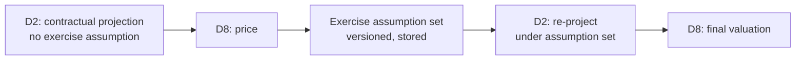

# D8 — Valuation & Analytics Engine

Given a position, a market snapshot and a date: what is it worth, what does it pay, and what is it
exposed to. Parent: `treasury-alm-risk-platform`. Phase 2.

**This module is already the most-referenced unbuilt thing in the corpus.** D2, D3, D7, D9, D10, D13
and D16 all consume it; the parent calls its narrow contract *"the best boundary in the document"* and
the critique's closing section says **"protect it — the fix adds one field, it does not widen the
interface."**

**So this deep-dive's job is the opposite of the others.** D3 and D16 needed expanding because they had
been under-specified. D8 needs *pinning down*, because the risk here is not that it is too small but
that it grows. "Valuation & Analytics Engine" is a name that attracts work: P&L attribution, risk
aggregation, independent price verification, the whole quant estate. Every one of those absorptions is
locally reasonable and collectively fatal, because **the moment D8 is more than a pricing service, the
Phase 2 buy decision dies** — nobody sells "our analytics module", and the bank ends up building the
one thing it was supposed to buy.

**The one-line test:** can the pricing library be replaced with a different vendor's without changing
any other module? If the answer requires thought, the boundary has already leaked.

## 1. The narrow contract

### 1.1 What D8 returns

```
value(subject, valuation_date,
      market_snapshot_version, reference_data_version, model_config_version,
      purpose)  →  Valuation
```

Where `subject` is a Contract, a Balance carrying a market-priced asset, or a Position, and the
`Valuation` carries four outputs plus its own provenance:

| Output | Content |
| --- | --- |
| **Value** | Present value, in trade currency and reporting currency, with the itemised adjustment stack (§3.1) |
| **Cashflows** | **Model-implied** cashflows only — exercise-adjusted, path-dependent (§3.2) |
| **Sensitivities** | Under a versioned perturbation convention (§3.3) |
| **`exposure_by_bucket`** | Notional or delta-equivalent by repricing bucket (§3.4) |

The fourth is the field revision 2 added to repair the repricing gap (parent §2.4). It is one field and
it carries a great deal of weight: `d9-alm-and-irrbb` §92 and D2 §4.2 both depend on it, because a
swaption's cashflow rate treatment produces a meaningless gap bucket.

**A Valuation is immutable and versioned** (parent §2.1). It is never updated; a re-run produces a new
version, and both persist — the same discipline D17 §5 applies to run outputs.

### 1.2 What D8 does not own

The list matters more than the inclusions, because each line is something a valuation engine is
routinely allowed to absorb:

| Not D8 | Owner | Why the line is here |
| --- | --- | --- |
| Market state, curves, surfaces | D3 | D8 **never sources a rate outside the snapshot it was given** (D3 §1.2) |
| Positions, contractual and behavioural projection | D2 | D8 receives terms, legs, schedules and cashflows |
| Aggregation of values into metrics | D9, D10, D11, D13 | D8 values one subject at a time; summing is a consumer concern |
| P&L attribution | D11 | D8 supplies the inputs; decomposing a movement is analysis |
| Independent price verification | D3 structure, finance process | D3 §3.3 holds multiple marks; D8 consumes the official one |
| Fair value hierarchy assignment (IFRS 13 Level 1/2/3) | D7 | D8 supplies input provenance; the disclosure classification is accounting's (§7) |
| XVA at netting-set level | D11 | D8 supplies exposure profiles; CVA/DVA are netting-set calculations (§3.1) |
| Scenario and shock definitions | D14 | D8 values against whatever snapshot it is handed, including derived ones (D3 §1.3) |
| Model approval and validation | D15 | D8 executes approved models; it does not approve them |

**The recurring pattern in that table: D8 computes per subject, and everything that spans subjects
belongs to someone else.** That is the boundary in one sentence, and it is worth writing on the wall of
the Phase 2 project room.

### 1.3 "Buy the pricing library" — what is actually bought

The parent's Phase 2 posture is *buy*. The distinction that makes the posture executable:

| Layer | Posture | Content |
| --- | --- | --- |
| **Pricing library** | **Buy** | Payoff representations, model implementations, calibration routines, numerical methods |
| **Valuation service** | **Build — and keep it thin** | Request routing, model selection (§4), snapshot binding, subject translation from D2's model, result versioning and storage, provenance propagation, caching, grid distribution |

**A vendor library is not a module.** It has no opinion about the bank's contract model, no access to
the snapshot store, no notion of a versioned result, and no way to record why it chose the model it
chose. The service wrapper is the module; it is genuinely thin, and it is the thing that must not
accumulate business logic.

**The Phase 0 consequence, already flagged.** D3 §1.2 established that curve calibration is a pricing
exercise, so the library is a shared Phase 0/2 dependency — the recommended resolution being that
Phase 0 consumes vendor-published curves and defers the library decision to Phase 2 (parent §6). That
recommendation stands, and it is what keeps the largest vendor decision in the programme out of the
phase with the least information.

## 2. The valuation request

### 2.1 Determinism and the version triple

Three versions are explicit parameters, for the same reason D2 §4's projection signature carries two:
**the same call on different days must return the same answer.**

- `market_snapshot_version` — D3 §2. A valuation without one is not reproducible.
- `reference_data_version` — D1 §2. Conventions, calendars and CSA terms all move the number.
- `model_config_version` — §4. Which model prices this instrument, with which numerical settings.

**Determinism is asserted, not assumed** (parent §2.5). Monte Carlo makes this sharper than it is for
projection: a valuation using random sampling must carry its **seed and path count in the model config**,
or two runs of the same request differ by simulation noise and no reconciliation is possible. Seeded,
versioned, reproducible — or the regeneration test (parent §2.5, pulled forward to Phase 1) cannot be
extended to cover valuation in Phase 2.

**Retained engine builds apply to bought code too** (§9).

### 2.2 `purpose`, and why one position has several correct values

The same position on the same date under the same market has different correct values depending on who
is asking. Accounting wants an IFRS 13 exit price including CVA. Risk wants mid. Regulatory capital
wants a prudent value net of AVA. FTP wants a value on internal curves.

Two ways to handle it, and the second is right:

| Approach | Consequence |
| --- | --- |
| D8 returns mid; each consumer applies its own adjustments | Four modules independently implement adjustment logic, and the accounting value and the risk value stop reconciling |
| **D8 returns a base value plus an itemised adjustment stack; `purpose` selects which adjustments apply** | One implementation, always decomposable, and the difference between any two purposes is a query rather than an investigation |

**The rule: every value D8 returns is decomposable into base plus named adjustments, and no consumer
adjusts a D8 value further.** If a consumer needs an adjustment D8 does not compute, that is a gap in
D8's adjustment set, not a licence to post-process.

## 3. The four outputs in detail

### 3.1 Value and the adjustment stack

| Adjustment | Applies to | Computed by |
| --- | --- | --- |
| Collateral / discounting basis | All collateralised derivatives | D8, from the CSA-selected curve (D3 §4.2) |
| **CVA / DVA** | Uncollateralised and partly-collateralised derivatives | **D11, per netting set** — D8 supplies exposure profiles |
| FVA / ColVA | Uncollateralised derivatives | D11, same basis |
| Bid-offer / close-out | Fair value where exit price differs from mid | D8 |
| **AVA / prudent valuation** | Anything fair-valued with uncertain inputs | D8, informed by D3 provenance; consumed by D13 as a CET1 deduction |

**A phase gap worth stating plainly.** IFRS 13 fair value for an uncollateralised derivative includes
CVA. CVA is computed per netting set by D11, which arrives in **Phase 5**. D7's accounting fair value
arrives in **Phase 4**. So **derivative fair value is structurally incomplete between Phase 4 and Phase
5**, and the gap is not a rounding matter for an uncollateralised book.

Three options, and the choice belongs to finance rather than to architecture: accept a documented
CVA-free fair value for one phase with the exposure disclosed; pull a simplified netting-set CVA
forward into Phase 4 (it needs netting sets from D1 §3.8 and exposure profiles from D8, both of which
exist by then); or re-sequence. **It needs deciding before Phase 4 is planned**, not discovered during
the first accounting close.

### 3.2 Cashflows — and why D8 returns any at all

D2 owns projection. So why does D8's contract include cashflows?

**Because some cashflows are model outputs, not schedule outputs.** A Bermudan callable's cashflows
depend on which exercise date the model implies. A barrier option's depend on whether the barrier is
breached along the path. Neither is derivable from the terms payload by a schedule generator.

**The boundary rule: D8 returns model-implied cashflows, tagged as such, and they are never written
back to D2 as contractual fact.** They flow into the two-pass protocol (§5) as a versioned assumption
artefact, and D2 re-projects under it. The distinction keeps D2's contractual and behavioural bases
clean — parent §2.2's "contractual and behavioural as parallel, never override" is the principle, and a
model-implied set is a third basis, not an amendment to either.

### 3.3 Sensitivities, and the convention problem

**Which sensitivities, in which buckets, under which perturbation — and the third is the one that
breaks things.**

The set: delta, gamma, vega, theta; curve-bucketed PV01/DV01 and key rate durations; FX delta; credit
spread sensitivity; and for the banking book, the duration measures D9 consumes.

**Perturbation conventions must be platform-wide, not per-engine.** A 1bp bump applied to zero rates,
to par rates, or to instantaneous forwards produces three different DV01s on the same trade. This is
exactly the problem D3 §1.3 solved for shocks by making shocked curves derived D3 snapshots rather than
per-consumer transformations, and the same answer applies:

**The perturbation convention set is versioned configuration, shared between D8's sensitivities and
D14's shocks.** If D8 bumps zero rates and D14 shocks par rates, the sensitivity-predicted P&L will not
reconcile to the full-revaluation P&L, and the difference will be attributed to "higher-order effects"
for as long as anyone is willing to keep saying that.

**The dependency was placed in D14 §2.5 as the transformation grammar, and
`d11-market-and-counterparty-risk` §2.2.1 raises what rests on it.** Market risk capital is standardised
(D13 §3), and under Basel III/IV the standardised approach is itself sensitivities-based — **so this
module's sensitivities are an input to market risk RWA, not merely to a reconciliation.** Two
consequences land on D8 directly:

- **§9's "sensitivity and perturbation conventions" criterion is not a trade-off to weigh.** A library
  with fixed conventions that do not match the grammar does not merely break P&L attribution; it
  produces the capital number under a convention the bank did not choose. The criterion is disqualifying
  in the same way vanilla-only coverage is (§11 q1)
- **The grammar's node set must contain the prescribed regulatory tenor vertices as a subset**, or an
  interpolation sits between the sensitivity ladder D8 produces and the capital number computed from it.
  That is a D14 binding (D14 §12 q9) and a D8 output requirement, and it is decided in Phase 1 — before
  the library is chosen

### 3.4 `exposure_by_bucket` — small field, exact meaning

**What it is:** the position's exposure to rate movement, expressed per repricing bucket, for the
positions that cashflows cannot represent.

| Position type | Content | Nature |
| --- | --- | --- |
| Options — swaptions, caps, floors, callables, CoCos | **Delta-equivalent** notional | Market-dependent; changes as the option moves in and out of the money |
| Futures | Notional | Static until the position changes |
| Equity, commodity, Balance-held items | Exposure or nil, per D9's scope | Contributes to EVE and NSFR without repricing basis |

**The requirement nobody has stated: the bucket definitions must be shared reference data.**
`exposure_by_bucket` is added to cashflow-derived gap by D9. If D8's buckets and D2's contractual
maturity bucket dimension and D9's gap ladder are defined independently, the two halves of the gap do
not add up — and the failure is silent, because both halves look reasonable.

**Bucket definitions belong in D1** alongside the other classification-adjacent reference data,
versioned and effective-dated like everything else there, and consumed by D2, D8 and D9 alike. This is
a small addition with a real consequence, and it should go into D1 §3.9's neighbourhood.

## 4. Model selection is a governed rule, not a code path

A bought library ships dozens of models. **Which one prices a given instrument is a bank decision with
a P&L**, and it must be governed exactly as the classification rule sets are (`classification-rules-engine`
§2): versioned, effective-dated, approved, and changeable without a release.

| Instrument class | Model tier |
| --- | --- |
| Money market, FRNs, fixed bonds, FX forwards, IRS, basis swaps | Discounting on the CSA-selected curve |
| Caps, floors, European swaptions, vanilla FX options | Analytic or near-analytic, smile-aware |
| Bermudan callables, puttables, CoCos, capped/floored FRNs (D2 Tier 1) | Term-structure model with calibration |
| Barriers, digitals (D2 Tier 1, **in scope** — Part 1 §4) | Smile-consistent model; the reason the surface in D3 §3.5 must be fitted rather than interpolated |
| CDS, index CDS | Credit model with recovery assumption; index CDS prices off externally-supplied cashflows |
| ABS/MBS | Priced **off D2's externally-projected cashflows** (parent §2.2) — D8 discounts, it does not model the waterfall |
| D2 Tier 3 structured products | **Replicating portfolio, with product-approval sign-off** — "specify only" in D2 §2.6, but D8 needs a documented path or it silently returns nothing |

**Two rules follow:**

1. **The instrument-to-model mapping is versioned data**, and changing it is a model change under D15 —
   the tier that requires validation before first use (`d15-control-core` §3).
2. **An instrument with no mapped model fails loudly.** Same principle as the rules engine's §4: there
   is no default. A position that cannot be priced is reported as unpriced, not valued at zero, not
   valued at cost, and not quietly excluded — the D16 §4.3 suspense argument applies to valuation too.

## 5. The two-pass protocol — resolving the D2 ↔ D8 circularity

**The critique's §3.4 finding, unresolved until now.** D2 §2.3 permits an exercise assumption to come
from "D8's model-implied exercise" — but D8 needs D2's cashflows to price. For every callable bond,
puttable, CoCo and Bermudan swaption, the call graph is circular with no stated resolution order.

**Resolution — three explicit steps with a stored artefact between them:**



The middle artefact is the point: **the exercise assumption is a versioned, reproducible object**, not
a hidden call between two modules. It is an input to the next projection exactly as a behavioural model
output is (D2 §4.3), it is governed by D15, and "why did this callable's cashflows change" resolves to
a dated assumption version.

### 5.1 This contradicts the parent's EOD sequence

Parent §3 runs `cashflow regeneration → valuation` in a straight line. **The two-pass protocol needs
projection → valuation → re-projection**, which is a cycle inside the EOD DAG that D17 §2 models as
acyclic.

Two ways out:

| Option | Consequence |
| --- | --- |
| Run the loop within the EOD | Correct, and it adds a second projection pass over the callable population to the critical path |
| **Use the prior day's assumption set** | Breaks the cycle. The exercise assumption is a day stale; for a Bermudan callable that is immaterial except around an exercise date |

**Recommended: the prior day's assumption set, with a documented same-day refresh around exercise
dates.** It keeps the DAG acyclic, keeps the critical path short, and converts an accidental staleness
into a stated one. What must not happen is the cycle being resolved implicitly by whichever stage runs
first, which is what an unspecified design will produce.

**Either way, parent §3's sequence needs amending** — it currently describes a pipeline that cannot
price the callable book.

## 6. Performance and the compute envelope

**Valuation is the second-largest compute in the platform after projection, and unlike projection it
grows by a large multiple in a later phase.**

| Driver | Phase | Scale |
| --- | --- | --- |
| Daily full-book revaluation | 2 | One pass |
| D9's IRRBB shocks — six prescribed plus internal | 3 | ~10× |
| D11 historical-simulation VaR | 5 | **250×+ revaluations of the trading book, daily** |
| D11 PFE / exposure profiles for XVA | 5 | Monte Carlo per netting set across time steps |
| **Sensitivity ladder across the platform vertex set** | **2** | **29 nodes, not the ~19 assumed — `D14-6`** |

**A fifth driver, and it lands in Phase 2 rather than Phase 5 — `D14-6`.** The table above was drawn
against an implicit rate ladder of roughly 19 nodes. The platform vertex set is the **union of the 19
IRRBB band midpoints and the 10 prescribed capital vertices — 29 nodes**, so that the regulatory views
are exact subsets rather than interpolations (`d1-reference-and-static-data` §3.10,
`d14-scenario-and-stress-framework` §2.5). **That is roughly 53% more perturbations per sensitivity
pass, every night, from Phase 2** — not a Phase 5 problem deferred. `D11-1` compounds it: because market
risk capital is standardised and the standardised approach is sensitivities-based, the ladder rises to
tier A priority on regulatory reporting dates, so it competes with the submission path on exactly the
nights the window is tightest (`eod-window-and-degradation` §5). Two independent reasons the nightly
machine is larger than the envelope below was costed against.

**The Phase 5 number is what sizes the hardware, and it arrives three phases after the architecture is
fixed.** A Phase 2 design that comfortably revalues the book once and cannot fan out will be rebuilt.
The specific decisions to take in Phase 2 with Phase 5 in mind: whether valuation distributes across a
grid, whether the library's licensing permits that (§9), and how the fan-out cases are revalued — which
is §6.1, previously open question 3 and now answered.

### 6.1 The fan-out question was one question and is two — closed

**Answered by `d11-market-and-counterparty-risk` §5.1**, whose module owns the multiplier. This section
was carried as *"full revaluation or sensitivity approximation for Phase 5's fan-out?"* through three
parent revisions. It collapses four different fan-outs into one binary, and they do not share an answer:

| Fan-out | Multiplier against one full pass `T` | Full revaluation feasible? |
| --- | --- | --- |
| Historical simulation VaR | ~250 `T`, daily | Expensive, arithmetically possible |
| Stressed VaR | ~250 `T`, daily | Same |
| P&L attribution step-through | ~10 `T`, daily | Trivially, and it must be — the residual is the point |
| **PFE / EPE exposure profiles** | **10⁴–10⁵ `T`** — netting sets × paths × time steps | **No. Not by any margin** |

**The fourth row settles the Phase 2-architectural half by arithmetic.** Approximate revaluation —
regression-based (American Monte Carlo) or grid-interpolated — is the only way exposure profiles are
computed anywhere, and **§8's phase table already concedes it** by listing *"exposure profiles for XVA"*
and *"full revaluation grid for VaR"* as two separate Phase 5 items. **So the wrapper and the grid must
support an approximate revaluation path regardless of anything anyone decides about VaR.** That is the
decision this module needed in Phase 2, and it is now made.

**Whether the VaR number uses that path is a later, re-tunable binding, and it keys off this module's own
model tiers (§4)** — which partition the universe by how non-linear the payoff is, which is exactly what
determines whether a second-order approximation holds:

| Model tier (§4) | Fan-out treatment | Why |
| --- | --- | --- |
| Linear — MM, FRNs, fixed bonds, FX forwards, IRS, basis swaps | Sensitivity-based, exactly | For a linear payoff, sensitivity-based *is* full revaluation. There is no approximation error to argue about |
| Analytic options — caps, floors, European swaptions, vanilla FX | Full revaluation, or delta-gamma-vega with a monitored residual | Analytic pricing is usually fast enough that full revaluation is the cheaper decision once the argument's cost is counted |
| Term-structure and smile-consistent — Bermudans, CoCos, barriers, digitals | **Full revaluation, or a fitted grid** | Where approximation breaks, and where the book's risk actually lives |
| Externally projected — ABS/MBS, index CDS | Full revaluation off stored cashflows | Cheap. D8 discounts rather than models |

**D11 §5.1's governing rule, which D8 executes: an approximation is permitted only where a scheduled
full-revaluation benchmark demonstrates it inside a stated tolerance.** That benchmark is a D8 request
pattern — the same `value()` call at the same versions, run periodically over the same population — so
the wrapper must be able to run it on demand rather than only as part of a risk batch.

**Two wrapper consequences fall out of the arithmetic, not out of the preference:**

- **Calibration sharing stops being an optimisation and becomes the design.** §6 above names it as the
  meaningful one; across 250 historical scenarios the calibration work repeats 250 times unless the
  wrapper shares it per derived snapshot. It is a wrapper property, so it is buildable — but only if
  designed in before the wrapper exists.
- **The wrapper values against 250 derived snapshots daily, not against a handful.** D3 §8's
  centralisation economics were sized for scenarios; D11 §5.3 recommends materialising the derived
  snapshots under a bounded retention rather than perturbing unmaterialised, because an unmaterialised
  perturbation is a transformation applied inside a consumer — the divergence D3 §1.3 exists to prevent.
  **D8 consumes materialised snapshots and must not acquire a perturbation path of its own.**

**Caching is weak here for the same reason as D2 §4.4** — the snapshot moves daily, so everything
market-dependent invalidates daily. What caches well is the market-independent part: schedule
resolution, subject translation, calibration results shared across instruments priced off the same
curve. Calibration sharing is the meaningful optimisation, and it is a property of the service wrapper
rather than the library.

**Monte Carlo does not parallelise the same way as the rest.** Valuation parallelises cleanly by
subject; a single Monte Carlo valuation parallelises by path with a different granularity and memory
profile. The grid design must handle both, and `eod-window-and-degradation` is where the resulting
budget lands.

## 7. Provenance, and the link to prudent valuation

**D3 tags every market value with its provenance** — observed, interpolated, stale, proxied,
model-implied, marked (D3 §5). **D8 must propagate that provenance into the valuation**, because a
value built on marked inputs is itself a marked value.

Two consumers depend on this, and neither can be served retrospectively:

- **D13 — prudent valuation.** AVAs are computed against valuation uncertainty, and the uncertainty is a
  function of input provenance and the spread of available marks (D3 §3.3). `d13-regulatory-reporting-and-capital`
  already lists D8 as the source for AVA inputs; this is the mechanism.
- **D7 — IFRS 13 fair value hierarchy.** Level 1 / 2 / 3 is a disclosure classification driven by
  whether inputs are quoted, observable or unobservable — which is very close to what D3's provenance
  tag already records. **D8 supplies the input provenance; D7 assigns the level.** Neither artifact
  currently draws this line, and without it the hierarchy disclosure gets assembled manually every
  quarter.

## 8. Phase split

| Capability | Phase |
|---|---|
| Service wrapper, model selection registry, valuation versioning, provenance propagation | **2** |
| Linear pricing, vanilla options, sensitivities, `exposure_by_bucket` | **2** |
| Adjustment stack framework with `purpose` (bid-offer, AVA populated; XVA slots empty) | **2** |
| Enables D16 reconciliation 2b — valuation against counterparty statements | **2** |
| Exotic pricing — barriers, digitals | **2** — in the instrument universe (source Part 1 §4), so in scope. Current holdings affect only where in Phase 2 it lands, never whether the library must support it |
| Scenario revaluation against D3's derived shocked snapshots | **3** |
| Valuations to D7 for accounting; hedge effectiveness measurement | **4** |
| **Approximate revaluation path** (payoff-at-state), and the full-revaluation benchmark harness | **2** — §6.1. Previously implicit in the Phase 5 rows below, which is how it went unbuilt in the phase that decides the architecture |
| Exposure profiles for XVA (approximate by necessity); revaluation grid for VaR | **5** |
| Valuation on internal FTP curves | **6** |

**The Phase 2 deliverable is the wrapper and the linear book.** Everything else attaches to it, which
is why the wrapper's thinness matters more than the breadth of the model set on day one.

## 9. Build/buy — what to evaluate on

The posture is settled (buy the library, build the wrapper). The evaluation criteria are not, and they
are unusual enough to be worth stating:

| Criterion | Why it is not obvious |
| --- | --- |
| Instrument coverage against **this** universe | Part 1's eleven classes, including MTM-resetting CCS, index CDS, commodity legs and **barriers and digitals — confirmed in scope**, so a vanilla-only library is disqualifying rather than a trade-off |
| **Model transparency** | D15 must validate the model. A black box cannot be validated, and "the vendor validated it" is not an answer a regulator accepts |
| Calibration control | Whether the bank can choose calibration instruments and methods (D3 §4.1) or must accept the vendor's |
| **Sensitivity and perturbation conventions** | Whether they are configurable to match D14's shocks (§3.3), or fixed in a way that permanently breaks P&L attribution |
| Native `exposure_by_bucket` | Whether the library produces it or the wrapper must derive it — a material scope difference |
| Determinism across versions | Whether a library upgrade changes numbers, and whether the vendor will say so |
| **Long-term version retention rights** | §9.1 |
| **Grid licensing at the Phase 5 multiplier** | **Not a criterion to weigh — a quantity to state in the RFP.** §9.2 |
| **Approximate revaluation support** | Whether the library exposes what a regression-based or grid-interpolated exposure calculation needs — payoff evaluation at a state, rather than only a full price call. §6.1 makes this compulsory, and a library that only prices end-to-end forces the wrapper to reimplement pricing |

### 9.1 The lock-in nobody costs

**Parent §2.5's third determinism mitigation is "the engine build retained as a versioned artefact, so
historic regeneration can run on the code that produced the original."**

For bought code, that is a **licensing and escrow requirement, not an engineering one**: the bank must
be able to run a decade-old version of the vendor's library, on hardware and an operating system that
will also have moved, for as long as the reproducibility guarantee stands. Standard licence terms do
not contemplate this. It needs to be in the contract, and procurement will not think to ask.

**The same clause has a model governance half — `D15-7`.** Retention says the bank *can* run the old
version. It does not say which version it *should* run, and the bought library is not one model but a
set of them (§2), every one of which is in D15's inventory and validated at a point in time. Two
consequences the escrow conversation is the only chance to price:

- **A vendor upgrade is a model change on the vendor's calendar, not the bank's.** The bank does not
  choose when its pricing models change; it chooses only whether to take the release. Every upgrade
  therefore triggers revalidation of whatever it touches, on a schedule set outside the bank —
  and a vendor release note is not a validation report, however detailed
- **A validated version eventually goes end-of-life**, which forces a choice between running unsupported
  code and revalidating on the vendor's timeline. Neither is free, and the contract is where the notice
  period, the parallel-run window and the support terms for a superseded version get set

Left out of the RFP, this surfaces as an operational surprise in Phase 3 or 5 — the first upgrade the
bank does not want but cannot refuse (`d15-model-governance` §4.3). It belongs with §9.2's grid licence
in the same negotiation, since both are Phase 5 costs decided by a Phase 2 signature.

### 9.2 The second lock-in, and it has a number on it

**Version retention (§9.1) is the lock-in nobody costs. Grid licensing is the one everybody underprices,
because the workload it is priced against is the wrong workload.**

The Phase 2 workload is one full revaluation pass a night. **The Phase 5 workload is `500 T` for VaR and
stressed VaR, plus an exposure simulation that is larger than everything else in the platform combined**
(§6, §6.1, `d11-market-and-counterparty-risk` §5.1–5.2). Between the two sits a factor of up to two
orders of magnitude in core count, and it arrives three phases after the licence is signed.

**This is why the criterion above is phrased as a quantity rather than a preference.** A per-core licence
negotiated against a one-pass workload is renegotiated in Phase 5 from a position of total lock-in,
against a vendor who by then knows the model set, the calibration configuration and the wrapper
integration cannot be moved. The bank's negotiating position is at its strongest exactly once, in the
Phase 2 RFP, and at that moment nobody in the room is thinking about VaR.

**Three requirements for the RFP, and all three are contract language rather than architecture:**

| Requirement | What it prevents |
| --- | --- |
| **Pricing quoted against the Phase 5 core count, not the Phase 2 one** | A headline Phase 2 price that triples the programme's licence cost in Phase 5. State the multiplier and make the vendor quote both points |
| **A licensing model that does not scale linearly with cores** — site, capacity or committed-band | Per-core pricing makes the correctness-driven fan-out decisions in D14 §8 and §6.1 into budget decisions taken by whoever holds the licence, which is the wrong person |
| **Burst and elastic-capacity rights** | The exposure simulation is a periodic heavy workload (`d11-market-and-counterparty-risk` §5.5), not a steady one. A licence sized for the peak is paid for all year; one sized for the average forbids the peak |

**D11 owns the multiplier and D8 owns the RFP**, which is precisely the split that causes this to be
missed — the number lives in a module that does not exist when the contract is signed. **The base `T` is
measurable as soon as the Phase 2 wrapper runs**, so it should be a stated Phase 2 deliverable feeding
the procurement, not a Phase 5 discovery.

## 10. Acceptance criteria

1. Every valuation is reproducible from its version triple — market snapshot, reference data and model
   config — including Monte Carlo, via seed and path count in the model config
2. Valuations are immutable and versioned; a re-run creates a version and never overwrites
3. Every value decomposes into a base plus named adjustments, and `purpose` selects the applicable set;
   no consumer post-adjusts a D8 value
4. D8 sources no market data outside the snapshot it was given
5. The instrument-to-model mapping is versioned, approved data; a mapping change requires validation and
   no code release
6. An instrument with no mapped model is reported unpriced — never zero, never cost, never excluded
7. Model-implied cashflows are tagged as such and are never written back to D2 as contractual fact
8. The two-pass exercise protocol runs through a stored, versioned assumption artefact, and the chosen
   cycle-breaking convention is documented
9. Perturbation conventions are shared configuration with D14's shocks; sensitivity-predicted P&L
   reconciles to full-revaluation P&L within a stated tolerance
10. `exposure_by_bucket` uses the bucket definitions held in D1, identical to those used by D2's maturity
    dimension and D9's gap ladder
11. Input provenance propagates from D3 through D8 to the valuation, sufficient for D13's AVA and D7's
    IFRS 13 level assignment
12. The pricing library can be replaced without changes to any module other than the D8 wrapper
13. The wrapper supports an **approximate revaluation path** — payoff evaluation at a state, not only a
    full price call — and a **scheduled full-revaluation benchmark** runnable on demand over the same
    population at the same versions (§6.1)
14. Calibration results are shared across subjects priced off the same derived snapshot, demonstrated at
    the 250-snapshot fan-out and not only at one (§6.1)
15. D8 values against **materialised** derived snapshots and holds no perturbation path of its own
    (§6.1, D3 §1.3)
16. The base `T` — one full revaluation pass of the fair-valued book — is measured and published as a
    Phase 2 deliverable, feeding the grid licensing quantity in §9.2

## 11. Open questions

1. **Exotic FX options — closed.** The source document lists *"FX options — vanilla (calls/puts) and*
   *exotic (barriers, digitals)"* in Part 1 §4, and the parent's scope decision binds the platform to
   that universe. **Phase 2 buys a smile-consistent library.** The question the artifacts had been
   asking — *are they held?* — was the wrong gate: holdings move the capability's position within
   Phase 2, while the universe determines the library, and the library is the irreversible choice.
   A vanilla-only library cannot be extended to barriers without changing vendor. **Current holdings
   remain a legitimate operational question for sequencing, and are not answered by the source
   document.**
2. **What is the CVA-free fair value policy between Phase 4 and Phase 5?** §3.1. Finance's decision,
   needed before Phase 4 planning.
3. **Full revaluation or sensitivity approximation for Phase 5's fan-out — closed.** It was one question
   and is two, answered by `d11-market-and-counterparty-risk` §5.1 as the module that owns the
   multiplier. **The Phase 2-architectural half is settled by arithmetic:** exposure profiles are
   netting sets × paths × time steps, which no grid revalues in full, so the wrapper and grid must
   support an approximate revaluation path regardless — and §8's phase table already assumed as much.
   **The remaining half is not Phase 2-blocking:** whether the *VaR* number uses that path is a
   per-model-tier binding against a scheduled full-revaluation benchmark, re-tunable later (§6.1).
   **What replaces it as the open item is a number, not a choice:** the base `T` — one full revaluation
   pass of the fair-valued book — which sizes the Phase 2 grid and its licence (§9.2) and is measurable
   as soon as the wrapper runs.
4. **Where do bucket definitions live?** §3.4 recommends D1. Needs confirming, and D1's artifact needs
   the addition.
5. **Does the Tier 3 replicating-portfolio path get built or documented?** D2 §2.6 says "specify only",
   which is fine until the first Tier 3 product is approved and there is no valuation path.
6. **Library version retention** — §9.1. A procurement question with an architecture consequence, and it
   should be in the RFP rather than discovered at renewal.

## Appendix — what this implies for the parent

Six items for a future revision, listed rather than applied. F1–F4 became parent Appendix H; F5 and F6
are new, raised by `d11-market-and-counterparty-risk` and applied to this artifact rather than merely
noted, because both bind the Phase 2 procurement.

| Ref | Change | Section |
| --- | --- | --- |
| F1 | **EOD sequence cannot price callables as drawn** — needs projection → valuation → re-projection, or the documented prior-day assumption convention | Parent §3 |
| F2 | **Derivative fair value is structurally incomplete between Phase 4 and Phase 5** because CVA is a D11 (Phase 5) calculation and D7 arrives in Phase 4 | Parent §6, §2.8 |
| F3 | **Repricing bucket definitions become shared D1 reference data**, consumed identically by D2, D8 and D9 | Parent §2.3, D1 §3.9 |
| F4 | **Retained engine builds imply a licensing and escrow requirement for bought libraries**, not just an engineering one | Parent §2.5, §6 |
| F5 | **The Phase 2 pricing library is sized and licensed against D11's Phase 5 multiplier, not Phase 2's single pass** — with the core count stated in the RFP, a non-linear licensing model, and burst rights for the exposure simulation. The number lives in a module that does not exist when the contract is signed, which is why it goes unasked | Parent §6, §2.5 (§9.2) |
| F6 | **This module's fan-out question is closed and splits in two.** Approximate revaluation machinery is compulsory in Phase 2 because exposure profiles cannot be computed any other way; whether VaR uses it is a re-tunable per-model-tier binding. Parent Appendix H's open list drops an item | Parent Appendix H, §6 (§6.1) |

## Appendix — amendments applied from sibling modules

Findings raised by `d15-model-governance` and `d14-scenario-and-stress-framework` against this artifact,
applied under the trigger *"D8 §9.1 / §6 is next amended"*. Refs keep their originating module's
namespace (`blueprint-amendment-protocol` R1) and allocate no new `F-n` in the appendix above.

| Ref | Applied | Section |
|---|---|---|
| `D15-7` | The escrow clause has a model governance half — a vendor upgrade is a model change on the vendor's calendar, and a validated version eventually goes end-of-life | §9.1 |
| `D14-6` | The compute envelope re-sized for a 29-node vertex set, and the ladder's rise to tier A on reporting dates | §6 |

**Both are Phase 2 procurement items, which is why they are worth applying before the RFP rather than
after.** `D15-7` is a contract clause that costs nothing to ask for and cannot be added later;
`D14-6` changes the core count the licence is negotiated against, joining `F5`'s grid multiplier in the
same conversation. Neither is a design change — the design already supports both; what changes is the
number in the RFP.
