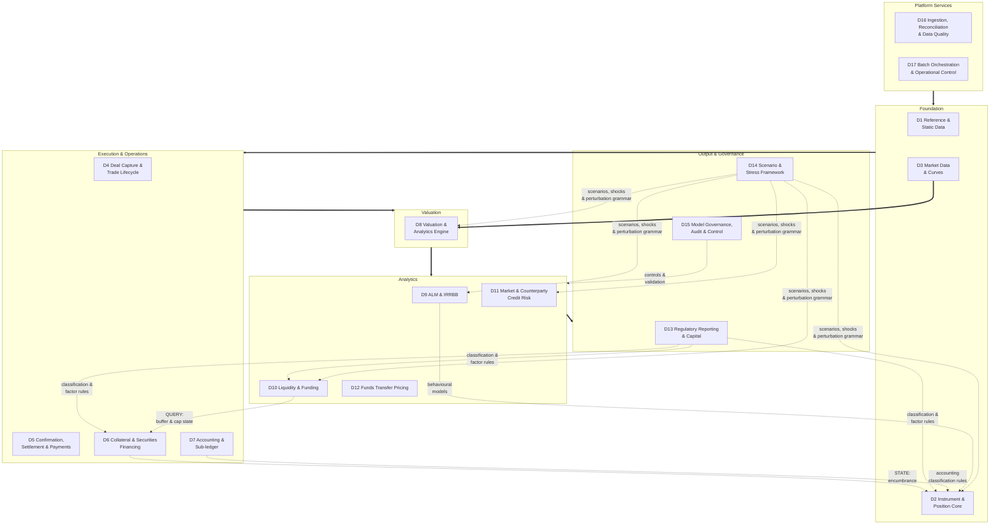
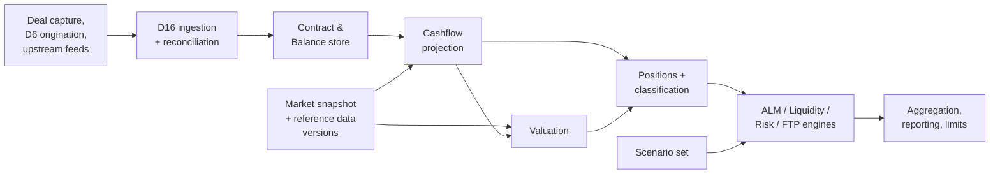

# Treasury, ALM & Risk Platform — Architecture Blueprint

Technology-agnostic architecture for a bank-wide treasury system of record with integrated
asset-liability management, liquidity, and risk. Scoped to the instrument universe and balance
sheet taxonomy in `Tier1-Bank-Treasury-Instrument-Universe-and-Balance-Sheet-Taxonomy.docx`.

**Revision 2.** Remediated against `architecture-critique` (findings C1–C10 and the IFRS 9
corrections) and `part2-taxonomy-mapping`. Changes from revision 1 are summarised in Appendix C.

**Revision 2.1.** Amended for findings raised by the Phase 0 module deep-dives —
`d3-market-data-and-curves` and `d16-ingestion-reconciliation-dq`. These are corrections and
dependencies the blueprint did not carry, not a redesign; they are summarised in Appendix E.

**Revision 2.2.** Amended for the D7 and D13 deep-dives. Summarised in Appendix F.

**Revision 2.3.** Amended for the D14 deep-dive. Summarised in Appendix G.

**Revision 2.4.** Amended for `d8-valuation-and-analytics`, `classification-rules-engine` and
`d15-control-core`. One of these — the callable-instrument cycle in §3 — is a correction to a run
sequence that could not have worked; the rest are dependencies and one previously unspecified Phase 0
capability. Summarised in Appendix H.

**Revision 2.5.** Amended for the second pass on `d14-scenario-and-stress-framework`, which places the
perturbation-convention dependency D8 §3.3 raised and left unowned. **D8 is a D14 consumer that §1.6's
one-line summary does not list**, and the object they share — the transformation grammar — is what makes
a sensitivity and a shock the same operation. Summarised in Appendix I.

**Revision 2.6.** Amended for `d6-collateral-and-securities-financing`. One of these is a correction to
**§1's own design rule**: the encumbrance edge is drawn as a rule edge, is not a rule, and is therefore
constrained by nothing. The rest widen what the encumbrance register must hold and state what the Phase 0
subset must carry so that Phase 4 inherits it rather than rebuilds it. Summarised in Appendix J.

**Revision 2.7.** Amended for `d11-market-and-counterparty-risk`, the last consumer of the grammar to be
deep-dived and the last module without an artifact. It **closes Appendix I's conditional in the opposite
direction to the one that was expected** — the grammar is load-bearing for market risk RWA *regardless*
of the fan-out decision, because the standardised approach the bank is on is itself sensitivities-based —
and it **answers `d8-valuation-and-analytics` open question 3** by splitting it in two. Summarised in
Appendix K.

**Revision 2.8.** Draws the **collateral optimiser edge** that revision 2.6 identified and left undrawn.
It is the first dependency to test §1's design rule rather than illustrate it — the optimiser needs a
computed liquidity result to flow downward, which the rule appears to prohibit. Resolved by decomposing
it into a rule edge that already exists and a read-only query edge that persists nothing. Summarised in
Appendix L.

**Revision 3 — checkpoint.** The first revision cut under `blueprint-amendment-protocol` R3: a periodic
checkpoint rather than a per-finding bump. **Revision 3 is all amendments recorded in Appendices A–L,
the module appendices (D3, D11, D12, D14, D15), and `BP-2`.**

Two things this checkpoint marks:

- **Stage 0 acceptance test 3 is unblocked.** `BP-2` closes every taxonomy routing ambiguity and orphan
  instrument (Appendix B.2), which was the last item blocking `tickets/p0-14`
- **`BP-1` is outstanding** — the D14 appendix merge, deferred on its trigger. It is the only known
  applied-but-unrecorded gap at this checkpoint

Between checkpoints the version of this document is **the set of applied refs**, not a number. Module
agents should not add to this list; see the block below.

---

> ### Before you amend this document
>
> **Six agents write to this file, and revision numbers have collided twice.** The protocol is
> `blueprint-amendment-protocol`; read it before your first amendment. In short:
>
> - **Do not bump the revision number and do not add to the list above.** That list has one writer — the
>   blueprint owner — who cuts a revision as a checkpoint, not once per finding. **Do not notify the owner
>   when you apply an amendment** either; the appendices are the record, and an inbox would just be the
>   contended counter in another form
> - **Amendment refs are module-scoped**: `D6-1`, `D11-4`, never the next free letter. They cannot
>   collide, and a second pass on a module continues its existing sequence. **`BP-n` is reserved to the
>   blueprint owner** (R1b). Other cross-cutting amendments namespace on **their source artifact** —
>   `EOD-n`, `TAX-n` — because the property that matters is a single writer per sequence, and a shared
>   `BP-n` would be the contended counter again at lower traffic
> - **One appendix per module**, named for the module, appended immediately before `## Child artifacts`.
>   Never edit another module's appendix — change the body and record the supersession in your own
> - **Append sections, never renumber them.** Fifteen artifacts cite `parent §2.5` and its siblings;
>   renumbering breaks all of them silently
> - **Cite body sections rather than appendix letters.** A pointer to "Appendix K" went stale within a
>   day; a pointer to `§6.2` or `D6-7` cannot
> - **Re-read the sections you are about to edit immediately before editing**, and treat "file modified
>   on disk" as a stop signal rather than a note
>
> **Appendices A–L predate this scheme and are not being renamed** (protocol §3). The scheme applies from
> the next amendment onward.

---

## Scope decisions

These were settled before design and constrain everything below.

| Decision | Choice | Consequence |
| --- | --- | --- |
| Deliverable | Architecture blueprint, not working software | Specifies capabilities, boundaries and contracts; a team or vendor builds or buys against it |
| Regulatory regime | Basel III/IV + IFRS 9, single jurisdiction | No multi-GAAP or solo/consolidated split |
| Legal entity | Single entity (provisional) | Entity carried as a Contract attribute; no elimination or consolidation built. **Four independent group-structure signals remain unresolved** — see Appendix D |
| System boundary | Full TMS + ALM + Risk — **system of record for treasury** | Treasury deals are booked, confirmed, settled and accounted for here. Core banking stays system of record for retail/corporate loans and deposits |
| Technology | Agnostic | No stack named. Module boundaries and calculation contracts are specified so implementation choices stay open |

**Not in scope:** retail/corporate loan origination and servicing, customer-facing channels, the core
banking GL itself, IFRS 9 ECL model computation (the platform consumes ECL — interface specified in
§2.6), and client-facing treasury sales.

## 1. Domain map

**Seventeen bounded contexts** in six layers. Each owns its data, publishes a defined interface, and
can be built, bought or deferred independently.

<user_quoted_section>Revision 1 said "fourteen" and listed fifteen. The count was wrong, and two further domains(D16, D17) were missing entirely — see §1.6.</user_quoted_section>



**Three edge classes, deliberately drawn separately.** Solid edges are **data flow**, which runs upward.
Dashed edges are **rule and definition flow**, which runs downward — a higher-layer module *authors* a
rule that a lower-layer module *stores and executes*. Revision 1 drew only the data edges, which made
the architecture appear acyclic when it is not. The downward edges are legitimate and load-bearing:
they are what keeps opinions (models, factors, classification rules) out of the system of record while
letting the system of record apply them.

**The design rule that makes the cycles safe:** a downward edge may carry only **versioned,**
**effective-dated definitions** — never live computed values. D2 stores and executes what D7, D13, D9
and D14 define. If a downward edge ever needs to carry a computed result, the boundary is wrong.

**The third class — state flow — new in revision 2.6, and it is a correction rather than an addition.**
`D6 → D2 encumbrance` was drawn as a rule edge through revisions 2 to 2.5. **It is not a rule.**
Encumbrance is an *observed state* — sometimes asserted by an external agent whose record is
definitionally correct (§4, tri-party) — flowing from an L3 module into an L2 one. It is neither a
versioned definition nor a computed result, so it satisfied neither the permission nor the prohibition
above, and the design rule that was supposed to make the downward edges safe **did not constrain the one
edge most likely to be got wrong**. It is marked `STATE:` in the map above; there is no third line style
in the notation, so the label carries it.

**The safety rule for a state edge is different, because the risk is different.** A rule edge is
dangerous when it carries a computed value. A state edge is dangerous when it cannot be replayed. It is
safe when the state is:

1. **Event-published** with both effective and system timestamps, not delivered as a periodic file —
   because a lower-layer consumer recomputes on the event (`classification-rules-engine` §5)
2. **Bitemporally queryable**, so "what was the state as of date D, as known on date K" is answerable and
   any historic recompute reproduces — the §2.5 and §5 reproducibility guarantees do not otherwise reach it
3. **Provenance- and authority-tagged**, because unlike a rule, a state may be asserted by a party
   outside the platform, and how much of a reported number rests on externally-asserted or
   operationally-maintained state must be a query (§5)

**The collateral optimiser edge — new in revision 2.8, and it tests the rule above rather than
illustrating it.** D6's optimiser must know the liquidity consequence of each candidate allocation, not
only its funding cost (§1.3). D10 sits in L5 and D6 in L3, so the dependency runs downward and appears
to be exactly what the design rule prohibits: a computed result flowing down.

**It decomposes into two edges, and only one of them is new.**

- **`D13 → D6`, a rule edge.** HQLA eligibility, level assignment and the LCR/NSFR factor sets are
  versioned, effective-dated rules that D13 already authors and that D2 and D10 already execute (§1.6).
  **D6 becomes a third executor of the same rule set** — no new authorship, no new rule class, and no
  possibility of the optimiser working from a different definition of HQLA than the ratio it is trying
  to protect. This is the existing pattern, applied to one more consumer
- **`D10 → D6`, a query edge.** What genuinely cannot be reduced to a rule is the **current buffer
  composition and whether the Level 2 and 2B caps are binding**, because the marginal liquidity cost of
  pledging an asset depends on the buffer it is being removed from. That is a computed result, and it
  does flow downward

**Why the second edge does not break the rule: the rule governs what a lower layer *stores and
executes*, not what it *asks*.** Every prohibited case in revisions 2–2.6 is a payload that a lower
layer persists and later applies — which is why versioning and effective-dating are the safeguards. A
read-only query that supports an operational decision persists nothing, so those safeguards have nothing
to attach to. **The discipline it needs instead is decision reproducibility**: the optimiser may not
store the score, and each allocation decision records the policy version, market snapshot and ratio
state it was taken against, so *"why did we pledge that bond"* is answerable months later — which is
precisely the question asked after a liquidity event.

**This is deliberately not a fourth edge class.** One read-only edge does not earn a new category in the
notation, and the safeguard it needs is of a different kind from the other three: rule edges are made
safe by versioning, state edges by replayability, and this by recording the decision rather than the
input. It is marked `QUERY:` and the scope qualification above is the whole of its treatment.

**Encumbrance is currently the map's only state edge.** Detailed in
`d6-collateral-and-securities-financing` §10.1; the requirements above are that artifact's §2.4 and §2.5.

### 1.1 Platform Services

**D16 — Ingestion, Reconciliation & Data Quality.** Feed adapters for core banking, custodians, CSDs,
nostro statements, counterparty and CCP statements. The reconciliation engine, break register, break
classification, ageing and escalation. Data quality checks — completeness, staleness, plausibility,
referential integrity — the fallback hierarchy for position, balance and static feeds, and the
**suspense presentation** that keeps quarantined records on the balance sheet (§5). **New in revision
2.** §4 made reconciliation a hard EOD gate and gave it no owner; without a domain it would be built
once per consumer. Detailed in `d16-ingestion-reconciliation-dq`; the market-data fallback hierarchy
belongs to D3, not here (§5).

**D17 — Batch Orchestration & Operational Control.** The EOD pipeline scheduler, the gate state
machine, re-run and partial-re-run semantics, dependency management between stages, and propagation of
the *provisional* flag when a gate fails. **New in revision 2.** §3 calls "every stage is gated" a
non-negotiable; nothing implemented it.

### 1.2 Foundation

**D1 — Reference & Static Data.** Legal entities, books and portfolios, counterparties with group
hierarchy and sector classification, product catalogue, holiday and settlement calendars, GL chart and
mapping, index and benchmark definitions, currency and rounding conventions, and **legal agreement**
**master data — ISDA, CSA, GMRA, GMSLA, and the netting sets they define** (§2.7).

**Everything in D1 is versioned and effective-dated**, because projection reproducibility depends on
it (§2.5). Revision 1 versioned market data, models and scenarios but not reference data — a
retroactively corrected holiday calendar silently shifts historic payment dates.

**D2 — Instrument & Position Core.** The system of record: the canonical Contract and Balance store
spanning the source document's Part 1 and Part 2, plus the cashflow projection engine. Detailed in
`d2-instrument-position-core`.

**D3 — Market Data & Curves.** Fixings, FX rates, prices, credit spreads, volatility surfaces, and
curve construction. Multi-curve OIS discounting. Snapshot versioning. Detailed in
`d3-market-data-and-curves`. **In Phase 0 because projection needs forward curves** (§2.5), not because
of valuation — only the snapshot infrastructure, fixings, FX and projection curves land in Phase 0; the
rest follows its consumers.

### 1.3 Execution & Operations

**D4 — Deal Capture & Trade Lifecycle.** Booking across the instrument universe; amendments,
novations, terminations, exercises, fixings, rollovers; pre-deal limit checking and four-eyes
authorisation.

**D5 — Confirmation, Settlement & Payments.** Confirmation generation and matching, settlement
instructions, nostro management, payment generation and release, failed-trade handling.

**D6 — Collateral & Securities Financing.** Repo and reverse repo lifecycles, tri-party, securities
lending and borrowing, haircuts, margining and margin calls, collateral optimisation and substitution,
central bank collateral pool management. **Owns the encumbrance register** and **originates Contracts**
for central bank facility drawings (§1.7). Detailed in `d6-collateral-and-securities-financing`.

**D6 is the only module that straddles Phase 0 and Phase 4**, because the encumbrance register is pulled
forward (§6, §7, §4.1) while the rest of D6 is bought in Phase 4. Three consequences the phase table
does not show, all new in revision 2.6:

- **Encumbrance is an allocation, not a flag.** The grain is *(holding, quantity, beneficiary, agreement,
  purpose, valid from, valid until)*, because partial encumbrance is the normal case, one holding can be
  pledged to several beneficiaries, and NSFR weights by residual encumbrance duration. A position-level
  `encumbered` boolean — the default implementation — misstates the HQLA buffer in four independent ways
- **Encumbrance is wider than securities financing.** Cash margin posted, mandatory central bank reserves,
  pre-positioned central bank collateral, CCP default fund contributions, any covered bond cover pool and
  the assets behind a failed securitisation derecognition are all encumbrance, and **several of them have
  no transaction feed at all** — they are standing states maintained by an operations process
- **The Phase 4 purchase changes control of a number already reported.** By then, classification, LCR,
  NSFR and the three-way custodian reconciliation have depended on the register for two or three years.
  §6 states the resulting posture

**D6's optimiser is a liquidity decision, not a funding-cost one — new in revision 2.8.** Collateral
optimisation chooses what to deliver against an obligation. The natural objective is to deliver the
cheapest eligible asset, and **that objective is wrong here**: delivering an HQLA-eligible security
encumbers it and removes it from the buffer, so an optimiser blind to liquidity will systematically
pledge the bank's best liquid assets, precisely because their wide eligibility makes them cheapest to
deliver. The objective function must carry the LCR and NSFR consequence alongside funding cost.

Two consequences the edge drawing makes explicit:

- **The weighting between cost and liquidity is a versioned treasury policy parameter held in D1**, not
  an engineering constant. The two objectives genuinely conflict, and where they conflict the resolution
  is governance — approved, effective-dated and changed under four-eyes like any other policy
- **Scoring is joint over the candidate set, not per-asset.** Because the Level 2 and 2B caps are caps
  on buffer *composition*, pledging one asset changes the marginal liquidity cost of the next. The naive
  implementation — score each asset once, sort ascending, allocate down the list — is wrong whenever a
  cap binds, which is exactly when the answer matters

**D7 — Accounting & Sub-ledger.** IFRS 9 classification, effective interest and amortisation, hedge
accounting, and double-entry generation. Corrected treatment in §2.8.

### 1.4 Valuation

**D8 — Valuation & Analytics Engine.** Narrow contract: given a position, a market data snapshot and a
valuation date, return **value, cashflows, sensitivities and exposure-by-bucket**. The last of these is
new in revision 2 and is what repairs the repricing gap (§2.4).

### 1.5 Analytics

**D9 — ALM & IRRBB.** See `d9-alm-and-irrbb`.
**D10 — Liquidity & Funding.** See `d10-liquidity-and-funding`.
**D11 — Market & Counterparty Credit Risk.** VaR and expected shortfall, **sensitivity aggregation** and
P&L attribution, SA-CCR (computed **per netting set**, §2.7), PFE, CVA/DVA, settlement and issuer risk.
See `d11-market-and-counterparty-risk`. **Corrected in revision 2.7:** this line read *"sensitivities"*,
which contradicts D8 §1.1 — D8 computes them per subject, D11 aggregates, buckets, limits and explains
them. The distinction decides whether the bought library's greeks are the bank's greeks. They are.
**D12 — Funds Transfer Pricing.** Internal pricing curves and transfer contracts.

**The limit framework is not part of D11.** It is a separate concern consumed by D4's pre-deal checks
and by D9, D10 and D11's outputs. Revision 1 buried it in D11 (Phase 5) while relying on it in Phase 4;
it now lands with Phase 4 (§6).

**The large exposures regime needs three owners named — `D11-6`.** A separate Basel framework from RWA,
with a hard 25%-of-Tier-1 limit, connected-counterparty grouping and its own return, raised by
`architecture-critique` and unmentioned in the body through four revisions. **Nothing needs designing:**
the exposure aggregation is D11's, the return is D13's, and the hard limit is a limit type in the Phase 4
framework. The data is already assembled — D1's counterparty group hierarchy, the issuer/obligor split
(Appendix B.1) and D6's collateral inventory, since a bond held as received collateral is issuer exposure
too (`d11-market-and-counterparty-risk` §3.4).

### 1.6 Output & Governance

**D13 — Regulatory Reporting & Capital.** RWA, leverage, capital adequacy, and a configurable returns
engine. **Authors the regulatory classification rules and the LCR/NSFR factor sets** that D2 and D10
execute — rule authoring lands in Phase 0/1 even though the module completes in Phase 6 (§6).

**D14 — Scenario & Stress Framework.** All shocks, scenarios and stress paths, versioned and approved,
consumed identically by **D8, D9, D10 and D11** — and the **transformation grammar** that makes
"identically" mechanical rather than aspirational: one representation, node set, magnitude unit and
floor rule, shared between D14's shocks and D8's sensitivity perturbations (Appendix I).

**D15 — Model Governance, Audit & Control.** Model inventory, assumption governance, backtesting,
four-eyes, audit trail, reproducibility — including the **regeneration test** (§2.5), which is pulled
forward to Phase 1.

### 1.7 Two boundary inversions worth stating

Both are legitimate and both were implicit in revision 1:

1. **D6 originates Contracts.** A marginal lending facility drawing or a central bank refinancing
 operation (Part 2 B.1) is created from collateral pool state, not booked by a dealer. The normal
 D4 → D2 flow inverts to D6 → D2.
2. **D6 encumbrance drives D2 classification.** HQLA eligibility is not a function of a security's own
 attributes alone; a pledged bond leaves the buffer at the moment of pledging. **This is the state edge
 of §1**, and *"at the moment of pledging"* is a requirement rather than a turn of phrase: an
 encumbrance change publishes an event that triggers intraday classification recompute
 (`classification-rules-engine` §5, `P0-10` criterion 4). A collateral system that publishes state as
 an end-of-day file does not degrade this — it stops the trigger firing, and HQLA becomes a batch number
 labelled intraday. Tri-party is the one exception by nature: the agent's daily report is authoritative,
 so basket encumbrance is a daily fact and is stamped as one.

## 2. Canonical data model

**Revision 1 claimed every instrument reduces to a Contract. That claim was false and is withdrawn.**
The line-by-line validation in `part2-taxonomy-mapping` found that only 20 of the source taxonomy's 40
balance sheet lines can be represented as Contracts.

### 2.1 Six core objects

| Object | Purpose |
| --- | --- |
| **Contract** | Legal and economic terms of a deal or holding. Common attributes plus a typed terms payload per product family |
| **Leg** | One currency, one payment convention, one rate treatment. A Contract has one or more |
| **Cashflow** | Dated projection from a Leg. Tagged contractual/behavioural, principal/interest, certain/contingent |
| **Balance** | **New.** Carrying amount plus dimensions. No legs, no cashflows, no projection. Holds cash, reserves, nostro/vostro, equity holdings, PP&E, intangibles, tax, and all equity lines |
| **Position** | Aggregated view over Contracts *and* Balances at a point in time. Always derived |
| **Valuation** | D8 output against a market snapshot. Immutable and versioned |

**Why Balance is necessary.** 16 of 40 taxonomy lines are pure Balance and 8 more are mixed. Without
it, equity holdings (present in Part 2 A.3 and A.4, absent from Part 1) cannot be booked at all —
they have no maturity and no repricing basis, and revision 1's "no Contract without complete
classification" rule would have rejected them.

**Encumbrance attaches to Balances as well as Contracts — new in revision 2.6.** Revision 2 gave
encumbrance to securities only. Cash margin posted, CCP default fund contributions and **mandatory
central bank reserves** are all Balance objects that are encumbered — the reserves by definition, and
generally HQLA-ineligible as a result (`part2-taxonomy-mapping` A.1). A register keyed to security
positions cannot express any of them, and the omission runs in the direction that overstates the buffer.

**Derived values are never stored and never ingested.** Accrued interest (A.15, B.13) and three of the
four reserve lines (C.4 — FVOCI revaluation, cash flow hedge, FX translation) are computed from other
objects. Core banking will also supply accrued interest; **D2 computes it and core banking's figure is**
**a reconciliation control, not an input.** Ingesting both double-counts the balance sheet and produces a
GL break whose cause is architectural.

### 2.2 Leg rate treatments and economics

Revision 1 supported fixed and floating-index only. Three additions, each forced by instruments in the
source universe:

| Treatment | Instruments | Note |
| --- | --- | --- |
| Fixed | Most money market, fixed bonds |  |
| Floating (index) | FRNs, IRS, basis swaps | **Three fixing states, not two** — see §2.5 |
| **Return** | Total return swaps (Part 1 §5, §6), equity swaps (§7) | Cashflow is price appreciation plus distributions on a reference asset. Neither fixed nor floating |
| **Quantity** | Commodity swaps and futures (§7), short securities positions (Part 2 B.4) | Quantity × price, not notional × rate. Relaxes the one-currency-per-Leg rule |
| **Externally projected** | ABS/MBS, index CDS, synthetic securitisation | Cashflows arrive from an external pool/waterfall model. **Stored, not regenerated** — the one documented exception to §2.5 |

**ABS/MBS are not "one leg, coupon plus redemption".** Cashflows derive from pool factor, CPR/CDR and
a tranche waterfall, and the bank does not hold the underlying loans, so contract-level projection
cannot apply. The same is true of index CDS (a stepping factor over a reference pool).

**Futures generate no contractual cashflows at all** — only variation margin. They contribute exposure
without cashflow, which is why §2.4 matters.

### 2.3 Fourteen dimensions, in two groups

**Risk and behaviour dimensions** (the original eight): contractual maturity bucket; behavioural
maturity; repricing basis and index; currency; product/GL mapping; counterparty type; accounting
classification; regulatory classification.

**Presentation and accounting dimensions** (new, six): book intent (trading vs banking — also the IRRBB
scope boundary); hedge designation; primary risk type (FX/IR/credit/equity/commodity); ECL stage;
held-for-sale; capital instrument classification.

Three notes on the new group:

- **Hedge designation cannot be a CONTRACT_LINK alone.** Taxonomy lines A.8 and B.8 require designated
derivatives to be separable from trading derivatives *by query*. A link is not a filter.
- **Primary risk type is not derivable from product code.** A cross-currency swap is both FX and
interest rate. An explicit primary-risk designation rule is required.
- **Capital instrument classification routes the line item itself** — it decides whether AT1 presents
in B.7 (liability) or C.5 (equity), not merely how it is labelled.

**Bucket definitions are shared reference data — new in revision 2.4.** The contractual maturity bucket
dimension, D8's `exposure_by_bucket` (§2.4) and D9's repricing gap ladder must use **one set of bucket
boundaries, held in D1, versioned and effective-dated**. The gap is assembled from cashflows *plus*
`exposure_by_bucket`; if the two halves are bucketed independently they do not add up, and the failure
is silent because each half looks reasonable on its own (`d8-valuation-and-analytics` §3.4).

**And there is a third list, which is prescribed — `D11-1`.** D14's transformation grammar binds a shock
and sensitivity **node set**, weighed so far against a compute decision (D14 §8) and this reporting one.
Market risk capital is standardised (D13 §3) and under this blueprint's Basel III/IV scope the
standardised approach is itself sensitivities-based, so **the sensitivity ladder is an input to market
risk RWA and the regulatory tenor vertices are a third list that is not negotiable**. A node set not
containing them puts an interpolation between the risk number and the capital number.
**One list, containing the prescribed vertices as a subset**, decided when the grammar is written in
Phase 1 rather than rediscovered in Phase 6 (`d11-market-and-counterparty-risk` §2.2.1).

**Decided, and the data now has a home — `D14-1`, `D14-2`.** `d1-reference-and-static-data` **§3.10** is
the domain none of the above had: boundary sets and vertex sets, four families, their derivation rules
and their consumers. Three things it settles that the paragraphs above leave implicit:

- **A bucket is an interval and a vertex is a point**, so "one set of bucket boundaries" and "one node
  set" are different objects. D1 holds one boundary set per family; a derived vertex set stores its
  derivation rule rather than being maintained as a second list that happens to agree
- **Not every vertex set is derived.** The prescribed capital vertices have no band structure behind
  them, are D13-authored like every other regulatory constant, and must appear in the platform set
  **exactly** — nearest-neighbour mapping is not permitted
- **The platform rate vertex set is the union** of the 19 IRRBB band midpoints and the 10 prescribed
  capital vertices — **29 nodes, against 19**. Both regulatory views are then exact subsets. The price
  is a sensitivity fan-out roughly 53% larger than the grammar assumed, which belongs in the §5
  performance envelope rather than being discovered against it

**Bucket and vertex definitions are the most retroactive data in D1**: a boundary change moves every
historic gap ladder, every historic sensitivity ladder and — since the sensitivities are the capital
number — every historic market risk RWA. The impact statement covers the full retained history
(`d1-reference-and-static-data` §3.10.5).

**Revised rules:**

1. No Contract or Balance is stored without a complete classification — **but "not applicable" is a**
** permitted value** where a dimension is meaningless (maturity and repricing basis for equity
 holdings, PP&E, goodwill). Revision 1's absolute rule would have blocked half the balance sheet.
2. Classification is rules-derived, versioned and effective-dated. Manual override is four-eyes,
 reason-coded and reported.
3. **Every Contract and Balance carries an `internal` designation, and internal objects are excluded
 from external-facing aggregation by construction — `D12-3`.** Part 1 §10 internal ALM instruments are
 real Contracts (Appendix A row 10) that must appear in management reporting and never in a balance
 sheet, a regulatory return or an external disclosure. D12 generates two per transfer, netting to zero
 at bank level. `d3-market-data-and-curves` §1.4 gave curves exactly this — a `curve_class` so a
 regulatory return can assert no internal curve entered it — and contracts have no equivalent.
 Exclusion by report-level filter is the weaker control and fails in the direction that inflates both
 sides of the balance sheet by the full internal book. **A Phase 6 need created by a Phase 0 object:**
 retrofitting means re-deriving which historic contracts were internal
 (`d12-funds-transfer-pricing` §3).

### 2.4 Cashflow is not the universal intermediate

Revision 1 asserted that liquidity ladder, **repricing gap**, NII, accrual and settlement are all
cashflow aggregations. **The repricing gap claim was wrong.** Options contribute a delta-equivalent
exposure, not a bucketed cashflow — treating a swaption's cashflow rate treatment as its repricing
attribute produces a meaningless bucket. Futures contribute exposure with no cashflow. Equity,
commodity and Balance-held items contribute to EVE and NSFR with neither.

**Corrected premise:** cashflow is the universal intermediate for **liquidity, accrual and**
**settlement**. Repricing gap and exposure measures consume `exposure_by_bucket` from D8 (§1.4)
alongside cashflows. One added field on an existing contract; no structural change.

### 2.5 Reproducible projection

Revision 1's projection signature omitted the market data snapshot while sourcing future resets from
forward curves — the same call on different days returned different answers. Corrected:

```
project(Contract, as_of_date, basis, assumption_set, horizon,
        market_snapshot_version, reference_data_version) → Cashflow[]
```

**Three fixing states, not two.** Revision 1 said a past reset is a stored fact and a future reset is a
market query. Compounded-in-arrears risk-free rates — now the market standard across the interest rate
complex — create a third case: the **current period is partly observed**, some daily fixings existing
and some not. The engine must handle partial observation explicitly.

**Determinism is asserted, not assumed.** Bit-exact floating-point equality across a decade of platform
migrations is not a safe assumption, and summation order changes whenever parallel partitioning
changes. Three mitigations replace revision 1's single aggregate-level test:

1. **Per-contract digest stored every EOD** — negligible volume, converts a silently undetectable
 failure into one detected the next day at contract granularity. Revision 1's aggregate comparison
 would pass on compensating errors.
2. **Full detail frozen for regulatory reporting dates only** — 4–20 dates a year at roughly 100m rows.
 Affordable, and it removes regeneration from the critical path for precisely the dates a regulator
 asks about.
3. **The engine build retained as a versioned artefact**, so historic regeneration can run on the code
 that produced the original.

The regeneration test moves from Phase 7 to **Phase 1**. A safety net that arrives after years of
projections have been discarded is not a safety net.

**The regeneration test is an implementation control, not a model validation — `D15-10`.** It asks
whether the platform reproduces the same number from the same inputs, and it says nothing about whether
the number is right: a consistently wrong model passes it every day. Reproducibility is the
*precondition* for validation — a validator and a developer must be looking at the same number — but it
is not evidence of correctness, and the distinction needs stating or a Phase 1 regeneration test gets
cited as model governance for the six years before validation arrives (`d15-model-governance` §4.4).

**Mitigation 3 is a procurement requirement for bought code — new in revision 2.4.** The pricing
library is bought (§6), so "retain the engine build" means the bank must be able to run a decade-old
version of a **vendor's** library, on an operating system that will also have moved, for as long as the
reproducibility guarantee stands. Standard licence terms do not contemplate this; it needs long-term
version retention and escrow written into the contract, and procurement will not think to ask
(`d8-valuation-and-analytics` §9.1).

**Monte Carlo needs its seed in the version set.** Any valuation using random sampling must carry seed
and path count in its model configuration version, or two runs of the same request differ by simulation
noise and the regeneration test cannot be extended to cover valuation in Phase 2.

### 2.6 The ECL interface

Revision 1 stated the platform consumes ECL and does not compute it, then specified no interface. The
boundary is right; the hole is not. Four dependencies exist and two run inbound:

| Direction | Content | Why |
| --- | --- | --- |
| Inbound | ECL allowance by contract and stage | Taxonomy lines A.6 and B.9 are acceptance-criterion lines. Amortised cost carrying amount = gross − allowance |
| Inbound | Stage assignment (1/2/3) | Dimension 12; **Stage 3 interest is calculated on the net carrying amount**, so D2's accrual output is a function of the allowance |
| Outbound | Exposure at default for off-balance-sheet items | Derived from D2's drawdown model (D.1, D.2, D.3) |
| Outbound | Contractual and behavioural cashflows | ECL models discount expected shortfalls over expected life |

**The boundary is a scope decision, not a model risk decision — `D15-6`.** The platform does not compute
ECL, and this section specifies the interface in both directions while saying nothing about *reliance*.
But the allowance changes carrying amounts, staging changes D2's accrual, and ECL migration is one of
three named paths into projected capital (`d13-regulatory-reporting-and-capital` §7). **Model risk does
not stop at the module boundary:** the external ECL model enters D15's inventory as a third-party model,
with the reliance documented and validation evidence obtained from its owner. That is a governance
conversation with another function rather than a build item, and if the answer is "no evidence
available" the reliance must be disclosed rather than assumed (`d15-model-governance` §3.1, §4.3).

### 2.7 Legal agreements and netting sets

**Absent from revision 1 entirely.** ISDA master agreements, CSAs, GMRAs and GMSLAs are D1 static data
defining **netting sets**, which are first-class objects because:

- **SA-CCR computes exposure at default per netting set.** So does CVA. Neither is computable without it
- Gross-versus-net presentation for taxonomy lines A.3 and B.4 depends on IAS 32 offsetting enforceability
- LCR downgrade-trigger outflows are CSA rating triggers (`d10-liquidity-and-funding` §3.3)
- D6 needs threshold, minimum transfer amount, eligible collateral schedule and rehypothecation rights
- **D11 needs the same CSA terms as SA-CCR *formula inputs*, not only as collateral parameters —
  `D11-2`.** Margin period of risk, threshold, minimum transfer amount and the independent amount enter
  the margined SA-CCR calculation directly, so the extraction template has a consumer beyond D6 and D3
  that it was not scoped against. Adding fields now is free; re-opening a completed legal review across
  the counterparty population in Phase 4 is not (`d11-market-and-counterparty-risk` §3.2)
- **The discount curve for a collateralised derivative is selected from the CSA, not from the trade's**
**currency** (`d3-market-data-and-curves` §4.2). A trade under a CSA paying interest on EUR cash
 discounts on the EUR collateral rate curve; uncollateralised discounts on the funding curve; cleared
 discounts at the CCP rate. **This is a D1 → D3 dependency that revision 2 did not draw**

**Legal agreement terms must be structured data, not attached PDFs.**

**Revision 2.1 correction — this is a Phase 2 blocker, not a Phase 4–6 one.** Revision 2 dated the
dependency from D6, D7 and D11's arrival. But without structured eligible-collateral and
collateral-interest terms the platform cannot select a discount curve, and therefore cannot value a
collateralised derivative correctly — it produces a plausible number wrong by a basis. Valuation lands
in Phase 2, which moves the deadline for `counterparty-documentation-workstream` forward by two phases.

### 2.8 Hedge accounting — corrected

Four corrections to revision 1's treatment, which was materially wrong for a bank ALM platform:

1. **Macro / portfolio hedge accounting was absent and is the dominant use case.** IFRS 9 does not
 address it; banks apply the **IAS 39 portfolio fair value hedge** under the IFRS 9 7.2.21 policy
 choice. This must be explicit or a vendor will scope the wrong module.
2. **A hedged item is routinely not a Contract** — it may be a layer of a portfolio, a forecast
 transaction, or a risk component. Modelling hedge relationships purely as CONTRACT_LINKs does not
 work; the hedged item needs its own designation object.
3. **Cost of hedging** (forward element and FX basis deferred in OCI, IFRS 9 6.5.15–16) is material for
 a bank funding through cross-currency swaps and was omitted.
4. **"Effectiveness testing" is IAS 39 language.** IFRS 9 replaced the 80–125% bright line with a
 qualitative effectiveness requirement plus mandatory rebalancing.

### 2.9 Derivative fair value is incomplete between Phase 4 and Phase 5

**New in revision 2.4** (`d8-valuation-and-analytics` §3.1). IFRS 13 fair value for an uncollateralised
derivative includes **CVA**. CVA is a netting-set-level calculation owned by D11, which arrives in
**Phase 5**. D7's accounting fair value arrives in **Phase 4**. The gap is one full phase, and for an
uncollateralised book it is not a rounding matter.

Three options, and the choice belongs to finance rather than to architecture:

| Option | Consequence |
| --- | --- |
| Accept a documented CVA-free fair value for one phase | Simplest; requires disclosure of the exposure and an auditor conversation before, not after |
| Pull a simplified netting-set CVA forward into Phase 4 | Feasible — netting sets exist from D1 §3.8 and exposure profiles from D8 by then |
| Re-sequence | Expensive, and Phase 4 is already the programme's principal risk (§6) |

**It needs deciding before Phase 4 is planned**, not discovered during the first accounting close.

### 2.10 Exotic FX options — closed

Carried as an open question across five artifacts and as a contradiction since the critique. **Closed
against the source document.**

Source Part 1 §4 reads: *"FX options — vanilla (calls/puts) and exotic (barriers, digitals)"*. The scope
decision above binds the platform to that instrument universe. **Barriers and digitals are in scope.**

**The artifacts were asking the wrong question.** *"Are they held?"* was treated as the gate on the
Phase 2 library choice. It is not, because the two decisions have different lifetimes:

| Question | Answer | What it governs |
| --- | --- | --- |
| Are they in the **universe**? | **Yes** — source Part 1 §4 | The library, the volatility surface (D3 §3.5), and the Phase 4 package's contract model. **Irreversible** — a vanilla-only library cannot be extended to barriers without changing vendor |
| Are they **held today**? | **Not answerable from the source**, and it remains a legitimate question for the front office | Only *where within Phase 2* the capability lands. **Reversible** |

**Consequences now fixed:** D3 §3.5 is sized for a fitted, arbitrage-free, smile-consistent surface;
D8's Phase 2 library must price barriers and digitals, making a vanilla-only candidate disqualifying
rather than a trade-off; and the Phase 4 evaluation's exotic-FX demonstration row is mandatory rather
than conditional.

**Note on provenance.** The contradiction originated in an artifact assertion that exotics were *"not
currently held"*, which has no basis in the source document — D2 §2.6 has since been corrected to treat
barriers and digitals as Tier 1, in scope. Nothing in the source ever said they were out.

## 3. Data flow and run cycle



Revision 1's diagram routed market data only into valuation; it feeds projection too (§2.5).

**Intraday.** Treasury events stream in within seconds. Limit checks, cash and nostro position keeping,
indicative valuation. **The banking book is batch-fed and therefore always as-of last night** — every
position response carries a per-source freshness stamp.

**End of day**, orchestrated and gated by D17:

```
cut-off → D16 ingestion & reconciliation → market snapshot + reference data version approval
→ cashflow regeneration → valuation → P&L & attribution → risk measures
→ ALM & liquidity metrics → limit and ratio checks → accounting postings
→ GL reconciliation → report distribution
```

Every stage is gated: a failure blocks downstream rather than silently producing wrong numbers, and
D17 propagates a *provisional* flag through every dependent output.

**The sequence as drawn cannot price the callable book — corrected in revision 2.4.** The critique
found a circular call between D2 and D8 for model-implied exercise: D2's projection needs an exercise
assumption, and D8 cannot produce one without D2's cashflows. Every callable bond, puttable, CoCo and
Bermudan swaption sits in that cycle, and `cashflow regeneration → valuation` in a straight line does
not resolve it.

The resolution is a **three-step protocol with a stored artefact in the middle** — contractual
projection → valuation → re-projection under a **versioned exercise assumption set**
(`d8-valuation-and-analytics` §5). Making the assumption an object rather than a hidden call is what
keeps it reproducible and governable, exactly as behavioural model output is in D2 §4.3.

That protocol is a cycle, and D17 models the EOD as an acyclic graph. **Recommended: break it with the
prior day's assumption set**, refreshed same-day around exercise dates. The assumption is then one day
stale by decision rather than by accident, the DAG stays acyclic, and the critical path does not carry a
second projection pass. What must not happen is the cycle being resolved implicitly by whichever stage
happens to run first.

**A second cycle of the same shape arrives with Phase 4 — new in revision 2.8.** The collateral
optimiser (§1) scores candidate allocations against the current HQLA buffer and cap state, then makes an
allocation, which changes encumbrance, which triggers classification recompute, which changes the buffer
it just scored against: `liquidity metrics → optimisation → encumbrance → classification → liquidity
metrics`. Intraday this is harmless, because the optimiser is a decision-support consumer and the ratio
is a published figure it reads. **In an overnight re-optimisation stage it is a cycle in D17's DAG.**

**Recommended: the same remedy as the callable book — score against the prior day's ratio state**, so
optimisation reads a published, gated figure rather than one being computed in the same run. The
alternative is to place overnight optimisation *after* the ratio stage and accept that its allocations
land in the following day's numbers, which is the same answer expressed as sequencing. **What must not
happen is optimisation being wired into the ratio stage's own dependency chain**, where the result
depends on which side of the recompute it ran.

**Monthly / periodic.** Regulatory returns, ECL interface and staging, hedge effectiveness assessment
and rebalancing, behavioural recalibration and backtesting, FTP publication, ALCO pack, funding plan.

**On-demand.** Scenario and stress runs, pre-deal what-if, ad-hoc regulatory requests. Same engines,
different scenario, no accounting postings.

**Calculation engines are stateless and re-runnable.** Given positions, a market snapshot, a reference
data version and a scenario, an engine produces results with no hidden state.

## 4. Reconciliation and control

**Owned by D16.** The platform is the sub-ledger and the GL is the control account: differences are
exceptions to be explained, never adjustments to be plugged.

**Sub-ledger to GL.** Every posting carries the Contract/Balance ID, event ID and valuation reference
that produced it, so a break decomposes to the individual object. Design for the common causes: manual
journals direct to treasury GL accounts, FX revaluation timing, accrual cut-off, and **the accrued**
**interest double-count in §2.1**.

**Position to external record.** Custodian/CSD statements for securities; nostro statements for cash
(the same feed intraday monitoring will later need — capture at event granularity with timestamps, not
end-of-day balances); counterparty and CCP statements for derivatives, valuations and margin, with a
materiality threshold on valuation differences.

**Trade population to confirmation status.** Every derivative and money market trade reaches confirmed
status within the required window; breaches escalate rather than age.

**Operating model.** Breaks are classified, aged, owned and carried in a register until cleared.
Reconciliation status is a hard gate: unreconciled positions above threshold mark every downstream
report provisional via D17.

### 4.1 The Phase 0–3 gate is weaker than this section implies

**Added in revision 2.1** (`d16-ingestion-reconciliation-dq` §7). Three of the four reconciliations
above depend on modules that do not exist until Phase 2 or Phase 4:

| Reconciliation | Needs | Available from |
| --- | --- | --- |
| Position to external record — **population** | D6 minimal encumbrance register | **Phase 0** |
| Dual-mastered attributes (D1 golden source) | D1 | **Phase 0** |
| Position to external record — **valuation** | D8 | Phase 2 |
| Sub-ledger to GL | D7 postings | Phase 4 |
| Trade population to confirmation status | D4, D5 | Phase 4 |

**So the sub-ledger-to-GL reconciliation named in §3's EOD sequence cannot run until Phase 4.** For
Phases 0–3 the strongest control on the platform's own correctness is position against custodian,
nostro and counterparty records. That is a real control and it is not the one this section describes.

Two consequences: **the Phase 0–3 reconciliation gate must be documented for what it actually covers**,
because a gate that is specified and empty is worse than an acknowledged gap; and an **interim
account-level GL comparison** — platform positions against existing GL balances, without the
posting-level decomposition D7 later provides — should be explicitly decided rather than defaulted. It
is coarse and cannot decompose a break to a contract, but it would catch most of the population errors
a Phase 0 platform actually makes.

**Decided: the interim comparison is built — `GL-4`.** The authoritative ERP supplies a **daily trial
balance extract** (`gl-interface-decision` §4), so the comparison runs daily from Phase 0 rather than
waiting for D7 in Phase 4. It remains coarse and still cannot decompose a break to a contract until the
sub-ledger arrives — but the Phase 0–3 gate now covers the platform's own population against an
independent record, which is materially more than the custodian and nostro reconciliations alone.

**The custodian reconciliation is three-way, not two-way.** Under the recognition rules in Appendix A
row 2, a repo'd-out security remains the bank's Position while being absent from the custodian's
statement, and a reverse-repo security sits at the custodian without being a holding. Comparing
positions to holdings alone raises a false break on every repo, reverse repo and stock loan in the
book. The reconciliation compares positions, custodian holdings **and the encumbrance and financing
register that explains the difference** — which gives D6's minimal encumbrance register a second,
independent reason to sit in Phase 0 beyond the HQLA argument in §7.

## 5. Non-functional requirements and controls

**Reproducibility** — versioned market snapshots, **versioned reference data**, versioned model
parameters, versioned scenario and classification rules, immutable valuations, retained engine builds,
and — **new in revision 2.6** — a **bitemporal encumbrance register**. Classification recomputes on
encumbrance change, so a historic classification cannot be reproduced from a register that holds only
current state, and the Phase 1 regeneration test would pass on a book whose HQLA composition it can no
longer rebuild. Late and retroactive assertions make this routine rather than theoretical: a tri-party
report arrives next morning effective yesterday, and a margin dispute resolves three days later
backdated. A current-state register silently changes yesterday's ratio; a bitemporal one records that
it learned something new.

**Segregation of duties and four-eyes** — front office books, middle office validates, back office
settles, finance posts. Four-eyes on amendments and cancellations, market data overrides, model
parameter changes, limit changes and manual journals. **Enforced from Phase 0**, which is why the
control core of D15 is pulled forward (§6).

**Four-eyes is a platform service, not a per-module feature — new in revision 2.4.** Nine distinct
controlled actions are live in Phase 0 alone, across D1, D3, D16, D17 and the classification rules
engine (`d15-control-core` §2). Implemented per module, that becomes several approval mechanisms with
different override semantics and no consolidated answer to "what was overridden yesterday, by whom, and
what is still outstanding" — which is the first thing an auditor asks for.

**The Phase 0–3 segregation model is not the one described above — new in revision 2.4.** Front
office / middle office / back office presumes D4 and D5, which arrive in Phase 4. Until then there are
no dealers in the platform, and the meaningful separation is between **the people who author reference
data and rules** and **the people who consume the outputs**: the maintainer of a counterparty rating
must not be the person whose ratio improves when it changes. Stating this prevents a Phase 0 control
design modelled on a trading floor that is not there yet.

**Impact statement — a capability, not a document. New in revision 2.4.** Retroactive-effect changes
must state "what reproduces differently, and over what period" — required by D1 §4 for calendars and
conventions, by D3 §7 for snapshot restatements and curve changes, and by the classification rules
engine before any rule set activation. **All three assume a capability that no artifact specified.**

Producing one means applying a proposed change **without committing it**, re-running the affected
computation and diffing: approved-but-not-active candidate versions, re-run against a frozen population
using D17's machinery and D2's determinism work, and a diff expressed in **taxonomy lines, balance moved
and ratio buckets** rather than row counts. It is a real Phase 0 build item, currently invisible in the
plan because each artifact stated the requirement and assumed the mechanism, and it is the highest-
leverage control in the platform — it turns "we think this rule change is fine" into a number, before
production rather than after.

**Audit trail** — append-only, never physically deleted. **Every record carries a correlation ID**, because
one business action spans several modules: a back-dated trade correction touches D2's bitemporal store,
triggers a classification recompute, changes a D16 reconciliation outcome, flags a D17 re-run and later
produces a D7 adjustment — six records in five modules describing one decision. Without a shared ID,
reconstructing it means joining on timestamp and guessing, and the ID cannot be retrofitted.

**Model governance** — inventory, owner, tier, methodology, validation date, approved usage, and the
validation technique appropriate to the model. Three corrections from the D15 deep-dive:

- **The inventory is far larger than the corpus implies — `D15-3`.** About eight things are named as
  models across these artifacts; there are at least twenty-six, and fourteen are unnamed, six of them
  material. The unnamed ones cluster: proxy and fallback hierarchies, the proxy spread model, D10's
  core/volatile split, the collateral outflow proxy, PFE and XVA, and the external ECL model (§2.6).
  **A proxy is a model** — an estimate under uncertainty — and treating that class as operational
  fallback is what keeps it out of the inventory (`d15-model-governance` §2, §3.1)
- **Backtesting is not universal — `D15-4`.** It applies to roughly a third of that inventory. EVE has
  no realised outcome to backtest against and neither does a curve; those are validated by benchmarking
  or by outcome-free techniques — conceptual soundness, sensitivity analysis, implementation testing.
  **Validation technique is therefore an inventory field**, so "no backtest" is either a recorded
  category or a finding and never ambiguous (`d15-model-governance` §4.1)
- **Approved usage is a list of named consumers and purposes, not free text — `D15-5`.** Reusing a model
  for a new purpose is a change requiring approval, and three such extensions are currently treated as
  free: D12 consuming D9's rate-risk parameters and D10's stability parameters for *pricing* rather than
  measurement, and D14's stress overlay pushing a parameter outside its calibration range
  (`d15-model-governance` §3.3)

**Data quality** — owned by D16. Completeness, staleness, plausibility and referential integrity
checks, documented fallback hierarchy, explicit stale-data policy. **Corrected in revision 2.1:** the
fallback hierarchy for **market observables** belongs to D3, not D16, because a market fallback is
instrument-specific and produces a provenance tag that must reach valuation and capital treatment
(`d3-market-data-and-curves` §1.5). D16 owns it for position, balance and static feeds, and counts D3's
applications as an acquisition-health signal.

**Provenance** — **new in revision 2.1.** Every market value carries whether it was observed,
interpolated, carried stale, proxied, model-implied or manually marked, and provenance survives
aggregation: how much of a valuation, ratio or P&L line rests on non-observed inputs is a query, not an
investigation. This is what makes the stale-data policy a control rather than a statement, and it is
what prudent valuation adjustments are computed against.

**Provenance extends to encumbrance — new in revision 2.6**, for the same reason and with a second
attribute. Every allocation carries its **authority**: externally asserted and authoritative (tri-party
basket allocation — the one feed where the external record is definitionally correct and the platform's
is the copy); externally asserted and reconcilable (custodian pledge status, CCP margin statements);
platform asserted (a booking, a pool drawing); or **operationally maintained** — standing state with no
feed at all, held under a review cycle, which is what a cover pool and a pre-positioned central bank
portfolio are. How much of the unencumbered HQLA buffer rests on operationally-maintained or stale
externally-asserted state should be a query, exactly as for market data.

**Provenance extends to models — `D15-8`.** Market data provenance answers how much of a number rests on
non-observed inputs; **there is no equivalent for models**, so *"what share of our EVE rests on a model
that is overdue for revalidation"* is an investigation rather than a query. Same pattern: every computed
output carries which models contributed and their validation status, surviving aggregation. This is what
makes model risk appetite expressible as something other than "validate everything" — and it matters
most for the models whose failure carries no automatic consequence, which are the ones that get quietly
tolerated (`d15-model-governance` §6). **Designing the tag into computed outputs is much cheaper than
retrofitting it**, exactly as it was for market data, even though the aggregate reporting it feeds is a
Phase 7 deliverable.

**Quarantine presents, never excludes** — **new in revision 2.1.** A record failing validation or
classification routes to a **reported suspense position**, and every balance sheet and ratio report
renders an unclassified line even when it is zero. Excluding the record does not make ratios quietly
wrong; it makes the balance sheet not balance by an amount nobody can name. A wrong classification is
visible and challengeable, an absent record is neither.

**The same principle applies to risk, where the absent record is a risk factor — `D11-3`.** A position
whose risk factors are not covered by the historical dataset raises no error in a historical simulation:
an absent factor is a flat series, which reads as **a position with no risk**. The exposure is worst for
proxied names, which is also where CVA depends on the same coverage. **A position whose risk factors are
not fully covered is reported uncovered, never as zero-risk**, and the uncovered proportion of the book
is a published figure — the same discipline as the suspense line above and as D8's unpriced-never-zero
rule (`d11-market-and-counterparty-risk` §4).

**Risk data aggregation** — **BCBS 239 is the governing standard for §4 and §5, and revision 2 did not
name it.** Its principles — accuracy and integrity, completeness, timeliness, adaptability — are close
to a specification for D16, and for a bank of the size the source taxonomy implies, compliance is
expected rather than optional. Naming it gives the reconciliation and data quality requirements an
external anchor rather than leaving them as internal preference.

**Resilience and performance** — EOD completes with re-run headroom; scenario runs parallelise;
recovery objectives set by ALCO's tolerance for a day without a liquidity number.

**Security** — role-based access to book and portfolio level, encryption in transit and at rest,
privileged access monitoring, policy on production data in test.

## 6. Build sequence and build/buy

**Re-cut in revision 2 (critique C3).** Revision 1 made complete classification a Phase 0 gate while
assigning the accounting classification rule to D7 (Phase 4) and the regulatory rule to D13 (Phase 6);
justified its freshness decision via limit checks living in Phases 4 and 5; and placed the audit,
four-eyes and regeneration-test capabilities Phase 0 and Phase 1 depend on in Phase 7.

**The resolution: separate rule *authoring* from module *completion*.** A later-phase module can author
a versioned rule set that an early-phase module executes. Phase 0 gets the classification rules engine;
D7 and D13 supply rules into it on their own timelines.

**But somebody must author the Phase 0 rules, and no module owns that — new in revision 2.4.** Six of
the fourteen dimensions have an author arriving in Phase 4 or later, and two of those are load-bearing
from the start: **accounting classification**, required on every object by the hard rule in §2.3, and
**regulatory classification**, which §7 makes the thing Phase 1's LCR depends on. "The rule author is
D7" is a statement about *custody*, not about who does the work in Phase 0 — and the engine ships empty
unless someone authors into it.

**Resolution: name interim rule owners as Phase 0 roles rather than modules.** Finance authors the
accounting rule set; regulatory reporting authors the regulatory and factor rule sets; both work to the
same versioned, effective-dated artefact the engine consumes for the platform's whole life. When D7 and
D13 are built they take **custody of rule sets already in production** — a considerably better position
than authoring from scratch against a live balance sheet, and the strongest practical argument for
holding rules as data rather than code (`classification-rules-engine` §9).

**This is a Phase 0 staffing line, not a software task** — the same class of work as the legal agreement
extraction, and no engineer can do it.

| Phase | Delivers | Usable output | Posture |
| --- | --- | --- | --- |
| **0. Foundation** | D1 (incl. legal agreements, netting sets, versioned reference data, **shared bucket definitions**), D2 (Contract + Balance + projection), **D3 snapshot infrastructure, fixings, FX and projection curves**, **D16**, **D17**, the **classification rules engine** *with interim rule authorship staffed*, the **audit/four-eyes control core** from D15 **including the impact-statement dry-run capability**, and a **minimal encumbrance register** from D6 *built to the full-D6 grain* (§6.2) | A complete, classified balance sheet with contractual cashflows, reconciled and orchestrated | **Build D1, D2, D3** — competitive core. **Buy the D16 matching engine and the D17 orchestrator**; build the adapters |
| **1. Liquidity** | D10 ladder, LCR, NSFR, HQLA, concentration; **D13 factor rule sets**; **D15 regeneration test** | Daily regulatory liquidity ratios and funding view | Build on Phase 0 |
| **2. Valuation** | D8 pricing, curves, sensitivities, **exposure-by-bucket** | Independent valuations and daily P&L | **Buy the pricing library** |
| **3. ALM & IRRBB** | D9 gap, EVE, NII, behavioural models; D14 scenarios; **internal liquidity metrics incl. survival horizon** | ALCO pack, IRRBB metrics, internal stress view | Build the framework; own the behavioural models |
| **4. Front-to-back** | D4, D5, D6 (full), D7, **the limit framework**. **D6 arrives around a register already in production** (§6.2). **Plus D11's counterparty carve-out — current exposure, SA-CCR, a simplified netting-set CVA and settlement exposure** (§6.3) | Treasury becomes system of record; straight-through processing | **Mostly buy, or evaluate heavily** — specified as a buy-evaluation contract in `phase4-front-to-back-buy-evaluation` |
| **5. Risk** | D11 VaR/ES, stressed VaR, P&L attribution and backtesting, PFE profiles, full simulated-exposure XVA | Full market and counterparty risk | Buy the analytics |
| **6. FTP & Regulatory** | D12, D13 (full returns engine) | Business-unit performance and regulatory submission | Build |
| **7. Governance** | **D15 aggregate model risk** — inventory-wide reporting, model risk appetite, model provenance (§5). **Not "D15 (full)"** — inventory, validation and change control accrete from Phase 0 (`D15-1`) | Audit and regulator-ready | Build |

**Phase 7 was the last surviving instance of the defect the critique found — `D15-1`, `D15-2`.** The
critique caught D15 holding the four-eyes machinery Phase 0 mandates, and `d15-control-core` fixed that
human-control half by carving Phase 0 out. **The model half had the identical defect and had not been
fixed.** Models arrive from Phase 0 onward — D3's curve construction, D8's pricing models in Phase 2,
D9's behavioural models in Phase 3, D11's VaR in Phase 5 — and validation before first use means the
validation capability must exist when each model does, not when the module named after it is scheduled.
A validation function arriving in Phase 7 validates nothing for six years and then inherits a portfolio
of models in production that nobody ever approved.

**The revalidation cycle cannot wait either.** A curve model validated in Phase 2 on an annual tier-1
cycle falls due again in Phase 3, and four more times before Phase 7 arrives. **So the periodic cycle
starts with the second model, not with the governance phase.** What remains genuinely Phase 7 is the
*portfolio* view — aggregation, appetite and reporting across an inventory large enough for the
aggregate to mean something. Read as "D15 (full)", the row invites a module built at the end, which is
the reading that produces six years of unvalidated models (`d15-model-governance` §7).

**Liquidity before ALM** still holds, on the corrected reasoning in §7 below.

**Valuation before deal capture** — positions can be ingested while front-to-back is built, but ALM and
risk are impossible without valuations.

**Principal risk: Phase 4 is where these programmes die.** Deal capture and settlement across the full
instrument universe is more work than everything else combined and delivers operational efficiency
rather than new insight. Be genuinely open to buying it.

**Two posture corrections in revision 2.1.** Revision 2 marked the whole of Phase 0 "Build —
competitive core". That is right for D1, D2 and D3 and wrong for the platform services: matching
engines, break workflow and exception management are a mature vendor market, and nothing about this
bank's reconciliation is a differentiator. **Buy the D16 engine and the D17 orchestrator, build the
adapters** — the D16/D17 interface is narrow enough that they need not come from one supplier, but
several vendors sell both and they should be evaluated together.

**The Phase 0 curve decision, which the phase table hid.** Phase 0 needs forward curves for projection,
and calibrating a curve means repricing its calibration instruments — analytics that belong to the
library Phase 2 buys (`d3-market-data-and-curves` §1.2, §10). **Recommended: consume vendor-published
curves in Phase 0 and build in-house from Phase 2.** The snapshot, versioning, provenance and
governance infrastructure is built in Phase 0 either way and does not care who calibrated the curve;
this defers the largest vendor decision in the programme without deferring the capability, and the
Phase 0 curve is then somebody else's documented methodology rather than an undocumented internal one.
The alternative — pulling the library evaluation into Phase 0 — is defensible but front-loads that
decision onto the phase with the least information about what the book needs. **Either way it must be
stated**, because a Phase 0 plan that says "D3" without saying which produces a projection engine with
no curve to project against.

### 6.1 Clocks that run independently of the build

**Revision 2 named one. There are four, and the first three should start now** — the fourth has a Phase 4
deadline rather than an immediate one (`D12-5`).

**1. LCR collateral look-back.** The LCR's derivative collateral outflow uses a **24-month historical
look-back** of net collateral flows, which the platform does not have. Resolved by a three-track
approach — log forward immediately, reconstruct backward from nostro, counterparty and custodian
statements, and proxy the residual conservatively (`d10-liquidity-and-funding` §3.6). Both active
tracks have their own clocks: forward logging loses a month for every month deferred, and statement
retrieval moves from self-service to archive request as records age.

**2. Legal agreement extraction.** Structured terms from executed ISDAs, CSAs, GMRAs and GMSLAs across
the full counterparty population (D1 §3.8, §7). A legal document review exercise, not a software one,
and now a **Phase 2** deadline rather than Phase 4 (§2.7). Scoped with track 1 in
`counterparty-documentation-workstream`, since the counterparty populations overlap.

**3. Market data history — new in revision 2.1** (`d3-market-data-and-curves` §6). Historical-simulation
VaR needs one to two years of clean daily risk factor history; stressed VaR needs a ten-year-plus window
containing a genuine stress period; behavioural calibration and backtesting need a full cycle. A
platform that starts capturing at go-live and reaches Phase 5 in year three has two years of history
with no stress period in it.

**Unlike the other two, this one money can fix.** History cannot be created retroactively but it can be
purchased, so the Phase 0 decision is not whether to start capturing — that begins with D3 — but
**whether to buy a vendor history set now** so Phases 3 and 5 are not gated on elapsed calendar time.
Note also that the risk factor history is a **distinct dataset** from the EOD snapshot series:
corporate-action-adjusted, gap-filled under a stated rule, organised by risk factor. Deriving it from
snapshots later is possible; deriving it well requires adjustment and gap-filling decisions that are far
cheaper made once, at capture.

**Clock 3 is also a specification decision, and the specification has the earlier deadline — `D11-4`.**
The paragraph above frames the purchase as a budget question. **Buy raw quotes and instrument
definitions, not pre-derived risk factors.** A vendor's derived series is bound to that vendor's
conventions — which is to say, to someone else's transformation grammar — and a representation the bank
later chooses cannot be reconstructed from it. Quotes plus definitions re-derive into any representation
once D3's Phase 2 bootstrapping exists, at the cost of storage and a re-derivation run. The same
requirement runs the other way for captured history: **the grammar version travels with the series from
first capture**, which is a Phase 0 data design decision and nearly free at the time
(`d11-market-and-counterparty-risk` §1.3.3, §4).

**4. FTP methodology — `D12-5`, and the one that is genuinely recoverable.** Phase 4 makes treasury the
system of record and contracts begin booking; D12 arrives in Phase 6. Matched-maturity FTP strikes a
transfer rate once, at inception, and holds it for the contract's life — so every contract booked in
between needs an inception rate that does not exist.

**Unlike clocks 1 and 3, the inputs survive**, and only because of decisions already taken: D3 retains
versioned snapshots, so the curve as at any inception date is available, and D2 retains the contract.
**What does not survive is the methodology decision** — which curve, which liquidity premium, which
components — because it was never made. **Recommended: settle the FTP methodology in Phase 4 and
populate rates in Phase 6.** It is a policy exercise rather than a build, costing a working group rather
than a project, and it converts a two-phase gap from a reconstruction problem into a backfill. The
alternative is Phase 6 choosing a methodology and applying it retrospectively to two years of contracts,
which restates business-unit P&L for periods already reported
(`d12-funds-transfer-pricing` §5).

**None of the four depends on the platform.** Clocks 1 to 3 lose value for every month deferred; clock 4
loses only the cheapness of the fix, which is a weaker claim honestly stated rather than a fourth
irreversible loss.

### 6.2 The one Phase 0 component Phase 4 inherits rather than replaces

**New in revision 2.6.** Every other Phase 0 deliverable is either kept (D1, D2, D3) or extended by its
own module later. The **encumbrance register is the exception**: it is a D6 subset built in Phase 0 for
two independent reasons — HQLA unencumbered status (§7) and the three-way custodian reconciliation
(§4.1) — and full D6 arrives in Phase 4, probably bought, to sit around it.

**Posture: the platform's register remains the register of record; a bought collateral package is the
operational engine and publishes allocations into it.** Justified on its own terms rather than by
analogy to the D2 decision — encumbrance is a classification input, so a vendor-owned register puts the
primary input to a reported regulatory ratio outside the platform's versioning, provenance and
regeneration guarantees; the register is bitemporal (§5) while collateral packages are current-state
operational tools; and §1.3's encumbrance sources are wider than any collateral package's scope. **The
cost is a permanent package-to-register reconciliation**, which is the second such reconciliation Phase 4
introduces and belongs in the business case rather than in the post-signature discovery log.

**What this obliges Phase 0 to build now.** The register must carry, from the start, the fields full D6
needs — allocation grain with beneficiary, agreement reference, purpose and duration; bitemporality;
provenance and authority; Balance as well as Contract encumbrance; and event publication. **None of these
can be retrofitted cheaply, because retrofitting them means rewriting history that has already been
reported.** They are close to free in the Phase 0 build and expensive at any later point, which is the
whole argument for stating them here rather than in the Phase 4 plan.

**And the cutover is a change of writer, not a change of store.** Encumbrance is standing state, so it
cannot be migrated by replaying events from a date: there is an open population of live repos, pledged
baskets, pre-positioned securities and posted margin, each of which must land with its agreement,
beneficiary and end date intact. Because the error direction is asymmetric — a missed allocation makes
an asset look free and overstates the buffer — the cutover fails conservatively, holding unmatched
allocations encumbered until proven otherwise. Full sequence and convergence bar in
`d6-collateral-and-securities-financing` §4.

**One item that strands silently unless it is written down.** The collateral movement history from
§6.1's first clock — logged forward and reconstructed backward outside the platform — **becomes D6's
when D6 arrives**. If the Phase 4 plan does not carry the handover, the LCR look-back window restarts at
Phase 4 and two years of deliberately accumulated history is discarded.

### 6.3 D11 is not a Phase 5 module — `D11-5`

The phase table places D11 in Phase 5. **That is right for its engines and wrong for its decisions**,
which is the same shape as D13's split in F1 and the interim rule authorship above: the work lands in one
phase and the choices that constrain it are taken in earlier ones, by people the plan does not name.

| D11-owned decision or capability | Phase | Why it cannot wait |
| --- | --- | --- |
| **Risk factor history purchase specification and capture convention** (§6.1, `D11-4`) | **Pre-Phase 0 / 0** | History cannot be created retroactively, and a series captured in an unstated convention cannot be re-expressed later |
| **Non-rate risk factor representation binding** — volatility, credit spread, FX | **1** | D14's grammar is written in Phase 1 and cannot be left per-class unbound. D14 §12 q8 routes the opinion to D11, which arrives four phases later. **Name an interim owner as a Phase 1 role**, on the same pattern as interim rule authorship above |
| **Fan-out architecture and the grid licence** | **2** | Settled in the Phase 2 RFP and irreversible after it. The multiplier is D11's and the contract is D8's, which is why it goes unasked (`d8-valuation-and-analytics` §9.2) |
| **Current exposure, SA-CCR, simplified CVA, settlement exposure** | **4** | Closes the §2.9 CVA-free fair value window, and feeds the Phase 4 limit framework's counterparty limit — which otherwise has a limit type and no feed on the phase that introduces derivative dealing |
| VaR/ES, stressed VaR, attribution, backtesting, PFE, full XVA | **5** | Needs history depth and simulation infrastructure |
| Large exposures aggregation | **6** | Lands with D13's returns engine |

**The Phase 4 carve-out is one build that closes two gaps**, which is the argument to put to whoever is
weighing §2.9's three options: SA-CCR is a prescribed formula over data that exists by Phase 4, and a
standardised-basis CVA runs off it without the simulated exposure profiles that make CVA expensive. The
Phase 5 arrival then *replaces a measured number* rather than filling an absence — at the cost of an
auditor conversation about a capital construct used as an IFRS 13 input, which §2.9 already says must
happen before rather than after. Detail in `d11-market-and-counterparty-risk` §6.

## 7. Why liquidity is still first — corrected reasoning

Revision 1 argued Phase 1 works because LCR comes off contractual cashflows. **That mis-states the**
**mechanism.** LCR is **balance × prescribed factor**: a retail current account contributes 5% or 10% of
its *balance* regardless of its contractual overnight flow. LCR is a rules engine over classified
balances, not a cashflow-ladder aggregation.

**The conclusion survives on the correct reasoning:** LCR and NSFR factors are **regulator-prescribed,**
**not bank-calibrated**, so Phase 1 genuinely does not need D9's behavioural models. What it needs is
correct classification — which is why the classification rules engine moved into Phase 0.

Three dependencies this exposed, now reflected in the phase table: unencumbered status and NSFR
encumbrance duration need the **minimal encumbrance register pulled forward from D6**; the Level 2/2B
caps need the adjusted-HQLA unwind of short-term secured funding, i.e. repo detail; and **survival**
**horizon genuinely needs behavioural assumptions and has moved to Phase 3.**

## Appendix A — Instrument to module traceability

All classes flow through D2, D7, D9/D10 and D13; the table names modules with *material specific*
handling. Corrections from revision 1 are marked.

| Part 1 class | Primary modules | Notes |
| --- | --- | --- |
| 1. Money market | D4, D5, D10 | Central bank facilities also D6, which **originates** them (§1.7). **Bankers' acceptances have no Part 2 home** — Appendix B |
| 2. Repo & securities financing | D6, D4, D5, D10 | **Recognition rules are mandatory, not optional:** securities repo'd out are *not* derecognised and remain an encumbered Position; securities received under reverse repo are *not* recognised as holdings but *do* count toward HQLA if eligible and rehypothecable. **Tri-party collateral is a basket reallocated daily by the agent, not known ISINs. Collateral swaps have no cash leg**, so the "repo = cash + collateral leg" framing does not apply to them |
| 3. Fixed income holdings | D3, D8, D6, D11 | **ABS/MBS use externally-projected cashflows** (§2.2). CoCos and callables use optionality; all feed HQLA classification |
| 4. FX | D8, D11, D5 | **FX swaps book as two linked Contracts**, not one — a single Contract cannot carry two maturity dates. **Exotic FX options (barriers, digitals) are in scope**: Contract plus Optionality carrying barrier/trigger levels, priced by D8's bought library |
| 5. Interest rate derivatives | D8, D9, D11, D6 | **Futures generate no contractual cashflows** — exposure only, plus variation margin. TRS uses the **return** leg treatment |
| 6. Credit derivatives | D8, D11, D13 | **Index CDS and synthetic securitisation use externally-projected cashflows.** SA-CCR and CVA compute **per netting set** (§2.7) |
| 7. Equity & commodity | D8, D11, D6 | **Commodity legs use quantity × price**, relaxing one-currency-per-Leg. Equity swaps use the return treatment. **Physical commodity holdings have no Part 2 home** |
| 8. Wholesale funding issuance | D4, D7, D10, D13 | Drive NSFR ASF, capital instrument eligibility, funding plan. **AT1 routes to B.7 or C.5 by capital instrument classification** |
| 9. Liquidity & collateral tools | D6, D10 | **Committed liquidity facilities received have no balance sheet anchor** and need a separate register |
| 10. Internal ALM instruments | D12, D9, D2 | Eliminate on consolidation — **an intentional non-appearance in Part 2, stated rather than omitted** |
| 11. Trade & structured finance | D2, D10, D13 | **Correction: forfaiting and factoring are funded purchases of receivables at a discount, not contingent exposures with drawdown models.** Revision 1 mis-mapped them |

## Appendix B — Balance sheet taxonomy coverage

Part 2 is the **reporting projection** of the canonical model: every line aggregates Positions over
Contracts *and* Balances. The full line-by-line validation is in `part2-taxonomy-mapping`; results:

- 12 lines pure Contract, 16 pure Balance, 8 mixed, 4 derived-dominant — **counts provisional, see B.1**
- Six additional dimensions required (§2.3)
- Routing rules were needed for **NCDs (B.3 vs B.6 — different NSFR ASF factors)**, promissory notes, and syndicated participation borrowings — **all resolved, see B.2**
- Nine Part 1 classes had no Part 2 home: bankers' acceptances, collateral swaps, securities lending, physical commodities, futures margin, committed liquidity facilities received, unsettled FX spot, promissory notes, syndicated participations (borrowing side) — **all resolved, see B.2**

**Three acceptance tests, not two.** Revision 1 tested Part 1 (bookable) and Part 2 (queryable)
independently and never tested the mapping between them:

1. Every Part 1 instrument class books, projects and prices
2. Every Part 2 line generates as a query over Positions and Balances with no bespoke rule
3. **Every Part 1 class maps to a named Part 2 line, or is explicitly recorded as an intentional**
** non-appearance with a reason**

### Appendix B.1 — the query specification and a second independent run

`part2-taxonomy-mapping` establishes *what* each line is. **`part2-query-specification` establishes
*how each line is produced*** — object type, source system, exact predicate and **measure**, for all
40 lines — and was run independently as a cross-check. Both runs agree the Balance primitive is
required and criterion 2 as originally written is unsatisfiable. Four consequences the second run
adds:

- **Criterion 2 is still incomplete.** Six lines need a *measure*, not a predicate — revolver drawn
  (A.6) vs undrawn (D.1), overdraft and card balance vs limit, partially-designated hedges across
  A.3/A.8, and B.3's operational and insured sub-portions. **No dimension set reaches these**, so the
  fourteen-dimension remediation does not close it. Criterion 2 becomes a *(measure, predicate)* pair
- **`counterparty_type` must split** into transaction counterparty and issuer/obligor. A bond bought
  from a bank and issued by a sovereign keys HQLA and risk weight off the **issuer** — one dimension
  mis-classifies the securities book. **The error direction depends on which field survives, and both
  occur:** trade-capture-derived data keeps the counterparty and *understates* HQLA while overstating
  bank concentration; custody-derived data keeps the issuer and *understates* settlement risk. Fifteen
  dimensions, and the check must be built both ways
- **Part of regulatory classification is customer-level, not contract-level.** Deposit insurance is a
  per-depositor threshold and operational status is capped at the service requirement, so B.3 cannot
  be classified contract-by-contract. The Phase 0 classification engine needs a **second,
  customer-aggregation pass** (`classification-rules-engine`)
- **Eighteen lines are GL-sourced and nothing reads GL balances back.** C.3 retained earnings is the
  proof: it is the balancing figure and has no other source, so without a **GL balance inbound
  interface** the balance sheet cannot balance. **Resolved — `GL-3`.** The authoritative ERP supplies a
  **daily trial balance extract**, and the inbound interface is specified in `gl-interface-decision` §7

The line counts above depend on five modelling calls — chiefly whether equity and short positions are
Balances or Contracts with a quantity leg, which alone moves three lines. **That call is now settled
(see B.2); the remaining calls are tracked in `part2-query-specification` §7 and the counts stay
provisional until they close.**

### Appendix B.2 — taxonomy and accounting policy decisions (`BP-2`)

All routing ambiguities and orphan instruments are resolved. Full reasoning in
`taxonomy-policy-decisions`. **Stage 0 acceptance test 3 is unblocked.**

**Four "orphans" were not orphans.** They had no single home because they are more than one thing;
splitting by role resolves them into existing lines:

| Instrument | Resolution |
|---|---|
| **Bankers' acceptances** | Three presentations of one name: **held** as investment → A.4 (A.3 if trading); **accepted** for a customer unfunded → off-balance-sheet with ECL provision in B.9; **accepted and discounted** → A.6 trade finance |
| **Securities lending** | Securities lent remain in A.3/A.4 **encumbered** (not derecognised); securities received **not recognised**; cash collateral received → extended B.5 |
| **Collateral swaps** | **Net balance sheet impact nil**, correctly — the entire substance is encumbrance, disclosed in D.5/D.6 |
| **Committed facilities received** | **Not recognised** — a facility granted *to* the bank is not an asset. Memorandum in D.8 |

**Taxonomy extended — seven additions, one deletion:**

| Change | Content |
|---|---|
| **A.3b** *(new)* | **Non-trading financial assets mandatorily at FVTPL.** Banking-book CLNs failing SPPI, structured notes, non-FVOCI-elected equity. A.3 is the *trading* book — filtering it on FVTPL silently swept banking-book instruments into the trading book, wrong for IRRBB scope, market risk capital and disclosure. Separately required by IFRS 7 |
| **D.5, D.6** *(new)* | Assets pledged as collateral; collateral received that may be repledged or sold. **Required by LCR, NSFR and IFRS 7 transferred-asset disclosure** |
| **D.7, D.8** *(new)* | Acceptances and endorsements; facilities received (memorandum, explicitly not recognised) |
| **B.5** *(extended)* | Now *"Repurchase agreements and cash collateral received on securities lending"* — economics identical to a repo, and it is funding carrying an NSFR consequence |
| **A.15** *(sub-components)* | Precious metals and commodity inventories (**not HQLA under Basel III**); margin placed with exchanges and clearing houses — **note settled-to-market VM extinguishes daily and creates no balance**, so treating VM as a receivable overstates both the balance sheet and the leverage exposure measure |
| **B.3** *(deleted)* | NCD sub-line removed — see below |

**Three elections settled:**

| Election | Decision |
|---|---|
| **NCD routing** | **Negotiability.** All negotiable CDs → B.6; B.3's NCD sub-line deleted. Negotiability is a contractual fact testable from terms, so the ratio can no longer move on booking convention. **Accepted cost:** NCDs placed with retail or SME customers receive debt-security ASF rather than deposit treatment |
| **Recognition** | **Trade date**, with unsettled FX spot in the derivative lines until settlement. Consistent with the Contract model — an unsettled spot is a two-day forward. **The liquidity ladder now sees settlement flows from trade date**, which is correct: the bank has committed, and a ladder seeing it two days later understates near-term outflows in exactly the window a stress bites. *Subject to confirmation against existing accounting policy* |
| **New lines** | **Accepted.** Forcing standards-required lines into "other assets" makes those lines unanalysable, which surfaces as an audit finding rather than a presentation preference |

**Two routing rules and one boundary:**

- **Promissory notes** — negotiable and held-to-collect-and-sell → A.4; bilateral and non-traded → A.6
- **Syndicated participations, borrowing side** — syndicated *loan* → B.2; syndicated *note* → B.6
- **A.2 / A.5 boundary** — A.2 is **settlement and cash management** (nostro, current accounts, overnight, call); A.5 is **term lending to banks**. Aligns with the LCR's operational versus non-operational distinction, so one rule serves presentation and the ratio

**Three intentional non-appearances, now stated rather than looking like gaps:** internal ALM contracts
(eliminate on consolidation), collateral swaps (encumbrance only), facilities received (not an asset).

**Equity and short positions are Contracts with quantity legs, not Balances.** The Balance test becomes
**"a position whose amount is *asserted* by an external system rather than *derived* from terms the
platform holds"** — which also sorts nostro, ROU assets and A.9 correctly, is stable under changing
integration scope, subsumes the GL source-versus-control rule, and applies at measure level as well as
object level.

## Appendix C — Revision 2 changes

| Ref | Change |
| --- | --- |
| C1 | Balance primitive added; "not applicable" permitted as a classification value |
| C2 | Six presentation/accounting dimensions added — fourteen total in two groups |
| C3 | Phases re-cut; rule authoring separated from module completion; D16, D17, control core, encumbrance register and regeneration test pulled forward; limit framework moved to Phase 4 |
| C4 | Return, quantity and externally-projected leg treatments added |
| C5 | Projection signature corrected; reference data versioned; per-contract digest, regulatory-date freeze and retained engine builds; three fixing states for compounded RFRs |
| C6 | LCR mechanism restated as balance × factor; encumbrance dependency surfaced; survival horizon moved to Phase 3; collateral history gap flagged as time-critical |
| C7 | Accounting-characteristics view for D7 (detailed in D2) |
| C8 | ECL interface specified in both directions |
| C9 | Legal agreements and netting sets added to D1 |
| C10 | D16 and D17 added |
| IFRS 9 | Macro hedge carve-in, cost of hedging, hedged item as non-Contract, effectiveness language corrected |
| Editorial | Domain count corrected to seventeen; two edge classes drawn; FX swap and exotic FX option contradictions resolved; forfaiting mapping corrected |

## Appendix D — Unresolved group-structure signals

The single-entity scope decision is contradicted by **four independent signals** in the source
taxonomy. All four must be checked together before D13 is specified:

1. **A.9** — investments in associates, joint ventures and subsidiaries
2. **C.6** — non-controlling interests
3. **B.6** — own securitisation notes issued on balance sheet, implying a consolidated SPV
4. **C.4** — foreign currency translation reserve, implying a foreign operation

Signal 4 also contradicts D7's net investment hedge capability, which requires a foreign operation to
hedge. If any signal is real, revisit the entity decision in `d2-instrument-position-core` §10 and the
elimination rules alongside it.

## Appendix E — Revision 2.1 changes

Raised by the Phase 0 module deep-dives. Each is a correction or a dependency the blueprint did not
carry; none is a redesign.

| Ref | Change | Source |
| --- | --- | --- |
| E1 | **Discounting is a function of the CSA, not the currency.** D1 → D3 dependency added; legal agreement extraction becomes a **Phase 2** blocker rather than Phase 4–6 (§2.7) | D3 §4.2 |
| E2 | **Market data history added as a third pre-Phase-0 clock**, and the only one purchasable. §6's single-clock paragraph becomes §6.1 with all three (§6.1) | D3 §6 |
| E3 | **The Phase 0 curve decision made explicit** — consume vendor curves in Phase 0, build from Phase 2, because calibration needs the Phase 2 library (§6) | D3 §1.2, §10 |
| E4 | **D3's Phase 0 scope narrowed** to snapshot infrastructure, fixings, FX and projection curves; prices land in Phase 1 with D10, the rest follows its consumers (§1.2, §6) | D3 §10 |
| E5 | **Provenance added as an NFR** — observed / interpolated / stale / proxied / model-implied / marked, surviving aggregation (§5) | D3 §5 |
| E6 | **Market-data fallback hierarchy reassigned from D16 to D3**, resolving a direct contradiction between the two deep-dives (§1.1, §5) | D3 §1.5, D16 §1.1 |
| E7 | **Quarantine presents rather than excludes** — reported suspense position and a mandatory unclassified line. Exclusion breaks the balance sheet (§5) | D16 §4.3, critique §3.4 |
| E8 | **The Phase 0–3 reconciliation gate gap stated** — three of four reconciliations need Phase 2 or Phase 4 modules, so §3's GL reconciliation cannot run until Phase 4 (§4.1) | D16 §7 |
| E9 | **The custodian reconciliation is three-way**, and D6's encumbrance register gains a second independent reason to sit in Phase 0 (§4.1) | D16 §5.4 |
| E10 | **Build/buy posture split for Phase 0** — buy the D16 matching engine and D17 orchestrator, build D1/D2/D3 and the adapters (§6) | D16 §9 |
| E11 | **BCBS 239 named** as the governing standard for §4 and §5 (§5) | D16 §9 |

## Appendix F — Revision 2.2 changes

Raised by the later module deep-dives — D7 and D13.

| Ref | Change | Source |
|---|---|---|
| F1 | **D13 splits across phases.** Rule authoring (regulatory classification, LCR/NSFR factors, HQLA eligibility, NMD caps) is a **Phase 0–1** specification activity; capital, RWA, leverage, large exposures and the returns engine remain Phase 6. Planning D13 as a single Phase 6 deliverable strands Phases 0 and 1 | D13 §1.1 |
| F2 | **Hedge accounting framework decided: IFRS 9 only, no macro hedge accounting.** One rule set; structural hedging runs economically | D7 §4.1 |
| F3 | **F2 has an unstated capital cost.** The cash flow hedge reserve is filtered out of CET1; retained earnings is not. Declining hedge accounting moves volatility from a filtered reserve into unfiltered CET1, so the micro-hedge mitigations are **CET1 protection** and the revisit threshold is CET1 volatility, not earnings volatility | D13 §2.2 |
| F4 | **Net investment hedging excluded — blocked on the group-structure investigation, not decided out.** Moves together with the entity decision, elimination rules and consolidation scope | D7 §4.5 |
| F5 | **The ECL allowance does not always reduce carrying amount.** Amortised cost only; FVOCI debt stays at fair value with the entry in the reserve; off-balance-sheet routes to a B.9 provision. The ECL interface now carries measurement category | D7 §2.2, D2 §6.3.1 |
| F6 | **Four capital deduction lines are Balance objects, not Contracts** — a concrete reason the Balance primitive had to exist. Capital cannot be computed from Contracts alone | D13 §2.1 |
| F7 | **Regulatory netting and accounting offsetting differ for the same netting set**, and both derive from the same D1 agreement data. A netting opinion gap is a capital cost, not a data gap | D13 §3, D7 §6 |
| F8 | **Reporting dates need a stricter gate policy** — no override may permit a submission from provisional data. Same submission calendar that drives the tier-A priority inversion | D13 §6.1 |

**Not yet applied, and tracked rather than silently dropped:** D3 §12 and D16 §12 carry open questions
that change the blueprint if answered a particular way — whether exotic FX options are held (affects
§2.2 and the Phase 2 library scope), whether CSRBB is in scope (affects D3's Phase 3 content), whether
an interim account-level GL comparison is built for Phases 0–3 (§4.1), and whether the incumbent TMS can
produce a contract-level extract at all, without which Phases 0–3 have no treasury book.

*The exotic FX options item above was superseded by `D3-1`; this paragraph is restored to its original
wording as the record of what was open at the time.*

## Appendix G — superseded

**Content merged into `Appendix — D14 amendments` (first pass) as `BP-1`.** Refs `G1`–`G11` are unchanged
and keep their names; citations to them still resolve.

## Appendix H — Revision 2.4 changes

Raised by `d8-valuation-and-analytics`, `classification-rules-engine` and `d15-control-core`.

| Ref | Change | Section | Source |
| --- | --- | --- | --- |
| H1 | **The EOD sequence could not price the callable book.** Corrected to a three-step protocol through a versioned exercise assumption set, with the prior-day convention recommended to keep D17's DAG acyclic | §3 | D8 §5 |
| H2 | **Derivative fair value is structurally incomplete between Phase 4 and Phase 5** — CVA is a D11 (Phase 5) netting-set calculation, D7 arrives in Phase 4. Three options, finance decides | §2.9 | D8 §3.1 |
| H3 | **Repricing bucket definitions become shared D1 reference data**, used identically by D2's maturity dimension, D8's `exposure_by_bucket` and D9's gap ladder | §2.3, §6 | D8 §3.4 |
| H4 | **Retained engine builds are a licensing and escrow requirement for bought libraries**, not only an engineering one; Monte Carlo seed and path count join the version set | §2.5 | D8 §9.1 |
| H5 | **The impact statement is an unspecified Phase 0 capability** — a dry-run facility with candidate versions, frozen-population re-run and a business-terms diff. Three artifacts require it; none built it | §5, §6 | Control core §4 |
| H6 | **Four-eyes is a platform service**, with nine controlled actions live in Phase 0; audit records carry a correlation ID across modules | §5 | Control core §2, §6.1 |
| H7 | **The Phase 0–3 segregation model is not front/middle/back office** — there are no dealers until Phase 4; the real separation is rule authors versus output consumers | §5 | Control core §5 |
| H8 | **Interim rule authorship must be staffed in Phase 0** — accounting and regulatory classification rules are needed from Phase 0 and Phase 1, while their owning modules arrive in Phases 4 and 6 | §6 | Rules engine §9 |

**Still open and tracked rather than dropped:** whether the Tier 3 structured product valuation path is
built or only documented.

**Closed since:** the VaR fan-out question — resolved in Appendix K, K2. It was one question and is two:
the approximation *machinery* must be built in Phase 2 because PFE cannot be computed any other way, and
whether *VaR* uses it is a later, re-tunable per-model-tier binding.

**Closed since:** the exotic FX options question, which had been listed here as blocking — resolved
against the source document in §2.10. In scope; Phase 2 buys a smile-consistent library.

## Appendix I — superseded

**Content merged into `Appendix — D14 amendments` (second pass) as `BP-1`.** Refs `I1`–`I7` are unchanged
and keep their names; citations to them still resolve.

## Appendix J — Revision 2.6 changes

Raised by `d6-collateral-and-securities-financing`. **J1 is a correction to §1's own design rule** — the
mechanism that was supposed to make the downward edges safe did not constrain the encumbrance edge,
because that edge is not the kind of thing the rule describes. The rest widen the register's contents and
fix what the Phase 0 subset must carry, which is a **Phase 0 build decision with a Phase 4 payoff** and
therefore has to be made before P0-10 is built rather than when D6 is bought.

| Ref | Change | Section | Source |
| --- | --- | --- | --- |
| J1 | **A third edge class — state flow — with its own safety rule.** `D6 → D2 encumbrance` was drawn as a rule edge through revisions 2–2.5. It is an observed state, so it is neither a versioned definition nor a computed result and satisfied neither the permission nor the prohibition. A state edge is safe when it is event-published with both timestamps, bitemporally queryable, and authority-tagged. Encumbrance is currently the map's only instance | §1 | D6 §10.1 |
| J2 | **Encumbrance is an allocation, not a flag** — *(holding, quantity, beneficiary, agreement, purpose, valid from, valid until)*, with a write-time invariant that allocations never exceed the holding. A position-level boolean misstates the HQLA buffer four ways and cannot express NSFR's residual-duration weighting | §1.3 | D6 §2.1 |
| J3 | **Encumbrance is wider than securities financing, and attaches to Balances.** Cash margin, mandatory central bank reserves, CCP default fund contributions, pre-positioned central bank collateral, cover pools and failed-derecognition securitisations. **Several have no transaction feed at all** and are standing states under a review cycle | §1.3, §2.1 | D6 §2.2 |
| J4 | **The encumbrance register is bitemporal**, joining the reproducibility list. Classification recomputes on encumbrance change, so historic classification is not reproducible from current state — and retroactive assertions (tri-party reports, resolved disputes) are routine, not exceptional | §5 | D6 §2.4 |
| J5 | **Provenance extends to encumbrance**, with an authority attribute: externally asserted and authoritative (tri-party), externally asserted and reconcilable, platform asserted, or operationally maintained | §5 | D6 §2.5 |
| J6 | **"At the moment of pledging" is a freshness requirement, not a phrase.** An encumbrance change publishes an event that triggers intraday classification recompute; an end-of-day state file stops the trigger firing and makes HQLA a batch number labelled intraday. Tri-party is the one exception by nature | §1.7 | D6 §4.3 |
| J7 | **The Phase 0 register is the one component Phase 4 inherits rather than replaces**, and the posture is that it stays the register of record with a bought package publishing into it — at the cost of a permanent package-to-register reconciliation. Cutover is a change of writer, not of store, and fails conservatively | §6.2 | D6 §4.1, §4.4 |
| J8 | **The pre-Phase-0 collateral movement series must be handed over to D6**, or the LCR look-back window restarts at Phase 4 and two years of deliberately accumulated history is discarded | §6.2 | D6 §4.5 |

**One item was tracked here and left undrawn: the collateral optimiser edge. It is now drawn — see
Appendix L.** The reasoning for deferring it was that it changed the map's shape rather than its
annotations. That was the reason to think about it carefully, not the reason to postpone it: the edge
turned out to test §1's design rule, and leaving an untested rule in place is worse than a Phase 4 edge
drawn early.

**Four of D6 §13's questions are now answered, and all four narrowed scope** — recorded as D6 §12
decisions 8–11 and applied in `phase4-procurement-workplan` §1. **UMR initial margin is out of scope**
(variation margin only), the bank is a **client clearer rather than a direct CCP member**, it **does not
re-use received collateral**, and there is **no covered bond programme**. Together these remove the
largest block of capability available to remove from Phase 4, and all of it from D6.

**One answer raised a sharper question than the one it closed, and it is a Phase 1 question.** *"We do
not re-use received collateral"* and *"we have no right to re-use it"* have **opposite HQLA
consequences** — reverse-repo collateral counts toward the buffer only where the right exists and is
unexercised, and not at all where the agreement withholds it. Practice is settled; the term is not.
Pending `counterparty-documentation-workstream`, **the platform excludes**, because the error being
avoided is over-counting HQLA. D6 §13 question 3a.

**Still open from D6 §13:** the **manufactured payment tax treatment** on lent and repo'd-out securities,
which must be settled before D6 is configured; **which central bank facilities are used** and whether
collateral is pre-positioned as standing practice; and **own securitisation derecognition**, which is
group-structure signal 3 in Appendix D. The last two are the remaining encumbrance sources with no
transaction feed.

## Appendix K — Revision 2.7 changes

Raised by `d11-market-and-counterparty-risk`. **K1 withdraws a conditional this blueprint stated in
Appendix I**; K2 closes the last item on Appendix H's open list. The rest are dependencies and phasing
corrections, none of them a redesign — but four of them have deadlines *earlier* than the module that
raised them, which is the module's own structural finding.

| Ref | Change | Section | Source |
| --- | --- | --- | --- |
| K1 | **Appendix I's closing conditional is withdrawn.** Market risk capital is standardised (D13 §3) and under Basel III/IV the standardised approach *is* the sensitivities-based method — so **the sensitivities are the capital number and the grammar is load-bearing for market risk RWA regardless of the fan-out decision.** Re-binding a convention moves RWA while the scenario version, the snapshot version and every other line a reviewer checks stay identical. VaR is a management measure, which raises rather than lowers the risk that a backtest exception is quietly tolerated | Appendix I, §1.6 | D11 §2.2.1 |
| K2 | **`d8-valuation-and-analytics` open question 3 is two questions and both are answered.** PFE arithmetic — netting sets × paths × time steps — makes full revaluation impossible for exposure profiles, so **approximate revaluation machinery must be built in Phase 2 regardless**. Whether *VaR* uses it is a per-model-tier binding against a scheduled full-revaluation benchmark, re-tunable later. Only the first is Phase 2-blocking | §6, Appendix H | D11 §5.1 |
| K3 | **The grammar's node set has a third constraint and it is prescribed.** D14 open question 9 weighed a compute decision against a reporting one; the regulatory capital vertices are a third list and are not negotiable. One list, containing them as a subset, decided when the grammar is written in Phase 1 | §2.3 | D11 §2.2.1 |
| K4 | **The Phase 2 pricing library is sized and licensed against D11's Phase 5 multiplier, not Phase 2's single pass.** Per-core grid licensing negotiated against a one-pass workload is renegotiated three phases later from total lock-in. D11's compute envelope belongs in the Phase 2 RFP | §6, §2.5 | D11 §5.2, D8 §9.1 |
| K5 | **The risk factor history is purchased as raw quotes and instrument definitions, not pre-derived risk factors.** A derived series is bound to the vendor's conventions — someone else's grammar — and cannot be re-expressed in a representation the bank later chooses. §6.1 frames the third clock as a budget decision; it is also a specification one, and the specification has the earlier deadline | §6.1 | D11 §4 |
| K6 | **Historical simulation asks D3 for 250 derived snapshots daily**, a scale D3 §8's centralisation argument was not sized for. Materialise them under a bounded retention rather than perturbing unmaterialised, which re-opens the divergence D3 §1.3 exists to prevent | §1.2 | D11 §5.3 |
| K7 | **A position whose risk factors have no history contributes zero VaR silently** — an absent factor is a flat series, which reads as a position with no risk. §5's quarantine-presents principle and D8 acceptance criterion 6 extend to risk: report uncovered, never zero, and publish the uncovered proportion | §5 | D11 §4 |
| K8 | **The exposure simulation has no tier, no budget and no frequency**, and it is the largest compute in the platform. `eod-window-and-degradation` §5's table needs the row. The sensitivity ladder and VaR also split on reporting dates, because only one of them is a capital number | §5, `eod-window-and-degradation` §5 | D11 §5.5 |
| K9 | **The SA-CCR hedging set is not the primary risk type dimension.** One primary risk type per Contract; legs across two asset classes under SA-CCR. Sharing the field understates exposure on exactly the cross-currency book a treasury holds most of | §2.3 | D11 §3.2 |
| K10 | **The counterparty documentation extraction has an unlisted consumer.** MPOR, threshold, MTA and the independent amount are SA-CCR formula inputs, not only collateral operations parameters. Free to add to the template now; not free to retrofit across a completed legal review | §2.7 | D11 §3.2 |
| K11 | **The large exposures regime is still unmentioned**, four revisions after `architecture-critique` raised it. Nothing needs designing and three owners need naming: D11 aggregates, D13 returns, the Phase 4 framework holds the hard limit. D1's group hierarchy, the issuer/obligor split and D6's collateral inventory already supply the data | §1.5, §1.6 | D11 §3.4 |
| K12 | **D11 is not a Phase 5 module.** Its decisions land in Phase 0 (history capture convention), Phase 2 (fan-out and licence), Phase 4 (SA-CCR, simplified CVA, settlement exposure, pre-deal counterparty limits) and Phase 5. §6's single Phase 5 line should be split the way D13's was in F1 | §6 | D11 §6 |

## Appendix L — Revision 2.8 changes

Draws the collateral optimiser edge Appendix J tracked and left undrawn. **This is the first dependency
in the platform that tests §1's design rule instead of illustrating it**, which is why it earns an
appendix rather than a line: the optimiser needs a computed liquidity result to flow from L5 to L3, and
the rule says a downward edge carrying a computed result means the boundary is wrong. The boundary is
not wrong. The rule's scope was unstated.

| Ref | Change | Section | Source |
| --- | --- | --- | --- |
| L1 | **The optimiser dependency decomposes into two edges, and only one is new.** `D13 → D6` is the existing factor-rule edge with **D6 added as a third executor** alongside D2 and D10 — the same versioned rule set, so the optimiser cannot work from a different definition of HQLA than the ratio it is protecting. `D10 → D6` then carries only what cannot be reduced to a rule: **current buffer composition and cap-binding state** | §1 | D6 §7 |
| L2 | **The design rule is scoped, not amended.** It governs what a lower layer **stores and executes** — versioning and effective-dating are safeguards for a persisted payload, and a read-only query persists nothing for them to attach to. Its discipline is **decision reproducibility** instead: the optimiser may not store the score, and each allocation records the policy version, market snapshot and ratio state it was taken against | §1 | — |
| L3 | **Deliberately not a fourth edge class.** One read-only edge does not earn a category in the notation, and its safeguard differs in kind from the other three — rule edges are made safe by versioning, state edges by replayability, this one by recording the decision rather than the input | §1 | — |
| L4 | **The optimiser's objective includes the liquidity consequence, and the cost-versus-liquidity weighting is a versioned D1 treasury policy parameter.** Cheapest-to-deliver systematically pledges the best liquid assets, because wide eligibility is exactly what makes them cheap to deliver. Where the two objectives conflict the resolution is governance, not engineering | §1.3 | D6 §7 |
| L5 | **Scoring is joint over the candidate set, not per-asset.** The Level 2 and 2B caps constrain buffer *composition*, so pledging one asset changes the marginal cost of the next. Score-once-and-sort is wrong precisely when a cap binds, which is when the answer matters | §1.3 | D6 §7 |
| L6 | **A second EOD cycle of the callable-book shape.** `liquidity metrics → optimisation → encumbrance → classification → liquidity metrics` is harmless intraday and a cycle in D17's DAG in an overnight re-optimisation stage. **Same remedy as H1 — score against the prior day's ratio state**, or sequence optimisation after the ratio stage and accept next-day effect | §3 | D6 §7, D8 §5 |

**What this does not settle.** Whether overnight re-optimisation runs at all is a Phase 4 operating model
decision, and L6 only binds if it does. The intraday case — the common one — needs no cycle treatment,
because the optimiser is then reading a published, gated ratio like any other consumer.

**A note on the two revisions landing together.** Appendix K reaches the same conclusion from the
opposite end of the platform: K1 finds the transformation grammar load-bearing for a capital number, and
L2 finds the optimiser's liquidity score load-bearing for nothing that is stored. **Both are questions
about what a downward payload is used for rather than what it contains** — which suggests the useful
discriminator across §1's edge classes is *persistence and consequence*, not direction. Not acted on
here, because one coincidence is not a pattern.

## Appendix — D3 amendments

First module-scoped appendix under `blueprint-amendment-protocol`. Earlier D3 findings were applied
under the letter scheme and remain there — Appendix E (E1–E6) and Appendix H (H1–H8) — which the
protocol leaves in place as historical identifiers.

| Ref | Change | Body section |
|---|---|---|
| `D3-1` | **Exotic FX options closed — in scope.** Source Part 1 §4 lists *"FX options — vanilla (calls/puts) and exotic (barriers, digitals)"*, and the scope decision binds the platform to that universe. Phase 2 buys a smile-consistent library; D3 §3.5 is sized for a fitted arbitrage-free surface; the Phase 4 evaluation's exotic demonstration row becomes mandatory. **The question had been framed as "are they held?" — the wrong gate**, since universe membership governs the irreversible choice (the library) and holdings govern only sequencing within Phase 2 | §2.10 |

**Supersessions.** `D3-1` supersedes the exotic FX options item in Appendix F's open list and in
Appendix H's open list. Per R6 both paragraphs are left as written; this row is the record that they no
longer hold.

**Provenance note.** The contradiction originated in an artifact assertion that exotics were *"not
currently held"*, which has no basis in the source document. Worth recording because the claim survived
five artifacts and a critique finding without anyone checking it against the source — the check took
minutes.

**Deferred, with triggers:**

| Ref | Deferred finding | Apply when |
|---|---|---|
| `D3-2` | **Current exotic FX holdings are still unknown.** Not blocking — it moves the capability within Phase 2, nothing else | Phase 2 is scheduled, or a position report becomes available |
| `D3-3` | **CSRBB scope is unresolved** (D3 §12 q4). If in scope, D3 needs spread curve infrastructure beyond what valuation requires, landing in Phase 3 rather than Phase 5 | D9's CSRBB question is answered, or Phase 3 is planned |
| `D3-4` | **Curve depth in the home market** (D3 §12 q3). If the last liquid point sits well inside the banking book's horizon, §4.1's extrapolation rule becomes a material EVE driver needing ALCO visibility | Phase 0 curve configuration is authored |

**All three remain open — see `PBR-3`.** `D3-2`, `D3-3` and `D3-4` each need a **bank answer**, not a
document change, so the D3 pass that discharged `D11-4`, `D11-9` and `D15-3` into that artifact left them
standing. **`D3-3` is the one worth chasing:** a single CSRBB decision discharges it, `d9-alm-and-irrbb`
q4 and `d14-scenario-and-stress-framework` q6 together.

## Appendix — D11 amendments

Module-scoped appendix under `blueprint-amendment-protocol`. **Earlier D11 findings were applied under
the letter scheme and remain there — Appendix K (K1–K12) — which R6 leaves as the historical record.**

**Why this appendix exists at all, given K.** Six of the K rows described changes to *body* sections that
were recorded in the appendix and never made to the body. Under R6 the body is authoritative, so a reader
trusting the body got a blueprint missing them. `D11-1` through `D11-6` are **not new findings** — they
are K's findings applied where they belong, with the ref recorded so the next agent does not rediscover
them.

| Ref | Change | Section | Applies |
|---|---|---|---|
| `D11-1` | **The grammar's node set has a third, prescribed list.** Market risk capital is standardised and the standardised approach is sensitivities-based, so the sensitivity ladder is an RWA input and the regulatory tenor vertices are not negotiable. One list, containing them as a subset, bound in Phase 1 | §2.3 | `K3` |
| `D11-2` | **The counterparty documentation extraction has an unlisted consumer.** MPOR, threshold, MTA and the independent amount are SA-CCR formula inputs, not only collateral parameters | §2.7 | `K10` |
| `D11-3` | **A position whose risk factors have no history contributes zero VaR silently.** The quarantine-presents principle extends to risk: report uncovered, never zero, and publish the uncovered proportion | §5 | `K7` |
| `D11-4` | **Clock 3 is a specification decision as well as a budget one.** Buy raw quotes and instrument definitions, not pre-derived risk factors; the grammar version travels with captured history from first capture | §6.1 | `K5` |
| `D11-5` | **D11 is not a Phase 5 module.** New §6.3 splits its decisions across pre-Phase 0, 1, 2, 4, 5 and 6, and the phase table's Phase 4 and Phase 5 rows are amended to match | §6, **new §6.3** | `K12` |
| `D11-6` | **The large exposures regime needs three owners named**, not designed — D11 aggregates, D13 returns, the Phase 4 framework holds the hard limit | §1.5 | `K11` |
| `D11-7` | **Applied to `eod-window-and-degradation`, not to this file.** Risk measures were one tier row and are five workloads; the sensitivity ladder rises to tier A on reporting dates while VaR does not; and the exposure simulation belongs **outside** tiers A–D, as a scheduled off-window workload with its own allocation and a weekly-full / daily-roll-forward frequency. Sizing consequences for D8 and D11 join that document's §6 | — (`eod-window-and-degradation` §5.1, §5.3, §5.4, §6) | `K8` |

**Not applied to this file, and deliberately.** `K1`'s withdrawal of Appendix I's conditional, `K2`'s
closure of the fan-out question, `K4`, `K6` and `K9` are carried in the body or in the artifact they
correct — K1 in Appendix I's own closing note, K2 in `d8-valuation-and-analytics` §6.1 and §11 q3, K4 in
that artifact's new §9.2. `K8` is applied as `D11-7`, in `eod-window-and-degradation` where it belongs.
Recording this so the absence is not read as an oversight.

**Deferred, with triggers:**

| Ref | Deferred finding | Apply when |
|---|---|---|
| ~~`D11-7`~~ | **Applied** — see the row above. Left here as a stub so the ref does not read as dropped | — |
| `D11-8` | **The SA-CCR hedging set is not the primary risk type dimension** — different cardinality, and sharing the field understates cross-currency exposure. A `classification-rules-engine` correction rather than a blueprint one | The primary risk type rule is authored, or `classification-rules-engine` is next amended |
| `D11-9` | **250 derived snapshots daily is not the scale D3 §8 sized for.** Materialise under bounded retention rather than perturbing unmaterialised. A D3 §8 amendment | D3 is next amended, or Phase 5 storage is sized |
| `D11-10` | **An interim non-rate representation owner is unnamed for Phase 1** (§6.3). It is a staffing line of the same class as P0-15, and P0-15 explicitly scopes primary risk type out | The Phase 1 plan is cut, or the grammar's non-rate classes are bound |
| `D11-11` | **Whether "standardised" market risk means the sensitivities-based method** is unconfirmed (D13 §3). `D11-1` assumes it does, which the Basel III/IV scope decision supports. If it does not, `D11-1`'s prescribed-vertex constraint weakens to the reconciliation argument alone — nothing else moves | Regulatory reporting confirms, or D13's capital computation is planned |

**Discharged — see `PBR-2`, `PBR-3`, `PBR-5`, `PBR-8`.** `D11-4`, `D11-8` and `D11-9` were applied to
D3, D10 and `classification-rules-engine` under their triggers, together with **two findings from this
module's own appendix that were never allocated a `D11-n` here** — its `H2` (D10 §7 and §9 routed breaches
to a limit framework "D11 operates", which parent §1.5 moved to Phase 4) and its `H3` (D14's transmission
registry should target D3 market objects, not risk factors). Both are cited as `D11-H2` and `D11-H3` for
want of a canonical ref; **this module's next writer should adopt them into the sequence.**
**`D11-10` and `D11-11` remain open** — a staffing line and a question for regulatory reporting.

## Appendix — D12 amendments

Module-scoped appendix under `blueprint-amendment-protocol`, from the `d12-funds-transfer-pricing`
deep-dive. **First D12 pass; no earlier D12 refs exist under the letter scheme.**

**The reconciliation this module was commissioned for.** `d9-alm-and-irrbb` §8.2 requires FTP and IRRBB
to share behavioural assumptions — *"one behavioural model set, consumed by both"*. `d10-liquidity-and-funding`
§5.1 requires the deposit book's three splits not to share a parameter. **Both are right: §8.2 means one
*inventory*, not one *parameter*.** D12 calibrates nothing and draws three parameter sets from two
owners — D9's split 3 for repricing, D10's split 2 for the liquidity premium, D9's prepayment models for
option cost. Most of the rows below follow from that.

| Ref | Change | Section |
|---|---|---|
| `D12-3` | **Every Contract and Balance carries an `internal` designation**, excluded from external-facing aggregation by construction. Part 1 §10 internal ALM instruments are real Contracts that must never reach a balance sheet or return; `d3-market-data-and-curves` §1.4 gave curves exactly this and contracts had no equivalent. A Phase 6 need created by a Phase 0 object | §2.3 rule 3 |
| `D12-5` | **A fourth clock — FTP methodology, with a Phase 4 deadline.** Contracts book from Phase 4; D12 arrives Phase 6; matched-maturity FTP strikes a rate once at inception. **The one recoverable clock** — D3 snapshots and D2 contracts survive, only the methodology decision does not. Settle it in Phase 4, populate in Phase 6 | §6.1 |

**Deferred, with triggers.** These correct sibling artifacts rather than the blueprint, so applying them
here would put the finding where the reader of the affected module will not see it.

| Ref | Deferred finding | Apply when |
|---|---|---|
| `D12-1` | **D9 acceptance criterion 9 is under-specified in the direction of the error.** *"D9 and D12 consume the same behavioural parameter set"*, read literally, sources FTP's liquidity premium from D9's rate-risk parameters — satisfying D9 AC9 while violating D10 §5.1. Should specify D9's split 3 for repricing and D10's split 2 for liquidity, each at a named version over the common segmentation | D9 is next amended, or Phase 3 parameter versioning is specified |
| `D12-2` | **D10 acceptance criterion 9 gains a third column** — the parameter reconciliation against the common segmentation should show D9's, D10's and D12's consumption together | D10 is next amended, or with `D12-1` |
| `D12-4` | **Treasury's residual has two causes and D9 §8.3 reports it as one.** FTP rates are struck at inception and behavioural parameters are recalibrated, so risk transferred and risk measured diverge structurally with no error anywhere. Unhedged position is a risk decision; parameter vintage drift is an allocation artefact. Opposite responses | D9 §8 is next amended, or the ALCO residual report is specified |
| `D12-6` | **A contingent liquidity charge is a required FTP component, not an enhancement.** Undrawn commitments consume LCR outflow and NSFR RSF while generating no funding need; charging nothing for them is the most reliable way to damage a ratio through internal pricing, and it is invisible in margin because the cost sits in a ratio | D12 is built, or D10 §2.2's contingent register is next amended |
| `D12-7` | **FTP transfer contracts are not D9 §2's internal hedges.** Similar names, different objects: one allocates within the banking book, the other crosses the trading/banking boundary and carries a recognition test. Conflating them would corrupt D9's IRRBB scope | D9 §2 is next amended, or internal hedge recognition policy is set (D9 §11 q5) |
| `D12-8` | **Option cost transfers D9's prepayment work into pricing.** D9 §6.2 identifies prepayment as an option the bank has sold; with no FTP charge the bank underprices its prepayable book with no decision having been taken | D12's component set is authored, or D9 §6.2 is next amended |

**Discharged — see `PBR-1` and `PBR-2`.** `D12-1`, `D12-2`, `D12-4`, `D12-6`, `D12-7` and `D12-8` were
all applied to `d9-alm-and-irrbb` and `d10-liquidity-and-funding` under their triggers. The rows above
stay as written (R6); this line is the forward pointer R8 requires. **Only `D12-9` remains**, below.

**One open question gates most of this — `D12-9`.** The component decomposition assumes
**matched-maturity FTP**. A pooled or single-rate FTP is simpler, materially less accurate, and would
make most of the above moot. It should be a stated decision rather than an inherited one, and it is
worth settling before the Phase 4 methodology work in `D12-5` starts.

## Appendix — D15 amendments

Module-scoped appendix under `blueprint-amendment-protocol`, from the `d15-model-governance` deep-dive.
**First pass on full D15**; `d15-control-core` is its already-specified Phase 0 subset and is unaffected.

**The organising finding.** The control core governs human decisions; this half governs models, and they
fail differently. A missing four-eyes is a gap someone can point at. **An unvalidated model produces a
number that looks exactly like a validated one**, is used to set limits and file returns, and is
discovered when a regulator asks who validated it.

| Ref | Change | Section |
|---|---|---|
| `D15-1` | **Phase 7 is not "D15 (full)" — it is aggregate model risk management.** Inventory, validation and change control accrete from Phase 0. The critique caught this defect once and the control core fixed only the human-control half | §6 phase table, §6 body |
| `D15-2` | **The revalidation cycle starts with the second model, not with Phase 7.** A curve model validated in Phase 2 on an annual tier-1 cycle falls due four more times before the owning module exists | §6 body |
| `D15-3` | **The model inventory is at least twenty-six items, fourteen unnamed anywhere**, six of them material. The unnamed cluster around proxies and fallbacks — **a proxy is a model** | §5 |
| `D15-4` | **Backtesting covers about a third of the inventory.** EVE and curve construction have no realised outcome; validation technique becomes an inventory field so "no backtest" is a category or a finding, never ambiguous | §5 |
| `D15-5` | **Approved usage is a list of named consumers and purposes, not free text.** Three extensions are currently treated as free — D12's two, and D14's overlay pushing a parameter outside its calibration range | §5 |
| `D15-6` | **The external ECL model enters the inventory as a third-party model.** §2.6 specified the interface in both directions and was silent on reliance; model risk does not stop at the module boundary | §2.6 |
| `D15-8` | **Model provenance, on the pattern §5 already establishes for market data and encumbrance.** Without it, *"what share of our EVE rests on an overdue model"* is an investigation. Cheap to design in, expensive to retrofit | §5 |
| `D15-10` | **The regeneration test is an implementation control, not a model validation.** A consistently wrong model passes it every day. Reproducibility is validation's precondition, not evidence of correctness | §2.5 |

**Deferred, with triggers.**

| Ref | Deferred finding | Apply when |
|---|---|---|
| `D15-7` | **A bought-library upgrade is a model change on the vendor's calendar, not the bank's**, and a validated version eventually goes end-of-life — revalidate on the vendor's timeline or run unsupported. Belongs with `d8-valuation-and-analytics` §9.1's escrow requirement in the procurement conversation, which §2.5 already carries | The pricing library RFP is drafted, or D8 §9.1 is next amended |
| `D15-9` | **The impact statement costs far more for models than for rules.** `d15-control-core` §4's dry-run is a classification recompute for a rule set and a full EVE/NII re-run for a recalibrated NMD model. A sizing input for `eod-window-and-degradation`, not a blueprint change | That artifact is next amended, or Phase 3 recalibration cadence is set |
| `D15-11` | **Sensitivity analysis generalises from D9 to every tier-1 model.** D9 §6.4 calls it the module's most valuable output; it is also the primary validation evidence for every model that cannot be backtested, so it should be standard output regardless of module | D15's validation standards are authored, or D9 §6.4 is next amended |
| `D15-12` | **Whether a model validity failure gates the EOD is undecided.** Gating on an overdue revalidation stops the bank reporting; not gating leaves the control toothless. The likely answer is D17's provisional flag rather than either extreme, and it should be decided rather than defaulted | D17 is next amended, or the first revalidation falls due |

**Discharged — see `PBR-3` through `PBR-7`.** `D15-3`, `D15-5`, `D15-7`, `D15-9`, `D15-11` and `D15-12`
were applied to D3, D8, D9, D10, D14, D17 and `d15-control-core` under their triggers. The rows above
stay as written (R6); this line is the forward pointer R8 requires. **`D15-13` remains open** and is a
hiring decision rather than a document change.

**The one finding that is not architectural — `D15-13`.** Validation requires independence *and*
equivalent technical depth, and in a bank this size those conflict: an escalated approver who cannot
evaluate the mathematics is a signature, not a control. The realistic answer is internal validation for
lower tiers with periodic external validation for the hardest. **This is a budget and hiring decision
rather than a build item**, which makes it the part of D15 most likely to be quietly dropped — it
produces no deliverable and its absence is invisible until examination.

## Appendix — D14 amendments

**All three D14 passes, consolidated here as `BP-1`.** D14 was deep-dived by two agents at different
times and had accumulated three separate homes — Appendices G and I under the old letter scheme, plus
this one. A reader asking *"what did D14 change"* found a third of it. Appendices G and I are now stubs
pointing here; **refs `G1`–`G11` and `I1`–`I7` keep their names**, since merging appendices does not
rename refs and every existing citation still resolves.

*Two editorial notes, for transparency about what was touched during a relocation.* The second pass's
table had been split by a stray blank line into two tables, the second without a header; it is rejoined
here. And the third pass's opening sentences referred to G and I as separate appendices; those pointers
now say "first pass" and "second pass". Nothing else was altered — per R6 the content stands as written,
including the parts later passes correct.

### First pass — formerly Appendix G (revision 2.3)

Raised by the D14 deep-dive. §1.6 gave D14 one sentence — *"consumed identically by D9, D10 and D11"* —
and only half of that had a mechanism: D3 §1.3 centralised shock application for curves, and nothing
covered the behavioural half. G1 is the counterpart decision.

| Ref | Change | Source |
|---|---|---|
| G1 | **Scenario-conditional parameter overlays are a D1 rule class**, authored by D14 and executed by D2 and D10 — the behavioural counterpart to D3's shocked-snapshot decision, and previously unowned. D1 §3.9 gains a third rule author alongside D7 and D13. Without it, D9's stressed deposit beta and D10's stressed run-off rate are configured independently and describe different worlds under one scenario name | D14 §3.2 |
| G2 | **D3 applies shocks to all market objects, not only curves** — explicitly including haircuts, which D10 would otherwise shock itself, making it the one market shock not reconciling to a derived snapshot | D14 §1.3 |
| G3 | **Prescribed regulatory factors are structurally separated from scenarios.** Different rule classes, different authorship, so the ALCO scenario approval workflow cannot amend a regulator-prescribed constant | D14 §1.2 |
| G4 | **A minimal D14 carve-out moves to Phase 1.** §6's phase table places D14 in Phase 3, but `d10-liquidity-and-funding` §3.6's Track 3 collateral proxy — load-bearing for Phase 1 LCR completeness and disclosed to the regulator as an interim method — consumes D14 market scenarios | D14 §9 |
| G5 | **`run_tier` moves from category to scenario.** `eod-window-and-degradation` §5 places all scenario runs in tier D; that is wrong for the supervisory outlier test on reporting dates and for survival horizon as a daily appetite metric | D14 §8 |
| G6 | **The transmission registry is a named artefact.** A macro path reaches no engine in this platform without a registered mapping from macro variable to risk factor or parameter; its absence is where scenario frameworks fail silently | D14 §1.5 |
| G7 | **Reverse stress testing is an inversion, not an evaluation** — bounded search, hundreds of engine invocations, a plausibility assessment as the deliverable, and a route back into the inventory. Required by D9 §4.2 and D10 §6, designed by neither | D14 §5 |
| G8 | **Scenarios expire.** Calibration vintage is required and a stale scenario runs flagged rather than suppressed, consistent with §5 provenance and D17's provisional propagation | D14 §4 |
| G9 | **D14 joins the market data history clock.** §6.1 names D9, D11 and D15; scenario magnitudes anchored to observed episodes need history containing episodes, so the vendor purchase decision is a D14 dependency too | D14 §9 |
| G10 | **Ad hoc scenarios propagate an approval state** that regulatory and ALCO outputs reject — reusing D17's *provisional* flag and D3's `curve_class` mechanism rather than inventing a third. Pre-deal what-if necessarily runs unapproved scenarios and must stay that way | D14 §6.1 |
| G11 | **Shock, stress scenario and stress path differ on the time axis** and cannot share a record shape. The multi-period path is the general case and the instantaneous shock the degenerate one; building the shock first strands D13's capital projection in Phase 6 | D14 §1.1 |

### Second pass — formerly Appendix I (revision 2.5)

Raised by the second pass on `d14-scenario-and-stress-framework`. The first pass closed the behavioural
half of *"consumed identically"*; this closes the **convention** half, which H-series finding D8 §3.3
opened and assigned to nobody. I1–I5 are one decision seen from different angles: **a sensitivity and a
shock are the same transformation at different magnitudes, so they cannot be defined in different
modules.** I6 and I7 come from drafting the rate factor class against the actual D1, D9 and D10
artifacts, and are corrections to this blueprint's own Appendix H3.

| Ref | Change | Section | Source |
| --- | --- | --- | --- |
| I1 | **The transformation grammar is a D14 artefact** — representation, node set, magnitude unit and floor application point — shared by D3 (shock application), D8 (sensitivity perturbation) and D11 (the representation its risk factor history is captured in). **§1.6's summary of D14 omits D8 as a consumer**; the dashed rule edge in §1's domain map runs to D8 as well as D2, D9, D10 and D11 | §1, §1.6 | D14 §1.6, §2.5; D8 §3.3 |
| I2 | **A shock is a governed instance of the grammar; a perturbation is a technical one.** Same mechanism, different governance: perturbations are D15-governed model configuration, stay out of the ALCO scenario inventory, and may not carry conventions of their own | §5 | D14 §2.5 |
| I3 | **D3 §1.3's shock mechanics are narrowed from per-curve configuration to grammar execution.** D3 still applies and still versions; it no longer defines, because D8 and D11 must read the same convention and neither reads a curve config. D3 §4.1's construction configuration is unaffected | §1.2 | D14 §2.5 |
| I4 | **The grammar joins the Phase 1 carve-out**, on a harder deadline than G4's collateral proxy: D8 §9 makes convention configurability a Phase 2 pricing-library evaluation criterion, and the remedy for choosing wrong is a different library. **Drafted as `d14-scenario-and-stress-framework/rate-transformation-grammar`.** It also makes the grammar version a tenth reproducibility line — re-binding a convention moves the number while every other version a reviewer checks stays identical | §6, §5 | D14 §9, §7 |
| I5 | **A floored shock is not a scaled perturbation.** Where the prescribed post-shock floor binds, `DV01 × 200` cannot reproduce ΔEVE and no convention alignment will make it. Shocks declare linear decomposability so attribution separates convention mismatch (must be zero) from floor binding (real) from higher-order terms | §5 | D14 §2.5 |
| I6 | **H3 was applied to this blueprint and never to D1.** `d1-reference-and-static-data` §3 lists nine domains and shared bucket definitions are not among them, so three modules now consume reference data that has no home. **D1 gains a bucket and time-band domain in Phase 0**, holding boundary sets, their derivation rules and their consumers | §2.3, §6 | Rate grammar §2.2.1 |
| I7 | **A node is not a bucket, and the platform has three bucket families — repricing, liquidity and presentation — which must not be forced into one list.** D1 holds one boundary set per family; point-valued views such as the grammar's node set are stored derivations from it, never second lists. The single cross-family rule is **refinement, never re-partition**: a finer set must contain every boundary of the coarser one, so the coarse view is an exact summation | §2.3 | Rate grammar §2.2.1–2.2.3 |

**This sharpened one of the open items above, and revision 2.7 closes it.** The conditional as written —
*"if Phase 5's VaR fan-out uses sensitivity approximation, the grammar becomes load-bearing for a capital
number"* — **is withdrawn as unnecessary and as pointing at the wrong number.** Market risk capital is
standardised (D13 §3), and under this blueprint's Basel III/IV scope the standardised approach *is* the
sensitivities-based method. **The sensitivities are the capital number**, so the grammar is load-bearing
for market risk RWA whatever the fan-out decision concludes, and the fan-out decision is about a
management measure. See Appendix K, K1–K3.

### Third pass — the reference-data domain

Module-scoped appendix under `blueprint-amendment-protocol`. **This is a third pass on D14, and it says
so per R7.** The first pass (**above, formerly Appendix G**) closed the behavioural half of *"consumed
identically"* with the overlay rule class; the second (**above, formerly Appendix I**) closed the
convention half with the transformation grammar, and left the grammar referencing a reference-data domain
that did not exist. **This pass builds that domain.** G and I are not renamed and stay valid as
historical refs; new findings allocate from `D14-1`.

**The organising finding.** Appendix H3 assigned shared bucket definitions to D1 and nobody added them to
D1. `d11-market-and-counterparty-risk` §2.2.1 then made the tenors a sensitivity is computed at an input
to market risk RWA. **The gap stopped being a tidiness problem and became a capital number with no
reference data behind it.**

| Ref | Change | Section |
|---|---|---|
| `D14-1` | **`d1-reference-and-static-data` gains §3.10 — bucket, band and vertex definitions.** D1 listed nine data domains and this was not among them, so D2's maturity dimension, D8's `exposure_by_bucket`, D9's gap ladder and D14's grammar all consumed a set with no owner. Ten domains; §3.10 appended, so every existing `D1 §3.1`–`§3.9` citation still resolves. Applies `I6` | §2.3 |
| `D14-2` | **A bucket is an interval and a vertex is a point, and not every vertex set is derived.** D1 holds one boundary set per family and stores the derivation rule for point-valued views; the prescribed capital vertices have no band structure behind them, are D13-authored, and must appear **exactly** — nearest-neighbour mapping is not permitted. Decides `D11-1`'s recommendation and D14 open question 9 | §2.3 |
| `D14-3` | **The platform rate vertex set is the union — 29 nodes, not 19.** Both regulatory views are exact subsets, so no number is interpolated between the risk report and the RWA calculation. **The price is a sensitivity fan-out roughly 53% larger than the grammar assumed**, and it belongs in the §5 performance envelope rather than being discovered against it | §2.3, §5 |
| `D14-4` | **A 30-year vertex enters by prescription, independent of the banking book's duration.** The rate grammar's open question — whether to extend past a 25-year terminal node — no longer gates a capital input. The materiality test still decides whether the internal *bands* subdivide past 20 years, and its consequence is now gap-ladder resolution rather than a missing RWA input | §2.3 |
| `D14-5` | **Bucket and vertex definitions are the most retroactive data in D1.** A boundary change moves every historic gap ladder, every historic sensitivity ladder and every historic market risk RWA; the impact statement covers the full retained history, not the current period | §5 |

**Supersessions recorded rather than edited.** `I4` states the grammar becomes load-bearing for a capital
number *if* Phase 5's VaR fan-out uses sensitivity approximation. **That conditional is wrong and
`D11-1` is right**: under the standardised approach the sensitivities *are* the capital number, so the
grammar is load-bearing regardless of the VaR decision. Per R6 the body carries the correction and
Appendix I stays as written.

**Deferred, with triggers.**

| Ref | Deferred finding | Apply when |
|---|---|---|
| `D14-6` | **The 29-node fan-out is not in any sizing document.** `d8-valuation-and-analytics` §6's compute envelope and `eod-window-and-degradation` §5's window were both drawn against an implicit smaller ladder, and `D11-1` additionally raises the sensitivity ladder to tier A on submission dates. Two independent reasons the nightly machine is larger than costed | `eod-window-and-degradation` or D8 §6 is next amended, or the Phase 2 library RFP is sized |
| `D14-7` | **The band-extension materiality test still has no data.** It needs a contract-level extract from the incumbent TMS, which this document's own open list still records as unconfirmed. Design is specified; only the answer is missing | The incumbent extract is confirmed, or Phase 1 commits the band set — whichever is first |

**`D14-6` discharged — see `PBR-3` and `PBR-4`.** The 29-node fan-out is now carried in the two sizing
documents it was missing from: `d8-valuation-and-analytics` §6 (as a fifth compute driver landing in
**Phase 2**, not Phase 5) and `eod-window-and-degradation` §6. `d3-market-data-and-curves` §8 takes the
storage half, resolved as **materialise under bounded retention** rather than perturb unmaterialised.
**`D14-7` remains open** and is gated on the same incumbent-TMS extract question that gates Phases 0–3.

## Appendix — BP amendments

Owner-originated and cross-cutting amendments (`blueprint-amendment-protocol` R1a, R1b). **Single
writer: the blueprint owner.**

| Ref | Change | Status |
|---|---|---|
| `BP-1` | **Merge Appendices G and I into a single D14 appendix**, with a one-line stub at each old position recording the supersession. D14 owns two appendices because two agents deep-dived it independently, and nothing connects them — a reader asking what D14 changed finds half. Merging now also prevents a three-home split when D14's next amendment lands under R7 | **Applied.** All three passes now sit under `Appendix — D14 amendments`; `G1`–`G11` and `I1`–`I7` keep their names and every citation still resolves through the stubs. **The three-home split had already happened** — the D14 module appendix was open with `D14-1`–`D14-7` before the merge ran, so this consolidated three homes rather than pre-empting a third |
| `BP-2` | **Taxonomy and accounting policy decisions.** Appendix B.2 — four orphans resolved by role-splitting, seven taxonomy additions and one deletion, three elections settled, two routing rules and the A.2/A.5 boundary. **Stage 0 acceptance test 3 unblocked.** Also corrects B.1's HQLA error-direction claim (it runs both ways, depending on which counterparty field survives) and marks the equity-versus-Balance call settled | **Applied** |
| `BP-3` | **Pointer block corrected for R1b.** It still read that owner-originated *and* cross-cutting amendments use `BP-n`, which R1b superseded — `BP-n` is owner-only, and other cross-cutting amendments namespace on their source artifact. A stale rule in the block agents read before amending is the precise thing that causes the next collision | **Applied** |

**Carried forward from `BP-2`:** the trade-date election is subject to confirmation against existing
accounting policy. If the bank already applies settlement-date accounting for securities, the platform
follows that and the FX spot treatment is revisited alongside it.

## Appendix — PBR amendments

Cross-cutting amendments from `phase-breakdown-readiness`, namespaced on their source artifact per R1b
(`BP-n` is owner-only). **Nothing in this appendix changes this file.** It is the discharge record for
deferred refs that targeted *sibling artifacts*, applied there under their own triggers, recorded here
because this is where those deferrals were registered and where the next agent will look for them.

| Ref | Discharged | Applied to |
|---|---|---|
| `PBR-1` | `D12-1`, `D12-4`, `D12-7`, `D12-8`, `D15-11` | `d9-alm-and-irrbb` §2, §6.2, §6.4, §8, AC9 |
| `PBR-2` | `D12-2`, `D12-6`, `D15-3`, and D11's `H2` | `d10-liquidity-and-funding` §2.2, §5.1, §7, §9, AC9 |
| `PBR-3` | `D11-4`, `D11-9`, `D14-3`, `D15-3` | `d3-market-data-and-curves` §6, §7, §8 |
| `PBR-4` | `D15-7`, `D14-6` | `d8-valuation-and-analytics` §6, §9.1 |
| `PBR-5` | D11's `H3`, `D15-5` | `d14-scenario-and-stress-framework` §1.5, §3.2 |
| `PBR-6` | `D15-12` | `d17-batch-orchestration` §3 — model validity added as a seventh gate type, outcome class `Warn` |
| `PBR-7` | `D15-9` | `d15-control-core` §4, `eod-window-and-degradation` §6, §8 |
| `PBR-8` | `D11-8` | `classification-rules-engine` §5 |

**Two of these change a test rather than adding prose, and they are the ones to re-read.** `D12-1`
rewrites D9 acceptance criterion 9, which was satisfiable in a way that violates D10 §5.1 — a build
could have passed it while sourcing FTP's liquidity premium from rate-risk parameters. `D15-12` decides
an outcome class that was undecided, and an undecided gate outcome defaults in practice to no gate.

**Two refs had no canonical number and are cited as `D11-H2` and `D11-H3`.** Both were raised in the D11
deep-dive's own appendix and never allocated a `D11-n` here, so there was nothing to cite. They are
written as originating-module-plus-local-ref rather than allocated into D11's sequence, which has a
single writer that is not me (R1b). **If the D11 agent returns, it should adopt them as proper
`D11-n`** — `D11-H2` in particular corrected two live stale references that would otherwise have
rebuilt the Phase 4→5 dependency inversion the critique found.

**Still deferred, and deliberately.** `D3-2`, `D3-3`, `D3-4`, `D11-10`, `D11-11`, `D12-9`, `D14-7`,
`D15-13` all need a **bank answer or a future event**, not a document change. Applying them would mean
inventing the answer. `D3-3` is the highest-leverage of them: one CSRBB decision discharges three
artifacts at once (D3 q4, D9 q4, D14 q6).

**One stale line, left for the owner — `PBR-9`.** The revision 3 checkpoint block above still reads
*"`BP-1` is outstanding"*. `BP-1` was applied during this pass, by another agent. **R3 gives that list a
single writer and it is not me**, so it is flagged rather than edited.

## Appendix — GL amendments

Cross-cutting amendments from `gl-interface-decision`, namespaced on their source artifact per R1b.
**Raised by answering Stage 0 gate item 1** in `phase4-procurement-workplan` §4 — the GL boundary
question that blocked Lot 2 entirely. Two of these close findings this blueprint had recorded and not
solved, and both land in **Phase 0**, which is the argument for having asked a Phase 4 gate question
early.

| Ref | Change | Section |
|---|---|---|
| `GL-1` | **The authoritative ledger is a separate finance/ERP GL, not the core banking GL**, and core banking posts into it too. D1's GL chart and mapping target the ERP's chart of accounts — a Phase 0 change, sourced from a system the platform does not otherwise touch. **Two sub-ledgers now post into one authoritative ledger**, so an account-level origination map is required before the mapping is built, or §2.1's accrued-interest double-count recurs one layer up as a GL-level twin | §2.1, §4 |
| `GL-2` | **Postings are contract-level and continuous — but the stream splits, on a checkable rule.** *A posting may be emitted intraday if and only if every input it depends on is already gated.* Event-derived postings (booking, settlement, cash, fees) go intraday; computation-derived postings (fair value, EIR, ECL, hedge reserves, FX revaluation) stay in the EOD sequence after the snapshot, valuation and ECL gates that produce their inputs. **§3's ordering was not stylistic** — a fair value movement cannot post before the snapshot it is measured against is approved. Amendments post as reversals, never as deletions | §3 |
| `GL-3` | **Appendix B.1's F11 is resolved.** The ERP supplies a **daily trial balance extract**, so the eighteen GL-sourced taxonomy lines have a source and C.3 retained earnings — the balancing figure with no other origin — can be produced. The balance sheet can balance | Appendix B.1 |
| `GL-4` | **§4.1's interim account-level GL comparison is decided rather than defaulted: it is built.** The daily extract makes it available from **Phase 0** instead of waiting for D7 in Phase 4. Still coarse and still unable to decompose a break to a contract, but the Phase 0–3 gate now covers the platform's own population against an independent record | §4.1 |

**One open condition, not a deferral.** Contract-level × intraday × ERP is the most demanding of the
available combinations and **has not been volume-sized**. If the posting count exceeds what the ERP will
ingest or license, the fallback is the runner-up option — summary to GL with contract-level detail
retained in the sub-ledger under a stable batch key — which preserves decomposition at the cost of one
indirection. **It should be priced now rather than discovered during Lot 2 implementation**
(`gl-interface-decision` §6). Owned by IT with finance, needed before the Lot 2 RFP issues.

## Child artifacts

- `d1-reference-and-static-data` — Reference & Static Data (Phase 0)
- `d2-instrument-position-core` — Instrument & Position Core
- `d3-market-data-and-curves` — Market Data & Curves (Phase 0)
- `classification-rules-engine` — the Phase 0 capability spanning D1, D2 and its later-phase rule authors
- `d15-control-core` — audit, four-eyes and override; the Phase 0 subset of D15
- `d15-model-governance` — **Model Governance, Audit & Control (full).** The model inventory, validation, change control and aggregate model risk; **accretes from Phase 0, with only the aggregate view in Phase 7** — see its §7
- `d16-ingestion-reconciliation-dq` — Ingestion, Reconciliation & Data Quality (Phase 0)
- `d17-batch-orchestration` — Batch Orchestration & Operational Control (Phase 0)
- `d8-valuation-and-analytics` — Valuation & Analytics Engine (Phase 2)
- `d7-accounting-and-subledger` — Accounting & Sub-ledger (Phase 4)
- `d6-collateral-and-securities-financing` — Collateral & Securities Financing (**Phase 4, except the encumbrance register in Phase 0**); carries the P0-10 → full-D6 migration and proposes a **third edge class** for §1's domain map
- `phase4-front-to-back-buy-evaluation` — **Phase 4 specified as a buy-evaluation contract**, not a build spec: lots, non-negotiables, the demonstration list, and the evaluation procedure for D4, D5, D6, D7 and the limit framework
- `phase4-procurement-workplan` — **how the Phase 4 purchase is run**: lot cuts with the settled scope applied, the stage calendar and its dependencies, decision rights including the non-negotiable waiver rule, and the stop conditions
- `gl-interface-decision` — **the GL boundary, settled.** Authoritative ledger, posting granularity and cadence, and the inbound trial balance. Closes D7 q7 and Stage 0 gate item 1; **closes F11 and §4.1's interim comparison, both in Phase 0**
- `d13-regulatory-reporting-and-capital` — Regulatory Reporting & Capital (**Phase 0–1 for rule authoring, Phase 6 for computation** — see its §1.1)
- `d10-liquidity-and-funding` — Liquidity & Funding (Phase 1)
- `d9-alm-and-irrbb` — ALM & IRRBB (Phase 3)
- `d12-funds-transfer-pricing` — Funds Transfer Pricing (**Phase 6, with a Phase 4 methodology clock** — see its §5)
- `d11-market-and-counterparty-risk` — Market & Counterparty Credit Risk (**Phase 5, with a Phase 4 counterparty carve-out** — see its §6)
- `d14-scenario-and-stress-framework` — Scenario & Stress Framework (**Phase 1 carve-out, Phase 3 main, Phase 6 macro paths** — see its §9)
- `executive-summary` — **Board and ALCO summary.** Non-technical; carries the decisions required from each
- `decisions-register` — **all 32 outstanding bank decisions cut by owner and deadline.** Numbers inherited from `phase-breakdown-readiness` §3; adds owner assignment, deadline classes, and the three decisions whose real deadline is earlier than their filed phase
- `programme-delivery-summary` — **Board delivery summary.** Companion to the above: the 97 planned
  pieces of work, the stage sequence, the four clocks, and **the decisions the Board and its committees
  must take to keep each stage moving.** Names the seven items no engineer can do
- `tickets` — **Phase 0 ticket breakdown.** Fifteen tickets in five waves, with the dependency graph
- `tickets-phase1` — **Phase 1 ticket breakdown.** Fifteen tickets in five waves. Delivers both
  regulatory ratios, the contractual funding view and pre-deal what-if; **states plainly that the
  internal liquidity view is Phase 3**, and that `p0-13` already discharged the regeneration test this
  phase table lists against Phase 1
- `tickets-phase2` — **Phase 2 ticket breakdown.** Fifteen tickets in five waves. The pricing library
  procurement, the thin valuation wrapper, sensitivities and `exposure_by_bucket`; **wave 1 is
  procurement and is the phase's long pole.** Records that Phase 1 does not depend on Phase 2 — the
  obligation runs the other way, and `p1-10`'s grammar must exist before the library is chosen
- `tickets-phase7` — **Phase 7 ticket breakdown.** **Seven tickets in three waves — deliberately the
  smallest in the programme.** Aggregate model risk only: provenance, inventory-wide reporting, risk
  appetite and audit readiness. **A small Phase 7 is the evidence that `D15-1` and `D15-2` were applied;
  a large one means they were not** — and two of its seven tickets are audits of exactly that
- `tickets-phase6` — **Phase 6 ticket breakdown.** Fifteen tickets in five waves. D12 in full plus
  D13-B — capital, RWA, leverage, large exposures, the returns engine, Pillar 3 and capital planning.
  **D13-A's rules have been in production since Phases 0 and 1**, so this phase builds computation over
  configuration that already works; D12's risk is the Phase 4 methodology clock, not modelling
- `tickets-phase5` — **Phase 5 ticket breakdown.** Fifteen tickets in five waves. VaR/ES, stressed VaR,
  P&L attribution, PFE and full XVA. **This is where Phase 2's decisions are graded** — it consumes the
  approximate revaluation path, the benchmark harness and `T`, none of which can be built here — and
  where the risk factor history clock comes due
- `tickets-phase3` — **Phase 3 ticket breakdown.** Fifteen tickets in five waves. Gap, EVE, NII, the
  outlier test, the behavioural models and D14's main scenario body — plus **the internal liquidity view
  Phase 1 held back**. Model *governance* is in wave 1 rather than last, and the phase's Phase 2
  dependency on D8 is drawn explicitly because the phase table understates it
- `eod-window-and-degradation` — **operational contract.** EOD window, compute budget and degradation order; unblocks sizing in D2, D16 and D17
- `counterparty-documentation-workstream` — **pre-Phase-0 ticket.** Legal agreement extraction and collateral history reconstruction, combined
- `part2-taxonomy-mapping` — line-by-line model validation
- `part2-query-specification` — **Appendix B.1.** Object, source, predicate and measure for all 40 lines; independent second run and cross-check of the mapping above
- `architecture-critique` — adversarial review that prompted revision 2
- `blueprint-amendment-protocol` — **working agreement for the agents amending this file.** Module-scoped amendment refs, per-module appendices, and the write sequence. Read before your first amendment
