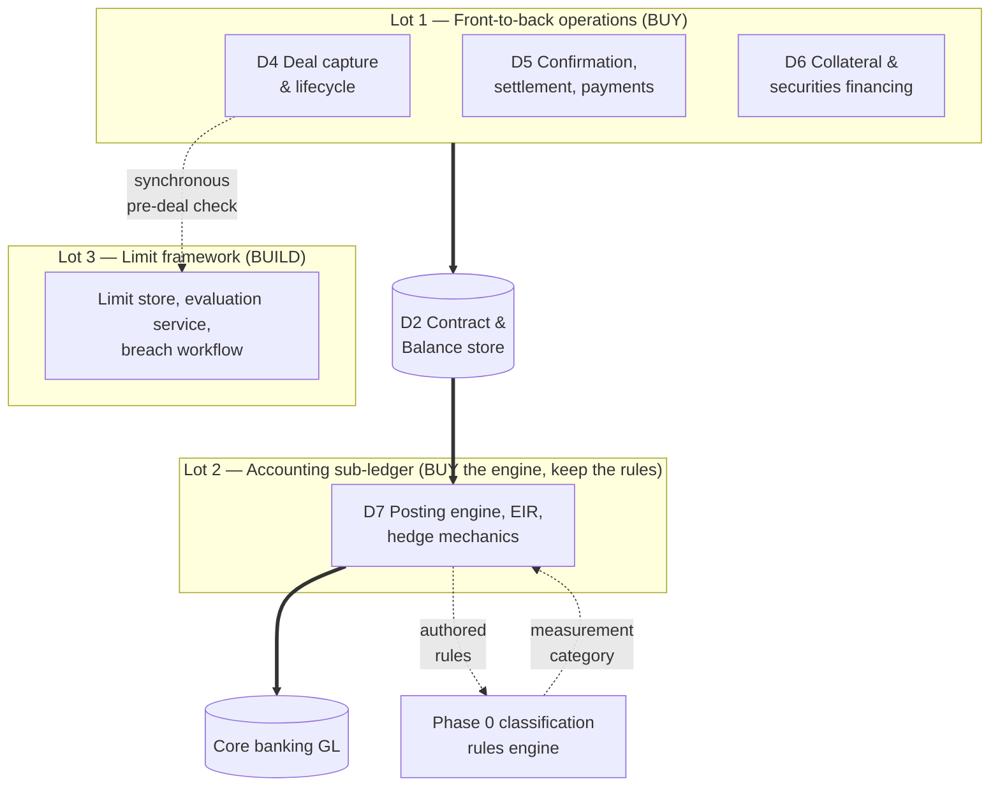

# Phase 4 Front-to-Back — Buy Evaluation Contract

D4 Deal Capture & Trade Lifecycle, D5 Confirmation/Settlement/Payments, D6 Collateral & Securities
Financing (full), D7 Accounting & Sub-ledger, and the limit framework. Parent:
`treasury-alm-risk-platform` §6, Phase 4.

**This is not a build spec, and the difference is deliberate.** Parent §6 sets the posture for this
phase as **"mostly buy, or evaluate heavily"** and names it the phase where these programmes die:
front-to-back across the full instrument universe is more work than everything else combined and
delivers operational efficiency rather than new insight. Specifying it as a build would be writing
several thousand requirements for software the bank has already decided it would prefer not to write.

So this artifact specifies the **contract a candidate package is evaluated against**: what the platform
requires from whatever fills these boxes, which of those requirements are pass/fail, how a claim is
converted into evidence, how the lots are cut, and who decides. It is equally usable as a build spec if
every lot fails — the requirements do not change with the answer — but it is written for the buy case
because that is the stated posture.

**One consequence to state up front.** The blueprint's boundaries were drawn to keep the bank's
competitive core (D1, D2, D3) and its opinions (models, factors, classification rules) inside the
platform. A bought front-to-back package arrives with its own opinions about all of them. Most of the
non-negotiables in §3 exist to hold that line, and §3.1 states plainly what holding it costs.

## 1. What is being bought, and the lot structure

**Three lots, not one and not five.**



| Lot | Contents | Posture | Why cut here |
|---|---|---|---|
| **1** | D4, D5, D6 | **Buy, single vendor** | Trade lifecycle, confirmation/settlement and collateral share one event model. A repo is a D4 booking, a D5 settlement and a D6 lifecycle simultaneously; a margin call is a D6 event that generates a D5 payment. Splitting them creates a lifecycle-event integration surface that no party owns and that shows up as breaks, not as errors |
| **2** | D7 | **Buy the engine; the classification rules stay ours** | Posting rules, EIR/amortisation mechanics and hedge reserve machinery are mature and generic. IFRS 9 classification is not generic here — D7 *authors* rules that D2 executes (parent §1, D7 §1), which is not how vendor sub-ledgers are built. §5.2 sets the resolution |
| **3** | Limit framework | **Build** | It spans pre-deal checks in D4 and post-trade utilisation from D9, D10 and D11 (parent §1.5). No vendor sells that shape; every vendor sells the half inside its own product. §6 |

**Lot 1 and Lot 2 may come from the same supplier and often will.** They are evaluated separately
anyway, because a package that is strong front-to-back and weak in IFRS 9 is common, and the bundled
price is not a reason to accept a sub-ledger that cannot pass D7 §9.

**What is explicitly not in any lot:** D2's contract and balance store, the classification rules engine,
the D15 control core, D17 orchestration, D16 reconciliation, D3 market data, and D8 valuation. These are
delivered by Phases 0–2 and are not re-procured here. A package that requires replacing any of them has
failed N1.

## 2. What the platform already provides — the vendor's starting position

A candidate arriving in Phase 4 does not arrive at a greenfield. This is the environment it must fit,
and it is also the reason a Phase 4 purchase is cheaper than it looks: four of the capabilities a
front-to-back package normally charges for already exist.

| Already built | From | Consequence for the vendor |
|---|---|---|
| Canonical Contract and Balance store, fifteen dimensions, projection engine | D2, Phase 0 | The package does not own treasury's book of record (N1) |
| Classification rules engine, incl. the customer-aggregation pass | Phase 0 | The package's own classification engine is switched off (N4) |
| Versioned, effective-dated reference data, legal agreements and netting sets | D1, Phase 0 | The package consumes agreement terms; it does not master them |
| Audit trail, four-eyes and override control core | D15, Phase 0 | The package's internal maker-checker must be subordinated or evidenced to the platform's (N5) |
| Ingestion, reconciliation, break register, data quality | D16, Phase 0 | The package does not bring its own recon tool |
| Batch orchestration, gate state machine, provisional propagation | D17, Phase 0 | The package's internal scheduler is subordinate to D17 (N6) |
| Market data snapshots, curves, provenance | D3, Phases 0–2 | The package does not mark its own curves |
| Valuation, sensitivities, exposure-by-bucket | D8, Phase 2 | The package's pricing library is not used for reported numbers |
| Minimal encumbrance register | D6 subset, Phase 0 | The full D6 either adopts this register or replaces it under a stated migration (§5.1) |

## 3. Non-negotiables — pass/fail

**A candidate failing any of these is disqualified, not scored down.** Each is stated with the failure
it prevents, because a non-negotiable that cannot be justified will be traded away in a commercial
negotiation at 2am.

| # | Non-negotiable | What it prevents |
|---|---|---|
| **N1** | **D2 remains the system of record.** The package originates and manages treasury deals and publishes lifecycle events to D2. Its internal store is a working copy, never the golden source for position, classification or reporting | Two contract stores with divergent classification. Every downstream number — LCR, EVE, RWA, the balance sheet — would then have two answers and no tiebreak |
| **N2** | **Event publication is complete, typed and ordered.** Every state change publishes with object ID, event type, effective and system timestamps, and enough before/after detail to satisfy D7 §3's substantial-modification test | Silent divergence between package and D2; an amendment that reaches D2 as a new state with no event is a modification the sub-ledger cannot account for |
| **N3** | **Derived values are never sent as inputs.** The package must not supply accrued interest, amortised cost, or fair value as facts to D2 (parent §2.1). It may compute them internally for its own screens | The accrued interest double-count in parent §2.1 — an architectural GL break |
| **N4** | **Classification is consumed, not authored.** The package accepts accounting and regulatory classification, measurement category and the fifteen dimensions from the platform and does not derive its own | Two rule sets, one of them unversioned and unauditable, disagreeing about HQLA eligibility or measurement category |
| **N5** | **Four-eyes, audit and override route through the D15 control core**, or the package's internal equivalent emits to it in a form D15 can adjudicate and report on. Append-only, never physically deleted | An audit trail split across two systems, which is not an audit trail |
| **N6** | **D17 orchestrates.** The package exposes its batch stages as externally triggerable, individually re-runnable units with observable completion status, and honours the provisional flag | An unowned scheduler inside the EOD window, and gate failures that do not propagate |
| **N7** | **Synchronous external pre-deal limit check at booking.** The package calls the platform's limit service before commit and blocks on a hard breach (§6.3) | The single most common Lot 1 failure. A package with internal-only limits either duplicates the limit store or cannot check the exposures that live in D9/D10/D11 |
| **N8** | **Structured legal agreement terms are consumed from D1** — ISDA, CSA, GMRA, GMSLA, netting sets, thresholds, MTAs, eligible collateral schedules, rehypothecation rights (parent §2.7) | A second agreement master. Also the CSA-driven discount curve selection (parent E1) breaks if D6 holds different terms from D3 |
| **N9** | **Hedge designation is captured at booking and the booking is rejected if incomplete** (D7 §4.3) | Designation retrofitted after the fact, which is not a hedge and fails on audit. Cannot be remediated later at any price |
| **N10** | **Full data extractability with documented schemas, on demand, without vendor assistance** | Exit cost that makes the next decision unfree. Also the practical precondition for D16 reconciling the package against D2 |

### 3.1 The cost of N1, stated rather than discovered

**Holding D2 as system of record while buying a front-to-back package creates a new reconciliation
that does not exist today: package population against D2 population.** This is a real, permanent
operating cost — a new reconciliation in D16, a new break class, and an owner.

It is worth paying, and the alternative is worse. Letting the package be the store means the Balance
primitive (parent §2.1), the fifteen dimensions (Appendix B.1), the reproducible projection signature
(§2.5) and the quarantine-presents rule (§5) either move into the package or are lost. The first is not
on offer from any vendor and the second breaks the balance sheet.

**Budget the recon in the business case.** A Phase 4 cost model that omits it will be wrong by an
ongoing FTE and a build item, and will be discovered after signature.

## 4. Instrument coverage — the demonstration list

**Coverage claims are worthless at this level of generality.** Every front-to-back vendor claims the
instrument universe in Part 1. The claim is tested against the specific constructions where the
platform's model is unusual, all of which are documented findings from earlier work rather than
invented difficulties.

Each row is demonstrated on the bank's own data, in the vendor's software, in front of the evaluation
team. A slide is not a demonstration.

| # | Construction | Source | Pass condition |
|---|---|---|---|
| 1 | **FX swap booked as two linked Contracts** | Appendix A.4 | Two contracts, two maturity dates, linkage preserved through lifecycle and settlement. A single contract with two dates is a fail |
| 2 | **Collateral swap with no cash leg** | Appendix A.2 | Books and lifecycles without a synthetic cash leg being invented |
| 3 | **Tri-party collateral as an agent-reallocated basket** | Appendix A.2 | Basket-level position with daily reallocation, not a list of fixed ISINs |
| 4 | **Repo'd-out security remains a Position, encumbered; reverse-repo security is not a holding but counts to HQLA if eligible and rehypothecable** | Appendix A.2, §2.9 | Both directions correct, and the encumbrance visible to D2 within the same day |
| 5 | **Central bank facility drawing originated from collateral pool state** (D6 → D2 inversion) | Parent §1.7 | Contract originates in D6 without a dealer booking |
| 6 | **Commodity leg as quantity × price**, relaxing one-currency-per-Leg | §2.2, Appendix A.7 | Not modelled as notional × rate |
| 7 | **Total return and equity swap using the return leg treatment** | §2.2 | Price appreciation plus distributions, not a floating index |
| 8 | **ABS/MBS and index CDS with externally projected cashflows, stored not regenerated** | §2.2 | Accepts an external cashflow vector as authoritative |
| 9 | **Futures: exposure and variation margin with no contractual cashflow** | §2.2, Appendix A.5 | Does not fabricate cashflows to make the position representable |
| 10 | **Exotic FX options — barriers, digitals** with trigger levels carried on the contract | Appendix A.4; source Part 1 §4 | **Mandatory.** In the instrument universe, so a package that cannot represent a barrier level on the contract is disqualified |
| 11 | **Non-substantial modification with immediate P&L catch-up at the original EIR** | D7 §3 | Lot 2. The most commonly missing accounting behaviour in the market |
| 12 | **Stage 3 interest on net carrying amount**, with the ECL interface sequenced before accrual | D7 §3, §9.4 | Lot 2 |
| 13 | **FVOCI debt vs FVOCI equity behaving oppositely** on impairment and recycling | D7 §2.2 | Lot 2. Routinely implemented as one category |
| 14 | **Cash flow hedge of a group of forecast transactions**, with a non-Contract hedged item | D7 §4.2, §9.9a | Lot 2. Carries part of the structural hedging load under the IFRS 9-only decision |
| 15 | **Cost of hedging election per relationship**, with its reserve | D7 §4.6 | Lot 2, conditional on the election (§9) |
| 16 | **Committed liquidity facility received**, which has no balance sheet anchor | Appendix A.9, B | Represented in a register, not forced onto a balance sheet line |
| 17 | **Bankers' acceptance**, which has no Part 2 home | Appendix A.1, B | Books and is reportable as an explicit non-appearance rather than silently dropping |

**Rows 1–10 and 16–17 are Lot 1. Rows 11–15 are Lot 2.** A candidate may fail individual rows and
remain viable — §7's scoring handles that — except where a row is also a non-negotiable (row 4's
encumbrance visibility supports the three-way custodian reconciliation in parent §4.1 and the HQLA
correctness in §7).

## 5. Lot-specific requirements

### 5.1 Lot 1 — D4, D5, D6

**D4 Deal capture and lifecycle.** Booking across the Part 1 universe; amendments, novations,
terminations, exercises, fixings, rollovers, restructurings; four-eyes authorisation on amendments and
cancellations; the synchronous limit check (N7); hedge designation capture (N9); and event publication
carrying before/after detail (N2). Also **the interim ingestion path**: until cutover, D2's treasury
contracts arrive from the incumbent TMS by batch extract (critique §322), and the package's arrival
replaces that feed — the migration is part of the lot, not a separate project.

**D5 Confirmation, settlement and payments.** Confirmation generation and matching with the required
window and escalation on breach (parent §4); settlement instruction management; nostro management at
**event granularity with timestamps, not end-of-day balances** (parent §4 — the same feed intraday
monitoring later needs); payment generation and release under segregation of duties; failed-trade
handling. **Market infrastructure connectivity is the main thing being bought here** and is the
strongest single argument against building Lot 1.

**D6 Collateral and securities financing.** Repo, reverse repo, tri-party, securities lending and
borrowing, haircuts, margining and margin calls, optimisation and substitution, central bank pool
management. Plus two boundary inversions the package must accommodate (parent §1.7): **D6 originates
Contracts**, and **D6 encumbrance drives D2's HQLA classification**.

**The Phase 0 encumbrance register is a migration, not a greenfield.** A minimal register exists from
Phase 0 for two independent reasons — HQLA unencumbered status (parent §7) and the three-way custodian
reconciliation (§4.1). The candidate either adopts it as the register of record or replaces it, and
**must state which at evaluation time with a migration path**. An unstated answer here produces two
encumbrance views and an HQLA number that moves depending on which is read.

### 5.2 Lot 2 — D7, and the rule-authoring problem

D7 §9's thirteen acceptance criteria are the requirement set; they are not restated here. What the
evaluation must resolve is the structural mismatch:

**The blueprint has D7 author accounting classification rules that D2 stores and executes** (parent
§1, D7 §1). **Vendor sub-ledgers classify internally.** N4 says the package consumes classification.
Both cannot hold as stated.

**Resolution: the platform's classification engine is authoritative and the package is a
measurement-category-driven posting engine.** Concretely — the business model assessment (portfolio
scope) and SPPI test (instrument scope, over D2's accounting-characteristics view) run in the platform's
rules engine; the resulting measurement category is an input to the package; the package's own
classification module is disabled and evidenced as disabled. What is bought is EIR and amortisation
mechanics, modification accounting, hedge reserve machinery, multi-currency revaluation, and posting
generation.

**A candidate that cannot accept an externally-determined measurement category per instrument fails
N4.** This is a specific, testable question to put in the RFI, and it eliminates candidates early and
cheaply.

Two further Lot 2 constraints:

- **Postings carry object ID, event ID and valuation reference** (parent §4, D7 §7.1). Without this a
  GL break decomposes to a lump, and the reconciliation described in parent §4 does not exist
- **The GL posting interface is an open question** (D7 §11.7) — contract-level detail or batch summary.
  This must be answered *before* the RFI, because it changes both what the package must emit and what
  the reconciliation can achieve. See §9

### 5.3 What Lot 2 does not have to do

**No macro hedge accounting, no IAS 39, no 80–125% bright line anywhere** (D7 §4.1, parent F2). A
candidate whose IFRS 9 module is priced or scoped around portfolio fair value hedge machinery is being
paid for capability this bank has decided not to use — and the decision is documented with its costs
(D7 §4.1) and its revisit trigger (CET1 volatility, not earnings volatility — parent F3).

**Net investment hedging is not built** (D7 §4.5, parent F4). It is blocked on the group-structure
investigation, not decided out, so it belongs in the roadmap-commitment question of §8 rather than in
the requirement set.

## 6. Lot 3 — the limit framework, and why it is built

### 6.1 The decision

**Build.** Parent §1.5 moved the limit framework out of D11 and into Phase 4 precisely because it is not
a risk-analytics capability: it is consumed by D4's pre-deal checks and fed by D9, D10 and D11's
outputs. Every vendor that sells a limit module sells the half that lives inside its own product — a
TMS limit module cannot see EVE utilisation, and a risk-system limit module cannot block a booking.

It is also small relative to the rest of Phase 4: a versioned limit store, an evaluation service, a
breach workflow, and utilisation feeds. The build is justified by shape, not by differentiation.

### 6.2 Limit types in scope

| Type | Fed by | Note |
|---|---|---|
| Counterparty credit exposure, per netting set | D11 | SA-CCR and PFE compute per netting set (parent §2.7) |
| **Large exposures — 25% of Tier 1**, on connected-counterparty groups | D13, D1 group hierarchy | A separate Basel regime with hard limits (critique §404). D1 already carries the hierarchy |
| Settlement and issuer risk | D11 | Issuer keys off the **issuer/obligor** counterparty split, not the transaction counterparty (Appendix B.1) |
| Notional, tenor and product limits | D4 | The only ones a bought TMS would cover natively |
| Sensitivity and VaR limits | D8, D11 | Phase 5 feeds; the limit type exists from Phase 4 with the feed arriving later |
| IRRBB — EVE and NII utilisation | D9 | |
| Liquidity early warning and concentration | D10 | D10 §440 routes early-warning breaches here |
| Intraday cash and nostro | D5 | |

### 6.3 The pre-deal check contract

This is the interface N7 tests, and it needs a stated budget rather than an aspiration:

```
check(proposed_deal, book, counterparty, netting_set, as_of) → {pass | soft_breach | hard_breach, headroom, limit_ids}
```

- **Latency: p99 ≤ 500ms** at booking. The package blocks on the call
- **Hard breach blocks the booking. Soft breach permits with reason code and escalation.** The
  distinction is a limit attribute, not a package configuration
- **Utilisation is as-of the freshness the source allows.** Intraday for cash, nostro and notional;
  **last night for anything sourced from the banking book** (parent §3), with a freshness stamp on the
  response. A limit check that presents an overnight EVE utilisation as live is a control that lies
- **Limit changes are four-eyes at elevated authority** (`d15-control-core` §72), versioned and
  effective-dated like everything else

### 6.4 Where the limit framework runs

Note that **limit consumption is already on the tier A critical path** (`eod-window-and-degradation`
§3) — limit availability for dealers by 07:00 is one of the four tier A outputs. Lot 3 therefore has a
batch face inside the ≤90 minute tier A budget as well as the intraday service face above, and both must
be sized. This is the one part of Phase 4 that is inside the EOD window rather than beside it.

## 7. Evaluation procedure

**Five stages, with elimination as early as possible.** The demonstration stage is expensive for both
sides; the point of stages 1 and 2 is to run it three times, not eight.

| Stage | Activity | Output | Eliminates on |
|---|---|---|---|
| **1. RFI screen** | The ten non-negotiables (§3) and the twelve highest-signal coverage rows as direct yes/no questions, with the architecture summary in §2 attached | Longlist → shortlist | Any N answered no, or an N4/N7 answer that reveals an internal-only classification or limit store |
| **2. Architecture review** | Vendor architect and platform architect, against §2, §3 and §5. Written, not presented | Recorded fit assessment per non-negotiable | Fit that only works via vendor customisation of core product |
| **3. Scripted demonstration** | §4's list, on the bank's own extract, in the vendor's software, run by the vendor with the evaluation team present | Scored coverage matrix with evidence level per row | Failure on rows that are also non-negotiables |
| **4. Reference and operational review** | Two references at comparable scale and instrument mix. Upgrade cadence against regulatory change. Support model against the EOD window (§8) | Operational risk assessment | Nothing automatic; feeds the weighted score |
| **5. Cost model and decision** | Total cost over seven years including the N1 reconciliation (§3.1), migration, adapters, and exit | Decision record (§10) | — |

### 7.1 Scoring, and the evidence rule

Scored requirements — everything that is not a non-negotiable — use one scale, and the level of
evidence is part of the score rather than a footnote to it:

| Score | Meaning |
|---|---|
| **4** | Demonstrated on our data, in stage 3 |
| **3** | Demonstrated on vendor data, or configurable within documented product capability |
| **2** | Available via configuration the vendor has done before but did not show |
| **1** | Roadmap commitment with a date (§8) |
| **0** | Not available, or customisation of the core product |

**A claim with no evidence level scores 0.** This rule is the whole point of the scoring scheme: the
difference between a 4 and a 2 in a treasury package selection is usually the difference between a
delivered programme and a two-year customisation.

**Weights** are set before the RFI is issued and are not revised after scores are seen. Recommended:
instrument coverage 30, integration and boundary fit 25, accounting correctness (Lot 2) 20, operations
and support 15, commercials 10 — reweighted per lot.

## 8. Commercial terms that follow from the architecture

These are requirement-derived, not boilerplate, and each traces to something in the blueprint:

| Term | Why |
|---|---|
| **Data extractability warranty** with documented schemas and no per-extract fee | N10. Also the standing precondition for the §3.1 reconciliation |
| **Regulatory change cadence** committed in the contract, with a defined lead time before regulatory effective dates | Parent F8: no override may permit a submission from provisional data. A late vendor release becomes a reporting failure, not an inconvenience |
| **Support model covering 00:00–07:00** | `eod-window-and-degradation` §1: the window is entirely outside business hours. A vendor answering at 09:00 does not help a pipeline that had to finish at 07:00 |
| **Performance warranty against the tier A budget** where the package sits on the critical path | ≤90 minutes tier A, ≤3 hours full pipeline (`eod-window-and-degradation` §2) |
| **Roadmap commitments dated and contractual**, not indicated | Score 1 in §7.1 is only meaningful if the date is enforceable. Net investment hedging (D7 §4.5) is the likely example, if the group-structure question resolves the other way |
| **Escrow of posting rules and configuration in readable form** | D7's outputs must be explainable to an external auditor who does not accept "the system calculates it" (D7 preamble) |

## 9. What must be answered before the RFI is issued

**These are not evaluation findings; they are inputs.** Issuing the RFI without them produces answers
to the wrong questions, and three of them change scope materially.

| # | Question | Source | Effect if unanswered |
|---|---|---|---|
| 1 | **Which GL is authoritative, and is the posting interface contract-level or batch summary?** | D7 §11.7 | Changes what Lot 2 must emit and whether GL breaks decompose. The single most consequential input |
| 2 | **Can the incumbent TMS produce a contract-level extract?** | Parent F, D16 §12 | Without it Phases 0–3 have no treasury book, and Lot 1's migration path is unknown |
| 3 | **Is cost of hedging elected?** | D7 §11.1 | Adds demonstration row 15 and a reserve line the taxonomy does not carry |
| 4 | ~~**Are exotic FX options held?**~~ **Closed — in scope.** Source Part 1 §4 lists barriers and digitals in the instrument universe | Source Part 1 §4; D8 §11.1 | **Demonstration row 10 is mandatory, not conditional.** Current holdings affect sequencing only, never whether a package must support them |
| 5 | **Is the fair value option applied anywhere?** | D7 §11.4 | Adds the own-credit OCI reserve and its CET1 filter |
| 6 | **Are there POCI assets?** | D7 §11.5 | Credit-adjusted EIR is different mechanics, small population, consistently absent from packages |
| 7 | **The four group-structure signals** | Parent Appendix D | Decides whether net investment hedging, elimination and consolidation are roadmap items or out of scope. Moves as one question, never piecemeal |

**Questions 3–6 are elections and facts about the bank's own book, not design decisions.** They are
answerable now, by finance and treasury, without any platform work — and each one left open converts a
pass/fail demonstration row into a negotiation after signature.

## 10. Outputs of the evaluation

The evaluation is complete when it has produced, per lot:

1. **A scored coverage matrix** over §4, with evidence level per row
2. **A non-negotiable compliance statement** per candidate, with the vendor's own words recorded
   against each of N1–N10
3. **A gap register** — every scored requirement below 3, with the remediation route (configure, build
   alongside, accept, or defer) and its cost
4. **A boundary decision record** — for Lot 1, whether the Phase 0 encumbrance register is adopted or
   replaced (§5.1); for Lot 2, confirmation that classification is consumed and the internal engine
   disabled (§5.2)
5. **A seven-year cost model** including the N1 reconciliation, migration from the incumbent TMS, the
   adapter build, and exit
6. **A recommendation with the runner-up and the reason**, because the second-best package is what the
   programme falls back to when stage 5 fails commercially

## 11. Timing — this evaluation starts before Phase 4

**Stages 1 and 2 should run during Phase 2, and stage 3 during Phase 3.**

Three reasons, none of them impatience. Front-to-back selections take six to twelve months of elapsed
time and the phase cannot start until one concludes. The demonstration in stage 3 needs a real contract
extract, classified — which is a Phase 0 output, so the input exists from Phase 1 onward. And the
answers to §9's questions 1 and 2 are needed by D16 and D7 independently of the purchase, so gathering
them early is not work done speculatively for a vendor.

**One dependency runs the other way and is already moving.** Structured legal agreement terms —
`counterparty-documentation-workstream` — became a **Phase 2** blocker rather than a Phase 4 one when
CSA-driven discounting was surfaced (parent §2.7, E1). Lot 1's D6 depends on the same extraction, so by
the time this evaluation reaches stage 3 the agreement data should exist. If it does not, demonstration
rows 3, 4 and 16 cannot be run on real data and the evaluation degrades to vendor-data evidence — a 3
rather than a 4, on the rows where the difference matters most.
