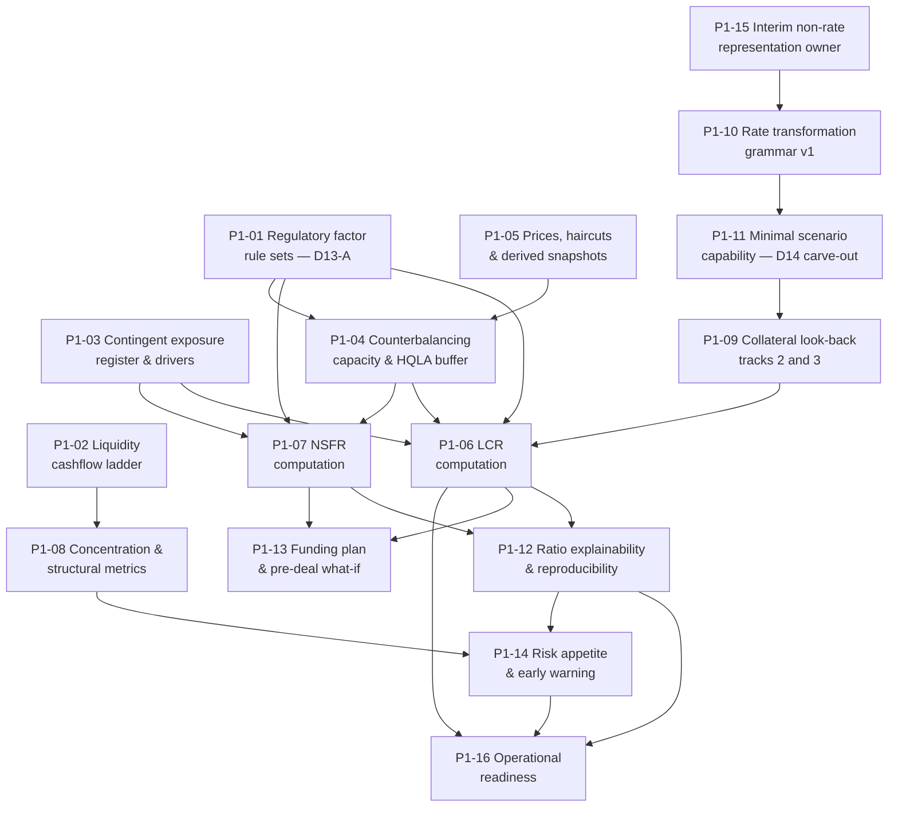

# Phase 1 — Ticket Breakdown

**Sixteen tickets** covering the Phase 1 scope in `treasury-alm-risk-platform` §6. Parent:
`treasury-alm-risk-platform`. Companion to `tickets` (Phase 0), whose structure this follows.

**What Phase 1 delivers:** daily regulatory liquidity ratios — LCR and NSFR — computed from the bank's
own records, by significant currency, decomposable to the contracts driving them and reproducible for
any past date. Plus the contractual funding view, concentration, and the pre-deal what-if that turns the
platform from a reporting tool into a decision tool.

**What it does not deliver, and this must be said plainly because revision 1 implied otherwise:**
the **internal** liquidity view. Survival horizon, the behavioural ladder and any defensible internal
stress view need D9's behavioural models and **are Phase 3** (D10 §3.1, §5). Phase 1 gives the
regulator's number and the contractual view. **Liquidity is not finished after Phase 1**, and a plan
that says otherwise will be read as a promise.

## Why Phase 1 works without behavioural models

The load-bearing argument, and it is worth restating because the whole phase order rests on it:
**LCR is not a cashflow aggregation. It is a rules engine over classified balances.** A retail current
account contributes 5% or 10% of its *balance* regardless of its contractual overnight cashflow, and
the run-off factors are **constants handed down by the regulator that the bank is not permitted to
substitute its own view for** (D10 §3.1).

So what Phase 1 needs is **correct classification and prescribed factors** — both available from Phase 0
— not calibrated models. NSFR follows the same argument. This is why liquidity comes before ALM.

## Dependency graph

**Phase 0 dependencies, not drawn:** every ticket here rests on P0-06 (classification), P0-07 (position
derivation), P0-10 (encumbrance register), P0-11 (control core) and P0-12 (orchestration). P1-02 needs
P0-05 projection; P1-05 needs P0-04 snapshots; P1-03 needs P0-02 legal agreements.

## Waves

Each wave leaves the platform in a working state.

| Wave | Tickets | State at the end |
|---|---|---|
| **1** | P1-01, P1-15, P1-10 | Prescribed factors are authored and governed; the grammar exists ahead of the Phase 2 library choice |
| **2** | P1-05, P1-02, P1-03 | Prices and haircuts land; the ladder buckets; contingent exposure is inventoried on both sides |
| **3** | P1-04, P1-11, P1-09 | The HQLA buffer computes with caps; scenarios are approvable; the look-back has a defensible number |
| **4** | P1-06, P1-07 | **Both regulatory ratios compute**, in aggregate and by significant currency |
| **5** | P1-08, P1-12, P1-13, P1-14 | Ratios explain and reproduce; concentration reports; what-if answers; appetite is monitored |
| **6** | **P1-16** | **The ratios are operationally live** — parallel run against the current process complete, differences explained to the regulator |

**P1-01, P1-15 and P1-10 come first for the same reason P0-11 and P0-15 did in Phase 0.** Two are
subject-matter work with long lead times and no engineer can do them, and the third — the grammar — has
a deadline set outside this phase entirely: **it must exist before the Phase 2 pricing library is
chosen**, because *"are perturbation conventions configurable to match D14's shocks"* is an evaluation
criterion and **a criterion cannot be evaluated against a convention that does not exist**
(`rate-transformation-grammar`, D8 §9). The remedy for choosing a library with fixed incompatible
conventions is a different library, which makes this the one Phase 1 item that is irreversible in the
wrong direction.

## Four things that are not tickets

**1. The regeneration test is already delivered.** Parent §6 lists *"D15 regeneration test"* against
Phase 1. **`tickets/p0-13` delivered it in Phase 0 wave 5**, together with per-contract digests and
retained engine builds. Phase 1 inherits it and must not re-plan it — what Phase 1 owes is extending its
*coverage* to the ratios, which is P1-12 rather than a new capability.

**2. Regulatory submission is Phase 6.** Phase 1 computes LCR and NSFR as numbers that reconcile to the
regulator's worked examples. **It does not produce returns.** D13-B — the returns engine, templates and
submission calendar — is Phase 6 (D13 §1.1). A Phase 1 plan that promises "regulatory reporting"
promises the wrong thing; what it delivers is the ratio, which is the harder half.

**3. Track 1 of the collateral log is pre-Phase-0 and running.** P1-09 covers tracks 2 and 3 only —
reconstruction and the proxy. **Track 1 is a named daily owner logging seven fields**, and it should
have started before Phase 0 did (D10 §3.6). If it has not started, that is an escalation, not a ticket.

**4. Intraday liquidity is deferred to Phase 4**, correctly, because it needs payment and nostro event
streams that arrive with front-to-back (D10 §8). What Phase 1 must not do is foreclose it — P1-02 notes
the constraint.

## Sizing note

Estimates are deliberately omitted, as in Phase 0. Three tickets carry materially more uncertainty than
the rest:

| Ticket | Why uncertain |
|---|---|
| **P1-01** Factor rule sets | Volume and precision of prescribed content, and it is **subject-matter capacity, not engineering** — the binding constraint the executive summary names as the most likely cause of delay |
| **P1-09** Collateral look-back | Depends entirely on what 24 months of statement retrieval actually recovers, which nobody knows until the requests go out |
| **P1-06** LCR computation | The adjusted-HQLA unwind and the cap interaction are where implementations fail against the regulator's worked examples, and "we compute a ratio" is not the same as "it reconciles" |

**P1-01 should be estimated first and started first.** It is the Phase 1 analogue of P0-15, and the
engine it feeds is already built and waiting.

## Decisions that gate acceptance

Six bank decisions sit inside this phase. **None is engineering work**, all have lead times, and they
are tracked in `phase-breakdown-readiness` §3.

| # | Decision | Gates | Owner |
|---|---|---|---|
| 1 | **Deposit insurance coverage threshold and aggregation rule** | P1-01, P1-06 — and P0-06's customer-aggregation pass cannot be tested without it | D13 interprets; D1 holds the data |
| 2 | **Significant currency threshold** — which currencies need their own ratio | P1-06, P1-07 | Regulatory reporting |
| 3 | **Three taxonomy policy elections** (`taxonomy-policy-decisions` §3) | P0-14 acceptance, and Phase 1 classifies off the same rules | Finance |
| 4 | **Who approves internal stress scenarios** — ALCO presumed | P1-11 | ALCO |
| 5 | **EOD window and degradation order** — formal sign-off | P1-06, P1-07 sizing | ALCO and finance |
| 6 | **Collateral log ownership and statement-request authority** | P1-09 — and every deferred month is permanently lost | Treasury operations |

**Decision 1 is the one that blocks quietly.** Without it P0-06's customer-aggregation pass has a
threshold, an allocation rule and a sequencing rule that are all unstated, and the insured/uninsured
split moves between runs with the LCR moving with it.

## Amendments carried in from the cross-artifact pass

Applied to the governing artifacts before this breakdown was written, and reflected in the tickets:

| Ref | Change | Tickets |
|---|---|---|
| `D11-H2` | **The limit framework is Phase 4, not part of D11.** D10 §7 and §9 said otherwise. Phase 1's thresholds arrive two phases before the framework meant to receive them — so Phase 1 carries its own escalation or accepts manual routing | P1-14 |
| `D12-6` | **The contingent liquidity charge is a required FTP component.** Phase 1 does not build FTP, but it owns the measurement basis, and the driver must be agreed now rather than re-derived in Phase 6 | P1-03 |
| `D15-3` | **The collateral outflow proxy is a model**, tier 1, disclosed to a regulator as an interim method, and the only model in the inventory with a planned retirement date | P1-09 |
| `D12-2` | D10 acceptance criterion 9 gains a third column — **not a Phase 1 test**, since D9 and D12 do not exist yet. Recorded so it is not read as one | — |

## Tickets

| # | Ticket | Governing artifacts |
|---|---|---|
| P1-01 | Regulatory factor rule sets *(non-engineering)* | D13 §1.1; D10 §3.1, §4 |
| P1-02 | Liquidity cashflow ladder | D10 §2, §2.1 |
| P1-03 | Contingent exposure register & drivers | D10 §2.2 |
| P1-04 | Counterbalancing capacity & HQLA buffer | D10 §2.3, §3.2 |
| P1-05 | Prices, haircuts & derived snapshots | D3 §3, §10; parent Appendix E4 |
| P1-06 | LCR computation | D10 §3 |
| P1-07 | NSFR computation | D10 §4 |
| P1-08 | Concentration & structural metrics | D10 §5 |
| P1-09 | Collateral look-back — tracks 2 and 3 | D10 §3.6 |
| P1-10 | Rate transformation grammar v1 | `rate-transformation-grammar` |
| P1-11 | Minimal scenario definition capability | D14 §9 carve-out |
| P1-12 | Ratio explainability & reproducibility | D10 §10; D2 §7 |
| P1-13 | Funding plan & pre-deal what-if | D10 §7 |
| P1-14 | Risk appetite & early warning | D10 §7, §9 |
| P1-15 | Interim non-rate representation owner *(non-engineering)* | D11 §6.3; `D11-10` |
| P1-16 | Operational readiness | D10; `eod-window-and-degradation` |
