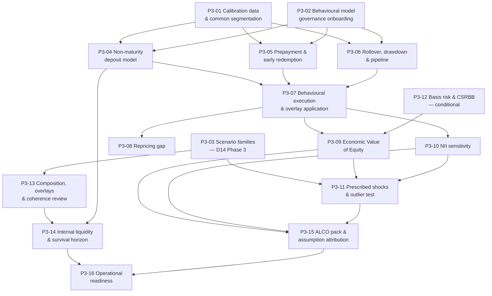

# Phase 3 — Ticket Breakdown

**Sixteen tickets** covering the Phase 3 scope in `treasury-alm-risk-platform` §6. Parent:
`treasury-alm-risk-platform`. Companion to `tickets` (Phase 0) and `tickets-phase1`, whose structure
this follows.

**What Phase 3 delivers:** the ALCO pack produced from source data — repricing gap, EVE, NII and the
supervisory outlier test — the behavioural models that drive all of them, D14's main scenario body, and
**the internal liquidity view Phase 1 deliberately did not deliver**: survival horizon, the behavioural
ladder and internal stress.

**What it does not deliver:** anything needing deal capture (Phase 4) or simulation and history depth
(Phase 5). FTP consumes these models but arrives in Phase 6.

## The phase where the assumptions become the answer

Every other phase in this programme computes something. **This one decides things**, and the executive
summary names the consequence as a principal risk: *for interest rate risk, the assumptions about
customer deposit behaviour drive the result more than the balance sheet does.*

That shapes the whole breakdown. **Three tickets in Phase 3 are model-building** (P3-04, P3-05, P3-06),
one is model *governance* (P3-02), and governance comes first rather than last. A behavioural model that
reaches production unvalidated produces a number indistinguishable from a validated one, is used to set
limits and file returns, and is discovered when a regulator asks who approved it.

## What it inherits, and what that saves

| Inherited | From | Used by |
|---|---|---|
| **The liquidity cashflow ladder** — bucketing, currency slicing, refinement-not-re-partition | `tickets-phase1/p1-02` | P3-14 adds the behavioural basis to an existing ladder rather than building a second one |
| **The scenario envelope, approval route and derived snapshots** | `tickets-phase1/p1-11` | P3-03 populates families into a governed object that already exists |
| **The rate transformation grammar** | `tickets-phase1/p1-10` | P3-11's prescribed shocks are expressed in it, so ΔEVE and DV01 reconcile by construction |
| **Prices, haircuts, provenance** | `tickets-phase1/p1-05` | P3-14's counterbalancing capacity under stress |
| **Reproducibility and digests** | `tickets/p0-13`, `p1-12` | P3-15's assumption attribution |

**The saving is real and worth stating to whoever sizes this phase.** P3-14 — survival horizon and the
internal stress view — is a *parameterisation* of P1-02 and P1-11, not a new engine. If it is planned as
a new engine, the bank ends up with two ladders that disagree.

## The Phase 2 dependency, which the phase table understates

**EVE is a present-value measure and NII is a projection under shocked curves. Both need D8.** Phase 3
cannot start its measurement tickets until Phase 2 delivers valuation, sensitivities and
`exposure_by_bucket`. Specifically:

- **P3-08's repricing gap consumes `exposure_by_bucket`** for options and futures — a gap built on
  cashflows alone silently omits the optionality it most needs to show
- **P3-09's EVE needs discounting** across the banking book on both base and shocked curves
- **The bucket boundaries must be D1's shared set**, or the cashflow half and the exposure half of the
  gap do not add up — and the failure is silent, because each half looks reasonable alone

## Dependency graph

**Not drawn:** every measurement ticket depends on Phase 2's D8, and every model ticket on P0-06's
classification and P0-11's control core.

## Waves

| Wave | Tickets | State at the end |
|---|---|---|
| **1** | P3-01, P3-02, P3-03 | Calibration data exists over a governed segmentation; the model framework can accept a model; scenario families are defined |
| **2** | P3-04, P3-05, P3-06, P3-07 | The behavioural models exist, are validated, and **D2 executes them** |
| **3** | P3-08, P3-09, P3-10 | Gap, EVE and NII compute on both bases |
| **4** | P3-11, P3-12, P3-13 | The outlier test runs; CSRBB is answered either way; scenarios compose and are reviewed for coherence |
| **5** | P3-14, P3-15 | The internal liquidity view exists; the ALCO pack is produced from source data |
| **6** | **P3-16** | **The pack is operationally live** — ALCO oriented and challenging assumptions; the recalibration cycle is running |

**P3-02 is in wave 1 deliberately, and it is the wave-1 item most likely to be argued out of position.**
Validation before first use means the validation capability must exist when the model does. A model built
in wave 2 and validated in wave 5 has been setting limits for three waves.

## Three things that are not tickets

**1. Model validation itself is not a D9 build item.** P3-02 onboards these models into D15's framework
and supplies what D15 requires. **Whether an independent validation function exists is a hiring and
budget question** (`D15-13`), it is the single most consequential open item in D15, and it produces no
deliverable — which makes it the thing most likely to be quietly dropped. If the answer is "no function",
that is an escalation before wave 2, not a discovery in wave 5.

**2. The revalidation cycle starts here and never stops.** A curve model validated in Phase 2 falls due
again in Phase 3 (`D15-2`). Phase 3 is where the periodic cycle becomes a standing operational
commitment rather than a project task, and it belongs in a run-book, not a ticket.

**3. FTP is Phase 6.** P3-05's prepayment models are an input to FTP's option cost component and P3-04's
are an input to its repricing component, but **D12 builds none of it here.** What Phase 3 owes is models
whose parameters are versioned and attributable per component (`D12-1`).

## Sizing note

Estimates omitted, as in Phases 0 and 1. Three tickets dominate:

| Ticket | Why uncertain |
|---|---|
| **P3-04** NMD model | **The single largest uncertainty in the phase and probably the programme.** For most retail banks this one model drives the IRRBB result more than any other input, and its calibration depends on history that may not exist (gating decision 1) |
| **P3-01** Calibration data | Nobody knows what core banking can supply until it is asked. If the history is not there, every model in wave 2 becomes judgement-led — which is a legitimate answer that must be *disclosed*, not discovered |
| **P3-10** NII | Three balance sheet bases, each producible and each labelled, plus the margin compression asymmetry. The dynamic basis embeds the business plan, which makes it an organisational negotiation as much as a build |

## Decisions that gate acceptance

| # | Decision | Gates | Owner |
|---|---|---|---|
| 1 | **Does NMD balance and rate history exist through a full rate cycle, and is it retrievable?** | P3-01, P3-04 | Core banking / data |
| 2 | **Is CSRBB in scope?** One answer discharges `D3-3`, D9 q4 and D14 q6 | **P3-12 entirely**, and D3's Phase 3 content | ALCO with regulatory reporting |
| 3 | **Deposit beta observability in the local rate environment** — administered or floored regimes may make the relationship weak or absent | P3-04 | ALM / treasury risk |
| 4 | **NMD segmentation granularity** — what customer data supports | P3-01, and it sets the ceiling on model quality | Data |
| 5 | **Internal hedge recognition policy**, and the control ensuring the trading book lays risk off externally | P3-08, P3-09 scope | ALCO |
| 6 | **Who signs off a recalibrated deposit beta, and on what cycle** | P3-02 | ALCO |
| 7 | **Overlay semantics — delta or override**, per parameter | P3-13. Cheap now, awkward once overlays are populated | D14 owner with ALM |
| 8 | **Does an independent validation function exist?** (`D15-13`) | P3-02, and everything downstream of it | Budget and hiring |

**Decision 2 is the one to answer first** — it is a single question with three dependent artifacts, and
P3-12 is either a real ticket or a deliberate non-appearance depending on it.

## Amendments carried in from the cross-artifact pass

| Ref | Change | Tickets |
|---|---|---|
| `D12-1` | D9 acceptance criterion 9 rewritten — the reconciliation must show **which parameter set each FTP component consumed**, not merely that D9 and D12 share one. The original was satisfiable while violating D10 §5.1 | P3-01, P3-15 |
| `D12-4` | **Treasury's residual has two causes** — unhedged position (a risk decision) and parameter vintage drift (an allocation artefact). Opposite responses; reported as one number, a growing residual invites a hedge that corrects nothing | P3-15 |
| `D12-7` | An internal hedge is not an FTP transfer contract. Applying the external-lay-off test to FTP mirrors understates IRRBB by the full internally-allocated position | P3-08 |
| `D12-8` | Prepayment models are an input to FTP's option cost component | P3-05 |
| `D15-11` | **Sensitivity analysis generalises from D9 to every tier-1 model** — it is the primary validation evidence wherever backtesting is impossible | P3-02 |
| `D15-5` | A stress overlay is an **extension of approved usage** requiring the model owner's agreement, not a free operation | P3-13 |
| `D15-9` | The impact statement becomes a **recurring workload from this phase** — a recalibrated NMD model's dry-run is a full EVE/NII re-run under both parameter sets | P3-02 |
| `D3-3` | CSRBB scope unresolved, and it gates D3's spread curve infrastructure as well as D9's measure | P3-12 |

## Tickets

| # | Ticket | Governing artifacts |
|---|---|---|
| P3-01 | Calibration data & common segmentation | D9 §6.1; D10 §5.1 |
| P3-02 | Behavioural model governance onboarding | `d15-model-governance` §3, §4; D9 §6.4 |
| P3-03 | Scenario families — D14 Phase 3 | D14 §1.2, §9; D10 §6 |
| P3-04 | Non-maturity deposit model | D9 §6.1 |
| P3-05 | Prepayment & early redemption | D9 §6.2 |
| P3-06 | Rollover, drawdown & pipeline | D9 §6.3 |
| P3-07 | Behavioural execution & overlay application | D2 §4.3; D14 §3.2 |
| P3-08 | Repricing gap | D9 §3 |
| P3-09 | Economic Value of Equity | D9 §4, §4.1 |
| P3-10 | NII sensitivity | D9 §5 |
| P3-11 | Prescribed shocks & supervisory outlier test | D9 §4.2 |
| P3-12 | Basis risk & CSRBB *(conditional)* | D9 §7; D3 §12 q4 |
| P3-13 | Composition, overlays & coherence review | D14 §2.4, §3.2, §4 |
| P3-14 | Internal liquidity metrics & survival horizon | D10 §5, §6 |
| P3-15 | ALCO pack & assumption attribution | D9 §6.4, §8, §10 |
| P3-16 | Operational readiness | D9 §6.4; `d15-control-core` §4 |
