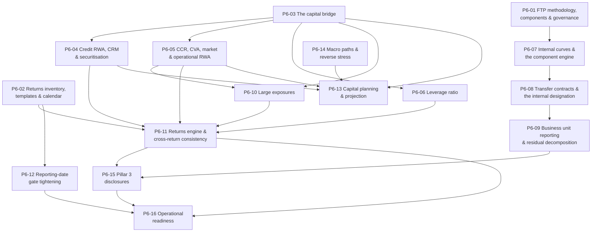

# Phase 6 — Ticket Breakdown

**Sixteen tickets** covering the Phase 6 scope in `treasury-alm-risk-platform` §6. Parent:
`treasury-alm-risk-platform`. Companion to `tickets` (Phase 0), `tickets-phase1`, `tickets-phase2`,
`tickets-phase3` and `tickets-phase5`.

**What Phase 6 delivers:** business-unit performance measurement and regulatory submission —
**D12 in full**, and **D13-B**: capital, RWA, leverage, large exposures, the returns engine, Pillar 3
and capital planning.

**What it does not deliver:** D13-A. **Rule authoring already happened** — regulatory classification
rules in Phase 0, LCR/NSFR factor sets in Phase 1. This phase builds the *computation*, and it inherits
rule sets that have been in production for years.

## Two modules, and only one of them is a build from nothing

| Module | Position entering Phase 6 |
|---|---|
| **D13-B** | The rules exist and are proven. **Phase 6 builds computation over configuration that already works** — the reverse of the usual position, and the strongest practical argument for holding rules as data |
| **D12** | Genuinely new, but **calibrates nothing**. It draws three parameter sets from two owners and adds no fourth. Its risk is not modelling — it is that it prices on a methodology decided too late |

**D13-A's split across phases was the defining structural feature of that module** and the thing most
likely to have been planned wrong. If it was planned as a single Phase 6 deliverable, Phases 0 and 1 were
stranded and this phase is much larger than it should be.

## The Phase 4 clock this phase either inherits or pays for

**D12's methodology should have been settled in Phase 4.** Matched-maturity FTP strikes a transfer rate
**once, at inception, and holds it for the contract's life** — so every contract booked between Phase 4
and Phase 6 needs an inception rate.

**The inputs survive; the decision does not.** D3 retains versioned snapshots, so the curve as at any
inception date is available, and D2 retains the contract. **What does not survive is the methodology —
which curve, which liquidity premium, which components — because it was never made.**

| If the Phase 4 clock was honoured | If it was not |
|---|---|
| P6-01 is a **ratification and a backfill** | P6-01 is a **reconstruction**, and Phase 6 chooses a methodology then applies it retrospectively to two years of booked contracts |
| Business unit P&L is populated for the gap period | **Business unit P&L restatements for periods already reported** — the one outcome D12 §4 says to avoid |

**This is the recoverable clock** — the only one of the four that is. It is still much cheaper honoured
than repaired.

## Dependency graph

## Waves

| Wave | Tickets | State at the end |
|---|---|---|
| **1** | P6-01, P6-02, P6-03 | The FTP methodology is ratified; the return list exists; **accounting equity bridges to regulatory capital** |
| **2** | P6-04, P6-05, P6-06 | All six RWA types compute; the leverage exposure measure produces |
| **3** | P6-07, P6-08, P6-09 | FTP prices, transfer contracts generate marked `internal`, and business unit margin decomposes |
| **4** | P6-10, P6-11, P6-12 | Large exposures aggregate; returns generate as configuration; **no submission can be produced from provisional data** |
| **5** | P6-13, P6-14, P6-15 | Capital projects forward under stress; ICAAP is served; Pillar 3 discloses |
| **6** | **P6-16** | **Returns and FTP are operationally live** — every return parallel-run, business units told before go-live |

**P6-02 is in wave 1 because it is a list nobody has.** *"Which local returns, in what templates, on what
calendar"* is D13's open question 2, and **the configurable design holds regardless but the build cannot
be sized without the list.** It is not engineering work and it has a lead time.

## Four things that are not tickets

**1. D13-A is done.** Regulatory classification rules (Phase 0) and LCR/NSFR factor sets (Phase 1) were
authored years ago and have been in production since. **D13-B takes custody of rule sets already
running** — a considerably better position than authoring from scratch against a live balance sheet.

**2. The `internal` contract designation should already exist.** `D12-3` marks it as **"a Phase 6 need
created by a Phase 0 object"** — one attribute, ideally added in Phase 0. **If it was not, P6-08 must
re-derive which historic contracts were internal**, which is a data archaeology exercise rather than a
build. Check before wave 3.

**3. Reverse stress testing is a different computational shape.** It asks the inverse question — *what
combination breaks us* — and it is an offline exercise with its own budget, contending with the exposure
simulation and model impact statements for off-window compute (`D15-9`, `p5-14`).

**4. Pillar 3 is a disclosure, not a second calculation.** Every number in it comes from the returns
engine. If Pillar 3 requires its own computation, the returns engine has been built too narrowly.

## Sizing note

| Ticket | Why uncertain |
|---|---|
| **P6-11** Returns engine | Sized entirely by P6-02's list, which does not exist yet. **The design is configurable; the content is not free** |
| **P6-01** FTP methodology | Depends on whether the Phase 4 clock was honoured. Ratification is small; reconstruction is a working group plus a backfill across two years of contracts |
| **P6-04** Credit RWA | The largest exposure population in the bank, and CRM is where legal enforceability meets data. **A netting opinion gap is a capital cost, not a data gap** |

## Decisions that gate acceptance

| # | Decision | Gates | Owner |
|---|---|---|---|
| 1 | **Group structure — the four Appendix D signals.** Determines whether solo *and* consolidated reporting are both required. **The single largest scope variable in this module**, and if any signal is real, Phase 6 gains elimination and consolidation work that is currently unscoped anywhere | Everything in D13-B | Board — executive summary decision 2 |
| 2 | **Standardised or IRB for credit risk?** Standardised assumed throughout. **IRB changes the data requirements materially and brings the output floor into scope** | P6-04 | Executive with the regulator |
| 3 | **Which local returns, in what templates, on what calendar** | P6-02, P6-11 — the build cannot be sized without it | Regulatory reporting |
| 4 | **Is FTP matched-maturity or pooled? — `D12-9`** A pooled or single-rate FTP is simpler, materially less accurate, and **would make most of the component decomposition moot.** A stated decision rather than an inherited one | P6-01, P6-07 | Finance with ALCO |
| 5 | **Does the bank want FTP at all, at this stage?** Phase 6 is late, and a bank without business unit P&L accountability may not need it. **Worth asking explicitly** | All of D12 | Executive |
| 6 | **Is the capital charge component in scope for FTP?** It needs RWA per exposure and a cost of capital set outside the platform | P6-07 | Finance |
| 7 | **Are IFRS 9 transitional arrangements elected?** Affects the CET1 bridge and its phasing | P6-03 | Finance |
| 8 | **Is the fair value option used anywhere?** Determines whether the own-credit filter is live | P6-03 | Finance |

**Decision 1 has been open since revision 2 and is the largest single scope variable in the programme.**
It should not still be open when this phase is planned.

## Amendments carried in from the cross-artifact pass

| Ref | Change | Tickets |
|---|---|---|
| `D12-3` | **Every Contract carries an `internal` designation, excluded from external aggregation by construction.** Exclusion by report-level filter is the weaker control, and **a missed filter inflates both sides of the balance sheet by the full internal book** | P6-08 |
| `D12-1` | The parameter reconciliation shows **which set each FTP component consumed** — D9's split 3 for repricing, D10's split 2 for liquidity | P6-07 |
| `D12-4` | **Treasury's residual has two causes** — unhedged position and parameter vintage drift. Opposite responses | P6-09 |
| `D12-6` | The **contingent liquidity charge is a required component**, not an enhancement | P6-07 |
| `D12-8` | **Option cost** transfers D9's prepayment work into pricing | P6-07 |
| `D11-6` | **Large exposures needs three owners named, not designed** — D11 aggregates, D13 returns, the Phase 4 framework holds the hard limit | P6-10 |
| `F3` / §2.2 | **Declining hedge accounting moved volatility from a filtered reserve into unfiltered CET1.** The revisit threshold is CET1 volatility, not earnings volatility | P6-03, P6-13 |

## Tickets

| # | Ticket | Governing artifacts |
|---|---|---|
| P6-01 | FTP methodology, components & governance | D12 §2, §4, §5 |
| P6-02 | Returns inventory, templates & submission calendar | D13 §6 |
| P6-03 | The capital bridge | D13 §2, §2.1, §2.2 |
| P6-04 | Credit risk RWA, CRM & securitisation | D13 §3 |
| P6-05 | CCR, CVA, market & operational risk RWA | D13 §3; D11 |
| P6-06 | Leverage ratio | D13 §4 |
| P6-07 | Internal curves & the FTP component engine | D12 §1.2, §1.3, §2 |
| P6-08 | Transfer contracts & the `internal` designation | D12 §3 |
| P6-09 | Business unit reporting & residual decomposition | D12 §1.2.5, §4 |
| P6-10 | Large exposures | D13 §5; D11 §3.4 |
| P6-11 | Returns engine & cross-return consistency | D13 §6 |
| P6-12 | Reporting-date gate tightening | D13 §6.1; D17 §3.1 |
| P6-13 | Capital planning & projection | D13 §7 |
| P6-14 | Macro paths, transmission registry & reverse stress | D14 §1.5, §5, §9 |
| P6-15 | Pillar 3 disclosures | D13 §6 |
| P6-16 | Operational readiness | D13 §6.1; D12 §4 |
